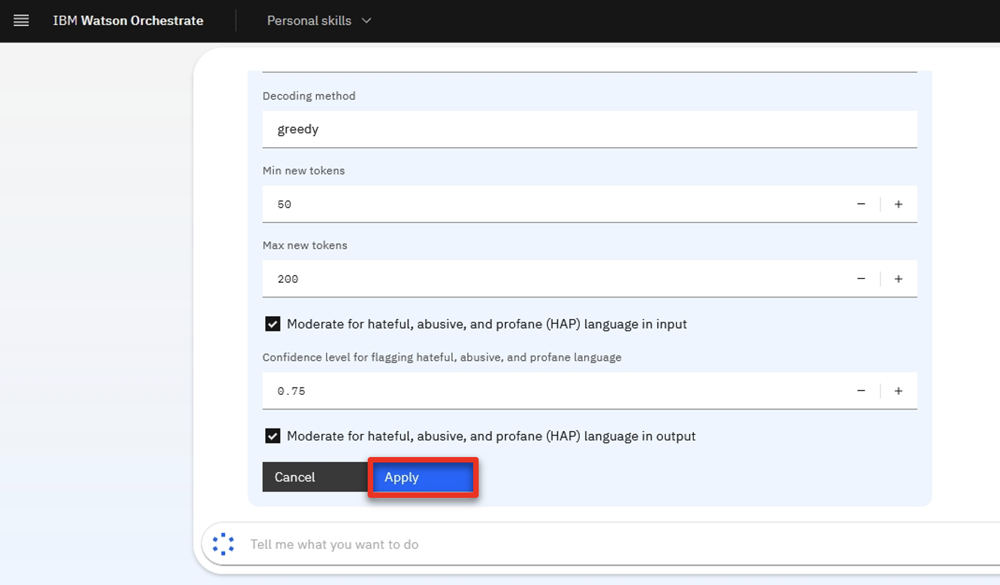
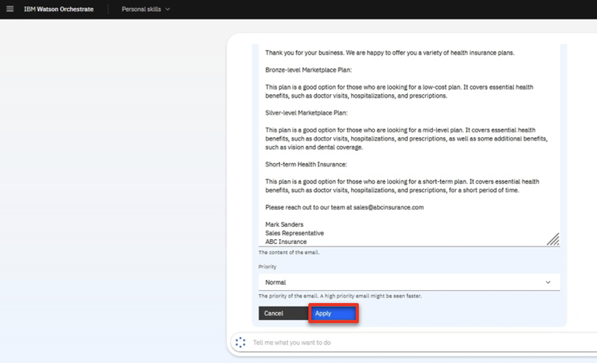

Introduction

Today we’ll see how IBM watsonx Orchestrate uses conversational AI to help sales professionals get their work done quickly.

Sellers in every industry perform many different tasks each day in their effort to upsell and cross-sell, including making customer offers, updating policies, and processing claims. In today's example, we'll look at how an insurance sales representative performs a series of tasks that traditionally require the use of multiple systems, making it challenging to remember which applications are required and how they are used.

Let’s look at how we can help sales reps become more efficient and effective in carrying out these daily responsibilities. Prior to watsonx Orchestrate, sales reps in a brokerage office dedicated a few hours per week to sending prospecting emails for upsell and cross-sell. The steps of this process were: 
1.	Search the CRM system for customers that meet certain criteria.
2.	Determine the best upsell and cross-sell products to offer each customer.
3.	Write a customized email to each customer.
4.	Send each e-mail.

We will see in the demo how quickly IBM watsonx Orchestrate can assist insurance sellers in performing this sequence of tasks. 

  

1 - Retrieving a customer list from a CRM using conversational AI

 

| **1.1** | **Invoke Salesforce skill using conversational AI** |
| :--- | :--- |
| **Narration** | The first step of the upsell task is to search Salesforce for clients that are upsell opportunities.    We invoke the customer upsell task using a chat prompt. |
| **Action** &nbsp; 1.1.1 | Type a natural language command **'Write upsell email to customers who have experienced recent life changes'** to pull a customer list from Salesforce.    |
| **Narration** | watsonx Orchestrate understands the request automatically and connects to Salesforce data using an API in the back end to retrieve a customer list. The data shows a list of all customers with recent life events. The customer data is neatly displayed in a built-in table within the chat interface. |

 

**[Go to top](#place1)**

  

2 - Running a decision engine for a recommendation

 

| **2.1** | **Identify a customer for cross-sell / upsell** |
| :--- | :--- |
| **Narration** | The next step of the task is to determine the products to recommend to the selected customer. This skill makes a product recommendation based on the customer’s situation. |
| **Action** &nbsp; 2.1.1 | Select **John Collins** (1) from the table and click **Apply** (2) in the chat window.    |
| **Narration** | watsonx Orchestrate uses the built-in decision automation capabilities to determine cross-sell / upsell recommendations for the selected customer.    The decision engine applies business logic that considers many different customer factors in order to make a product recommendation. In this case, the decision recognizes that the customer, John Collins, has a child who recently turned twenty-five. In the US, twenty-six is a milestone requiring children to acquire independent health insurance care coverage. Therefore, the decision will recommend a few suitable health coverage products for John’s child. |

 

**[Go to top](#place1)**

  

3 - Sending a personalized email for a cross-sell / upsell opportunity

 

| **3.1** | **Use generative AI to create a personalized email** |
| :--- | :--- |
| **Narration** | watsonx Orchestrate uses one of 20 Large Language Models (LLMs) available in watsonx to generate a personalized email. The generative AI input prompt is automatically created based on the customer’s life event. The products recommended by the decision engine are inserted into the prompt. |
| **Action** &nbsp; 3.1.1 | In the prompt field, highlight the embedded recommended products.    |
| **Action** &nbsp; 3.1.2 | Scroll down and click **Apply**.    |
| **Narration** | watsonx Orchestrate connects to watsonx.ai to generate an email containing the upsell offer. The generated email contains client-specific content that references the client’s recent history and why the recommended policy change has been recommended.    watsonx Orchestrate comes with a pre-built email editor that allows the seller to further customize or change the email to their preferences, like adding a signature. When they are happy with the email format, they can send the email directly from watsonx Orchestrate without having to open their email client. |
| **Action** &nbsp; 3.1.3 | Change the email address in the **To** field to your own email and review the email.    |
| **Action** &nbsp; 3.1.4 | Review the email.    Scroll down and click **Apply** in the watsonx Orchestrate chat window.    |
| **Action** &nbsp; 3.1.5 | Open an email client to show the sent email.    |
| **Narration** | As you can see here in one of their inboxes, the email was sent successfully. |
  
 

**[Go to top](#place1)**

  

Summary

 

In today’s demo, we saw an insurance seller use watsonx Orchestrate to automate some of their repetitive, daily tasks. What would normally take hours to do, we were able to accomplish in only five minutes without any code or constant switching between applications. 

That’s because watsonx Orchestrate comes with a catalog of pre-built skills and the ability to create custom ones. Instead of dealing with complex API commands, users only need to click a button to access their tools and services.

For multiple customers, this is equivalent to saving days of work. From an IT perspective, you are creating more efficient ways of doing work for end users and developers alike, and getting more out of your existing investments.

Thank you for attending today’s presentation.

**[Go to top](#place1)**

  

