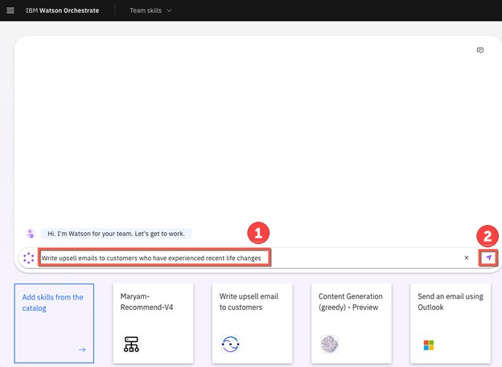
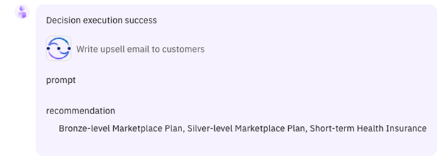
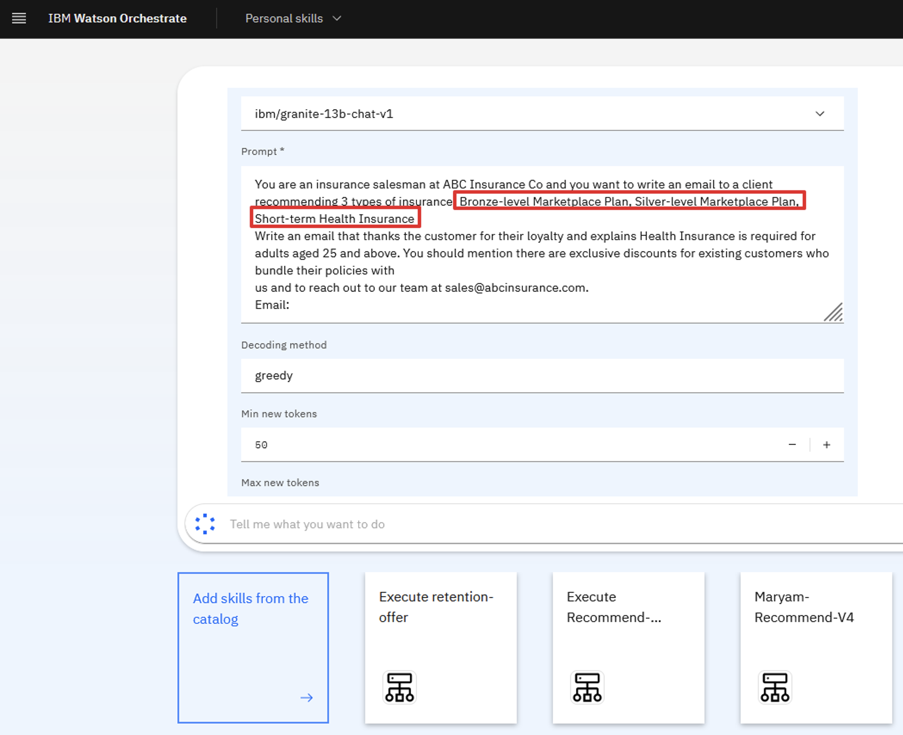
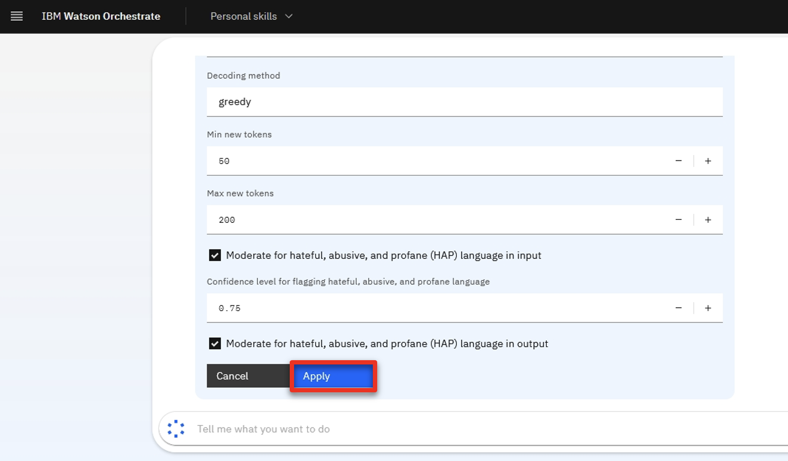
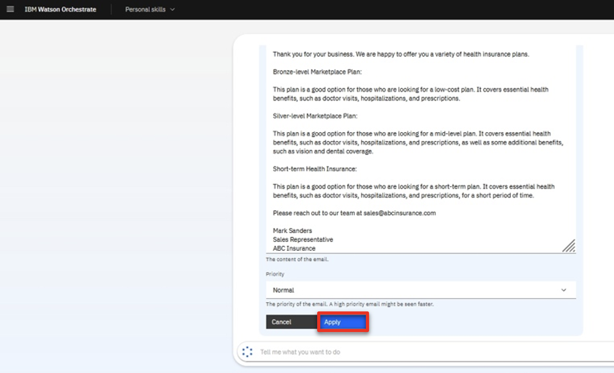
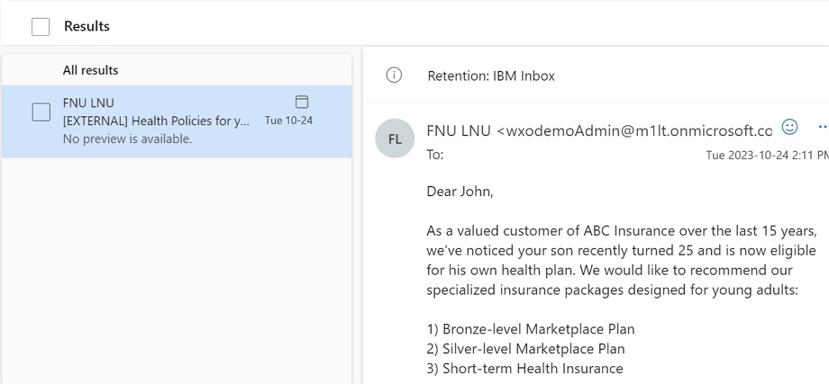

Introduction

Today we’ll see how IBM watsonx Orchestrate uses conversational AI to help sales professionals get their work done quickly.

Insurance sales agents spend their days doing many tasks. Much of their time is spent taking care of existing clients, but an important part of being an insurance agent is finding new customers.  We’ll look at how watsonx Orchestrate performs a series of tasks that traditionally require the use of multiple systems. Because agents use so many systems and applications in a day, they find it cumbersome to constantly switch between them.

Let’s look at how we can help agents become more efficient and effective in carrying out these daily responsibilities. Prior to watsonx Orchestrate, agents in an insurance office dedicated a few hours per week to sending prospecting emails for upsell and cross-sell. The steps of this process were: 
1.	Search Salesforce for customers that meet certain criteria.
2.	Determine the best cross-sell products to offer each customer.
3.	Send a customized email to each customer.

We will see in the demo how IBM watsonx Orchestrate can assist agents in performing this sequence of tasks within a single chat interface.   

Let's get started.

 

1 - Retrieving a customer list from Salesforce using conversational AI

 

| **1.1** | **Invoke a Salesforce skill using natural language** |
| :--- | :--- |
| **Narration** | A common task for an insurance agent is to periodically search the Salesforce CRM for customers with recent life changes and identify upsell/cross-sell opportunities. Traditionally this task involves creating custom Salesforce reports and downloading them offline for manual review by the agent.   In Orchestrate we invoke the Salesforce task using a simple natural language phrase like "Write upsell email to customers". Orchestrate will use AI to understand our intent and peform the correct action even when the request phrase is ambiguous.|
| **Action** &nbsp; 1.1.1 | Type a natural language command **'Write upsell email to customers'**   |
| **Narration** | In this first step of the upsell automation, watsonx Orchestrate automatically connects to Salesforce using an API to query multiple data fields and retrieve a list of customers with recent life changes. Instead of offline reports, the customer data is neatly displayed in a table within Orchestrate's chat interface.  In this case, the agent reviews the list of customers and decides on a cross-sell opportunity with John Collins because he has a child who is about to turn twenty-six. In the US, twenty-six is a milestone requiring children to acquire independent health insurance coverage. Other countries set different age limits for various family milestones.|
| **Action** &nbsp; 1.1.2 | Select **John Collins** (1) from the table and click **Apply** (2) in the chat window.    |

 

**[Go to top](#place1)**

  

2 - Running a decision engine for a recommendation

 

| **2.1** | **Identify products for cross-sell / upsell** |
| :--- | :--- |
| **Narration** | The next step is to determine which products to recommend for the selected customer.  To do this task, watsonx Orchestrate automatically invokes a product recommendation skill that uses built-in decisioning capabilities to apply business logic that considers many different factors, such as the child’s age, pre-existing conditions, and current coverage, to determine the best products to recommend to the customer.  In the case of John Collins, the decision engine recommends three health insurance plans suitable for his young adult: Bronze-level Marketplace Plan, Silver-level Marketplace Plan and Short-term Health Insurance.|

| **Action** &nbsp; 2.1.1 | The customer details are submitted into the built-in decision engine and the upsell recommendations are displayed. Note that this form would usually be hidden as it is an intermediate step, but it’s shown here for clarity.    |

 

**[Go to top](#place1)**

  

3 - Sending a personalized email for a cross-sell / upsell opportunity

 

| **3.1** | **Use generative AI to create a personalized email** |
| :--- | :--- |
| **Narration** | Personalized emails make sales offers more compelling and increase the likelihood of conversion. Large Language Models (LLMs) use natural language processing capabilities to generate customer-specific emails by understanding context and producing human-like text.  watsonx Orchestrate can use any of the watsonx.ai LLMs to generate a personalized email for the client. The generative AI input prompt is automatically created based on the customer’s life event. Also, the products recommended by the decision engine are inserted dynamically into the prompt submitted to the LLM.|
| **Action** &nbsp; 3.1.1 | In the prompt field, highlight the embedded recommended products to show how the prompt has been populated using data taken from the CRM system and the decision engine (1). Click Apply (2).    |
| **Action** &nbsp; 3.1.2 | Scroll down and click **Apply**.    |
| **Narration** | watsonx Orchestrate connects to watsonx.ai to generate an email containing the upsell offer. The generated email contains client-specific content that references the client’s recent history and why the products have been recommended.    Orchestrate then launches the out-of-the-box Microsoft Outlook skill so the seller can send the email directly from Orchestrate without having to open their email client. The fields for the e-mail, such as the subject line and e-mail body, are pre-prepopulated and can be updated.|
| **Action** &nbsp; 3.1.3 | Change the email address in the **To** field to your own email. Review the email and show the customer the email text automatically generated by the watsonx.ai.      Highlight and review the automatically generated email subject and body.|
| **Action** &nbsp; 3.1.4 | Review the email.    Scroll down and click **Apply** in the watsonx Orchestrate chat window.    |
| **Action** &nbsp; 3.1.5 | Open an email client to show the sent email (the email may not be received if a known bug is not fixed).    |
| **Narration** | As you can see here in one of their inboxes, the email was sent successfully. |
  
 

**[Go to top](#place1)**

  

Summary

 

To summarize, in today’s demo we saw an insurance seller use watsonx Orchestrate to automate some of their repetitive, daily tasks. What would normally take hours to do, we were able to accomplish in only five minutes without any code or constant switching between applications. 

That’s because watsonx Orchestrate comes with a catalog of pre-built skills and the ability to create custom ones. Instead of manually moving data between applications, users only need to interact conversationally to invoke their tasks.

Thank you for attending today’s presentation.

**[Go to top](#place1)**

  

