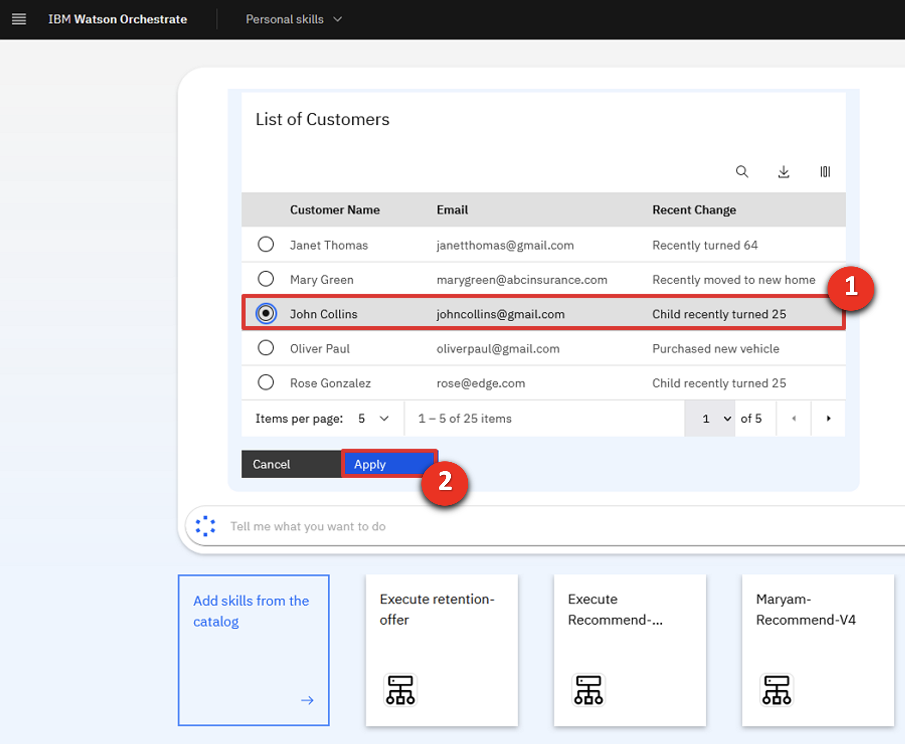

Introduction

Today we’ll see how IBM watsonx Orchestrate uses conversational AI to help sales professionals be more productive.

Insurance sales agents spend their days doing many tasks. Much of their time is spent taking care of existing clients, but an important part of being an insurance agent is finding new customers.  We’ll look at how watsonx Orchestrate performs a series of tasks that traditionally require the use of multiple systems. Because agents use so many systems and applications in a day, they find it cumbersome to constantly switch between them.

Let’s look at how we can help agents become more efficient and effective in carrying out these daily responsibilities. Prior to watsonx Orchestrate, agents in an insurance office dedicated a few hours per week to sending prospecting emails for upsell and cross-sell. The steps of this process were: 
1.	Search Salesforce for customers that meet certain criteria.
2.	Determine the best cross-sell products to offer each customer.
3.	Send a customized email to each customer.

We will see in the demo how IBM watsonx Orchestrate can assist agents in performing this sequence of tasks within a single chat interface.   

Let's get started.

 

1 - Retrieving a customer list from Salesforce using conversational AI

 

| **1.1** | **Invoke a Salesforce skill using natural language** |
| :--- | :--- |
| **Narration** | A common task for an insurance agent is to periodically search the Salesforce CRM for customers with recent life changes and identify upsell/cross-sell opportunities. Traditionally this task involves creating custom Salesforce reports and downloading them offline for manual review by the agent.   In Orchestrate, we invoke the Salesforce task using a simple natural language phrase like "Write upsell email to customers". Orchestrate will use AI to understand our intent and peform the correct action even when the request phrase is ambiguous.|
| **Action** &nbsp; 1.1.1 | Type a natural language command **'Write upsell email to customers'** (1) and click the **Send arrow** (2) in the chat window.  |
| **Narration** | Orchestrate runs the Salesforce task by automatically connecting to an API in the backend that queries multiple data fields and retrieves a list of customers with recent life changes. Instead of offline reports, the customer data is neatly displayed in a table within Orchestrate's chat interface.  In our case, the agent reviews the list of customers and decides on a cross-sell opportunity with the customer John Collins because he has a child that is about to turn twenty-six. In the US, twenty-six is a milestone requiring children to acquire independent health insurance coverage. Other countries set different age limits for various family milestones.|
| **Action** &nbsp; 1.1.2 | Select **John Collins** (1) from the table and click **Apply** (2) in the chat window.    |

 

**[Go to top](#place1)**

  

2 - Running a decision engine for a recommendation

 

| **2.1** | **Identify products for cross-sell / upsell** |
| :--- | :--- |
| **Narration** | The next task is to determine which products to recommend for the selected customer.   The customer details from Salesforce are automatically submitted into Orchestrate's built-in decision engine and the upsell recommendations are displayed. 
Behind the scenes, the recommendation engine applies business logic to many different factors specific to the selected customer, such as the child’s age, pre-existing conditions, and current coverage.  In the case of John Collins, the decision engine recommends three health insurance plans suitable for his child: Bronze-level Marketplace Plan, Silver-level Marketplace Plan and Short-term Health Insurance.| 
| **Action** &nbsp; 2.1.1 | Highlight the three insurance plans recommended by the decision skill.  |
 

**[Go to top](#place1)**

  

3 - Sending a personalized email for a cross-sell / upsell opportunity

 

| **3.1** | **Use generative AI to write a personalized email** |
| :--- | :--- |
| **Narration** | Personalized emails increase the likelihood of conversion so watsonx Orchestrate uses one of twenty Large Language Models (LLMs) available in IBM's watsonx.ai platform to generate a targeted email for the selected customer.  Perfecting the AI prompt to generate a properly formatted email is typically a time-consuming activity, however Orchestrate automatically creates the AI prompt for the agent by dynamically inserting customer-specific data into the prompt input field.|
| **Action** &nbsp; 3.1.1 | In the prompt field, **highlight** the input text with embedded recommended products to show how the prompt has been populated using data taken from the CRM system and the decision engine (1).   |
| **Action** &nbsp; 3.1.2 |     |

 

| **3.2** | **Use the Microsoft Outlook sill to send a personalized email** |
| :--- | :--- |
| **Narration** | Orchestrate launches its out-of-the-box Microsoft Outlook skill so the agent will send the email directly from Orchestrate without having to open their email client. In addition to pre-populating the **To** and **Subject** fields, Orchestrate automatically inserts the AI-generated text into the **body** field.|
| **Action** &nbsp; 3.2.1 | Review the email and show the customer the text generated by watsonx.ai and automatically inserted in the body field.  |
| **Action** &nbsp; 3.2.2 | Change the email address in the **To** (1) field to your own email. Scroll down and click **Apply** (2) in the watsonx Orchestrate chat window.     |

 
 

**[Go to top](#place1)**

  

Summary

 

To summarize, in today’s demo we saw an insurance agent use watsonx Orchestrate to automate some of their daily repetitive tasks using a catalog of skills that eliminate the need to manually move data between systems. 

Watsonx Orchestrate's single user interface provides the ability to interact conversationally to perform complex tasks. What would normally take hours to do, we were able to accomplish in only five minutes without any code or constant switching between applications.

Thank you for attending today’s presentation.

**[Go to top](#place1)**

  

