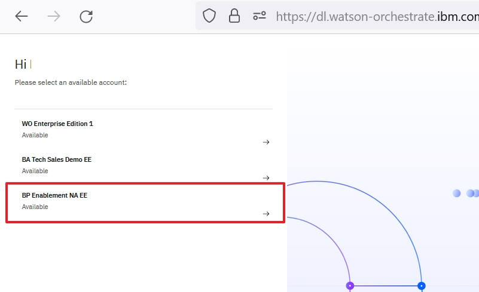

<inline-notification text="<strong>This 100-level demo does not require technical skills and is appropriate for both Sellers and Tech Sellers.</strong> The demo covers the end user view only.   A more in-depth 300-level demo designed for Tech Sellers that also covers the 'Builder' view will be available shortly."></inline-notification>

| **DEMO OVERVIEW** | | 
| :---         | :--- |
| **Scenario overview** | This demo shows how watsonx Orchestrate can be used by sales representatives to assist with the upsell/cross-sell process. To illustrate this, an insurance seller uses watsonx Orchestrate to retrieve a list of customers from Salesforce and automatically send a customized offer.|
| **Demo products** | watsonx Orchestrate |
| **Demo capabilities** | Salesforce skill; watsonx.ai generative AI skill; Microsoft Outlook skill; Embedded decision engine skill|
| **Demo script** | A complete demo script is on the second tab above.    This demo script has multiple tasks that each have multiple steps. In each step, you have the details about what you need to do (**Actions**), what you can say while delivering this demo step (**Narration**), and what screenshots you will see.  This demo script is a suggestion, and you are welcome to customize based in your sales opportunity. Most importantly, practice this demo in advance. If the demo seems easy for you to execute, the customer will focus on the content. If it seems difficult for you to execute, the customer will focus on your delivery. |
| **How to get support** | • Open a support case at <a href="https://techzone.ibm.com/help" target="_blank" rel="noreferrer">IBM Technology Zone Help</a> regarding issues with reserving and provisioning Tech Zone environments. • Contact <a href="https://ibm-cloud.slack.com/archives/C0216F39ACU" target="_blank" rel="noreferrer">#platinumdemos-automation-support</a> regarding issues with setting up and running this demo. |

### **PREPARE TO GIVE THE DEMO**

Access the demo tenant

IBM maintains multiple watsonx Orchestrate production tenants that can be accessed by IBMers or Business Partners.

This demo is available on both **sales demo** tenants and **enablement** tenants. Use your IBM email to log into an account <a href="https://dl.watson-orchestrate.ibm.com/home" target="_blank" rel="noreferrer">here</a>   
   • **Sales demo tenants**: These tenants are for IBMers who require longer term access to a demo environment for sales opportunities.. 
   • **Enablement tenants**</a>: These tenants are for IBMers and Business Partners who require short-term access (two week maximum) to a demo environment for enablement and sales activities.  If you have been added to **multiple** accounts on the enablement tenant, you will see a list of available account names. Select the **BP Enablement NA EE** account.  If you have been added to only **one account** on the production tenant, you will not see a list of available accounts and will be logged straight into the account after entering your IBM email.  

**NEED ACCESS?**

IBMers and Business Partners who do not already have access to a tenant can request access for your organization.  
To submit a request for tenant access, provide the following:    
   **Subject line:** watsonx Orchestrate Access Request 
   **Demo type:** 100-LEVEL or 300-LEVEL 
   **Environment:** TECHSALES (IBMers only) or ENABLEMENT (access will only be given for two weeks) 
   **Company Name:** 
   **CEID:** (required for Business Partners only - this can be found in your PartnerWorld profile) 
   **Full Name:** (first and last) of the individual 
   **Company email:** Email address of the individual listed above (non-company email addresses will be rejected) 
   **Data Geography choice:** (Only Americas available, more locations coming soon) 
   **Purpose for request:**
     
   Send an email to XYZ (xyz@email.com) with the above information

Navigate to team skills

When you log into watsonx Orchestrate, the default view is **personal skills**. To run the demo, change the view to **team skills**. 

Click [here](demo-script) to go to the **Demo script** on the next tab.