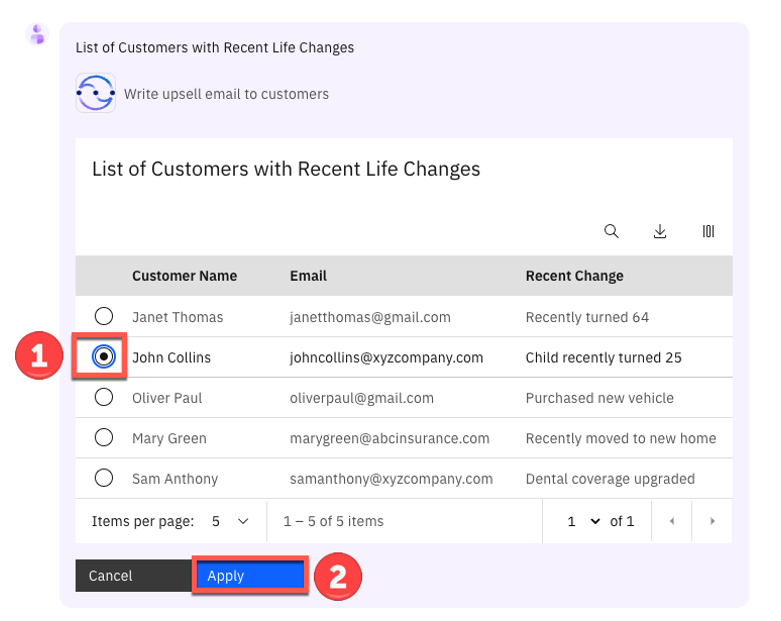
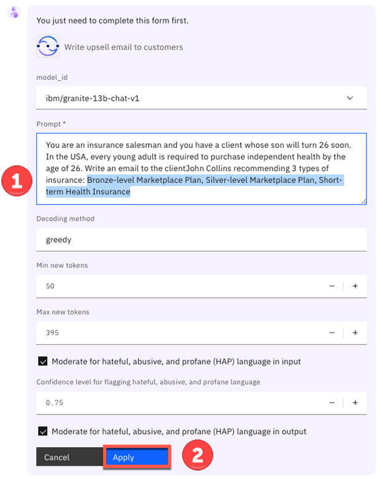
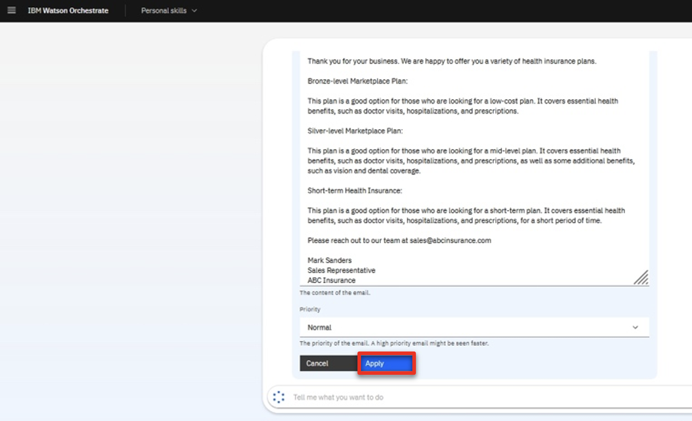
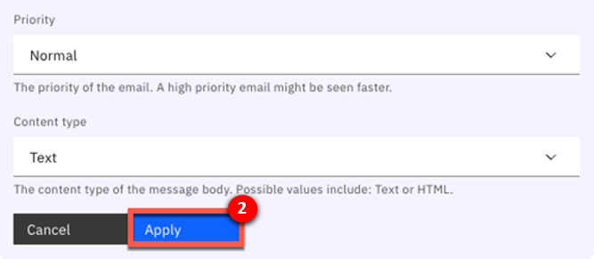

Introduction

Today we’ll see how watsonx Orchestrate uses conversational AI to help sales professionals be more productive.

Insurance sales agents spend their days doing many tasks while constantly switching between multiple applications. Much of their time is spent servicing existing clients, but an important part of being a sales agent is finding new business. 

Prior to watsonx Orchestrate, agents in an insurance office dedicated a few hours per week to sending prospecting emails for upsell and cross-sell. The steps of this process are: 
1.	Search Salesforce for customers that meet certain cross-sell criteria.
2.	Determine the best cross-sell products to offer each customer.
3.	Send a customized email to each customer.

We'll look at how watsonx Orchestrate can assist agents in performing this sequence of tasks.   
Let's get started.

 

1 - Retrieving a customer list from Salesforce using conversational AI

 

| **1.1** | **Invoke a Salesforce skill using natural language** |
| :--- | :--- |
| **Narration** | A common task for an insurance agent is to periodically search the Salesforce CRM for customers with recent life changes to whom they can make upsell/cross-sell offers. Traditionally this task involves creating custom Salesforce reports and downloading them offline for manual review by the agent.   In Orchestrate, the agent invokes the Salesforce task using the simple natural language phrase: "Write upsell email to customers". Orchestrate uses AI to understand the sales agent's intent and peforms the correct action, even when the request phrase is ambiguous.|
| **Action** &nbsp; 1.1.1 | Type the natural language command **'Write upsell email to customers'** (1) and click the **Send arrow** (2) in the chat window.  |
| **Narration** | Orchestrate runs the Salesforce task by connecting to a backend API that retrieves a list of customers with recent life changes. The returned customer data is neatly displayed in a table within Orchestrate's chat interface.  The agent reviews the list of customers and pursues a cross-sell opportunity with John Collins, who has a child that is about to turn twenty-six. In the US, twenty-six is a milestone requiring children to acquire independent health insurance coverage. (Other countries set different age limits for various family milestones.)|
| **Action** &nbsp; 1.1.2 | Select **John Collins** (1) from the table and click **Apply** (2) in the chat window.    |

 

**[Go to top](#place1)**

  

2 - Running a decision engine for a recommendation

 

| **2.1** | **Identify products for cross-sell / upsell** |
| :--- | :--- |
| **Narration** | The next task is to determine which products to recommend for the selected customer.   The customer details from Salesforce are automatically submitted into Orchestrate's built-in decision engine and the upsell recommendations are displayed. Behind the scenes, the decision engine applied business logic using many different factors specific to this customer, such as the child’s age, pre-existing conditions, and current coverage.  In the case of John Collins, the decision engine recommends three health insurance plans suitable for his child: Bronze-level Marketplace Plan, Silver-level Marketplace Plan and Short-term Health Insurance.| 
| **Action** &nbsp; 2.1.1 | Highlight the three insurance plans recommended by the decision skill.  |

 

**[Go to top](#place1)**

  

3 - Sending a personalized email for the cross-sell opportunity

 

| **3.1** | **Use generative AI to write a personalized email** |
| :--- | :--- |
| **Narration** | Personalized emails increase the likelihood of conversion. Watsonx Orchestrate uses one of IBM's Large Language Models (LLMs) via the watsonx.ai platform to generate a targeted email for the selected customer.  Perfecting the AI prompt to generate a properly formatted email is typically a time-consuming activity. To make this quicker, Orchestrate automatically inserts a pre-written AI prompt that includes dynamically inserted customer data in the prompt input field.|
| **Action** &nbsp; 3.1.1 | In the prompt field, **highlight** (1) the input text with embedded recommended products to show how data from the decision engine has been automatically inserted. Click **Apply** (2).  |

 

| **3.2** | **Use the Microsoft Outlook skill to send a personalized email** |
| :--- | :--- |
| **Narration** | Orchestrate launches its out-of-the-box Microsoft Outlook skill to send an email without the agent needing to use an email client. In addition to pre-populating the **To** and **Subject** fields, Orchestrate automatically inserts the AI-generated text into the **body** field.|
| **Action** &nbsp; 3.2.1 | Review the email and point out the text generated by watsonx.ai that was automatically inserted into the **body** field.  |
| **Action** &nbsp; 3.2.2 | Change the email address in the **To** (1) field to your own email.     Scroll down and click **Apply** (2) in the watsonx Orchestrate chat window. |

 
 

**[Go to top](#place1)**

  

Summary

  
Using an upsell/cross-sell example, we demonstrated how watsonx Orchestrate provides a conversational interface for sales agents to perform their repetitive tasks.

By providing a catalog of skills, Orchestrate eliminated the need to manually move data between different backend applications. Watsonx Orchestrate streamlined the agent's work by sequencing a series of skills within a single unified interface, boosting the agent's productivity and enabling them to focus on higher value work.

Thank you for attending today’s presentation.

**[Go to top](#place1)**

  

