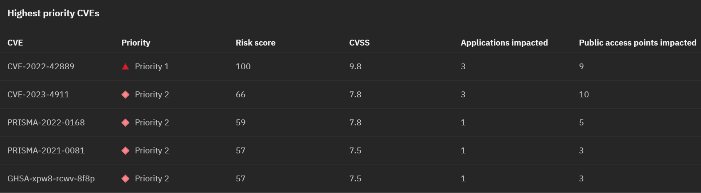

Introduction

As enterprises develop and deploy an increasing number of software applications, they face significant risks and challenges related to security vulnerabilities and compliance issues.

Leveraging data from various tools, IBM Concert empowers security managers to gain a comprehensive view of vulnerabilities across their homegrown application landscape. Using Concert’s advanced generative AI analytics engine, we can accurately assess vulnerability risk tailored to each customer's specific environment. Concert identifies potential threats, evaluates their impact, and provides actionable recommendations to prioritize and mitigate risks effectively.

Let’s delve into how IBM Concert helps manage vulnerabilities and enhances your security posture.

 

<strong>1 - Home page</strong>: Assessing application security risk

 

| **1.1** | **Examine the security landscape** |
| :--- | :--- |
| **Narration** | The security manager at Focus Financial is overwhelmed with a backlog of 20,000 CVEs, struggling to manage vulnerabilities across applications hosted in diverse environments. With the recent adoption of a microservices architecture, the complexity has surged as these applications now span multiple servers and cloud providers. This shift has introduced significant challenges in security and vulnerability management, making it crucial to find an intelligent way to prioritize and address these CVEs. |
| **Action** &nbsp; 1.1.1 | Show the **Home** page, which you opened during demo preparation.    |
| **Narration** | Upon logging into Concert, the security manager is presented with a circular dashboard, featuring arc slices that represent different aspects of the application landscape. The vulnerability summary is prominently highlighted by default, providing an immediate overview of his risk posture.    The right section provides a high-level overview of key vulnerability metrics, such as the number of total unique CVEs, the number of Priority 1, 2 and 3 CVEs, and more. |
| **Action** &nbsp; 1.1.2 | Scroll down the home page to show the **Most vulnerable applications** and **Prioritized CVEs impacting public access points** graphs.    |
| **Narration** | Scrolling down the home page, the security manager can see visual representations with a bar chart showing his most vulnerable applications on the left, and the prioritized CVEs impacting public access points on the right. |
| **Action** &nbsp; 1.1.3 | Scroll down the home page to show the **Highest prioritiy CVEs** table.    |
| **Narration** | Finally, at the bottom of the home page, the security manager can see a table with the top five vulnerabilities displayed in order of priority. |

**[Go to top](#top)**

  

<strong>2 - CVE Analysis</strong>: Understanding CVE impact

 

| **2.1** | **View CVE details** |
| :--- | :--- |
| **Action** &nbsp; 2.1.1 | Click **CVE-2022-42889**.       The following screen will appear:    |
| **Narration** | The security manager selects a CVE to view the details and sees the "blast radius" showing each image and repository where the vulnerable code is deployed.    The CVE view provides the security manager with a summary of the issue, the industry-defined generic CVSS score, and a custom Concert risk score. Instead of relying on generic assessments, Concert uses gen AI to correlate vulnerability data using multiple risk vectors to analyze complex chains of application dependencies and uncover the highest severity risks in an organization’s specific environment. This enables Concert to generate a score based on the actual exposure in their specific application environment. Concert then uses the details of the specific environment, along with proprietary threat intelligence and business criticality, to calculate the risk posed by each vulnerability. |

**[Go to top](#top)**

  

<strong>3 - watsonx chatbot</strong>: Expert CVE analysis and remediation guidance

 

| **3.1** | **Interact with the chatbot** |
| :--- | :--- |
| **Action** &nbsp; 3.1.1 | Click **Ask watsonx**.    |
| **Narration** | Concert’s interactive chatbot uses generative AI to dig deeper into Concert’s specific suggestions and explain the potential impact and remediation of each issue. The chatbot uses IBM’s Granite language model and comes pre-trained to have interactive conversations about application risk. The security manager interactively asks questions about CVE details and engages in a discussion about remediation guidance. Concert responds just as a CVE expert would. |
| **Action** &nbsp; 3.1.2 | Type '**How do I mitigate this CVE?**' in the chatbot.    |

**[Go to top](#top)**

  

<strong>4 - Service ticket generation</strong>: Quickly resolving application issues

 

| **4.1** | **Open a ticket** |
| :--- | :--- |
| **Narration** | Now that the security manager fully understands the potential impact of the CVE on his application environment, he can create a service ticket to resolve the issue. Alternatively, the security manager can configure automation rules to automatically create and assign tickets in the ticketing system. |
| **Action** &nbsp; 5.1.1 | Click **Open ticket** in the first row.       The following **Open a ticket** screen will appear.    |
| **Narration** | Concert can connect directly to popular ticketing systems, such as GitHub, Jira and ServiceNow to automatically generate service tickets to remediate the vulnerability. Concert automatically inserts the appropriate text into the ticket fields, automating what would otherwise be a time-consuming task. |

**[Go to top](#top)**

  

<strong>5 - Arena View</strong>: Visualizing the impact of CVEs on the application ecosystem

 

| **5.1** | **Display CVEs in the Arena View** |
| :--- | :--- |
| **Action** &nbsp; 5.1.1 | Click the **Prioritized CVEs** switch. <inline-notification text="A red <strong>Prioritized CVEs</strong> section will appear in the diagram."></inline-notification>  |
| **Narration** | By clicking on ‘Prioritized CVEs,’ the security manager sees the higher priority CVEs. The darkest circles represent the most critical CVEs.    Hovering over a CVE highlights the end-to-end exposure path of the CVE from repositories to endpoints. |

**[Go to top](#top)**

  

<strong>6 - Prioritizing CVEs</strong>: Assess potential exposures to your applications

 

| **6.1** | **Examine vulnerabilities in the dimensions view** |
| :--- | :--- |
| **Action** &nbsp; 6.1.1 | Placeholder    |
| **Narration** |  |

**[Go to top](#top)**

  

Summary

We’ve demonstrated how Concert assists a security manager in identifying and prioritizing CVEs and streamlining their remediation process. Before implementing Concert, the security team faced challenges with manual efforts, fragmented tools, and extensive data needed to manage and assess vulnerabilities.

The security manager utilized Concert to unify disparate data sources, offering a comprehensive view of their security posture. Concert used gen AI to analyze data across various environments, enabling the security team to proactively prioritize, understand and address vulnerabilities, ensuring proactive protection against potential threats.

**[Go to top](#top)**

  

