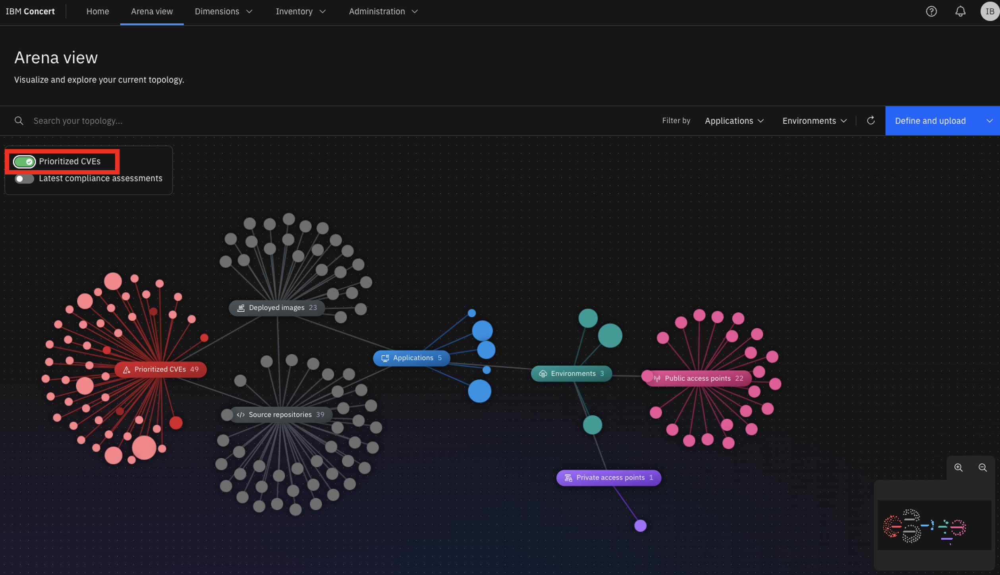
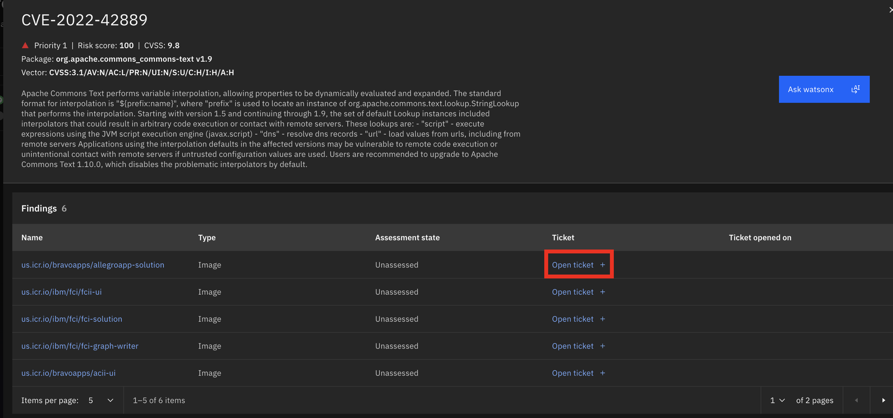

Introduction

Today we’ll see how IBM Concert assists an operations manager in understanding and maintaining his diverse application landscape. I’ll show how Concert enables him to discover and manage the connections, dependencies and gaps in his application architecture.  

Using data from disparate tools, we’ll see how Concert provides the operations manager with a baseline view of applications and their dependencies. Then we’ll use Concert’s generative AI capabilities to discover issues and provide actionable recommendations to maintain application health.

Let’s get started.

 

1 - Viewing a summary of your application posture

 

| **1.1** | **Examine the application landscape** |
| :--- | :--- |
| **Narration** | The operations manager at Focus Financial manages applications hosted across various environments. The application team has recently adopted a microservices architecture which has increased complexity as the applications now span multiple servers and cloud providers. This has introduced new challenges related to security, compliance and change management. |
| **Action** &nbsp; 1.1.1 | Show the home page.    |
| **Narration** | Upon logging into Concert, the operations manager sees a dynamic summary of his application landscape. His entire application posture is shown, including metrics tied to risk, compliance, cost and networking.    The blue sections of the circle indicate areas where the operations team has connected Concert to their application data. The outer red sections indicate problem areas that need to be investigated by the operations team. The gray areas of the circle represent opportunities to provide more information so Concert can provide additional insights. |

**[Go to top](#top)**

  

2 - Visualizing the application ecosystem

 

| **2.1** | **Discover application connections and dependencies** |
| :--- | :--- |
| **Action** &nbsp; 2.1.1 | Click **Arena view**.    |
| **Narration** | The Arena view provides the operations manager with a comprehensive overview of his entire application ecosystem. Concert ingests data from multiple sources and creates this "App 360" view showing all the applications, environments, source code repositories and deployed images.    The operations manager can hover over any component to highlight the associated dependencies. |
| **Action** &nbsp; 2.1.2 | Hover over the **paymentApp** application.    |
| **Narration** | Looking at 'paymentApp,' he sees the Docker images and Github repositories associated with 'paymentApp.' He also sees the environments where ‘paymentApp’ is deployed (in this case, dev, QA, staging and two production environments). |
| **Action** &nbsp; 2.1.3 | Hover over the **prod** environment.    |
| **Narration** | Highlighting the 'prod' environment shows the applications that are deployed and the exposed public and private access points. |
| **Action** &nbsp; 2.1.4 | Hover over any **Deployed image**.    |
| **Narration** | Highlighting an image shows the associated source code repositories, applications, environments and the exposed public and private access points. |
| **Action** &nbsp; 2.1.5 | Hover over any **Source repository**.    |
| **Narration** | Highlighting a source code repository shows the associated images, applications, environments and the exposed public and private access points. |

**[Go to top](#top)**

  

3 - Assessing and prioritizing application risk

 

| **3.1** | **View the compliance assessments** |
| :--- | :--- |
| **Narration** | In addition to the baseline application information, Concert can ingest a broad set of data including security, compliance, observability, networking, DevSecOps and cost. Concert normalizes and correlates the ingested data, then uses a generative AI engine to identify issues.    As issues are identified, the operations manager knows he can’t fix all of them immediately. Concert helps him by prioritizing the issues that pose the biggest impact to his specific applications and their environments. |
| **Action** &nbsp; 3.1.1 | Click the **Latest compliance assessments** switch.    |
| **Narration** | The operations manager is charged with maintaining a good compliance posture and needs to ensure that all his applications adhere to regulatory requirements.    By clicking on ‘Latest compliance assessments,’ the operations manager sees a summary of the compliance assessments for his application environments. The lighter circles represent the environments with the lowest compliance scores, while the darker circles represent those with higher compliance scores. |

 

| **3.2** | **Prioritize and view CVEs** |
| :--- | :--- |
| **Action** &nbsp; 3.2.1 | Click the **Prioritized CVEs** switch.    |
| **Narration** | The operations manager must also manage the ongoing threats posed by Common Vulnerabilities and Exposures (CVEs). There can be hundreds or even thousands of CVEs that pose potential threats. Concert enables the operations team to prioritize the highest risk vulnerabilities – based on the actual exposure in their specific application environment. Concert uses the details of the specific environment, along with proprietary threat intelligence and business criticality, to calculate the risk posed by each vulnerability.    By clicking ‘Prioritized CVEs,’ the operations manager sees the higher priority CVEs. The darkest circles represent the most critical CVEs. |
| **Action** &nbsp; 3.2.2 | Click a high priority CVE (darkest red).       The following screen will appear:    |
| **Narration** | The operations manager selects a CVE to view the details and sees the "blast radius" showing each image and repository where the vulnerable code is deployed. |

**[Go to top](#top)**

  

4 - Using conversational AI to gain deeper insights

 

| **4.1** | **Interact with the chatbot** |
| :--- | :--- |
| **Action** &nbsp; 4.1.1 | Click **Ask watsonx**.    |
| **Narration** | Concert’s interactive chatbot uses generative AI to dig deeper into Concert’s specific suggestions and explain the potential impact and remediation of each issue. The chatbot uses IBM’s Granite language model and comes pre-trained to have interactive conversations about application risk. The operations manager interactively asks questions about CVE details and engages in a discussion about remediation guidance. |
| **Action** &nbsp; 4.1.2 | Type '**How do I mitigate this CVE?**' in the chatbot.    |
| **Narration** | Concert responds like an expert, providing the operations manager with deeper insight into the vulnerability and offering remediation guidance. |
| **Action** &nbsp; 4.1.3 | Click **X** to close the chatbot window.    |

**[Go to top](#top)**

  

5 - Creating a service ticket

 

| **5.1** | **Open a ticket** |
| :--- | :--- |
| **Narration** | Now that the operations manager fully understands the potential impact of the CVE on his application environment, he can create a service ticket to resolve the issue. Alternatively, the operations manager can configure automation rules to automatically create and assign tickets in the ticketing syste |
| **Action** &nbsp; 5.1.1 | Click **Open ticket** in the first row.       The following **Open a ticket** screen will appear.    |
| **Narration** | Concert can connect directly to popular ticketing systems, such as GitHub, Jira and ServiceNow to automatically generate service tickets to remediate the vulnerability. Concert automatically inserts the appropriate text into the ticket fields, automating what would otherwise be a time-consuming task. |

**[Go to top](#top)**

  

Summary

Today we saw how Concert uses generative AI to help an operations manager mitigate risk, prioritize tasks and optimize their operations. We showed how Concert can bridge data silos to help operational teams proactively ensure the health of their operations.

**[Go to top](#top)**

  

