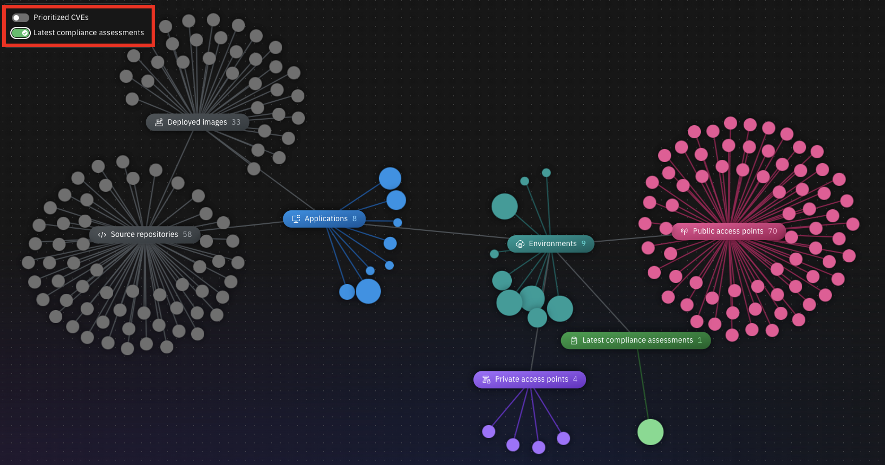

Introduction

Today we’ll explore how IBM Concert assists an operations team with managing a complex application landscape. Concert leverages AI across the entire technology operation, enabling timely and effective decision-making.

By seamlessly integrating with existing environments and toolsets and automatically discovering relevant data about the operations, we’ll see how Concert provides the operations team with a holistic view of the applications and their dependencies. Then we’ll use Concert’s generative AI capabilities to prioritize issues and provide actionable remediation recommendations to maintain application health.

Let’s get started.

 

<strong>1 - Home page</strong>: Focus on the highest priority issues

 

| **1.1** | **Examine the application landscape** |
| :--- | :--- |
| **Narration** | The operations manager at Focus Financial manages applications hosted across various environments. The application team has recently adopted a microservices architecture which has increased complexity as the applications now span multiple servers and cloud providers. This has introduced new challenges related to security, compliance and change management. |
| **Action** &nbsp; 1.1.1 | Show the **Home** page, which you opened during demo preparation.    |
| **Narration** | Upon logging into Concert, the operations manager sees a comprehensive overview of the organization’s application lifecycle. Concert provides comprehensive AI-generated insights that transcend traditional infrastructure silos.    The entire application posture is displayed, highlighting key metrics tied to risk, compliance, cost and networking. Application issues are prioritized based on their impact on applications, ensuring that the highest priority issues are addressed effectively. |

**[Go to top](#top)**

  

<strong>2 - Arena view</strong>: Interactive map of the application portfolio

 

| **2.1** | **Discover application connections and dependencies** |
| :--- | :--- |
| **Action** &nbsp; 2.1.1 | Click **Arena view**.    |
| **Narration** | The operations team harnesses the power of generative AI as Concert delves into the application architecture, revealing intricate connections, dependencies and invaluable opportunities.    The ‘Arena view’ provides the operations manager with a 360-degree view of the entire application ecosystem. Concert connects with their environments and toolsets and ingests crucial data about the application’s operations. Concert automatically creates this “App 360” view showing all the applications, environments, source code repositories and deployed images.    The operations manager can hover over any component to highlight the associated dependencies. |
| **Action** &nbsp; 2.1.2 | Hover over the **paymentApp** application.    |
| **Narration** | Looking at the 'paymentApp,' they see the Docker images and Github repositories associated with that app. They also see the environments where ‘paymentApp’ is deployed (in this case, dev, QA, staging and two production environments). |
| **Action** &nbsp; 2.1.3 | Hover over the **prod** environment.    |
| **Narration** | Highlighting the 'prod' environment shows the applications that are deployed and the exposed public and private access points. |
| **Action** &nbsp; 2.1.4 | Hover over any **Deployed image**.    |
| **Narration** | Highlighting an image shows the associated source code repositories, applications, environments and the exposed public and private access points. |
| **Action** &nbsp; 2.1.5 | Hover over any **Source repository**.    |
| **Narration** | Highlighting a source code repository shows the associated images, applications, environments and the exposed public and private access points. |

**[Go to top](#top)**

  

<strong>3 - Turning data into knowledge</strong>: Manage application risk

 

| **3.1** | **Prioritize and view CVEs** |
| :--- | :--- |
| **Action** &nbsp; 3.1.1 | Click the **Prioritized CVEs** switch. <inline-notification text="A red <strong>Prioritized CVEs</strong> section will appear in the diagram."></inline-notification>  |
| **Narration** | The operations manager manages the ongoing threats posed by Common Vulnerabilities and Exposures (CVEs). Concert empowers the operations team to prioritize, mitigate and trace application vulnerabilities, ensuring resilient operations and reduced security risks by proactively revealing vulnerabilities before integration into the code base.    There can be hundreds, or even thousands, of CVEs that pose potential threats. Concert enables the operations team to prioritize the highest risk vulnerabilities – based on the actual exposure in their specific application environment. Concert uses the details of the specific environment, along with proprietary threat intelligence and business criticality, to calculate the risk posed by each vulnerability.    By clicking ‘Prioritized CVEs,’ the operations manager sees the higher priority CVEs. The darkest circles represent the most critical CVEs. |
| **Action** &nbsp; 3.1.2 | Click a high priority CVE (darkest red).       The following screen will appear:    |
| **Narration** | Concert traces the root causes of vulnerabilities based on the application context. The operations manager selects a CVE to view the details and sees the “blast radius” showing each image and repository where the vulnerable code is deployed. |

 

| **3.2** | **View the compliance assessments** |
| :--- | :--- |
| **Narration** | Concert empowers the organization with actionable insights by generating strategic recommendations that enhance application performance and efficiency. Concert normalizes and correlates the ingested data and uses a generative AI engine to identify issues.    As new issues are identified, not all of them can be fixed immediately. Concert helps by prioritizing the issues that pose the biggest risk to the specific applications and their environments, ensuring the most critical issues are addressed effectively. |
| **Action** &nbsp; 3.2.1 | Click the **Latest compliance assessments** switch. <inline-notification text="A green <strong>Latest compliance assessments</strong> section will appear in the diagram."></inline-notification>  |
| **Narration** | The operations manager is charged with maintaining a good compliance posture and needs to ensure that all the applications adhere to regulatory requirements.    By clicking on ‘Latest compliance assessments,’ the operations manager sees a summary of the compliance assessments for the application environments. The lighter circles represent the environments with the lowest compliance scores, while the darker circles represent those with higher compliance scores. |

**[Go to top](#top)**

  

<strong>4 - watsonx chatbot</strong>: Expert analysis and guidance

 

| **4.1** | **Interact with the chatbot** |
| :--- | :--- |
| **Action** &nbsp; 4.1.1 | Click **Ask watsonx**.    |
| **Narration** | Concert’s interactive chatbot uses generative AI to dig deeper into Concert’s analysis and engage in intuitive conversations. Natural language processing is used to question Concert’s  conclusions, comprehend its recommendations and explore the potential impacts. The chatbot uses IBM’s Granite language model and comes pre-trained to have interactive conversations about application risk.    For example, the operations manager can interactively ask questions about CVE details and engage in a discussion about Concert’s remediation guidance. |
| **Action** &nbsp; 4.1.2 | Type '**How do I mitigate this CVE?**' in the chatbot.    |
| **Narration** | Concert responds like an expert, providing the operations manager with deeper insight into the vulnerability and offering remediation guidance. |
| **Action** &nbsp; 4.1.3 | Click **X** to close the chatbot window.    |

**[Go to top](#top)**

  

<strong>5 - Service ticket generation</strong>: Quickly resolve application issues

 

| **5.1** | **Open a ticket** |
| :--- | :--- |
| **Narration** | Now that the operations manager fully understands the potential impact of the CVE on the application environment, they can create a service ticket to resolve the issue. Alternatively, the operations manager can configure automation rules to automatically create and assign tickets in the ticketing system. |
| **Action** &nbsp; 5.1.1 | Click **Open ticket** in the first row.       The following **Open a ticket** screen will appear:    |
| **Narration** | Concert can connect directly to popular ticketing systems, such as GitHub, Jira and ServiceNow to automatically generate service tickets to remediate the vulnerability. Concert automatically inserts the appropriate text into the ticket fields, automating what would otherwise be a time-consuming task. |

**[Go to top](#top)**

  

Summary

We’ve shown how Concert helps an operations manager identify and prioritize application issues, and then facilitate remediation. Before using Concert, the operations team struggled with the manual efforts, multiple tools and extensive data required to manage their applications.

The operations manager leveraged Concert to bridge data silos and provide a 360-degree view of their application operations. Concert analyzed data across diverse application environments and helped the operations team proactively ensure the health of their applications.

**[Go to top](#top)**

  

