

Introduction

Today we’ll see how IBM’s watsonx Orchestrate capabilities are used to manage and secure content across an organization at scale. We’ll see how using IBM watsonx Orchestrate  enhances call center agents' productivity, increases compliance with the organization business procedures, and reduces risk of inconsistency in the decision making process.

Using a customer service scenario, we’ll see how to easily create a new decision automation skill from a deployed IBM Operational Decision Manager (ODM) application using a watsonx Orchestrate discovery service. We’ll look at how to create a new watsonx Orchestrate skill in just a few clicks, starting from an existing ODM service deployed on premises. Then, we’ll see how the built-in skills workflow capability is used to feed that new skill with existing data.

We’re using a customer service example, but the same discovery service can be used to leverage existing deployed decision services across your enterprise.

Let’s get started!

 

1 - Introducing the deployed decision service

 

| **1.1** | **Introduce the customer service decision** |
| :--- | :--- |
| **Narration** | When receiving a customer claim through the call center, agents must recover the customer data and access different systems to register the claim, as well as explain to their customers if they will be reimbursed or what to do to return an item. FocusCorp wants to improve their employee productivity by providing them a way to have direct access to the same information that they have in their backend systems. The item return validation is one of them.    FocusCorp uses ODM to process their customer return request validation. FocusCorp has deployed a decision service on their backend system to manage the return policy for their customers' mobile application, as well as a backend application that processes the return requests in batch mode each night.    FocusCorp is going to expose this automated decision as a skill to make it easily accessible to the call center agents. Before seeing how to create such a skill, let’s have a look to the existing deployed application developed with ODM. |
| **Action** &nbsp; 1.1.1 | Show the ODM business console screen that was opened during the demo preparation. Select **Enterprise LDAP** (1), enter the Username **cp4admin** (2), enter the **password** (3) you copied in your notebook, and click **Log in** (4). <inline-notification text="The Decision Center console will start from the last page you were in when you left during your last connection."></inline-notification>  |
| **Action** &nbsp; 1.1.2 | Click the **LIBRARY** tab.    |
| **Narration** | The return policy is managed by FocusCorp's subject mater experts. The return validation policy is defined in a dedicated business console called the Decision Center. Let’s see how the return policy is implemented in ODM. |
| **Action** &nbsp; 1.1.3 | Click the **Customer service** decision service.   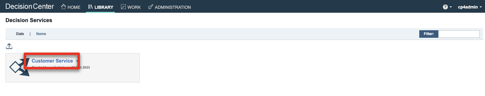 |
| **Action** &nbsp; 1.1.4 | Click the **main** branch.   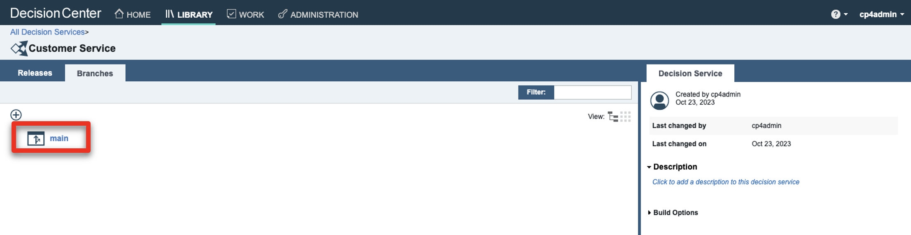 |
| **Action** &nbsp; 1.1.5 | Click the **Decision Artifacts** tab, if you are not already on that tab.    |
| **Action** &nbsp; 1.1.6 | Click the **X** to remove any decision artifact filters (if any).   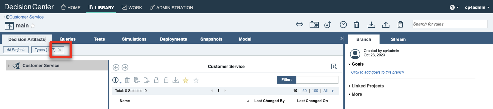 |
| **Action** &nbsp; 1.1.7 | Click **Main customer service flow**.    |

| **1.2** | **Give a decision service overview** |
| :--- | :--- |
| **Narration** | The return validation policy is managed end to end using ODM. The business logic is composed of different rule artifacts like ruleflows, decision tables and business rules expressed in natural language.    The main rule flow is the backbone of the decision services. It synchronizes the rules guiding the fraud detection, the warranty validation, the items return policy as well as the refund conditions. |
| **Action** &nbsp; 1.2.1 | Select the **Issue refund** box (1) and then the **Refund flow** link (2).    |
| **Action** &nbsp; 1.2.2 | Select the **Shipment fee** box (1) and then the **Shipment fee** link (2) to open the decision table.    |
| **Narration** | Let’s have a look at one of the decision artifacts. The 'Shipment fee' decision table defined the fixed return fee depending on the location of the customer and the type of item being returned. |
| **Action** &nbsp; 1.2.3 | Hover your mouse over the row header to display the business rule.    |
| **Narration** | Each row of the table corresponds to a specific business rule that can also be seen in natural language. In this rule, the return fee for grocery items in the USA is 15 dollars. A message is also concatenated to the response to document the decision. |
| **Action** &nbsp; 1.2.4 | Click **Main customer service flow**.    |
| **Narration** | The end-to-end return policy is managed by a flow of business rules and decisions tables that assess the fraud, evaluate the warranty conditions, decide if a product can or cannot be returned, and compute the return fee and reimbursement amount. This decision service is deployed in a production environment and is used by the FocusCorp customer portal, as well as the FocusCorp business process. Let’s have a look at the execution server. |

| **1.3** | **Introduce the production rule execution server** |
| :--- | :--- |
| **Action** &nbsp; 1.3.1 | Show the ODM **Rule Execution Server** screen that was opened during the demo preparation.    |
| **Narration** | The ODM Rule Execution Server is a console to monitor the rule applications that have been deployed on a given server. From this console, the rule administrator can test a rule application, trace its usage, run diagnostics, and access some execution traces when required. |
| **Action** &nbsp; 1.3.2 | Click the **Explorer** tab.    |
| **Action** &nbsp; 1.3.3 | Click **FocusCorp_CustomerService**.    |
| **Narration** | Two ruleapps are deployed on this production environment. The 'customer service' ruleapp is driving the return policy that we have just seen in the business console. |
| **Action** &nbsp; 1.3.4 | Click **FocusCorp_Customer_Service**.    |
| **Action** &nbsp; 1.3.5 | Point out and explain the **FocusCorp_Customer_Service** ruleset.    |
| **Narration** | The customer service application has one ruleset with two input parameters (the customer and the purchase to be returned) and one output parameter (the return decision). The decision service and the ruleset that it contains are versioned, so a user can decide to use a very specific version, or the latest deployed version of the ruleapp.    Let’s now see how to reuse these deployed decisions using watsonx Orchestrate to improve the productivity of the call center agents. |

**[Go to top](#place1)**

  

2 - Creating a new skill in watsonx Orchestrate

 

| **2.1** | **Connect the discovery service to the ODM Rule Execution Server** |
| :--- | :--- |
| **Action** &nbsp; 2.1.1 | Log in to your watsonx Orchestrate instance.    |
| **Narration** | Let’s now log in to watsonx Orchestrate. As a citizen developer, I have the ‘Builder’ profile in Orchestrate. This means that I’m entitled to create new skills and enhance them at any time. I can then access the skills capabilities in watsonx Orchestrate. |
| **Action** &nbsp; 2.1.2 | Click the **menu slider** icon.    |
| **Action** &nbsp; 2.1.3 | Click **Skills**.    |
| **Action** &nbsp; 2.1.4 | Click **Add skills**.   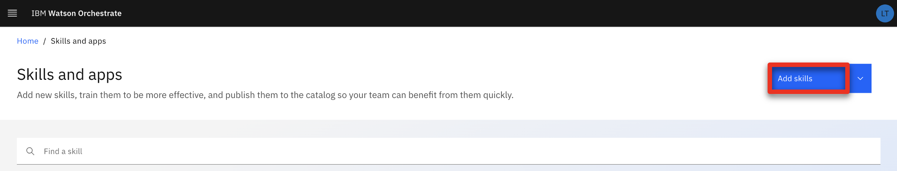 |
| **Narration** | watsonx Orchestrate offers a wide variety of skills that can be added as a personal or team skill. Let’s create a new skill. |
| **Action** &nbsp; 2.1.5 | Click the **IBM Cloud Pak for Business Automation - On premises** tile.   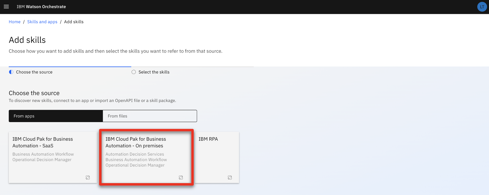 |
| **Narration** | There are various ways to create a skill in watsonx Orchestrate. One of them is to use Automation Discovery Services (ADS). These services allow you to create new skills from IBM Cloud Pak for Business Automation that are deployed on SaaS, on premises or from RPA ones. The automation services that we want to leverage are deployed on a containerized version of ODM on premises deployed on an IBM Cloud cluster.    To access this environment, an API key has been generated by the Cloud Pak for Business Automation cluster administrator. With this API key and the cluster URL, I can set up the discovery service and let it access all the deployed automation on this specific environment. |
| **Action** &nbsp; 2.1.6 | Enter your **Username** (1), **API key** (2) and **Connection URL** (3) you stored in your notebook in the demo preparation. Click **Connect** (4).   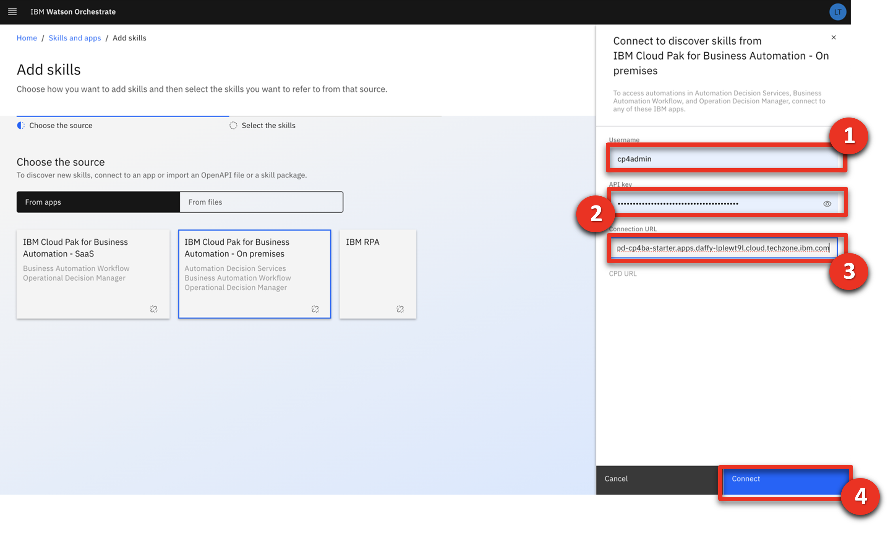 |

| **2.2** | **Create the customer service skill from the ODM ruleapp** |
| :--- | :--- |
| **Action** &nbsp; 2.2.1 | Expand the **Automations** folder.    |
| **Narration** | The discovery service now lets me see all the deployed business automation that I can leverage to create a new skill. |
| **Action** &nbsp; 2.2.2 | Select **FC_CustomerService**.    |
| **Narration** | 'FC_CustomerService' is one of the deployed ODM applications that I can leverage to create a new skill. Let’s use this application. My skill will then use exactly the same business rules as the ones that were recently deployed on the rule execution server that we saw earlier in this demo. |
| **Action** &nbsp; 2.2.3 | Select the '**Invokes the execution..**' skill (1) and click **Save as draft** (2).    |
| **Narration** | Saving as a draft creates a skill in watsonx Orchestrate that will use the same input data and provide the same output results as the selected automation service. The next step is to enhance the skill to personalize the way the skill will ask for the input and display the output. The sentences used to train the NLP engine to invoke the skill are also specified during the skill enhancement.    Let’s search for our recently added skill. |
| **Action** &nbsp; 2.2.4 | Search for ‘**FC**’ to access the recently imported skill.    |
| **Action** &nbsp; 2.2.5 | Expand the **Invokes the execution of the decision service operation XXX_FC_CustomerService** skill (XXX being your initials used during the setup phase). <inline-notification text="The <strong>Step in the process</strong> for this skill should read '<strong>Just 1 step away to be ready</strong>'. The <strong>Status</strong> for this skill should read '<strong>Ready to publish</strong>'."></inline-notification>  |
| **Narration** | The discovery service has correctly created the skill in the catalog. As we can see, it is not yet ready to be published and exposed to the other users in Orchestrate. |
| **Action** &nbsp; 2.2.6 | Make sure you are on the right skill by checking you are the author of the skill.    |
| **Action** &nbsp; 2.2.7 | Click the corresponding **ellipsis** icon.    |
| **Narration** | As a skill builder, I can customize the way the users will interact with my skill. This enhancement phase is required before publishing the skill. |
| **Action** &nbsp; 2.2.8 | Click **Enhance this skill**.    |

| **2.3** | **Enhance the customer service skill to your personal skills** |
| :--- | :--- |
| **Action** &nbsp; 2.3.1 | Enter an easy-to-find skill name (e.g., '**NEW XXX FocusCorp customer service**' – XXX being your own initials)    |
| **Narration** | The first customization is for the skill title. On the right, I can see precisely how the skill will be displayed to the users. As this demo environment is shared across various users, let me add my initials to easily find my skill in the catalog. |
| **Action** &nbsp; 2.3.2 | Click the **Input** tab.   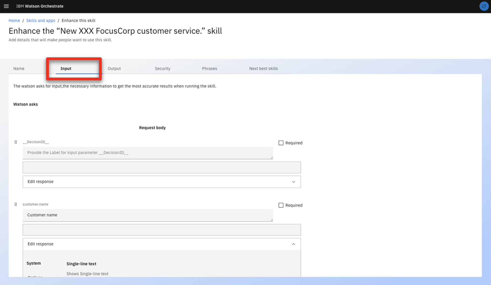 |
| **Narration** | I can also customize the way my inputs will be displayed and edit a specific label for each entry. I can also specify what attributes will be required to invoke the skill. Each required field will have to be provided in order to have the ‘Invoke’ button active. |
| **Action** &nbsp; 2.3.3 | Scroll down to the **customer.name** field.   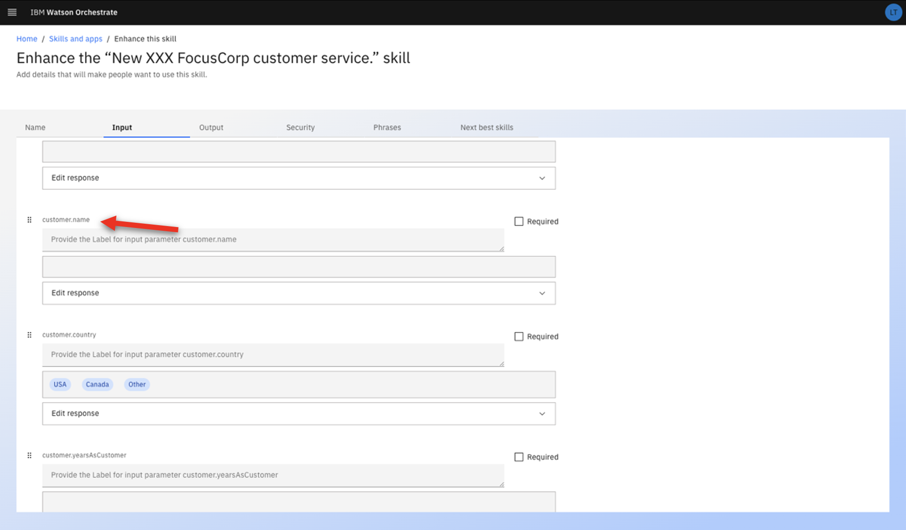 |
| **Action** &nbsp; 2.3.4 | Enter ‘**Customer name**’ in the **customer.name** field.    |
| **Narration** | We will do the exact same procedure for the other remaining fields. To shorten this demo, we have already performed this enhancement in a ready-to-use skill. <inline-notification text="If you are not willing to show the entire skill enhancement, you can jump to <strong>Action 2.3.10</strong>."></inline-notification> |
| **Action** &nbsp; 2.3.5   (Optional) | Repeat **Action 2.3.4** for each input field by adding the corresponding text:    |
| **Action** &nbsp; 2.3.6   (Optional) | Click the **Output** tab.    |
| **Action** &nbsp; 2.3.7   (Optional) | Click **Edit response**.    |
| **Narration** | In the same way I've customized the input data, I can customize the way the skill will display the results. In this demo, we only need to provide the different column headers corresponding to the different fields of the ODM response. |
| **Action** &nbsp; 2.3.8   (Optional) | Type ‘**Return decision**’ in the **decision.returnStatus** header field.    |
| **Action** &nbsp; 2.3.9   (Optional) | Repeat **Action 2.3.8** by adding the following column headers to the corresponding fields:    |
| **Action** &nbsp; 2.3.10 | Click the **Phrases** tab.    |
| **Action** &nbsp; 2.3.11 | Type ‘**register a claim**’ as a new phrase. Hit the enter/return key on your keyboard to validate.    |
| **Narration** | Finally, I can provide different phrases that can be used in the conversation to invoke the skill. |
| **Action** &nbsp; 2.3.12 | Click **Publish**.    |
| **Narration** | My skill is now ready to be published in the watsonx Orchestrate catalog. Any user will now be able to add this new automation skill into their own skills sets.   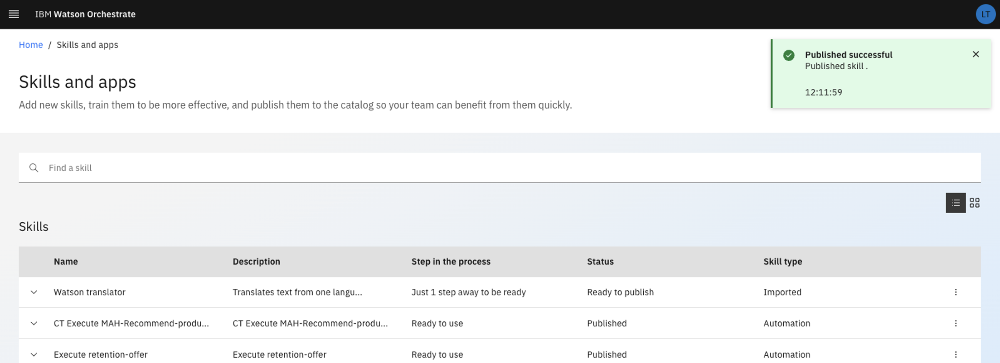 |

| **2.4** | **Add the customer service skill to your personal skills** |
| :--- | :--- |
| **Action** &nbsp; 2.4.1 | Click **Home**.    |
| **Narration** | I can now add this new skill into my personal catalog. |
| **Action** &nbsp; 2.4.2 | Click **Add skills from the catalog**.    |
| **Action** &nbsp; 2.4.3 | Type your ‘**XXX**’ in the search field ('XXX' being your own initals).    |
| **Action** &nbsp; 2.4.4 | Click your ‘**XXX_FC_customerService**’ ('XXX' being your own initials).    |
| **Action** &nbsp; 2.4.5 | Click **Connect app**.   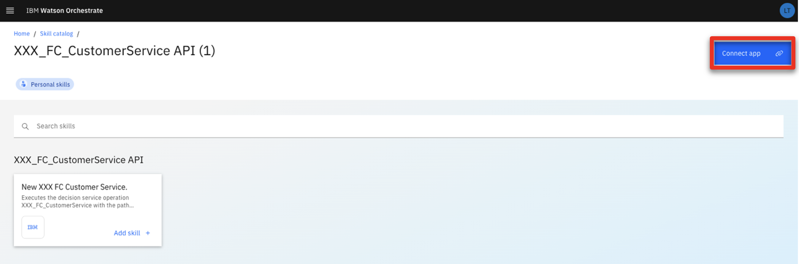 |
| **Narration** | To be able to connect to the execution server, I must connect my skill to the Rule Execution Server. I can use the ZEN API key that was provided by the ODM administrator to connect to the deployed rule service. |
| **Action** &nbsp; 2.4.6 | Enter the **ZEN API key** (1) you copied in your notebook. Click **Connect app** (2).    |
| **Narration** | My skill is connected, and I can now add it into my personal catalog. |
| **Action** &nbsp; 2.4.7 | Click **Add skill +** (2).    |
| **Action** &nbsp; 2.4.8 | Check that your skill is added.   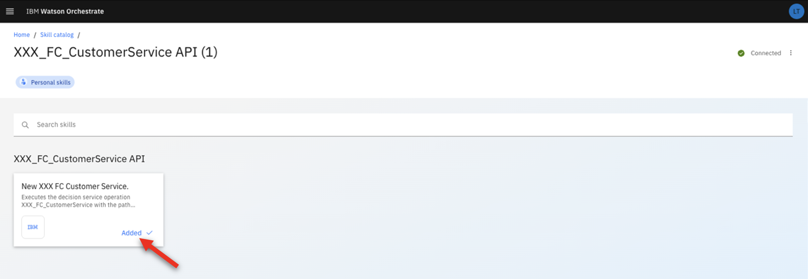 |
| **Action** &nbsp; 2.4.9 | Click **Home**.    |

| **2.5** | **Show the customer service skill** |
| :--- | :--- |
| **Action** &nbsp; 2.5.1 | Click the **New XXX FocusCorp customer service** tile ('XXX' being your own initals).    |
| **Narration** | The new skill is now listed in my personal skills list. In one click, I can invoke it. |
| **Action** &nbsp; 2.5.2 | Scroll through the set of required inputs.   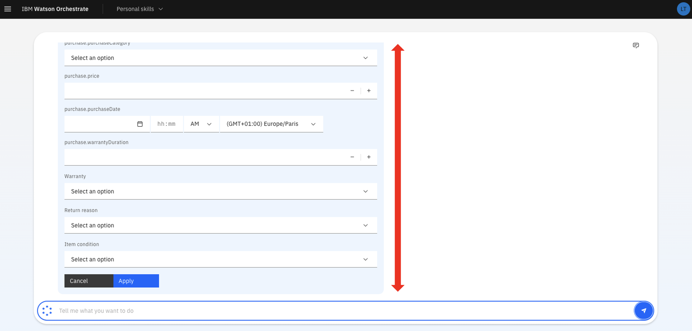 |
| **Narration** | With ODM, the decisions require different input data describing the customer and the item to be returned. It would take too much time for an agent to fill all these fields manually. For this reason, we are going to create a composite skill that will get all the customer and item information from the FocusCorp CRM.    In this effort, we have already created a skill that is able to recover all this information with only the customer ID and purchase ID. |
| **Action** &nbsp; 2.5.3 | Click the **XXX FocusCorp Get data from CRM** skill ('XXX' being your own initals).    |
| **Narration** | Let’s use a customer ID and a purchase ID, just like a call center agent would do. |
| **Action** &nbsp; 2.5.4 | Enter ‘**CU-001**’ as the **customer ID** (1). Enter ‘**PO-001**’ as the **purchase ID** (2). Click **Apply** (3).    |
| **Action** &nbsp; 2.5.5 | Scroll through the result to show the data recovered from the back-end system. |
| **Narration** | This skill has correctly recovered the customer and item details from the FocusCorp CRM. I can now use that skill to recover the data and feed my customer request decision skill with this data. To do so, I will use a skill flow to create a composite skill. |

**[Go to top](#place1)**

  

3 - Creating a composite skill to deliver easy-to-use interactions

 

| **3.1** | **Create the customer service composite skill** |
| :--- | :--- |
| **Action** &nbsp; 3.1.1 | Click the **menu slider** icon.    |
| **Action** &nbsp; 3.1.2 | Click **Skills**.   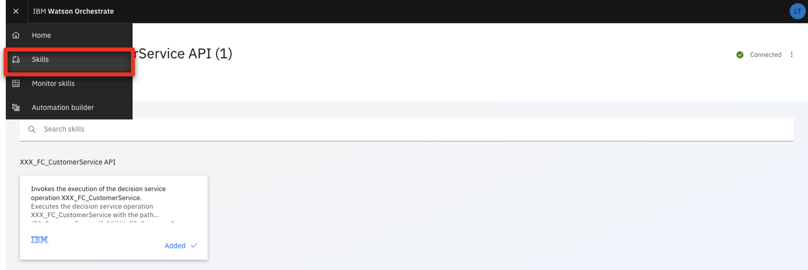 |
| **Action** &nbsp; 3.1.3 | Expand the **Add skills** menu (1). Click **Create a skill flow** (2).    |
| **Narration** | Let’s now work on this composite skill. As an automation builder, I can create composite skills in Orchestrate.    The first step is to give a name and description to the skills so that users can easily recognize it in the catalog. The description is important to understand the precise actions that are performed by the composite skill. |
| **Action** &nbsp; 3.1.4 | Click the **pen** icon to name the ruleflow.    |
| **Action** &nbsp; 3.1.5 | Enter a skill name that contains your 'XXX' initials (e.g., '**XXX FocusCorp Register claim**) (1). In the **Description** field, enter ‘**Get the customer and purchase details from the CRM - Validates de return conditions and refunds**’ (2). Click **Save** (3).    |
| **Action** &nbsp; 3.1.6 | Click the **+** button.    |
| **Narration** | Let’s now add the two skills that will compose this flow. The first one will collect the data from the CRM. The second one, which we created from the ODM deployment, will analyze them and provide the return decision. |
| **Action** &nbsp; 3.1.7 | Type your '**XXX**' initials to find all your skills from the catalog.    |
| **Action** &nbsp; 3.1.8 | Click the **XXX FocusCorp_Get_Data_from_CRM** skill ('XXX' being your own initals).    |
| **Narration** | Let’s search for the skills we have added in our personal skills. |
| **Action** &nbsp; 3.1.9 | Click **Add skill +**.    |
| **Action** &nbsp; 3.1.10 | Click **+** button.    |
| **Narration** | Now that we have the data recovery skill in our flow, let’s search for the decisioning one. |
| **Action** &nbsp; 3.1.11 | Type your '**XXX**' initials to find all your skills from the catalog.    |
| **Action** &nbsp; 3.1.12 | Click the **XXX FocusCorp_CustomerService** skill.    |
| **Narration** | Let’s use this finalized version of our skill. This version is the exact same version of the skill we just imported but with more detailed enhancements. All its fields have been assigned a label to provide the call center agents an easy-to-understand interface. |
| **Action** &nbsp; 3.1.13 | Click **Add skill +**.    |
| **Action** &nbsp; 3.1.14 | Click the second skill in the flow.    |
| **Action** &nbsp; 3.1.15 | Click **Generate mapping suggestions**.    |
| **Narration** | The next step is to map the output data of the first skill to the input data of the second skill. This operation can be automated using watsonx Orchestrate's intelligent mapping capability. Orchestrate is able to suggest a mapping based on attributes, names and types. |
| **Action** &nbsp; 3.1.16 | Point out the mapping.    |
| **Narration** | We can see all the attributes are correctly mapped between the two skills in just a single click. No additional action is required. We can now save the skill to add it to the catalog, as well as enhance it to publish it to users. |
| **Action** &nbsp; 3.1.17 | Expand the **Actions** menu (1). Click **Save as draft** (2).    |
| **Action** &nbsp; 3.1.18 | Expand the **Actions** menu (1). Click **Enhance** (2).    |
| **Narration** | Let’s now enhance the skill by adding some phrases that will be used to invoke the skill in the conversational interphase of watsonx Orchestrate. |
| **Action** &nbsp; 3.1.19 | Click **Phrases**.    |
| **Action** &nbsp; 3.1.20 | Type '**return a product**’.    |
| **Action** &nbsp; 3.1.21 | Click **Publish**.    |
| **Narration** | Our skill is ready to be published. Just by entering ‘return a product’ in the conversation, watsonx Orchestrate will understand that this skill should be used. |
| **Action** &nbsp; 3.1.22 | Click **Home**.    |

**[Go to top](#place1)**

  

4 - Using the customer service skill in the call center

 

| **4.1** | **Add the customer service composite skill** |
| :--- | :--- |
| **Action** &nbsp; 4.1.1 | Click **Add skills from the catalog**.    |
| **Narration** | As a call center user, I want to use a skill that rapidly provides me a decision when a customer calls to return a purchase.    I can search in the skills catalog for such a skill. Let’s directly search for the skills we recently created. |
| **Action** &nbsp; 4.1.2 | Type your '**XXX**' initials to find all your skills from the catalog.    |
| **Narration** | We are looking for a composite skill. There is one that matches our search. Let’s add it into the personal catalog. |
| **Action** &nbsp; 4.1.3 | Click the **Composite** tile.    |
| **Action** &nbsp; 4.1.4 | Click **Add skill +**.    |
| **Action** &nbsp; 4.1.5 | Click **Add skill +**.    |
| **Action** &nbsp; 4.1.6 | Check that your skill is added.    |

| **4.2** | **Use the customer service composite skill** |
| :--- | :--- |
| **Action** &nbsp; 4.2.1 | Check that the skill is in your personal skill set.    |
| **Narration** | We're now ready to use the composite skill. I can invoke it directly using the conversational UI in watsonx Orchestrate. |
| **Action** &nbsp; 4.2.2 | Type ‘**return a product**’ and hit the enter/return key on your keyboard.    |
| **Action** &nbsp; 4.2.3 | Enter ‘**CU-004**’ as the **customer ID** (1). Enter ‘**PO-001**’ as the **purchase ID** (2). Click **Apply** (3).    |
| **Narration** | I only need to provide the customer ID and purchase ID to recover the details from the CRM. |
| **Action** &nbsp; 4.2.4 | For the **Return reason** field, select **Arrived_late** (1). For the **Item condition** field, select **Opened** (2). Click **Show all fields** (3).    |
| **Narration** | The customer is now telling me the reasons why they're returning the product. |
| **Action** &nbsp; 4.2.5 | Point out the other fields.    |
| **Narration** | All the other fields have been automatically pre-filled for me, saving me a lot of time. |
| **Action** &nbsp; 4.2.6 | Scroll down and click **Show fewer fields**.   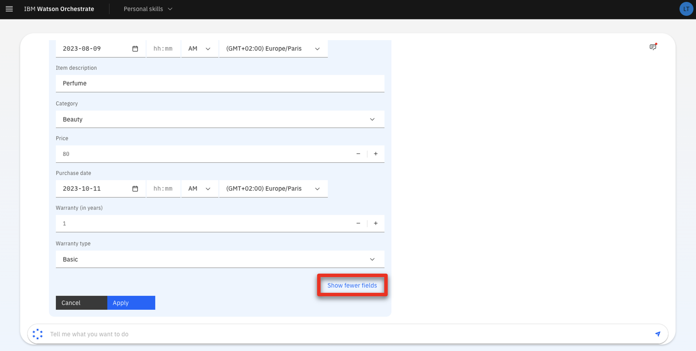 |
| **Action** &nbsp; 4.2.7 | Click **Apply**.    |
| **Action** &nbsp; 4.2.8 | Point out the decision results.    |
| **Narration** | In one click, the ODM decision service deployed on-premises returns me a decision and other information, such as the refund amount or some possible shipment fees. All these results have been dynamically calculated by the rules we saw at the beginning of this demo. If the SMEs decide to update the business logic by deploying new rules, this skill will automatically take them into account without having to recreate it. <inline-notification text="You can play with different combination of users (CU-001 – CU-005) and items (PO-001 – PO-005) to show the different decision outcomes."></inline-notification>   |

| **4.3** | **Advanced demos for ODM experts [Optional]** |
| :--- | :--- |
| **Action** &nbsp; 4.3.1 | Update a business rule in the Decision Center. |
| **Action** &nbsp; 4.3.2 | Deploy a new version of the ruleapp in the Rule Execution Server. |
| **Action** &nbsp; 4.3.3 | Re-run the exact same flow and show that the new rules have been applied. |

**[Go to top](#place1)**

  

Summary

In this demo, we saw how a company uses IBM watsonx Orchestrate to reuse and expose their deployed ODM decisions services to improve employee productivity. 

We used the discovery service to connect to a production ODM execution server environment. We also used the discovery service to create a new skill that's able to invoke rule-based decisions. We created a composite skill that's able to orchestrate different skills, mapping their respective inputs and outputs automatically. Finally, we used language recognition to invoke this composite application using conversational UIs.

ODM's capabilities are used by our customers today to manage hundreds of thousands of business rules in their organizations and execute them in a robust, scalable environment. Skills can be configured so that they execute a specific deployment version of the rules, or the latest deployed ones at any time.

watsonx Orchestrate is the new intelligent generation of tools that leverages your existing IBM automation assets and reuses them in modern, scalable, and easy-to-use environments. 

Thank you for attending today’s presentation.

**[Go to top](#place1)**

  

