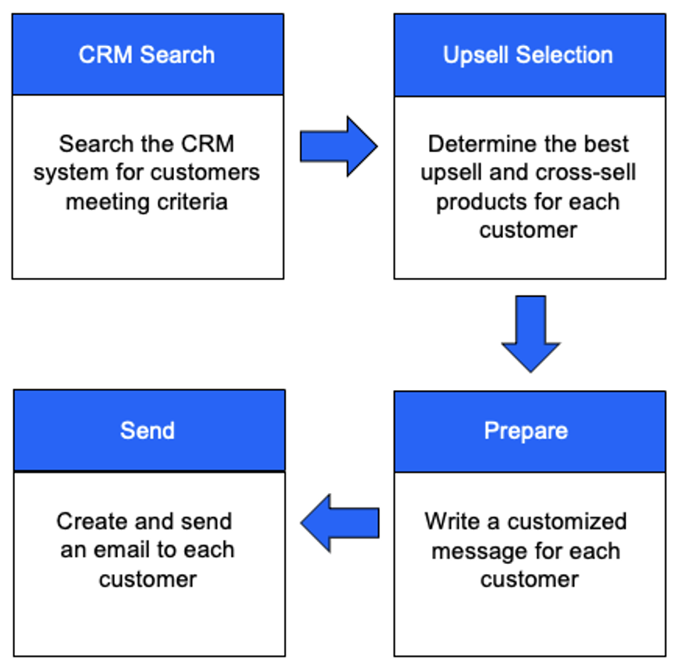
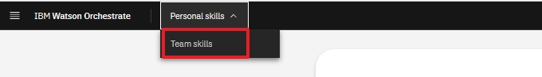

| **DEMO OVERVIEW** | | 
| :---         | :--- |
| **Scenario overview** | This demo shows how watsonx Orchestrate can be used by sales representatives to assist with the upsell/cross-sell process. To illustrate this, an insurance seller uses watsonx Orchestrate to retrieve a list of customers from Salesforce and automatically send a customized offer.|
| **Demo products** | watsonx Orchestrate |
| **Demo capabilities** | Salesforce skill; watsonx.ai generative AI skill; Microsoft Outlook skill; Embedded decision engine skill|
| **Demo script** | A complete demo script is on the second tab above.    This demo script has multiple tasks that each have multiple steps. In each step, you have the details about what you need to do (**Actions**), what you can say while delivering this demo step (**Narration**), and what screenshots you will see.  This demo script is a suggestion, and you are welcome to customize based in your sales opportunity. Most importantly, practice this demo in advance. If the demo seems easy for you to execute, the customer will focus on the content. If it seems difficult for you to execute, the customer will focus on your delivery. |
| **How to get support** | • Open a support case at <a href="https://techzone.ibm.com/help" target="_blank" rel="noreferrer">IBM Technology Zone Help</a> regarding issues with reserving and provisioning Tech Zone environments. • Contact <a href="https://ibm-cloud.slack.com/archives/C0216F39ACU" target="_blank" rel="noreferrer">#platinumdemos-automation-support</a> regarding issues with setting up and running this demo. |

### **PREPARE TO GIVE THE DEMO**

New users will have access to pre-connected "Team Skills” to perform Part 1 of the demo that uses an existing skill flow. 

For Part 2, it will be necessary to set up two “Personal Skills” that can be used to build a new skill flow.

The OpenAPI file for the custom Salesforce skill will also require an update before we can re-import it. (This API has already been imported, so it is necessary to change the API signature before we can repeat the import process).

1 - Add Salesforce API as personal skill

1. Click the **Team skills** drop-down menu (1) and click **Personal skills** (2).    
   

2 - Add personal skill with Automation Builder

When you log into watsonx Orchestrate, the default view is **personal skills**. To run the demo, change the view to **team skills**. 

3 - Update the OpenAPI file

When you log into watsonx Orchestrate, the default view is **personal skills**. To run the demo, change the view to **team skills**. 

Click [here](demo-script) to go to the **Demo script** on the next tab.