

| **DEMO OVERVIEW** | | 
| :---         | :--- |
| **Scenario overview** | This demo shows how watsonx Orchestrate can be used by sales representatives to assist with the upsell / cross-sell process. To illustrate this, an insurance seller uses watsonx Orchestrate to retrieve a list of customers from Salesforce and automatically send a customized offer. Developers, called ‘builders’ in watsonx Orchestrate, create the customized skills used by the agents. |
| **Demo products** | watsonx Orchestrate |
| **Demo capabilities** | Salesforce skill; watsonx.ai generative AI skill; Microsoft Outlook skill; Embedded decision engine skill|
| **Demo script** | A complete demo script is on the second tab above.    This demo script has multiple tasks that each have multiple steps. In each step, you have the details about what you need to do (**Actions**), what you can say while delivering this demo step (**Narration**), and what screenshots you will see.  This demo script is a suggestion, and you are welcome to customize based in your sales opportunity. Most importantly, practice this demo in advance. If the demo seems easy for you to execute, the customer will focus on the content. If it seems difficult for you to execute, the customer will focus on your delivery. |
| **How to get support** | • Open a support case at <a href="https://techzone.ibm.com/help" target="_blank" rel="noreferrer">IBM Technology Zone Help</a> regarding issues with reserving and provisioning Tech Zone environments. • Contact <a href="https://ibm-cloud.slack.com/archives/C0216F39ACU" target="_blank" rel="noreferrer">#platinumdemos-automation-support</a> regarding issues with setting up and running this demo. |

 

### **PREPARE TO GIVE THE DEMO**

1 - Add Salesforce API skill

1. Click the **Team skills** drop-down menu (1) and click **Personal skills** (2).   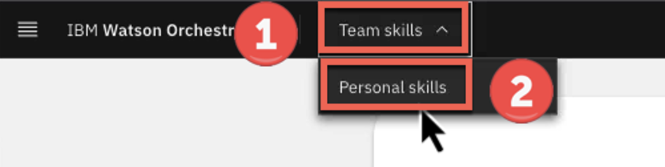 

2. Click the **Add skills from the catalog** tile.   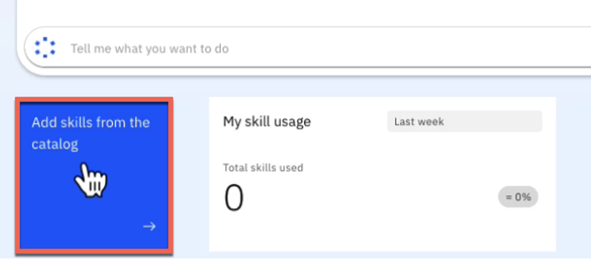 

3. Search for '**life**' in the search panel.   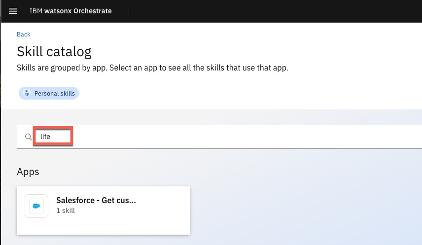 

4. The list of apps is filtered to only show apps that contain skills containing the word 'retrieve.' Click the **Salesforce – Get customers with recent life changes** card.   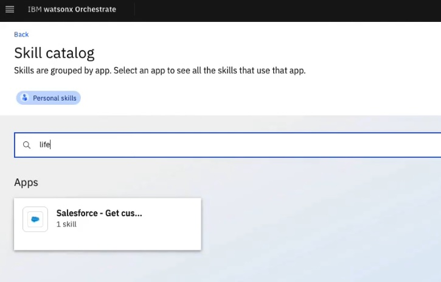 

5. Click **Add skill +** (1). Click **Connect app** (2).   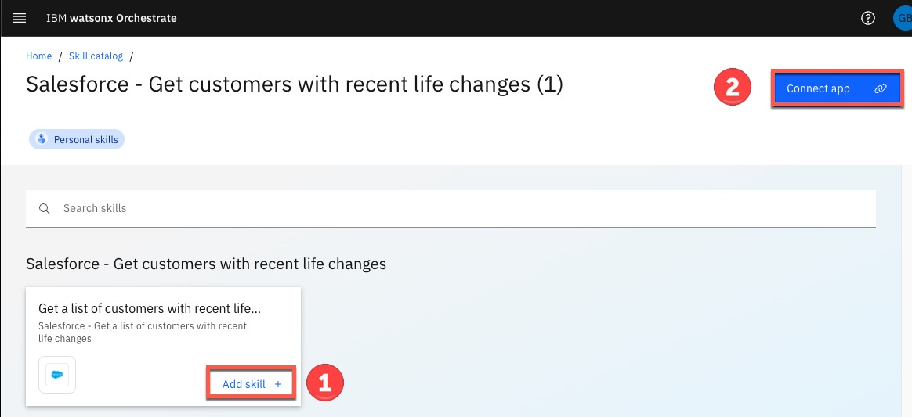 

6. Use the following credentials:    • **Client ID** (1): 3MVG9HB6vm3GZZR_fBoKSxSomjQ8ZaShg9mWyjw2pJak55hcL8KGtUjjkooS7wpLD25QraIBxop4ThrTPK237   • **Client Secret** (2): 34CB8CCE1E4495C0CAE6A921A5FC7D17CC6CE614152175D20F5B00F8B250626C    Click **Connect app** (3).   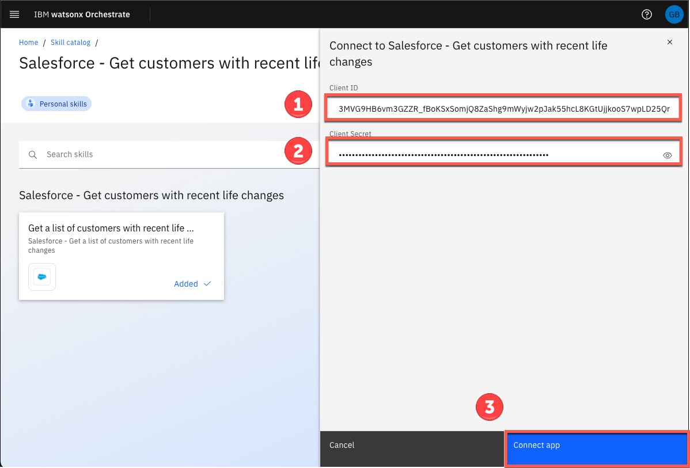 

7. Click the **menu slider** icon.   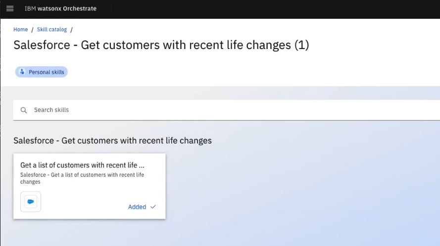 

8. Click **Home**.   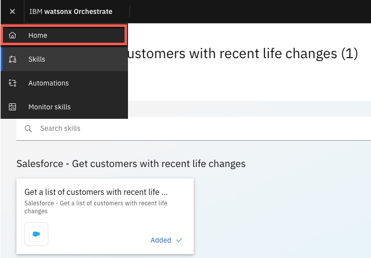 

9. Test the skill works correctly by clicking the skill tile.   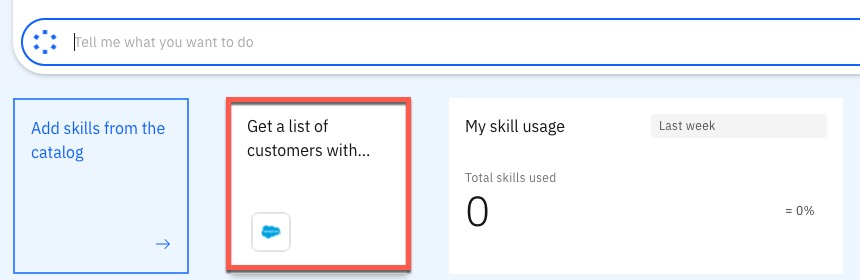 

10. A table should be shown containing the data from Salesforce.   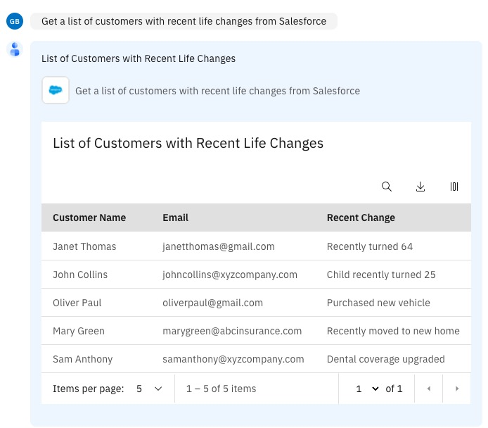 
   

2 - Add product upsell skill

The next personal skill to add will be based on a decision model imported into Automation Builder.

1. Click **Add skills from the catalog**.   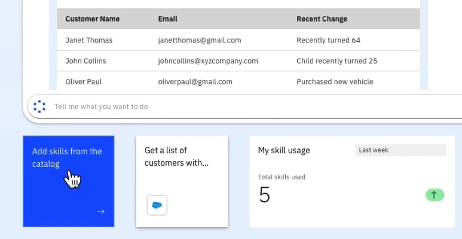 

2. Search for '**Product**' in the search panel.   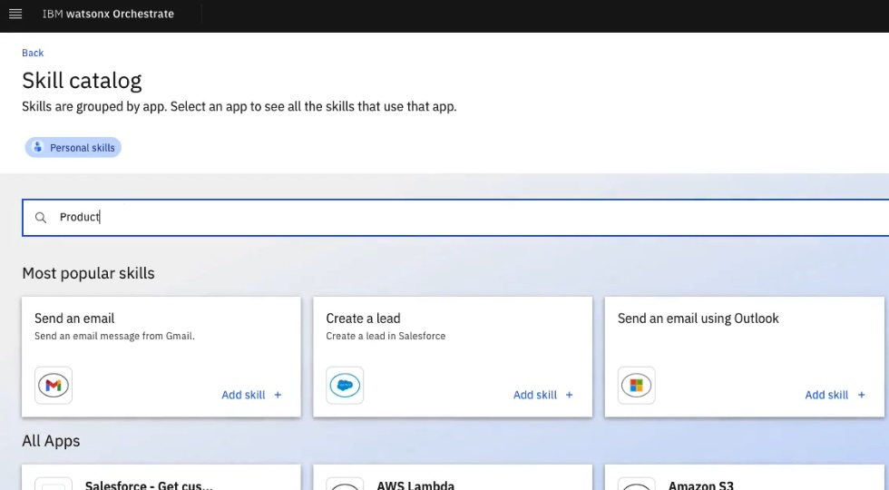 

3. Click **Product Upsell**.   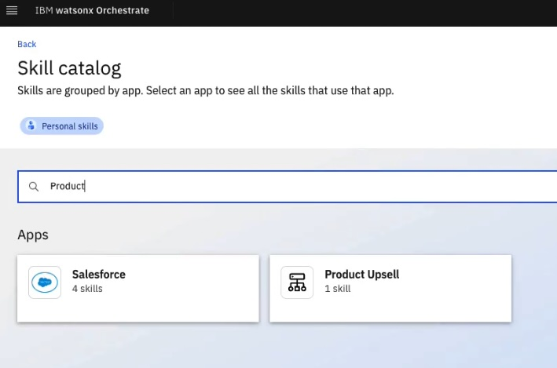 

4. Click **Add skill +**.   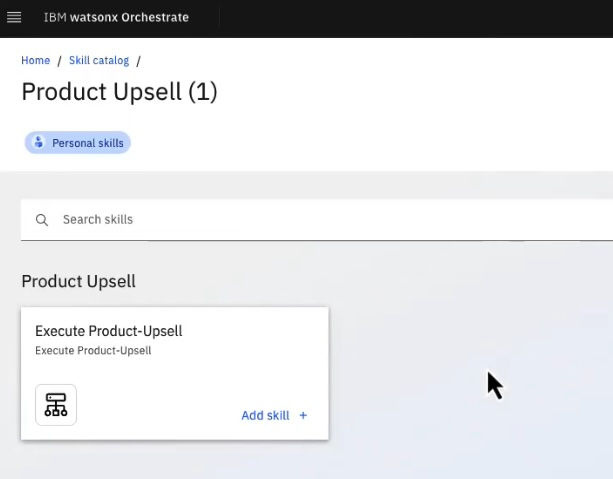 

3 - Update the OpenAPI file

<inline-notification text="The OpenAPI file must be updated before it can be used to import a new skill. This is necessary as Orchestrate uses two attributes as the unique ID for the skill and the skill has already been imported as a team skill."></inline-notification>

1. In a multi-user environment, we must provide unique values for the API. There are four attributes to update: **x-ibm-application-name**, **description**, **summary** and **operationId**.   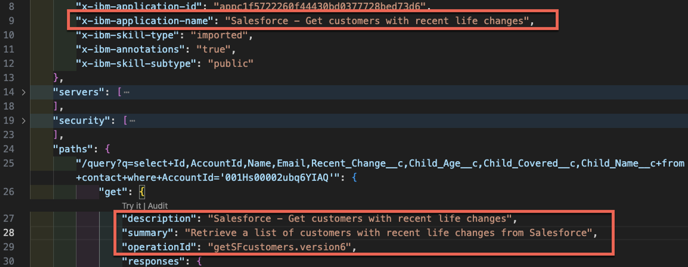   Add your initials and date to the four attributes.    Please test you can import the API as a skill before starting the demo. These steps are taken from the demo script and are duplicated here for convenience.  

 

### **PREPARATION REQUIRED TO GIVE THIS DEMO AGAIN**

Delete the draft skill

Delete the draft skill once you have tested it, as it will be imported again in the demo. After returning to the skill panel, search for the unique ID and delete it.   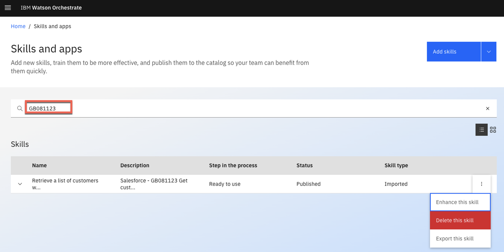 

Repeat the demo

To repeat the demo, remove the two skills that were created during the demo. First, remove the skill flow, and then remove the skill created from the OpenAPI.

1. Click the **menu slider** icon and select **Skills**. Use the search panel to find the skill flow that was created in the demo. In the example demo, this was created as '**GB Upsell Skill**' (it is listed below as a composite skill). Click the corresponding **ellipsis** icon to the right of the screen. Click **Delete this skill**.    

2. Remove the skill that was created using an OpenAPI file. During the preparation for this skill import, it was recommended to add a unique ID to the description attribute in the OpenAPI file. (In the example, 'GB081123' was added to the description attribute.) Use your unique ID to find the skill. Click the **ellipsis** icon and click **Delete this skill**.    

 

### **AFTER EACH DEMO**

Final cleanup

The watsonx Orchestrate environment used for the demo is shared by many users. After completing your demo, please take a few minutes to remove any skills or automations you created during the demo. Then, also remove the personal skills created during the demo preparation. Finally, remove the decision automation that was imported.

1. Click the **menu slider** icon and select **Skills**. Use the search panel to find the skill flow that was created in the demo. In the example demo, this was created as '**GB Upsell Skill**' (it is listed below as a composite skill). Expand the skill details to confirm you are the author. Click the corresponding **ellipsis** icon to the right of the screen. Click **Delete this skill**.    

2. Remove the skill that was created using an OpenAPI file. During the preparation for this skill import, it was recommended to add a unique ID to the description attribute in the OpenAPI file. (In the example, 'GB081123' was added to the description attribute.) Use your unique ID to find the skill. Expand the skill details to confirm you are the author. Click the **ellipsis** icon and click **Delete this skill**.   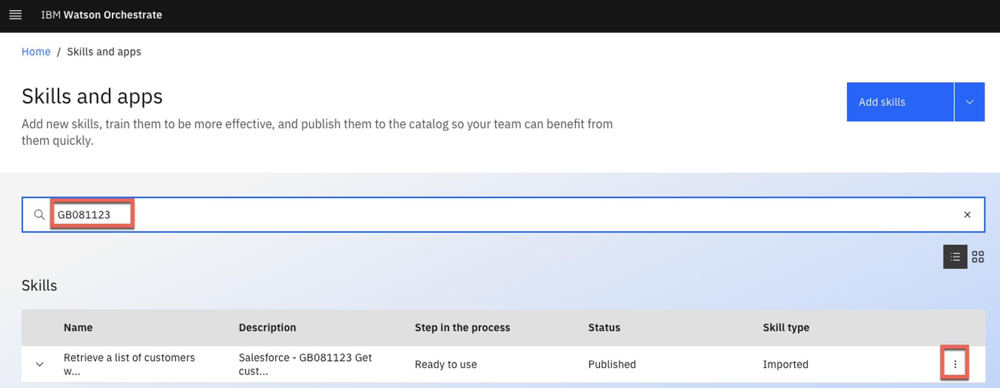 

3. Remove the **Product Upsell** skill that was created when the decision automation was published. Enter '**Product Upsell**' in the search panel, and expand the details to confirm you are the author. Click the **ellipsis** icon and click **Delete this skill**.   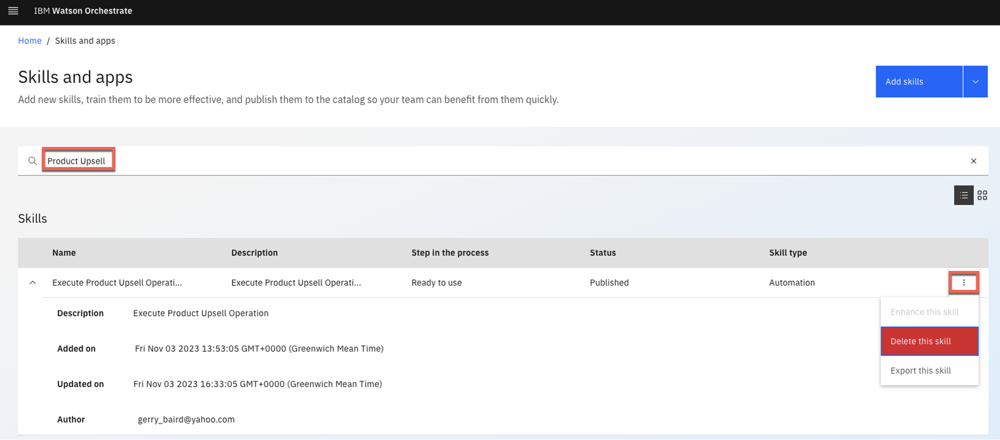 

4. Click the **menu slider** icon. Select **Automation builder**.   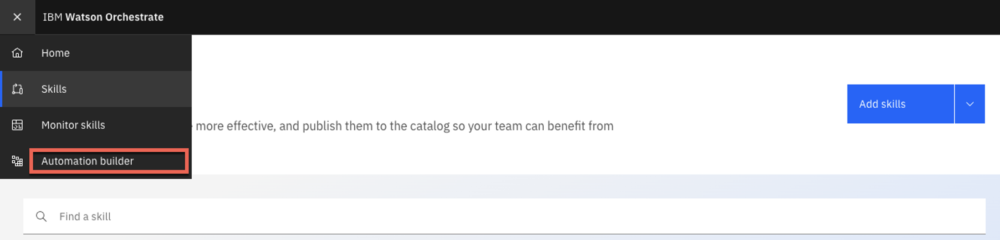 

5. Click the **ellipsis** icon on the **Product Upsell** card. Click **Delete** and confirm the deletion.   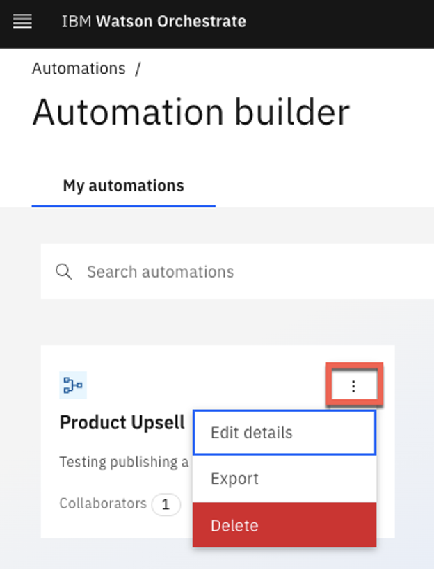 

Click [here](demo-script) to go to the **Demo script** on the next tab.