

| **DEMO OVERVIEW** | | 
| :---         | :--- |
| **Scenario overview** | In this demo, we will see how watsonx Orchestrate can leverage Operational Decision Manager’s deployed services on premises to create new skills. To illustrate this, we will use a company’s customer service application. |
| **Demo products** | IBM Operational Decision Manager (included in Cloud Pak for Business Automation V23.0.1), watsonx Orchestrate |
| **Demo capabilities** | Decision management; Digital assistant |
| **Demo script** | A complete demo script is on the second tab above.    This demo script has multiple tasks that each have multiple steps. In each step, you have the details about what you need to do (**Actions**), what you can say while delivering this demo step (**Narration**), and what diagrams and screenshots you will see.  This demo script is a suggestion, and you are welcome to customize based on your sales opportunity. Most importantly, practice this demo in advance. If the demo seems easy for you to execute, the customer will focus on the content. If it seems difficult for you to execute, the customer will focus on your delivery. |
| **Demo downloads** | Operational Decision Manager (Decision Center projects)   • <a href="./files/Customer Service.zip" target="_blank" rel="noreferrer">Customer Service.zip</a>   • <a href="./files/Get Request Details.zip" target="_blank" rel="noreferrer">Get Request Details.zip</a>    watsonx Orchestrate (Skills)   • <a href="./files/XXX FocusCorp Customer Service.json" target="_blank" rel="noreferrer">XXX FocusCorp Customer Service.json</a>   • <a href="./files/XXX FocusCorp Get data from CRM.json" target="_blank" rel="noreferrer">XXX FocusCorp Get data from CRM.json</a>    Optional (For ODM experts looking to customize the decision service)   • <a href="./files/RuleDesignerFiles_V5_20231027.zip" target="_blank" rel="noreferrer">RuleDesignerFiles.zip</a> |
| **Required versions** | IBM Operational Decision Manager 8.11.1.0 on IBM Cloud, watsonx Orchestrate SaaS (Standard or Enterprise edition) |
| **How to get support** | • Open a support case at <a href="https://techzone.ibm.com/help" target="_blank" rel="noreferrer">IBM Technology Zone Help</a> regarding issues with reserving and provisioning Tech Zone environments. • Contact <a href="https://ibm-cloud.slack.com/archives/C0216F39ACU" target="_blank" rel="noreferrer">#platinumdemos-automation-support</a> regarding issues with setting up and running this demo. |

<inline-notification text="You are going to deliver a demo on a watsonx Orchestrate shared environment. watsonx Orchestrate environments are single-tenant. To prevent conflicts and to easily access your different artifacts, you will have to pre-fix or update some skills and artifacts with your own initials.    In this documentation, we will use ‘<strong>XXX</strong>’. You are asked to use your own 3-letter initials that are not yet used on your watsonx Orchestrate instance."></inline-notification>

 

Prerequisites

Before starting the installation of this demo, make sure you have been granted access to a watsonx Orchestrate SaaS environment:   
• IBM Tech Sales: Contact your local geo tech sales leader to be invited to the dedicated watsonx Orchestrate instances  
• Business Partners: Contact your local IBM Ecosystem representative

It is also required that you have a text editor that's able to edit JSON files. In this documentation, we will use Microsoft™ Visual Studio Code.

 

**[Go to top](#top)**

  

 

### **PROVISION AN OPENSHIFT ENVIRONMENT AND DEPLOY CLOUD PAK FOR BUSINESS AUTOMATION**

1 - Prepare your Cloud Pak for Business Automation environment

1. Visit the <a href="https://techzone.ibm.com/collection/PakInstaller/journey-cloud-pak-for-business-automation" target="_blank" rel="noreferrer">Pak Installer</a> page.   

2. Click the **Cloud Pak for Business Automation 23.0.1 IF001 - VMWare Public (OCP 4.12) (Powered by Pak Installer)** tile.    

3. Select **Reserve now** tile.     

4. Select **Practice / Self-Education**     

5. Enter a **Purpose description**     

6. Select your **Preferred Geography**     

7. Select **decisions** as the **Starter service**     

8. Read and agree to **IBM Technology Zone's Terms and Conditions and End User Security Policies** (1). Click **Submit** (2).     

9. Check that the request was correctly submitted, and wait for the confirmation emails.     

 

**[Go to top](#top)**

  

2 - Download the installation files

Four installation files are required for the setup of this demonstration.

To set up IBM Operational Decision Manager (ODM):  
• <a href="./files/Customer Service.zip" target="_blank" rel="noreferrer">Customer Service.zip</a>  
• <a href="./files/Get Request Details.zip" target="_blank" rel="noreferrer">Get Request Details.zip</a>

To set up watsonx Orchestrate:  
• <a href="./files/XXX FocusCorp Customer Service.json" target="_blank" rel="noreferrer">XXX FocusCorp Customer Service.json</a>   
• <a href="./files/XXX FocusCorp Get data from CRM.json" target="_blank" rel="noreferrer">XXX FocusCorp Get data from CRM.json</a>

**Customer Service.zip** contains the business rule decision service driving the customer service decisions. **Get Request Details.zip** contains some rules that are used to simulate access to the FocusCorp CRM. The rules are simply providing the customer and purchase details based on a customer and purchase ID. This service is used to create the ‘FocusCorp get data from CRM’ skill. The two JSON files (**XXX FocusCorp Customer Service.json** and **XXX FocusCorp Get data from CRM.json**) are the skills configuration files that are used to make the skill creation faster in watsonx Orchestrate.

Download these four files on your computer to have them ready to configure these two components.

 

**[Go to top](#top)**

  

 

### **VALIDATE YOUR ENVIRONMENT AND BOOKMARK YOUR IDS / URLS**

1 - Check your Cloud Pak for Business Automation install

After 4-5 hours, your Cloud Pak for Business Automation (CP4BA) should be ready. After requesting your CP4BA, you will receive a series of emails from IBM Technology Zone regarding the progress of your request.

1. Check for an email with the subject **Pak Installer – CloudPakInstalled** (1). Add your **Pak Installer Portal URL** (2) into your notebook.    

2. Wait for ODM to be installed.   <inline-notification text="At this stage, it will take around 3-4 hours to have ODM fully installed onto your environment."></inline-notification>

3. Click your **Pak Installer Portal URL**.    

4. Click the **Cloud Pak Console** tab.    

5. Check that the **Decision Console ODM** credentials and URLs are available.   <inline-notification text="If nothing is displayed in this section, you will have to wait a bit more for the installation to be completed."></inline-notification>  

6. Add the following information to your notebook: **Decisions Admin Username** and **Decisions Admin Password** (1), **Decision Center URL** (2), **Decision Server Console URL** (3), **Designer URL** (4).    

7. Add the CPD URL of your CP4BA install to your notebook.   <inline-notification text="Copy only the section highlighted in blue. It will be used to configure the discovery service in watsonx Orchestrate."></inline-notification>  

 

**[Go to top](#top)**

  

2 - Generate your API key

1. Open the **Designer URL** from your notebook and select **Enterprise LDAP**.    

2. For the **Username** and **Password** fields (1), use the **Decisions Admin Username** and **Decisions Admin Password** credentials from your notebook. Click **Log in** (2).    

3. Right-click your **avatar** icon (1). Click **Profile and settings** (2).    

4. Click **API key**.    

5. Click **Generate new key**.    

6. Click **Generate**.    

7. Click the **eye** icon to show the API key.    

8. Copy and paste the **API key** into your notebook (1). Click **Close** (2).    

 

**[Go to top](#top)**

  

3 - Generate your ZEN API key

1. Open a terminal window.    

2. Type the following command:   `echo -n "cp4admin:<your API key>" | base64`    

3. Copy and paste your ZEN API key (highlighted in blue) in your notebook using the format '**ZenApiKey + [your generated ZEN API key]**'     

4. Check your notebook to make sure you have all the following information noted.   <inline-notification text="Please note the format of the ZEN API key (highlighted in orange), which you will have to use in the discovery service."></inline-notification>  

 

**[Go to top](#top)**

  

 

### **CONFIGURE ODM**

1 - Import the ‘Get Request Details’ decision service

1. Log in to the **Decision Center** using the URL and credentials from your notebook.    

2. Click the **LIBRARY** tab.    

3. Click the **import** icon.    

4. Click **Choose**.    

5. In your local folder, select **Get Request Details.zip** (1). Click **Open** (2).    

6. Click **Import**.   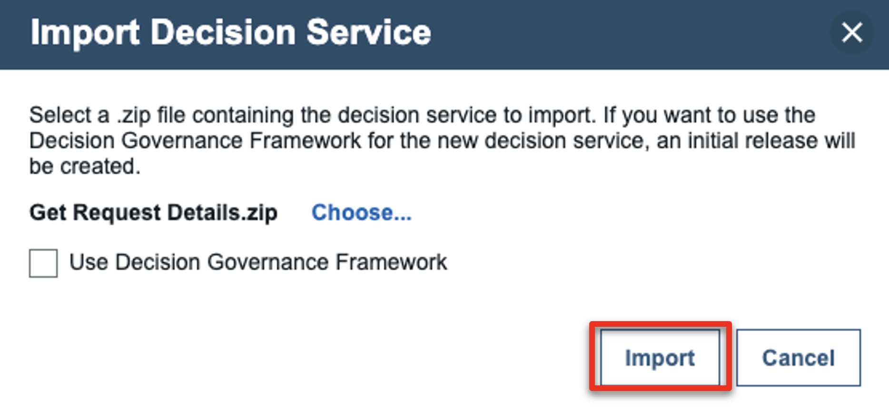 

7. Click the **LIBRARY** tab.   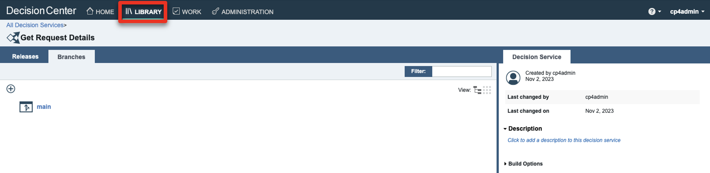 

8. Repeat from **Step 3** and import the **Customer Service.zip** file.  

9. Click **Get Request Details**.   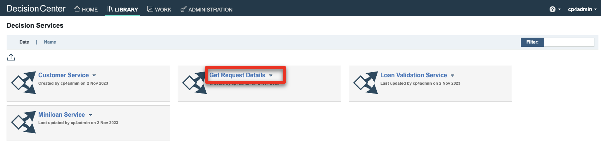 

10. Click **main**.   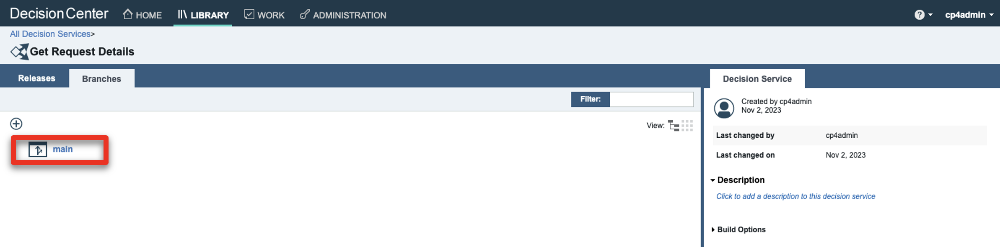 

11. Click the **Deployments** tab.    

12. Click the **Configurations** tab.    

13. Click the **+** button.   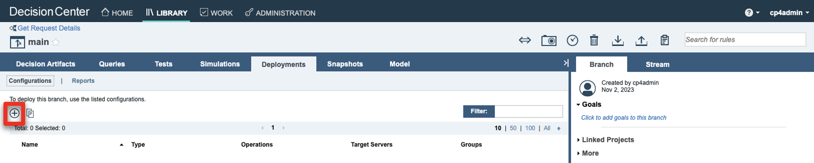 

14. For the **Configuration name**, enter ‘**wxoDeploy**’ (1). For the **RuleApp name**, enter ‘**FocusCorp_GetRequestDetails**’ (2). Click the **Operations** tab (3).   <inline-notification text="Make sure to use the same name and letter case for the RuleApp name."></inline-notification> 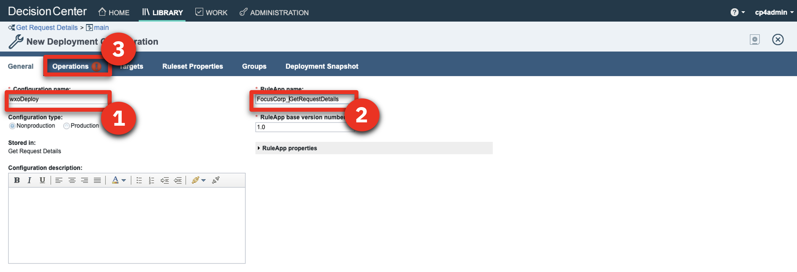 

15. Select the **FocusCorp_Get_request_details** operation (1). Click the **Targets** tab (2).    

16. Select the **Decision Service Execution** target server (1). Click the **save** icon (2).    

17. Click **Create new version**.   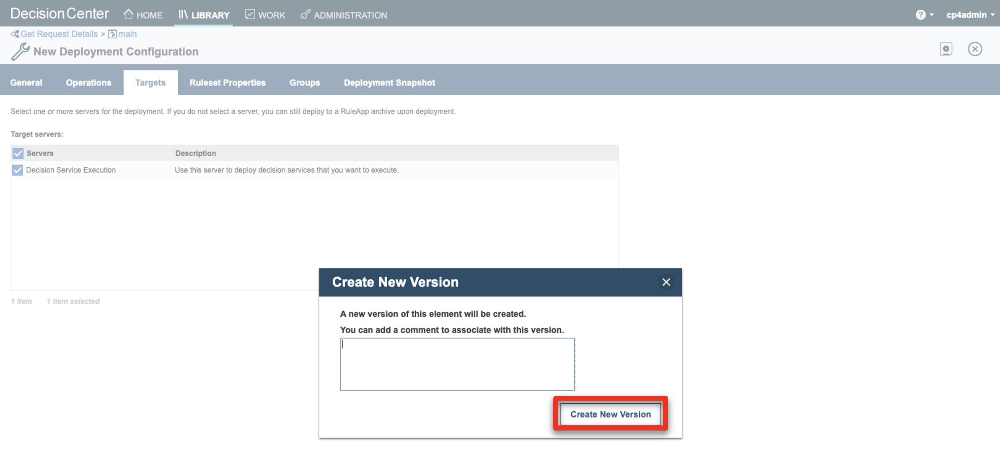 

18. Hover your cursor over the **wxoDeploy** row and click the **deploy** icon.   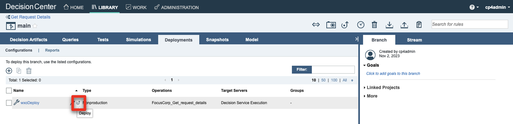 

19. Click **Deploy**.    

20. Click **OK**.    

21. Wait for the service to be deployed.   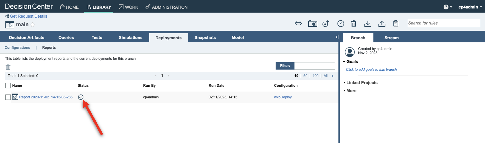 

22. Click the **LIBRARY** tab.    

 

**[Go to top](#top)**

  

2 - Import the ‘Customer Service’ decision service

Let's deploy the decision service driving the ‘Customer Service’ decision of the demo.

For this service, we are going to deploy two different instances with two different operations. One will be used by the finalized 'Customer Service' skill; the other one will be used to show how to create a skill step by step in watsonx Orchestrate. For this second one, you will have to update the RuleApp name with your own ‘XXX’ initials in order to not conflict with some skills that may have already been published by other users of your watsonx Orchestrate tenant.

1. Click the **Customer Service** decision service.    

2. Click the **main**.    

3. Click the **X** to remove the filter on the decision artifacts.    

4. Expand the **Customer Service** folder.    

5. Click **Operations**.    

6. Hover your cursor over the **FC_CustomerService** row and click the **edit** icon.     

7. Replace the '**XXX**' in the **Ruleset Name** with your own three-letter initials (1). Click the **save** icon (2).     

8. Click **Create New Version**.     

9. Click **Deployments**.     

10. Click **Configurations**.     

11. Click the **+** button.     

12. For the **Configuration name**, enter ‘**wxODeploy**’ (1). For the **RuleApp name**, enter ‘**FocusCorp_CustomerService**’ (2). Click the **Operations** tab (3).   <inline-notification text="Make sure to use the same name and letter case for the RuleApp name."></inline-notification>  

13. Select the **FocusCorp_CustomerService** operation (1). Click the **Targets** tab (2).     

14. Select the **Decision Service Execution** target server (1). Click the **save** icon (2).    

15. Click **Create New Version**.    

16. Repeat from **Step 11** using the following information:    • **Configuration name**: wxoDeployDemo   • **RuleApp name**: FC_CustomerService   • Select the **FC_CustomerService** operation  

17. Hover your cursor over the **wxODeploy** row and click the **deploy** icon.   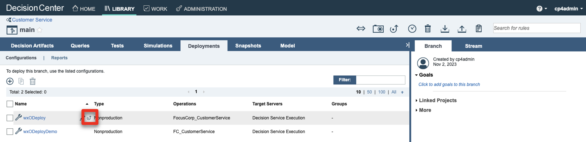 

18. Click **Deploy**.   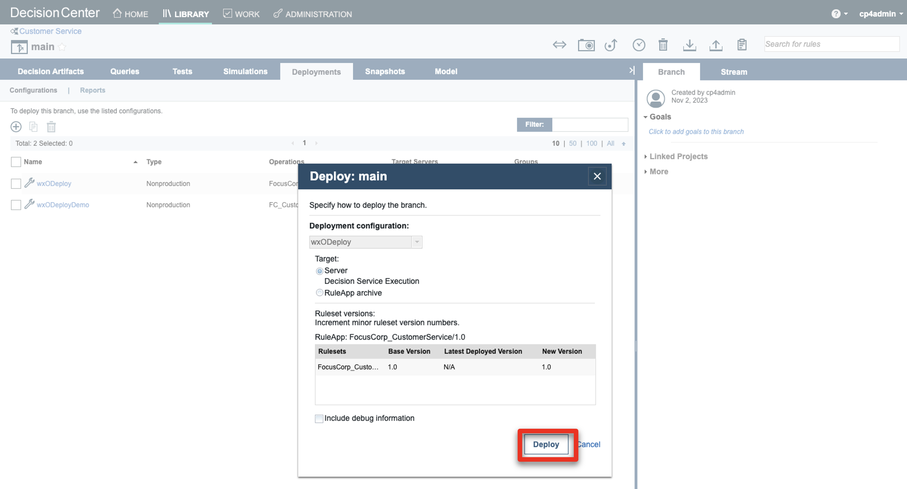 

19. Click **OK**.   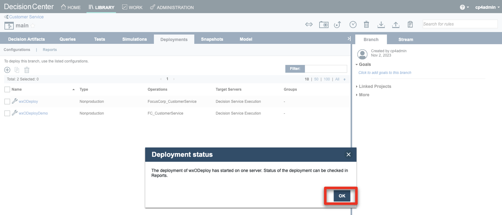 

20. After the deployment is completed, click **Configurations**.   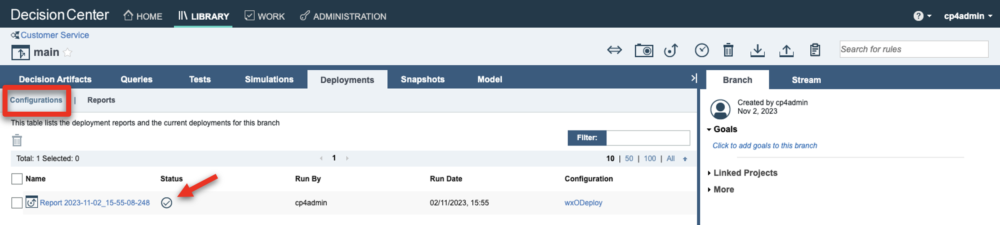 

21. Repeat from **Step 17** and deploy the **wxODeployDemo** configuration.    

 

**[Go to top](#top)**

  

3 - Check the deployments on the Decision Server

Let’s now make sure the two decision services are correctly deployed on the Rule Execution Server.

1. Open the **Decision Server Console** using the URL from your notebook.    

2. Click the **Explorer** tab.    

3. [Optional] Select the two RuleApps that are not part of the demo (1). Click **Remove** (2).   <inline-notification text="We are removing these two RuleApps to better display the deployed services in the watsonx discovery service."></inline-notification>  

4. Click **Confirm**.    

5. Click **FC_CustomerService**.    

6. Make sure the ruleset name has your updated initials (it is '**XXX**' in the screenshot by default).    

 

**[Go to top](#top)**

  

 

### **CONFIGURE WATSONX ORCHESTRATE**

1 - Update the JSON skill files

To quicken the demo setup, we are providing two skill configuration files. In order to avoid conflicts with other watsonx Orchestrate users, we are going to customize these skills with your own three-letter initials.

We are also going to update the server URL with the URL of your own ODM Rule Execution Server.

1. Open the **XXX FocusCorp Customer Service.json** file with a compatible text editor of your choice.    

2. Replace the **server URL** with the **CMD URL** from your notebook.   <inline-notification text="Replace only the section highlighted in blue."></inline-notification>  

3. Replace the two occurrences of ‘**XXX**’ occurrences with your own three-letter initials.    

4. Save the file under a new name containing your own initials.  

5. Repeat from **Step 1** to update the second JSON file (**XXX Focus Corp Get data from CRM.json**).  

 

**[Go to top](#top)**

  

2 - Import the two skills

1. Log in to your watsonx Orchestrate instance using your IBM ID credentials.    

2. Click the **menu slider** icon.    

3. Click **Skills**.    

4. Enter your '**XXX**' initials to see the skills that may have been deployed with these same initials.   <inline-notification text="Use other initials if the demo skills have already been deployed with the initials of your choice."></inline-notification>  

5. Click **Add skills**.    

6. Click **From files**.    

7. Click **Drag and drop files here or click to upload**.    

8. Select the **XXX FocusCorp Get data from CRM.json** file you previously customized (1). Click **Open** (2).    

9. Click **Next**.    

10. Select the **XXX FocusCorp Get data from CRM** skill (1). Click **Save as draft** (2).    

11. Enter your '**XXX**' initials to search for your skill.    

12. Click the **ellipsis** icon (1). Click **Enhance this skill** (2).    

13. Click **Publish**.    

14. Enter your '**XXX**' initials and check that your skill is correctly published.    

15. Repeat from **Step 5** and import the **XXX FocusCorp Customer Service.json** file.  

16. Click **Home**.   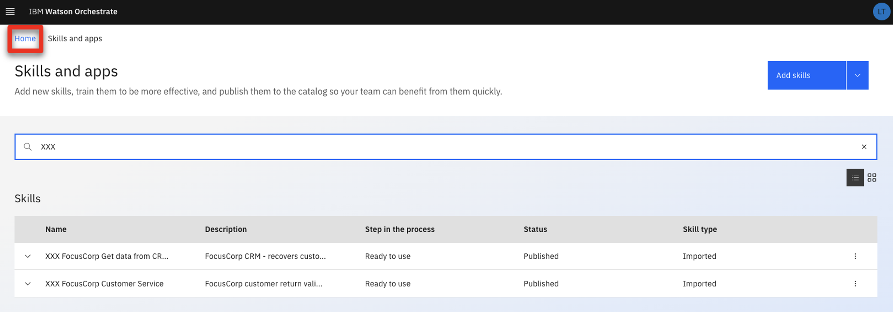 

 

**[Go to top](#top)**

  

3 - Add skills to your personal skills

1. Click **Add skills from the catalog**.   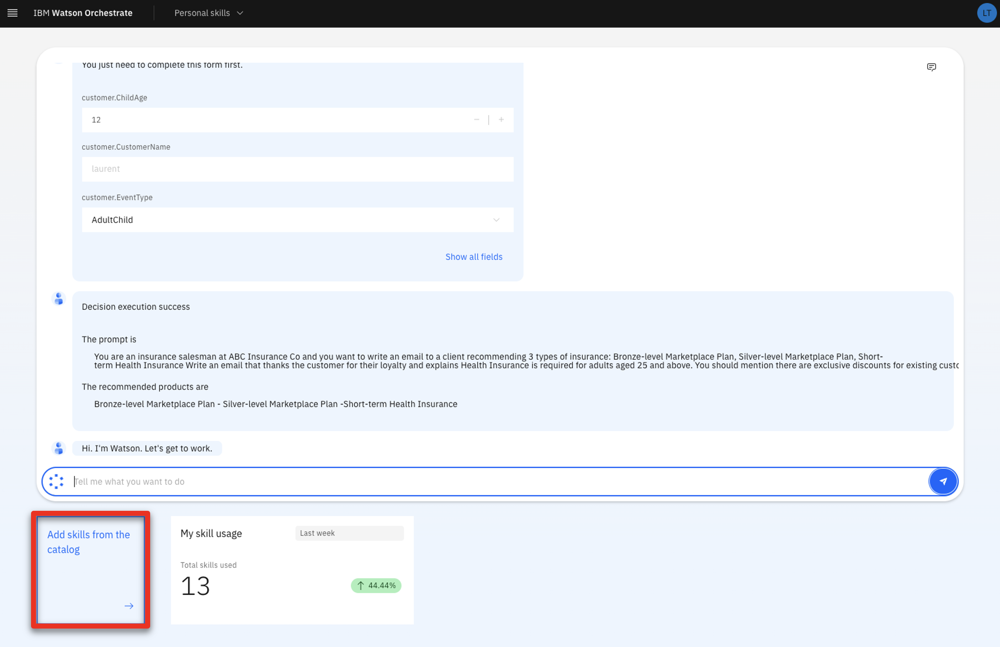 

2. Enter your '**XXX**' initials to search for the imported skills in the catalog.    

3. Click the **XXX FocusCorp_Get_Data_From_CRM** skill.    

4. Click **Connect app**.    

5. Enter your **ZEN API key** from your notebook (1). Click **Connect app** (2)    

6. Click **Add skill +**.    

7. Click **Home**.   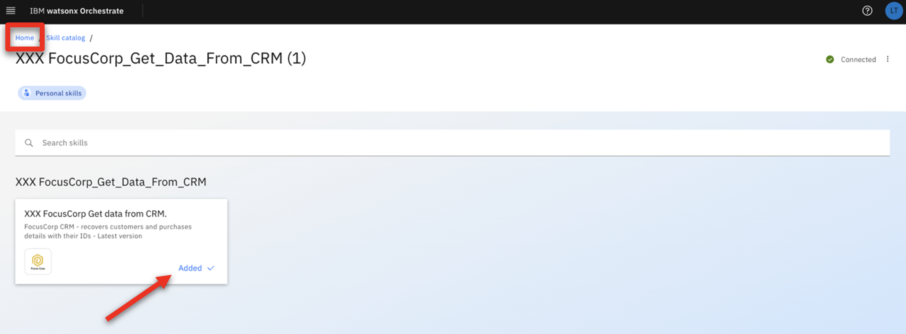 

8. Repeat from **Step 1** and add the **XXX FocusCorp Customer Service** skill.  

9. Click the **XXX Focus Corp Get data from CRM** skill to test it.   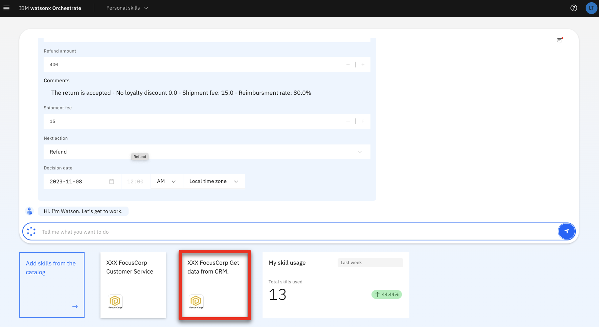 

10. Enter ‘**CU-001**’ as the **customer ID** (1). Enter ‘**PO-001**’ as the **purchase ID** (2). Click **Apply** (3).   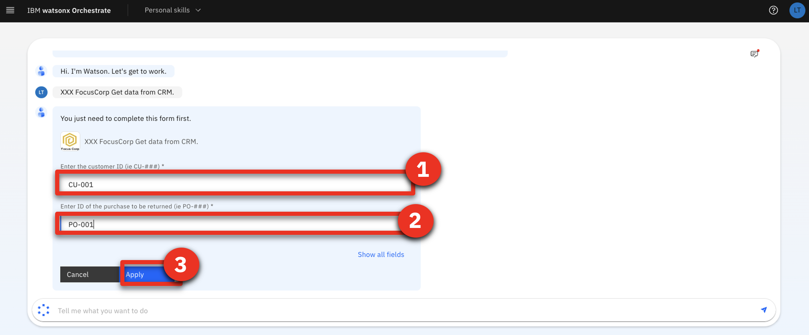 

11. Check that the service returns some values.   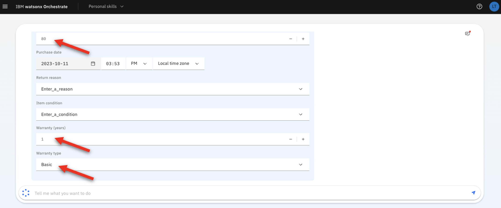 

You are now ready to demo!

 

**[Go to top](#top)**

  

 

### **AFTER EACH DEMO**

Remove the two skills created during the demo

After each demo, you must remove the **NEW XXX FC FocusCorp CustomerService** skill you imported using the discovery service, as well as the skill flow created during the demo.   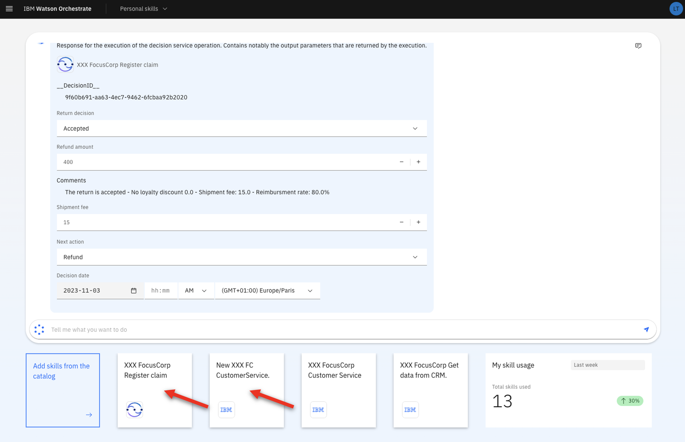 

1. Click the **menu slider** icon.    

2. Click **Skills**.    

3. Enter your '**XXX**' initials to access your skills.    

4. Look for the skill with the **Composite** skill type. Click its corresponding **ellipsis** icon (1). Click **Delete this skill** (2).   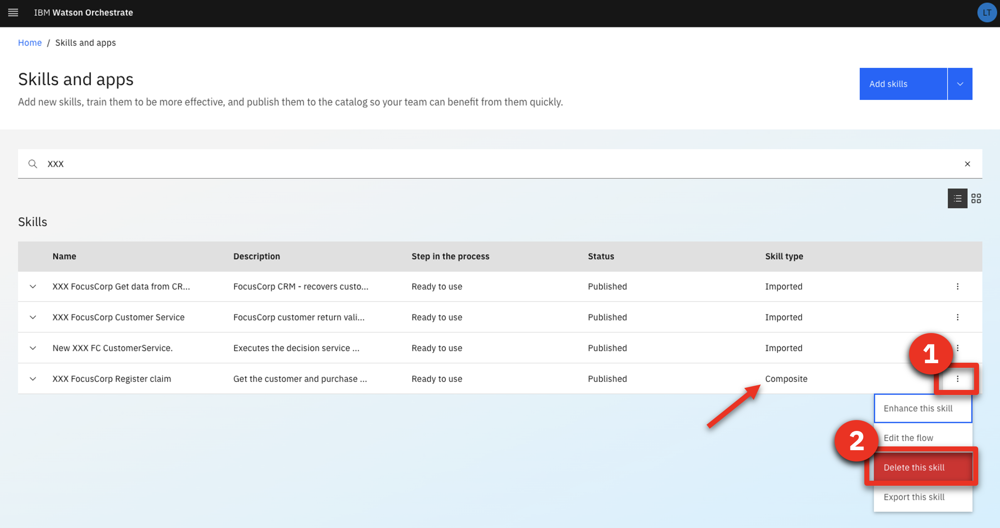 

5. Click **Delete**.   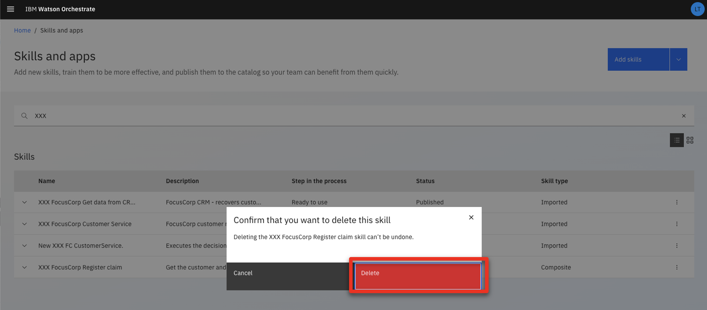 

6. Repeat from **Step 4** and delete the **NEW XXX FC CustomerService** skill.   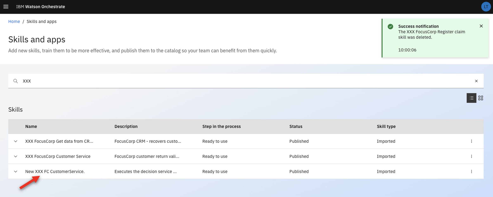 

7. Click **Home**.   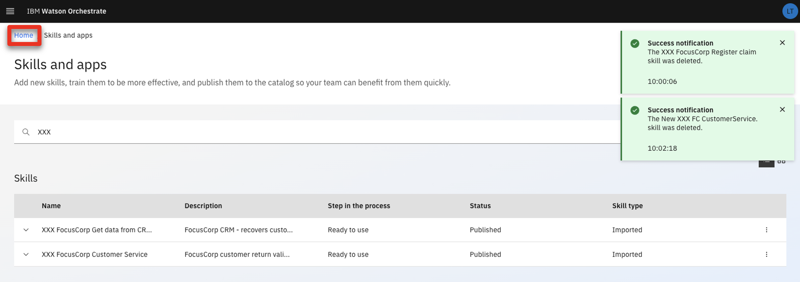 

8. You are now ready to demo again.   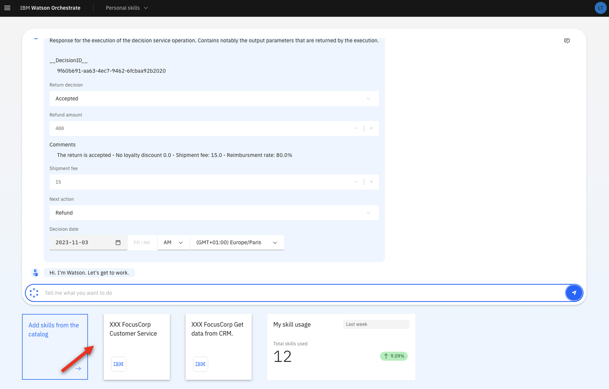 

 

**[Go to top](#top)**

  

 

### **UNINSTALL THE DEMO**

Remove the four skills created during the demo

1. Repeat the **AFTER EACH DEMO** steps and remove the four '**XXX FocusCorp**' skills.   <inline-notification text="The composite skill must be removed first."></inline-notification>  

2. Enter your '**XXX**' initials and make sure no skills remain.    

 

**[Go to top](#top)**

  

