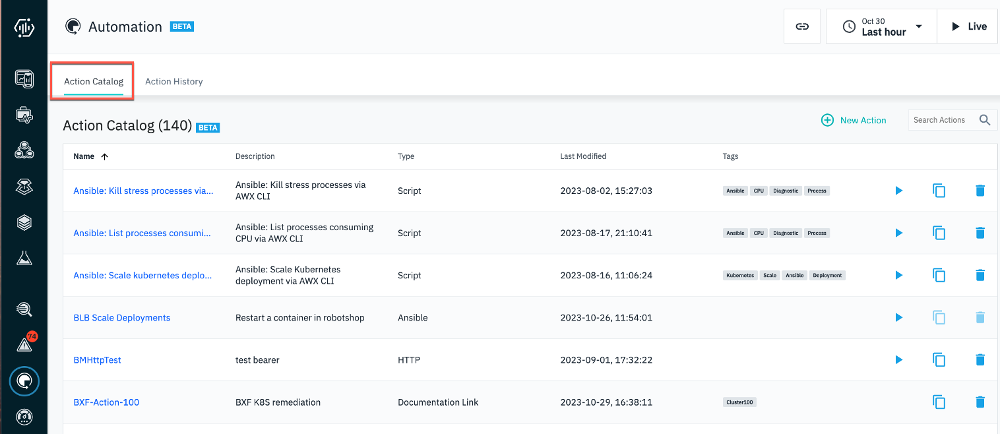
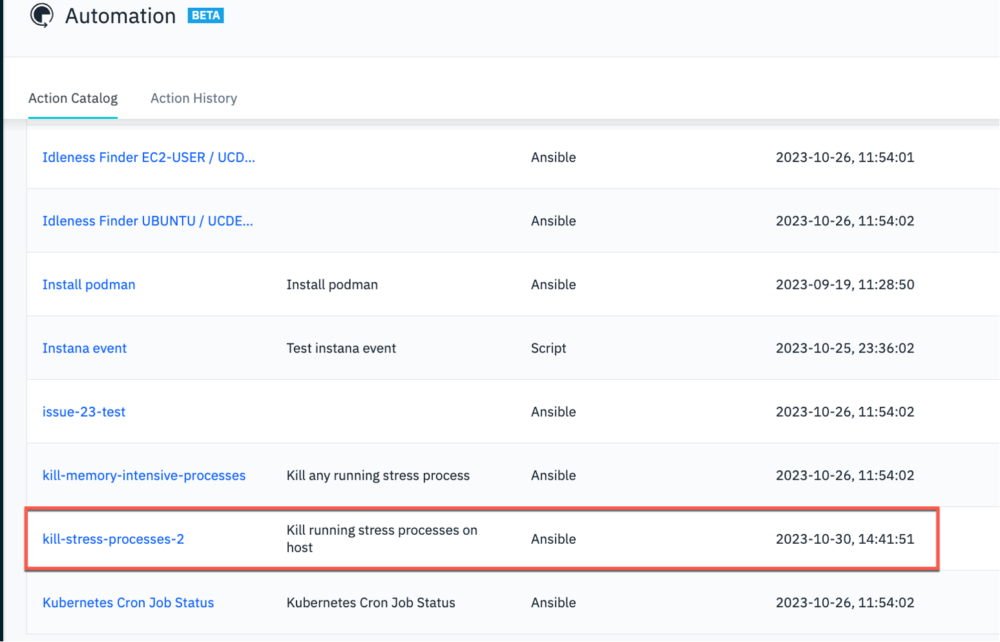
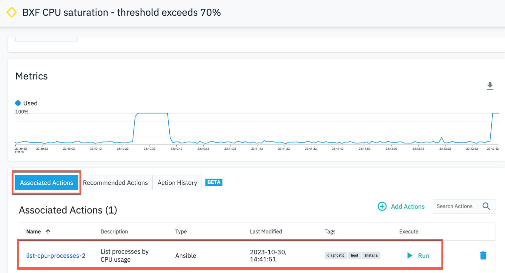
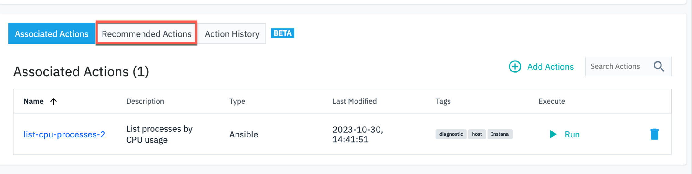
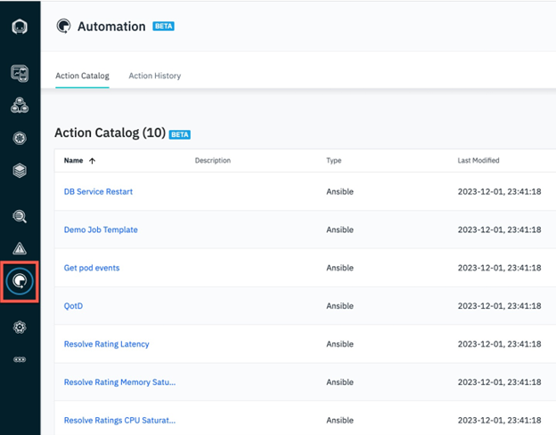

Introduction

In this demo, we will see how the new IBM Instana Automation framework can leverage the Red Hat Ansible Automation Platform (RHAAP) to accelerate the remediation of an IT incident. Our application is called GenZ mobile banking and the SRE is being alerted on the sudden CPU congestion of one our mission critical banking services.

Let’s get started!

 

1 - Observing your application deployments

 

| **1.1** | **Review application XYZ golden signals** |
| :--- | :--- |
| **Narration** | Automation controller is the command-and-control center for RHAAP. It serves as a central location to configure and manage how automation runs across your enterprise infrastructure using job templates. |
| **Action** &nbsp; 1.1.1 | On the RHAAP console, click **Templates**.    |
| **Narration** | The job template defines how automations run and leverage Ansible playbooks that specify the detailed steps of an IT task. Ansible playbooks make it easier for IT teams to codify operational knowledge and ensure that the same actions are performed consistently with minimal to no operator intervention. |

 

| **1.2** | **Understand XYZ application dependencies** |
| :--- | :--- |
| **Narration** | The Instana Action Framework integrates with the Ansible automation platform. You can use this framework to create and manage user-defined automation actions or leverage any automations already defined in Ansible to automatically remediate incoming events. |
| **Action** &nbsp; 1.2.1 | Click **Automation** in the navigation menu.    |
| **Narration** | The Action Catalog is a key component of the Action Framework. It serves as a repository of all the known remediations also known as actions. You can use the Action Catalog to create new actions or view integrations from 3rd party automation providers such as Ansible, to diagnose or remediate events. |
| **Action** &nbsp; 1.2.2 | Click **Action Catalog**.   |
| **Narration** | Notice there are 3 types of Actions supported by the Action Framework – Documentation Link action, Script action and HTTP action. Let’s understand what each of these mean:    • 'Documentation Link' action - provides you access to the relevant documentation to diagnose or remediate a known issue directly from the event context   • 'Script' action – an automation script that can run on your agent using a Script Action Sensor that is part of the automation framework   • 'HTTP' action – specifies HTTP calls to invoke webhooks or other REST APIs on your agent by using the new HTTP action sensor    You can also import Ansible playbooks from your Ansible Automation Controller as Ansible actions by using the Ansible Action Sensor. |
| **Action** &nbsp; 1.2.3 | Highlight **Delete-active-stress-test**.    |

**[Go to top](#place1)**

  

2 - Inspecting the open event

 

| **2.1** | **Examine the event details** |
| :--- | :--- |
| **Narration** | An issue represents an event that gets created if an application, service, or any part of it gets unhealthy. Let’s examine the issues that are detected by Instana. |
| **Action** &nbsp; 2.1.1 | Click **Issues**.    |
| **Narration** | Each Instana issue contains the severity, start/end times, metric charts showing metric values relevant to the problem. It also lists the actions that can be taken to remediate this event. |
| **Action** &nbsp; 2.1.2 | Click the **BXF** event.    |
| **Narration** | The 'Associated Actions' section is new and provided by the Automation Framework. When an event is raised, the pre-configured potential remediations also are attached and available in-context to convenience. You have the option to add additional actions or remove actions if they are no longer relevant. |
| **Action** &nbsp; 2.1.3 | View the **Associated Actions** section.    |
| **Action** &nbsp; 2.1.4 | Select the **Recommended Actions** tab.    |
| **Narration** | The 'Recommended Actions' tab lists an AI-derived list of recommendations, sorted by a confidence score. You can associate any or all of these recommendations to this event by clicking the Associate Action icon in each recommendation action row. The confidence score is derived based on several factors, such as the action definitions, tags, and the meta data from the event. The confidence score attempts to approximate the likelihood of the action resolving this event. We will next select a remediation to resolve the current active event. |

**[Go to top](#place1)**

  

3 - Reviewing the remediation recommendations

 

| **3.1** | **Choose a remediation to execute** |
| :--- | :--- |
| **Action** &nbsp; 3.1.1 | Click **Run** in the **Associated Actions** tile.    |
| **Narration** | Each Instana issue contains the severity, start/end times, metric charts showing metric values relevant to the problem. It also lists the actions that can be taken to remediate this event. |

**[Go to top](#place1)**

  

4 - Understanding the Instana-Ansible integration

 

| **4.1** | **Explore the Instana Action Framework** |
| :--- | :--- |
| **Action** &nbsp; 4.1.1 | Click **Action History page**.    |

**[Go to top](#place1)**

  

5 - Executing the remediation directly from Instana

 

| **5.1** | **Verify remediation execution status in Instana** |
| :--- | :--- |
| **Action** &nbsp; 5.1.1 | Click **Action History page**.    |

 

| **5.2** | **Verify remediation execution status in Ansible** |
| :--- | :--- |
| **Action** &nbsp; 5.2.1 | Click **Action History page**.    |

**[Go to top](#place1)**

  

Summary

In this demo, we showed how the new Automation Framework elevates Instana beyond just an observability tool that does rapid root cause analysis to also include resolving the IT incidents. The Instana-Ansible integration enables IT ops teams take automatically execute remedial actions right from within Instana without having to hop across other automation tools. This feature accelerates the time to fix an incident and drastically reduces down time.

**[Go to top](#place1)**

  

