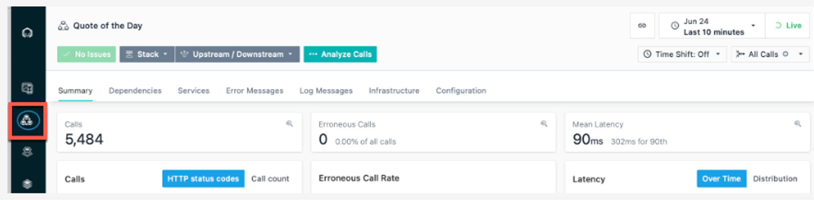
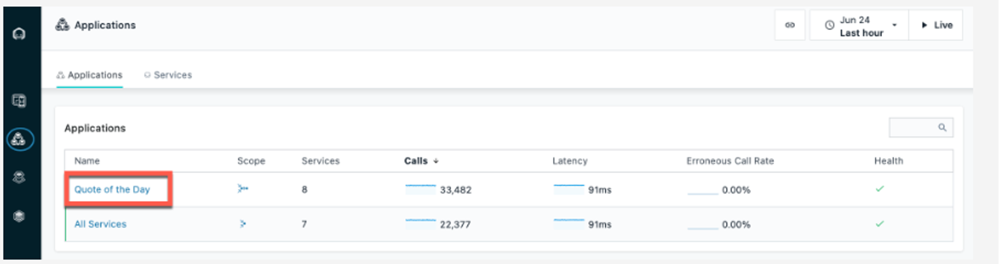
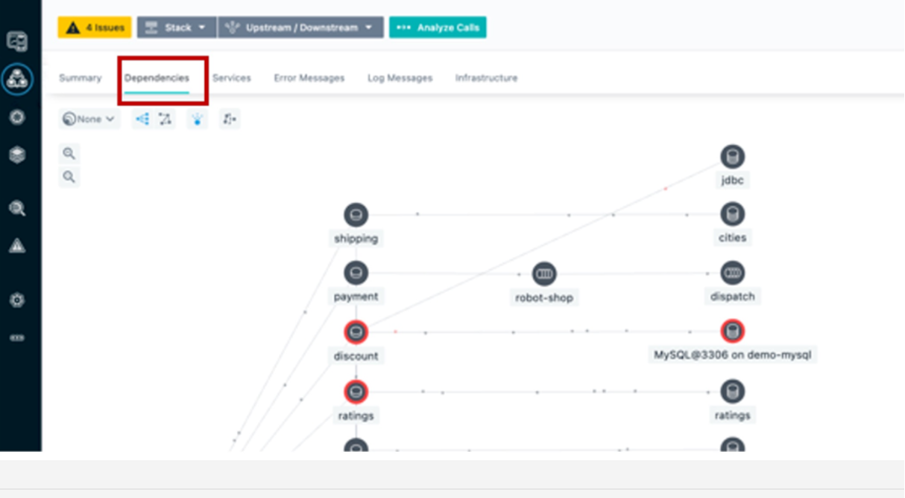
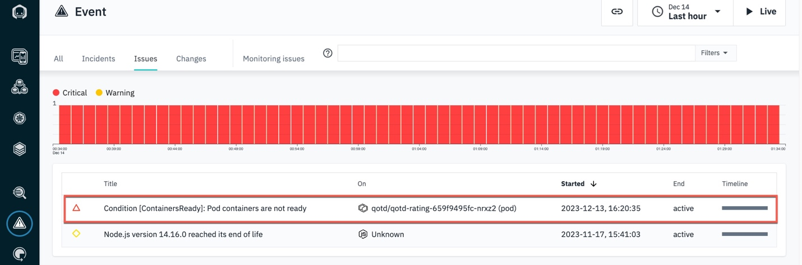
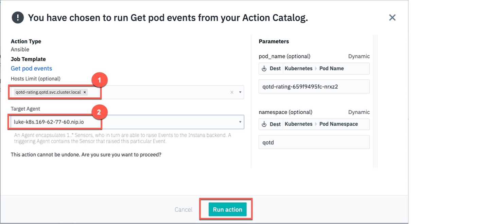
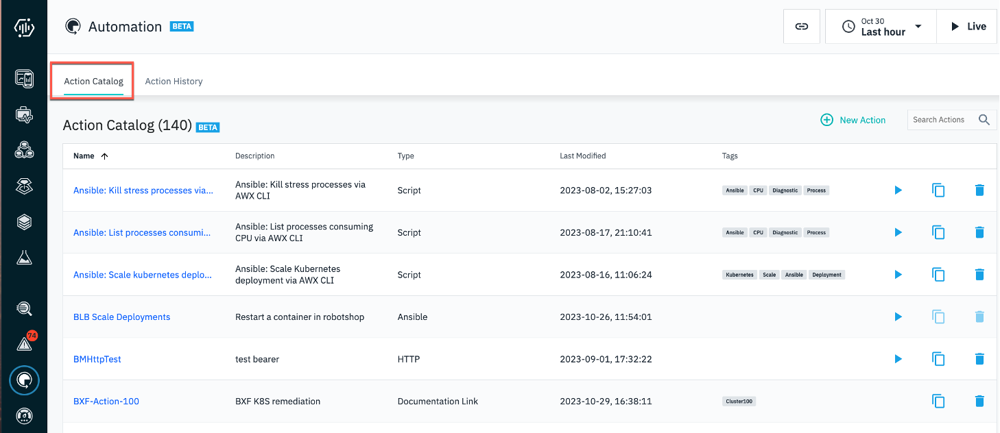

Introduction

In this demo, we'll see how we can go beyond just observing or analyzing an incoming event in Instana and automatically remediate the issue using Ansible. Our application is a content management app called Quote of the Day (QotD) that delivers personalized content via a mobile and web channel. Due to a recent sales promotion, the application has been receiving an exponential increase in user traffic. A notification has just been received indicating users are beginning to experience slow response times.

Let’s get started.

 

1 - Observing the application health and service interactions

 

| **1.1** | **View golden signals of the QotD application** |
| :--- | :--- |
| **Narration** | Let's first observe the golden signals of the application. |
| **Action** &nbsp; 1.1.1 | Navigate to Instana and click the **Applications** icon.    |
| **Action** &nbsp; 1.1.2 | Click the **Quote of the Day** application.    |
| **Action** &nbsp; 1.1.3 | Click the **Summary** tab (1). Set the time period to **Last 10 minutes** (2). Click **Live** (3).    |
| **Narration** | Observe the increase in both the erroneous call rate (1) and the mean service latency (2). Also notice that in the 'Top Services' chart, the 'qotd-rating' service is now at the top of the list (3). |
| **Action** &nbsp; 1.1.4 | Ensure you are on the **Summary** tab. If not, click the **Summary** tab.    |

 

| **1.2** | **Assess service dependencies** |
| :--- | :--- |
| **Narration** | The golden signals provide an aggregate view of all the services in the application. To drill down into more granular detail, we should first understand how the services are interconnected. Instana automatically discovers the relationships between the services and correlates them into a dynamic graph. |
| **Action** &nbsp; 1.2.1 | Click the **Dependencies** tab.    |
| **Narration** | We can see how the requests are moving through the application in real time. Instana captures 100% of all traces that flow through the application and is able to automatically analyze this information to pin-point hotspots in the request flows.    We can quickly tell there are some problems with the application because several services are highlighted in yellow and red. From the service dependency graph, we can also understand which services are impacted by a service performance issue. |

**[Go to top](#place1)**

  

2 - Inspecting the incoming event

 

| **2.1** | **Examine the event details** |
| :--- | :--- |
| **Narration** | Instana determines how the events are related and generates an alert only if the underlying event or group of events could potentially impact an end user. Let’s proceed to examine the new incoming event. Let’s examine the critical events detected by Instana. |
| **Action** &nbsp; 2.1.1 | Click the **Issues** tab.    |
| **Action** &nbsp; 2.1.2 | Filter for ‘**BXF**’ in the search bar.    |
| **Narration** | Each Instana issue contains the severity with start and end times. The chart plots metric values relevant to the problem. The performance issue is still active and needs to be resolved to address the current end-user experience problems. |

**[Go to top](#place1)**

  

3 - Reviewing the event remediation recommendations

 

| **3.1** | **Review remediation recommendations** |
| :--- | :--- |
| **Narration** | Before we take a look at the specific event remediations, let’s first understand how Instana goes beyond pure observability to enable you to take remedial action on an incoming event without ever leaving Instana.    This new incident remediation feature is referred to as the Action Framework. The Action Framework is a collection of capabilities that allows you to define and manage a remediation. The Action Catalog is a central component of the Action Framework that allows you to manage the lifecycle of the remediations. The Action Framework can also interoperate and leverage external automation platforms like Ansible.    The event page lists the details behind the event. By leveraging the Action Framework, Instana goes beyond pure observability to actually resolve the issue. This page is now enriched with a list of potential remedial actions that can be executed right from within Instana to actually resolve this issue. |
| **Action** &nbsp; 3.1.1 | Select the **Recommended Actions** tab.    |
| **Narration** | The 'Recommended Actions' tab lists an AI-derived list of recommendations, sorted by a confidence score. You can associate any or all of these recommendations to this event by clicking the 'Associate Action' icon. The confidence score is derived based on several factors, such as the action definitions, tags, and the metadata from the event. The confidence score attempts to approximate the likelihood that the action will fix this event. We will next select a remediation to resolve the current active event. |

 

| **3.2** | **Choose a remediation to execute** |
| :--- | :--- |
| **Narration** | The 'Associated Actions' section is new and provided by the Automation Framework. When an event is raised, the pre-configured potential remediations are also attached and available in context to accelerate the mean time to fix (MMTF). We have the option to add additional actions or remove actions if they are no longer relevant to the event. These actions will be persisted with this event. Any future occurrence of this event will then carry these newly configured remediations. |
| **Action** &nbsp; 3.2.1 | Click the **Associated Actions** tab (1). For the **list-cpu-processes-2** action, click **Run** (2).    |
| **Narration** | Actions are executed on target nodes or agents. Let’s specify the Instana agent and host on which this action should be executed. |
| **Action** &nbsp; 3.2.2 | Set the **Hosts Limit** (1) and **Target Agent** (2) with the values shown in the screenshot below. Click **Run action** (3).    |

**[Go to top](#place1)**

  

4 - Understanding the execution steps of the remediation

 

| **4.1** | **Explore the Instana Action Framework** |
| :--- | :--- |
| **Narration** | The Instana Action Framework bridges the integration between Instana and the Ansible automation platform. You can use this framework to create and manage user-defined automation actions natively in Instana, or leverage any automations already defined in Ansible to automatically remediate incoming events |
| **Action** &nbsp; 4.1.1 | Click the **Automation** icon.    |
| **Narration** | The Action Catalog is a key component of the Action Framework. It serves as a repository of all the known remediations, also called actions. You can use the Action Catalog to create new actions or view existing remediations from third-party automation providers, such as Ansible. |
| **Action** &nbsp; 4.1.2 | Click the **Action Catalog** tab.    |
| **Narration** | Notice the Action Framework supports three types of actions – a 'Documentation Link' action, a 'Script' action and an 'HTTP' action.    Let’s understand what each of these mean:    • *Documentation Link* action: provides access to the relevant documentation to diagnose or remediate a known issue directly from the event context   • *Script* action: an automation script that can run on your agent using a Script Action Sensor that is part of the automation framework   • *HTTP* action: specifies HTTP calls to invoke webhooks or other REST APIs on your agent by using the new HTTP action sensor.    The Instana-Action Framework synchronizes with the Red Hat Ansible Automation Platform (RHAAP) and imports the pre-defined Ansible playbooks. The ingested Ansible playbooks are categorized in the Instana Action Catalog as Ansible actions to denote that they actually exist in RHAAP. Let’s examine a sample remediation. |
| **Action** &nbsp; 4.1.3 | Point out the **Ansible** action (1). Delete **active-stress-test** (2).    |

 

| **4.2** | **View the available Ansible playbooks** |
| :--- | :--- |
| **Narration** | Automation Controller is the command-and-control center for RHAAP. It serves as a central location to configure and manage how automation runs across your enterprise infrastructure using job templates. |
| **Action** &nbsp; 3.2.1 | On the RHAAP console, click **Resources** (1) and then **Templates** (2).    |

**[Go to top](#place1)**

  

5 - Validating the proper execution of the remediation action

 

| **5.1** | **Check the execution status of the remediation flow** |
| :--- | :--- |
| **Action** &nbsp; 5.1.1 | Click **Action History page**.    |
| **Action** &nbsp; 5.1.2 | Click **View Log**.    |
| **Narration** | Each action has at least two log entries – the 'Start' and 'Stop' entries. The log output displays the steps of the script execution to help track the execution progress of the remediation. |
| **Action** &nbsp; 5.1.3 | Click the **End running action** log entry (1). Check for **success** (2).    |

 

| **5.2** | **Monitor the status of the Ansible playbook execution** |
| :--- | :--- |
| **Narration** | This step is optional. The SRE does not really need to go to Ansible at all. The SRE can stay within Instana to perform all the remediation work. However, if there are failures, it helps to understand the state of Ansible and ensure that the connectivity between Instana and Ansible is properly synchronized. |
| **Action** &nbsp; 5.2.1 | On the Ansible console tab, click **Dashboard** (1) and then **Jobs** (2). Look for **list-cpu-processes** (3).       |

**[Go to top](#place1)**

  

Summary

In this demo, we showed how the new Automation Framework elevates Instana beyond just an observability tool that does rapid root cause analysis, to also include incident resolution. The Instana-Ansible integration enables IT ops teams to automatically execute remedial actions in a timely manner, directly from within Instana without having to hop across other automation tools. This feature accelerates the time to fix an incident and drastically reduces downtime.

**[Go to top](#place1)**

  

