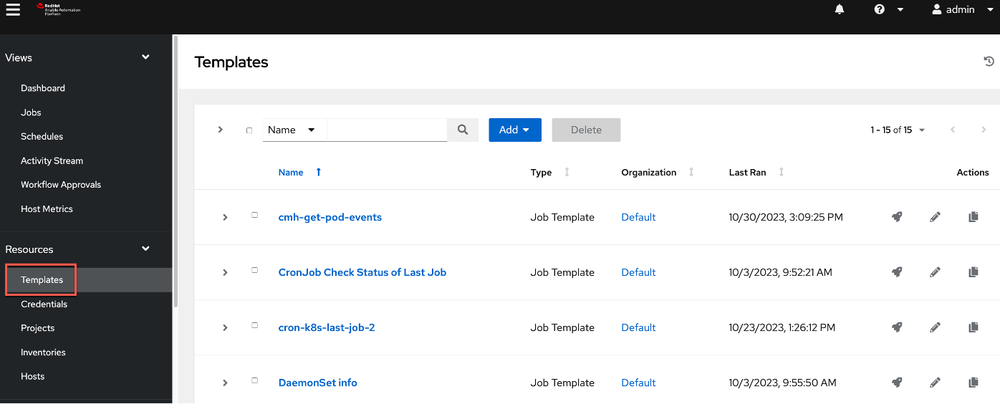

Introduction

In this demo, we'll see how we can go beyond just observing or analyzing an incoming event in Instana and automatically remediate the issue using Ansible. Our application is called GenZ Mobile Banking, and the SRE is being alerted on the sudden CPU congestion of one of our mission-critical banking services.

Let’s get started.

 

1 - Inspecting the incoming event

 

| **1.1** | **Examine the event details** |
| :--- | :--- |
| **Narration** | We've just received a notification about a performance problem on the GenZ mobile banking application. The SRE proceeds to examine the new incoming event. In Instana this is reported as an issue. An issue represents an event that gets created if an application, service, or any part of it gets unhealthy. Let’s examine the issues that are detected by Instana. |
| **Action** &nbsp; 1.1.1 | Click the **Events** icon (1). Click **Issues** (2).    |
| **Action** &nbsp; 1.1.2 | Filter for '**BXF**' in the search bar.    |
| **Narration** | Each Instana issue contains the severity with start and end times. The metric charts graph metric values relevant to the problem. Let’s search for the performance event pertaining to the GenZ performance issue. Notice that the issue is still active and needs to be resolved to address the current end-user experience problems. |

**[Go to top](#place1)**

  

2 - Reviewing the event remediation recommendations

 

| **2.1** | **Review Instana's remediation recommendations** |
| :--- | :--- |
| **Narration** | The 'Recommended Actions' tab lists an AI-derived list of recommendations, sorted by a confidence score. You can associate any or all of these recommendations to this event by clicking the Associate Action icon in each recommendation action row. The confidence score is derived based on several factors, such as the action definitions, tags, and the meta data from the event. The confidence score attempts to approximate the likelihood of the action resolving this event. We will next select a remediation to resolve the current active event. |
| **Action** &nbsp; 2.1.1 | Select the **Recommended Actions** tab.    |

 

| **2.2** | **Choose a remediation to execute** |
| :--- | :--- |
| **Narration** | The 'Associated Actions' section is new and provided by the Automation Framework. When an event is raised, the pre-configured potential remediations also are attached and available in-context to accelerate the MMTF – mean time to fix. You have the option to add additional actions or remove actions if they are no longer relevant to the event. These actions will then be persisted with this event. Any future occurrence of this event will then carry these newly configured remediations. |
| **Action** &nbsp; 2.2.1 | Click **Associated Actions** (1). Select **list-cpu-processes-2** (2). Click **Run** (3).    |
| **Narration** | Before the action is executed, we need to specify the hosts and Instana agents on which this action should be executed. |
| **Action** &nbsp; 2.2.2 | Set the values shown below for the **Hosts Limit** (1) and **Target Agent** (2) fields. Click **Run action** (3).    |

**[Go to top](#place1)**

  

3 - Understanding the Instana-Ansible integration

 

| **3.1** | **Use the Instana Action Framework** |
| :--- | :--- |
| **Narration** | The Instana Action Framework integrates with the Ansible automation platform. You can use this framework to create and manage user-defined automation actions or leverage any automations already defined in Ansible to automatically remediate incoming events. |
| **Action** &nbsp; 3.1.1 | Click the **Automation** icon.    |
| **Narration** | The Action Catalog is a key component of the Action Framework. It serves as a repository of all the known remediations, which are also known as actions. You can use the Action Catalog to create new actions or view existing remediations from external automation providers, such as Ansible. |
| **Action** &nbsp; 3.1.2 | Click the **Action Catalog** tab.    |
| **Narration** | Notice the Action Framework supports three types of actions – a 'Documentation Link' action, a 'Script' action and an 'HTTP' action.    Let’s understand what each of these mean:    • 'Documentation Link' action: provides access to the relevant documentation to diagnose or remediate a known issue directly from the event context   • 'Script' action: an automation script that can run on your agent using a Script Action Sensor that is part of the automation framework   • 'HTTP' action: specifies HTTP calls to invoke webhooks or other REST APIs on your agent by using the HTTP action sensor.    In this demo, we import the pre-defined Ansible playbooks from Ansible Automation Controller using the Ansible Action Sensor configured on the Instana agent.    The ingested playbooks are categorized in the Instana Action Catalog as Ansible actions to denote that they actually exist in Red Hat Ansible Automation Platform (RHAAP). Let’s examine a sample remediation. |
| **Action** &nbsp; 3.1.3 | Point out the **Ansible** action (1). Delete **active-stress-test** (2).    |

 

| **3.2** | **View the available Ansible playbooks** |
| :--- | :--- |
| **Narration** | Automation Controller is the command-and-control center for RHAAP. It serves as a central location to configure and manage how automation runs across your enterprise infrastructure using job templates. |
| **Action** &nbsp; 3.2.1 | On the RHAAP console, click **Resources** (1) and then **Templates** (2).    |

**[Go to top](#place1)**

  

4 - Validating the proper execution of the remediation action

 

| **4.1** | **Check the execution status of the remediation flow** |
| :--- | :--- |
| **Action** &nbsp; 4.1.1 | Click **Action History page**.    |
| **Action** &nbsp; 4.1.2 | Click **View Log**.    |
| **Narration** | Each action has at least two log entries – the 'Start' and 'Stop' entries. The log output displays the steps of the script execution to help track the execution progress of the remediation. |
| **Action** &nbsp; 4.1.3 | Click the **End running action** log entry (1). Check for **success** (2).    |

 

| **4.2** | **Monitor the status of the Ansible playbook execution** |
| :--- | :--- |
| **Narration** | This step is optional. The SRE does not really need to go to Ansible at all. He can stay within Instana to perform all the remediation work. However, if there are failures it helps to understand the state of Ansible and ensure that the connectivity between Instana and Ansible is properly synchronized. |
| **Action** &nbsp; 4.2.1 | On the Ansible console tab, click **Dashboard** (1) and then **Jobs** (2). Look for **list-cpu-processes** (3).       |

**[Go to top](#place1)**

  

Summary

In this demo, we showed how the new Automation Framework elevates Instana beyond just an observability tool that does rapid root cause analysis, to also include incident resolution. The Instana-Ansible integration enables IT ops teams to automatically execute remedial actions in a timely manner, directly from within Instana without having to hop across other automation tools. This accelerates the time to fix an incident and drastically reduces downtime.

**[Go to top](#place1)**

  

