

<span id="installDemo"></span>

<details markdown="1">

<summary>4 - Install the demo</summary>

1. The script to install the demo components requires a utility called jq. If you don't have it, follow the installation steps described in this <a href="https://jqlang.github.io/jq/download/" target="_blank" rel="noreferrer">page</a>, based on your operating system. <br/>

2. Install API Connect and App Connect by running the `deploy.sh` command:<br/>

   ```./deploy.sh ```

This script may take 30-45 minutes to complete.

**[Go to top](#top)**

<br/><br/>

</details>

<span id="prereq"></span>

<details markdown="1">

<summary>5 - Set up Salesforce</summary>

You need a Salesforce developer account to run this demo. If you already have a Salesforce developer account, you can use that (start at step 2 below). If not, you can sign up for a free developer account by following step 1 below.

1. Go to <a href="https://developer.salesforce.com/signup" target="_blank" rel="noreferrer">Salesforce Developers</a>. Follow the prompts on the Saleforce pages to get your free developer account.<br/>

2. As soon as you have your account, go back to the <a href="https://login.salesforce.com/" target="_blank" rel="noreferrer">Salesforce log in page</a> and log in to your developer account.<br/>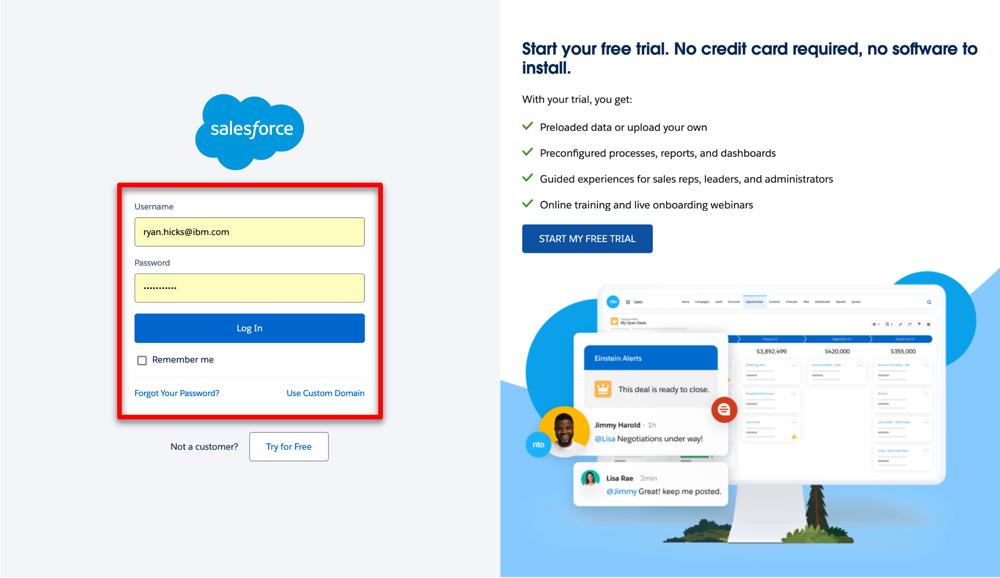<br/>

3. Click the **profile** icon (1) and save your Salesforce Login URL (2).<br/><br/>

4. In the same user profile menu select **Settings**.<br/>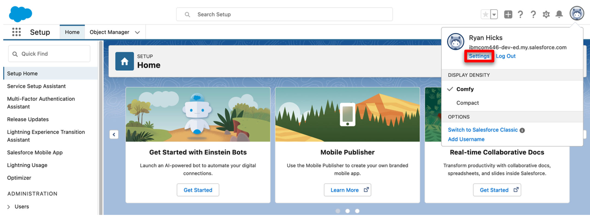<br/>

5. Click **Reset My Security Token** in the **My Personal Information** (1) menu. Then, click **Reset Security Token** (2). A newly-generated security token will be emailed to you.<br/><br/>

6. Next, you will create an application representing App Connect Enterprise, and then retrieve the Consumer Key and Consumer Secret. Click the **cogwheel** icon (1) and select **Setup** (2).<br/><br/>

7. In the navigator on the left-hand side, scroll to **PLATFORM TOOLS**, expand **Apps** (1), and click **App Manager** (2).<br/>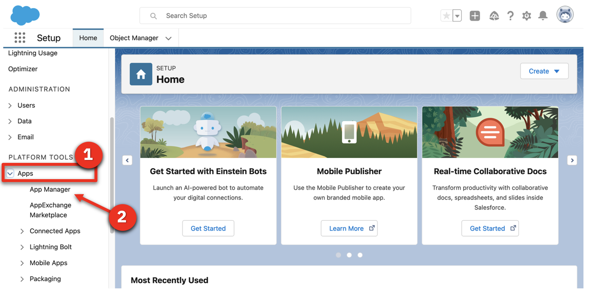<br/>

8. Click **New Connected App**.<br/>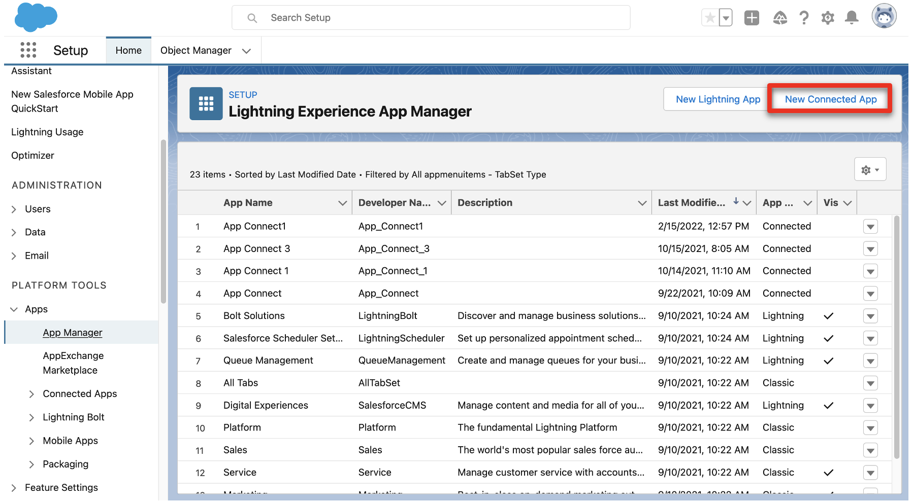<br/>

9. Enter **App Connect** (1) as the **Connect App Name** and your email as the **Contact Email** (2). Select **Enable OAuth Settings** (3).<br/><br/>

10. Select **Enable for Device Flow** (1). Now select **Manage user data via APIs (api)** (2) as the **Selected OAuth Scopes**. Click **Add** (3)<br/>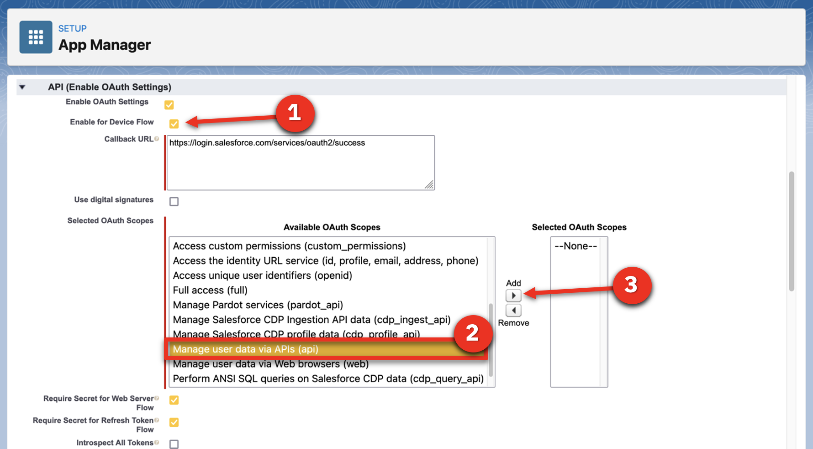<br/>

11. Click **Save**.<br/><br/>

12. It will take approximately 10 minutes for the new connected app to register in Salesforce. Once it does, you should see **Manage Consumer Details** displayed. Click **Manage Consumer Details,** following any authentication directions.<br/><br/>

13. Save the **Consumer Key** and **Consumer Secret.**<br/>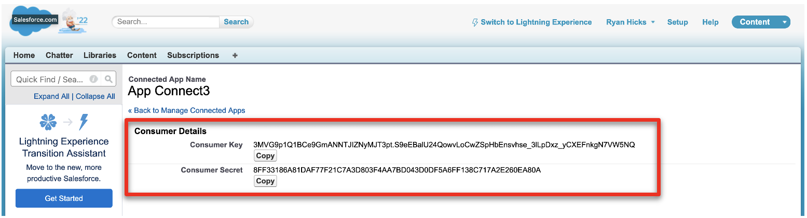<br/>

14. In the search box at the top of the screen, enter **OAuth** (1), and then select **OAuth and OpenID Connect Settings** (2).<br/>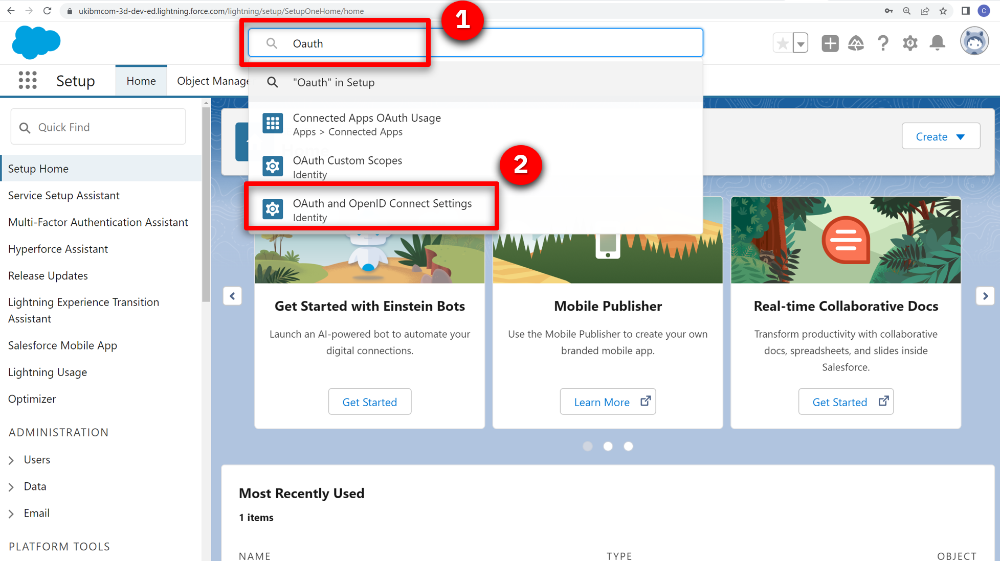<br/>

15. Ensure that **OAuth User-Agent Flows** and **OAuth Username-Password Flows** are enabled. <br/>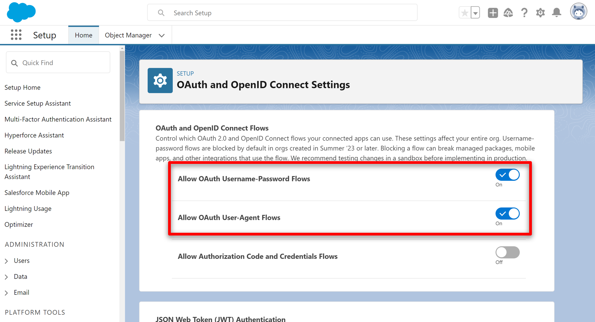<br/>

Your Salesforce developer account is ready.

**[Go to top](#top)**

<br/><br/>

</details>

<span id="connectEndpoints"></span>

<details markdown="1">

<summary>6 - Connect Cloud Pak for Integration instance to your endpoints</summary>

Let’s configure our services endpoints in Cloud Pak for Integration.
<br/>

1.	Return to the command line and access the Platform Navigator using the provided URL. Copy and paste  the **Username** (1) and **Password** (2) from the command line output, and click **Sign In** (3).<br/>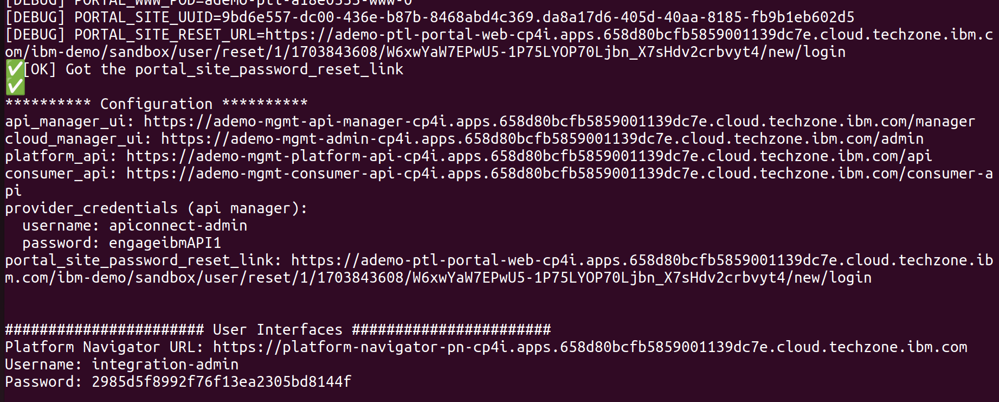<br/><br/>

2. You will be asked to provide a new password. Provide a new password and click **Submit**. <br/><br/>

3. In the menu on the top left, open the **Design** folder (1) and select **Integrations** (2). <br/>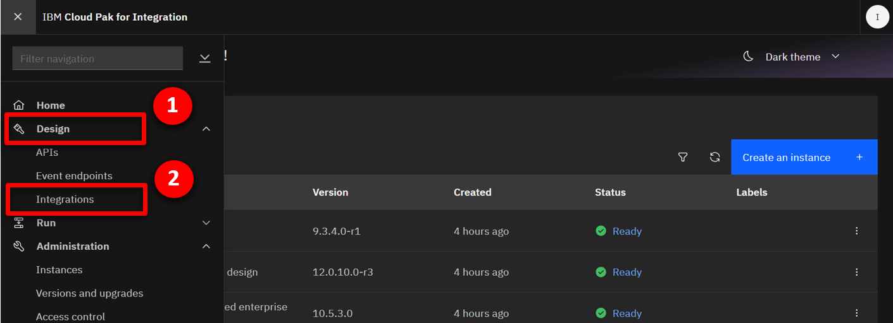<br/>

4. Click on the **ace-designer-demo** entry. <br/>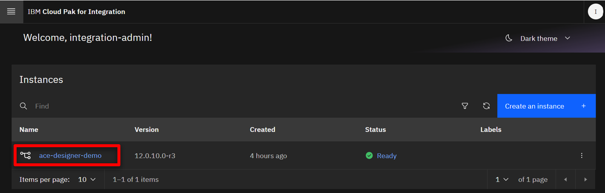<br/>

5. Click the **Catalog** icon to see a list of the available connectors. <br/>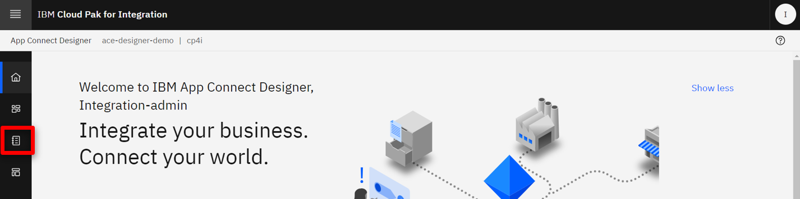<br/>

5. Search for **salesforce** (1) and click **Connect** (2).<br/><br/>

6. Enter your Salesforce **Login URL**.<inline-notification text="You must enter <strong>‘https://’</strong> in front of the Saleforce Login URL you saved earlier. The connection will not work if you just copy/paste the hostname."></inline-notification>

7. Input your Salesforce **Username** (1). Fill in the connector's **Password** field (2) by concatenating your Salesforce **Password** and the **Security token** received via email.<br/><br/>For example, if your Salesforce password is ‘myGreatPassword’ and your Salesforce security token is ‘2325jsdhew4312hs534dh’ then enter ‘myGreatPassword2325jsdhew4312hs534dh’ in the **Password** field.<br/><br/><br/>

8. Input Salesforce’s **Consumer Key** as **Client ID** (1) and **Secret** as **Client Secret** (2), in the connector account UI. Click **Connect** (3).<br/><br/>

9. Click on the **menu** icon (1) and select **Rename Account** (2).<br/><br/>

10. Enter **App Connect Trial** (1) as **Account name** and click **Rename Account** (2).<br/>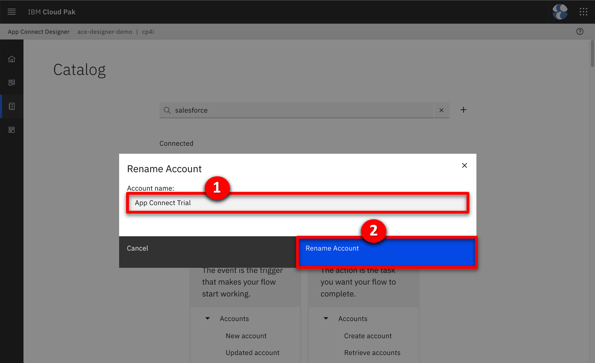<br/>

Your environment is ready to demo.

<br/>

**[Go to top](#top)**

<br/><br/>

</details>

<span id="CreateUser"></span>

<details markdown="1">

<summary>7 - Configure the asset repository</summary>

During the demo we will import an existing flow from the assest repository. An GitHub repository will be configured to import the flow. 

1. In the menu on the top left, open the **Administration** folder and select **Instances** (2). <br/>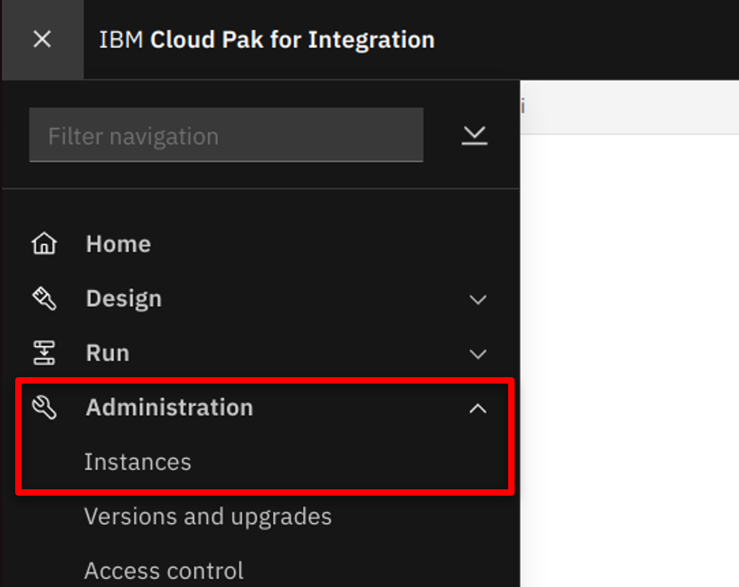<br/>

1. Select **assetrepo**.<br/>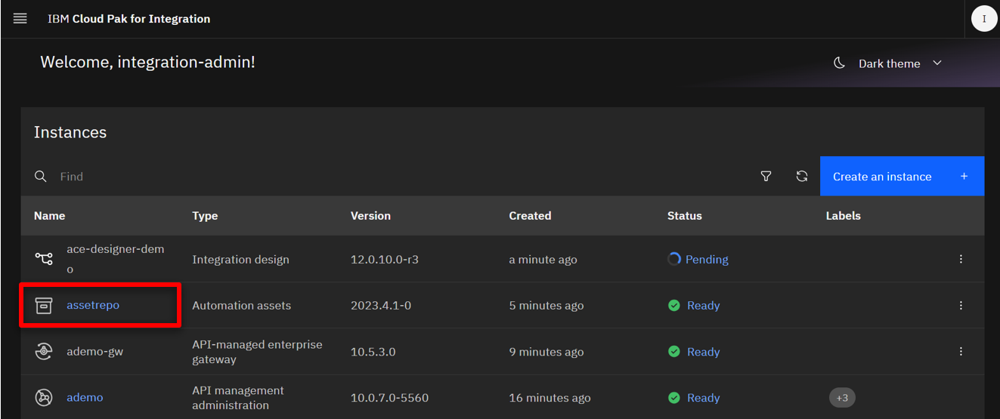<br/>

2. Click **Remotes** (1) and select **Add remote** (2). <br/>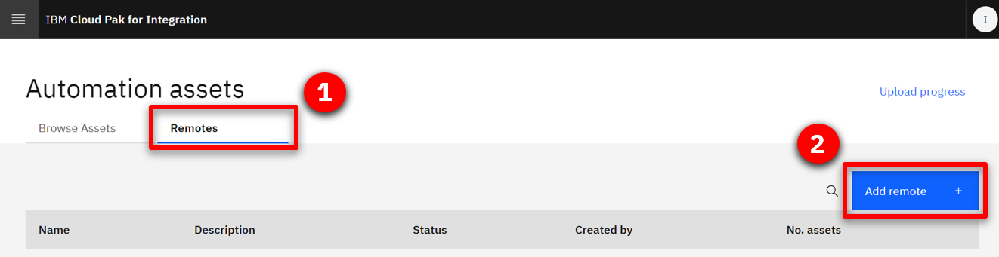<br/>

3. Fill in the following values:<br/>
   * **Name** (1): CP4I Demo Assets
   * **Git URL** (2): https://github.com/IBM/cp4i-demos.git
   * **Automatic sync options** (3): 5 minutes
   * **Asset types to synchronize** (4): Select all          

   Click **Create remote** (5) to complete the form.        

   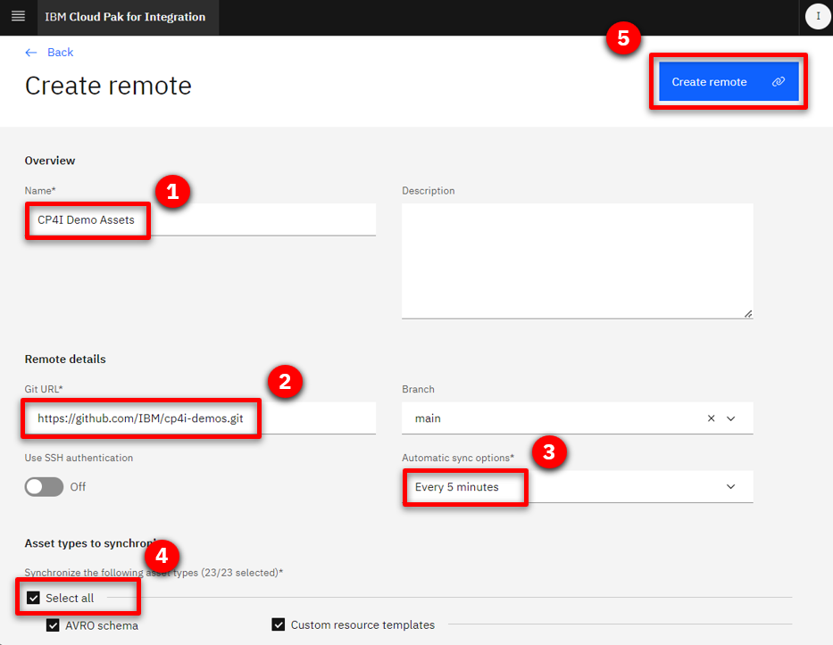<br/>

4. In a couple of minutes the resources from the GitHub repository will be synchronized.<br/>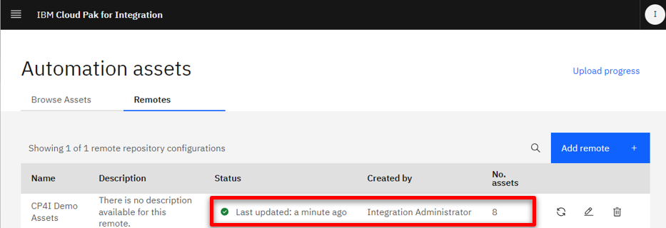<br/>

<br/>

**[Go to top](#top)**

<br/><br/>

</details>

<span id="CreateUser"></span>

<details markdown="1">

<summary>8 - Creating Dev User for Developer Portal</summary>

Now create a user in the Developer Portal.

1. Expand **Design** and select **APIs** (1).<br/>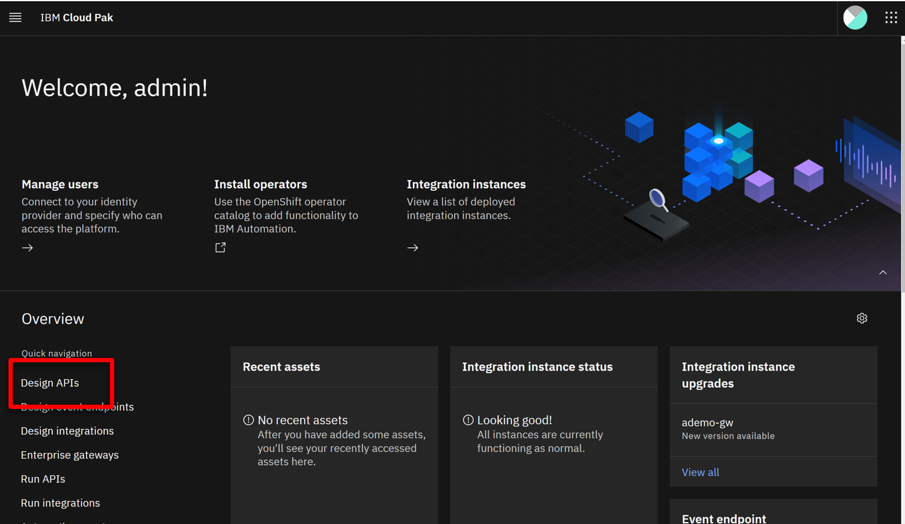<br/>

2. Click **ademo** API management. <br/>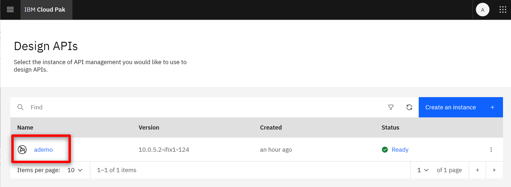<br/>

3. If a login screen is presented, select **Cloud Pak User Registry** <br/>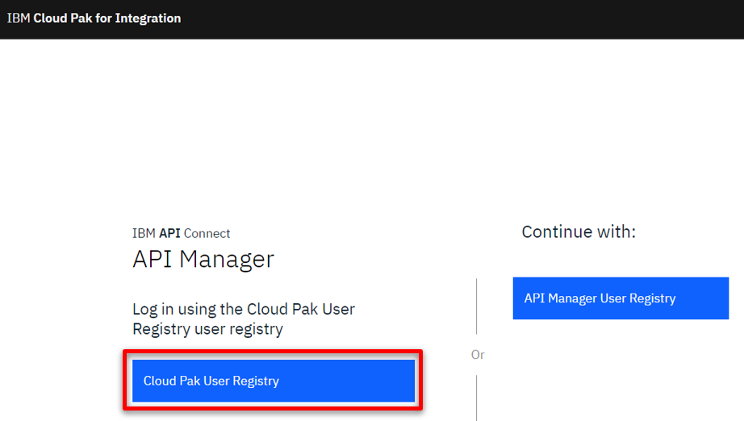<br/>

4. Click **Manage catalogs** (2).<br/><br/>

5. Open **Sandbox**.<br/><br/>

6. Select the **Consumers** (1) tab, click **Add** (2) and select **Create organization** (3).<br/><br/>

7. Fill in **IBM** as the title.<br/>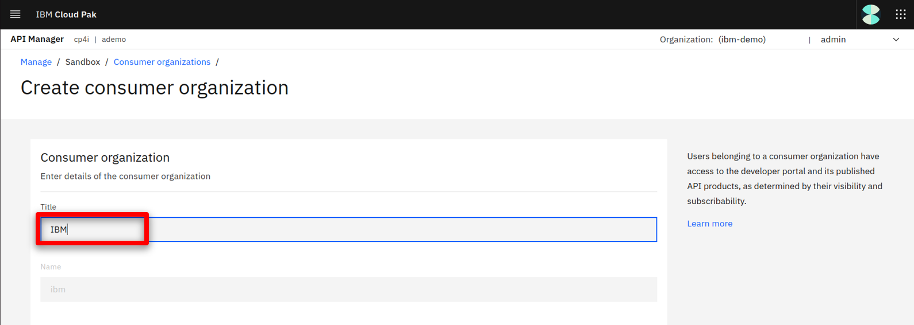<br/>

8. Scroll down to the Owner section, set the type of user to **New user** (1), fill in the following details and click **Create**.

    | FIELD | VALUE |
    | ------ | ------- |
    | **Username:** | devuser |
    | **Email:** | devuser@ibmapiconnect.com |
    | **First name:** | Dev |
    | **Last name:** | User |
    | **Password:** | AP1Connect! | 
    
    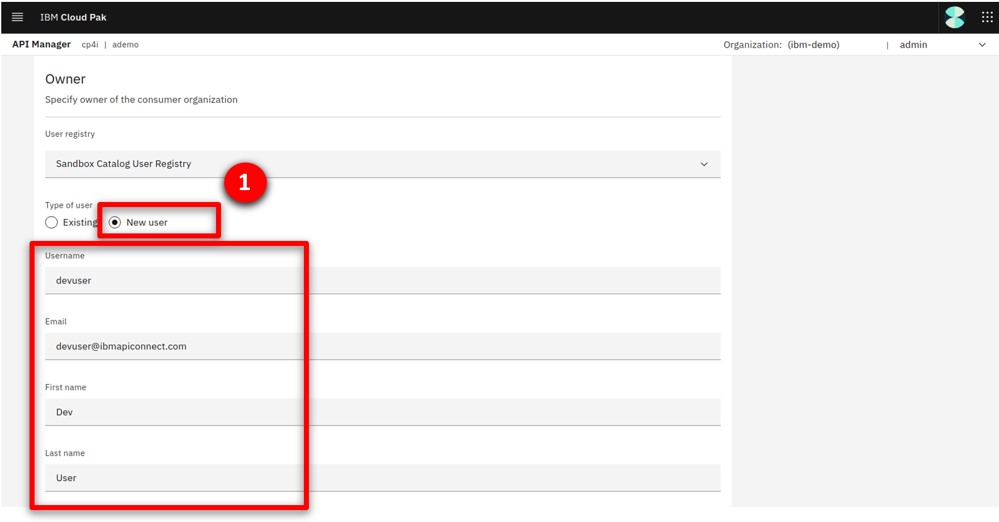

9. A new consumer organization is created.
<br/><br/>

Congratulations! Your portal developer user has been created and you are ready for the demo.

<br/>

**[Go to top](#top)**

<br/><br/>

</details>

Click [here](/platinum-demos/300-integration-api-enabled-application-integration/demo-script) to go to the **Demo script** on the next tab.