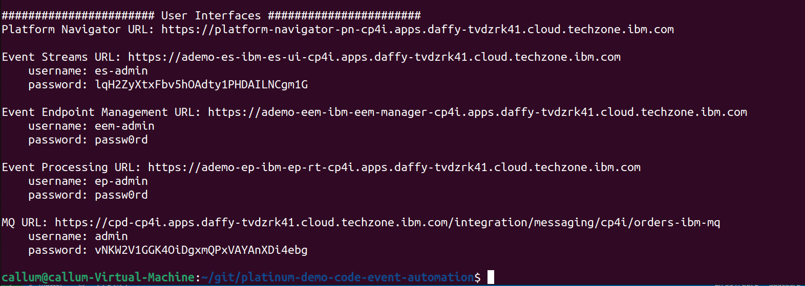
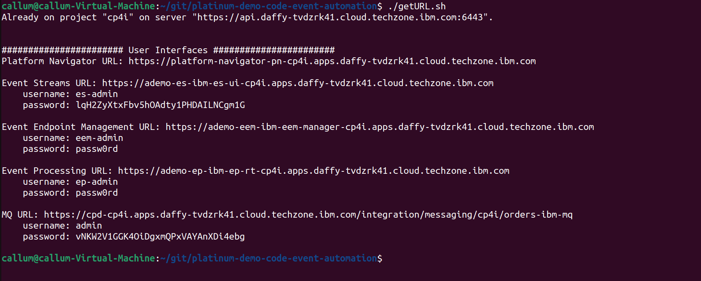



<span id="installDemo"></span>

<details markdown="1">

<summary>4 - Install the demo</summary>

1. To deploy the demo run:

   ```./deployWithConnector.sh```

   This will automatically deploy the resources into the CP4I namespace.


2. The deployment will take approximately 20-45 minutes to install. Wait for the deployment to complete. The URL and credentials will be shown once the installation is complete. 

   

   If you need to recall this information please use the getURL.sh command: 

   ```getURL.sh```

   


**[Go to top](#top)**

<br/><br/>

</details>

<span id="configureDemo"></span>

<details markdown="1">

<summary>5 - Configure the demo</summary>

The installation of the demo has not imported the event streams into the Event Management console. This must be completed manually. 

1. Open the Event Management console using the URL outputted in the previous step. Click on the **topic** (1) icon and select the **Add topic** (2) button.      
    

2. Click **Add new cluster**.        
    

3. Specify **IBM Event Streams** (1) for the cluster name and click **Next** (2).      
    

4. Specify **ademo-es-kafka-bootstrap.cp4i.svc:9095** (1) for the servers field and click **Next** (2).     
    

5. Check the **Accept all certificates** (1) box and click **Next** (2).      
    

6. Specify **es-admin** (1) for the username, use the value outputted in the preparation section for the password (2), and click **Add cluster** (3).       
    

7. Select **IBM Event Streams** (1) and click **Next** (2).      
    

8. Check **CUSTOMERS** (1) and **ORDERS** (2), and click **Add topic** (2).        
    

9. Click on the **CUSTOMERS** (1) topic.       
    

10. Click on the **Edit information** (1) button.       
     

11. Enter **Events generated by the customer management system. A new event is created for each new user registration.** (1) as the description.           
    

12. Scroll down and enter **customer** (1) as a tag and **customerservice@focus.corp** (2) as the contact email.          
     

13. Select the **Event information** tab, scroll down to the sample message text box (2) and copy the content from below, and click **Save** (3).         
    <inline-code code="{<br/>&nbsp;&nbsp;&quot;customerid&quot;: &quot;acb3eb65-98a1-45c2-84d4-f5df157862b4&quot;,<br/>&nbsp;&nbsp;&quot;customername&quot;: &quot;Emilio Quitzon&quot;,<br/>&nbsp;&nbsp;&quot;registered&quot;: &quot;2023-10-24 19:20:35.638&quot;<br/>}"></inline-code>       
     

14. Select the **Options** (1) tab and click on the **Create Option +** (2) button.     
    

15. Enter **Customer Access** (1) as the option name, **CUSTOMERS** (2) as the alias, **Self-service access to customer event stream** (3) as the description and click **Next** (4).       
     

16. Click **Next**.     
    

17. Click **Publish**.       
    

18. Check the **production** (1) checkbox and click **Save** (2).       
    

19. Select the **topics** (1) icon and click on the **ORDERS** (2) topic.            
     

20. Click on the **Edit information** (1) button.           
     
    
21. Enter **Events from the Focus Corp order management system. An event will be emitted for every new order that is made.** (1) as the description.           
     

22. Scroll down and enter **order** (1) as a tag and **orders@focus.corp** (2) as the contact email.         
     

23. Select the **Event information** tab, scroll down to the sample message text box (2) and copy the content from below, and click **Save** (3).        
    <inline-code code="{<br/>&nbsp;&nbsp;&quot;quantity&quot;: 9,<br/>&nbsp;&nbsp;&quot;price&quot;: 197.09,<br/>&nbsp;&nbsp;&quot;customerid&quot;: &quot;a7d1586b-ced1-462f-9e44-14e9e5013540&quot;,<br/>&nbsp;&nbsp;&quot;description&quot;: &quot;Composite Oversize 28in Tennis Racket&quot;,<br/>&nbsp;&nbsp;&quot;id&quot;: &quot;1eba7af9-b748-4754-b750-3459e589dccf&quot;,<br/>&nbsp;&nbsp;&quot;region&quot;: &quot;EMEA&quot;,<br/>&nbsp;&nbsp;&quot;ordertime&quot;: &quot;2023-10-24 19:26:04.839&quot;,<br/>&nbsp;&nbsp;&quot;customer&quot;: &quot;Reed McKenzie DDS&quot;<br/>}"></inline-code>     
     

24. Select the **Options** (1) tab and click on the **Create Option +** (2) button.        
    

25. Enter **Order Access** (1) as the option name, **ORDERS** (2) as the alias, **Self-service access to orders event stream** (3) as the description and click **Next** (4).         
    

26. Click **Next**.        
     
    
27. Click **Publish**.        
    

28. Check the **production** (1) checkbox and click **Save** (2).      
    

**[Go to top](#top)**

<br/><br/>

</details>

<span id="openConsoles"></span>

<details markdown="1">

<summary>6 - Open the web consoles for the demo</summary>

1. In preparation for running the demo open the Event Streams, Event Endpoint Management and Event Processing consoles using the supplied credentials. We have also created a scratch pad that you may find useful while running the demo. It contains space for all the username and passwords outputted above, and the text that you need to copy and paste within the demo. You can find this file [here](../300-integration-event-automation-common/scratch-pad).
<br/>

Your have completed the demo setup.

<br/>

**[Go to top](#top)**

<br/><br/>

</details>
<hr/>
Click [here](demo-script) to go to the **Demo script** on the next tab.
