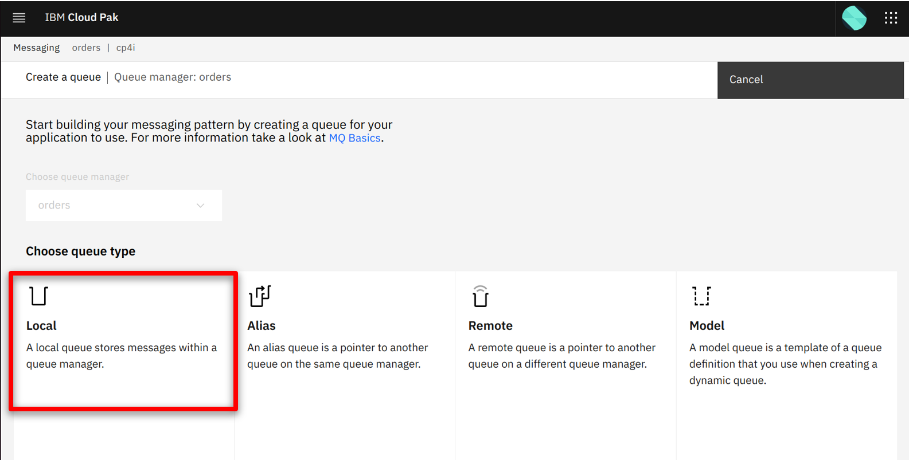
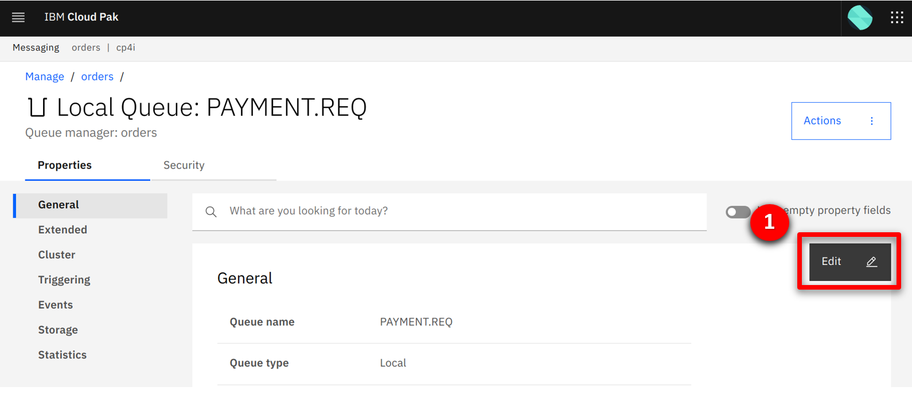
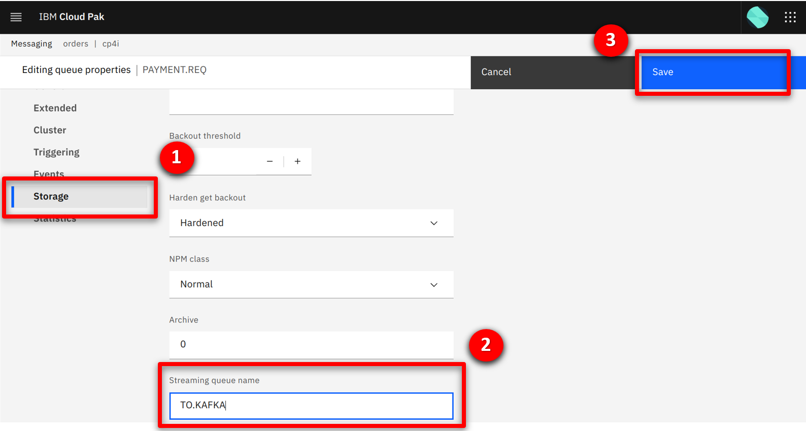
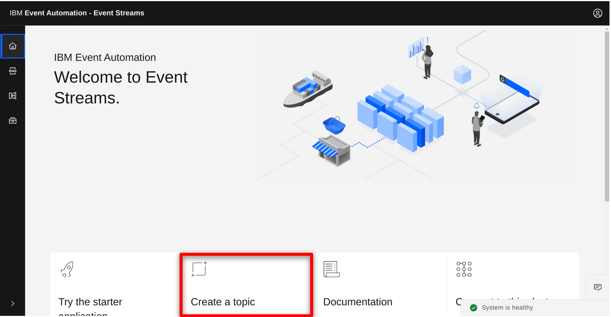

Introduction

Today we will see how Focus Corp, an online retailer, uses real-time transaction data to capitalize on time-sensitive revenue opportunities. 

Focus Corp has a goal of driving more revenue from its first-time customers. The marketing team want to send a high-value promotion to first-time customers immediately after a large initial order.

Focus Corp use IBM MQ to coordinate transactions between its order management system and its payments gateway. We’ll see how these transactions can be harvested to generate a Apache Kafka event stream and exposed to other teams for reuse. The marketing team will use this event stream to precisely identify which customers to send the promotional offer to.

Let’s get started!

(Demo intro slides <a href="https://ibm.box.com/s/quzwd2gvn7zbo9oo19xi1o05gtdlvmwj" target="_blank" rel="noreferrer">here</a>)

(Printer-ready PDF of demo script <a href="https://ibm.box.com/s/jsz9v4mva1jdz7gg1fls3xk4rhgiezvh" target="_blank" rel="noreferrer">here</a>)

  

1 - Creating an event stream from a message queue

Focus Corp’s integration team exposes the enterprise’s data using event streams. This allows application teams to subscribe to the data without impacting the backend system, decoupling development, and lowering risks. The integration team have received a request to access customer orders. The order management system and its payment gateway exchange customer orders over IBM MQ. The integration team will tap into this communication, clone each of the orders and publish into an event stream.

 

| **1.1** | **Configure a new queue in IBM MQ for the cloned order messages** |
| :--- | :--- |
| **Narration** | Focus Corp’s integration team log into the IBM MQ console. They create a new queue called TO.KAFKA to store the cloned order messages before they are published to Apache Kafka. |
| **Action** &nbsp; 1.1.1 | In the IBM MQ console click on **manage**.   |
| **Action** &nbsp; 1.1.2 | Click on the **Create** button to start creating the new queue.   |
| **Action** &nbsp; 1.1.3 | Click on the **Local** tile.   |
| **Action** &nbsp; 1.1.4 | Fill in **TO.KAFKA** (1) as the queue name and click **Create** (2).   |
| **Action** &nbsp; 1.1.4 | See the newly created queue in the table.   |

| **1.2** | **Configure IBM MQ to clone the orders** |
| :--- | :--- |
| **Narration** | Next the integration team identify the queue being used between the order management system and its payment gateway. They update the configuration to specify TO.KAFKA as the streaming queue. This causes IBM MQ to clone all new messages put to the queue. Once saved the new configuration is live, and the integration team can see cloned order messages stacking up in the TO.KAFKA queue. |
| **Action** &nbsp; 1.2.1 | Click on the **PAYMENT.REQ** queue.   |
| **Action** &nbsp; 1.2.2 | Click on a message (1), scroll down (2) and show the order details (3).   |
| **Action** &nbsp; 1.2.3 | Click **Close**.   |
| **Action** &nbsp; 1.2.4 | Click the **Actions** button and select **View configuration**.   |
| **Action** &nbsp; 1.2.5 | Click the **Edit** button.   |
| **Action** &nbsp; 1.2.6 | Select the **Storage** (1) section, in the Streaming queue name field type **TO.KAFKA** (2), and click **Save** (3).   |
| **Action** &nbsp; 1.2.7 | Scroll to the top of the page (1), and select **Manage** (2).   |
| **Action** &nbsp; 1.2.8 | Click on the **TO.KAFKA** (1) queue.   |
| **Action** &nbsp; 1.2.9 | View the order messages building up on the queue.   |

| **1.3** | **Define the orders event stream** |
| :--- | :--- |
| **Narration** | Next the integration team open the IBM Event Streams console to create the orders stream where the messages will be published. They have options to customize the replication and retention settings that control the redundancy and volume of data held.  |
| **Action** &nbsp; 1.3.1 | In the IBM Event Streams console click on the **Create a topic** tile.   |
| **Action** &nbsp; 1.3.2 | Specify **ORDERS** (1) as the Topic name, and click **Next** (2).   |
| **Action** &nbsp; 1.3.3 | Leave the number of partitions as the default and click **Next** (1).   |
| **Action** &nbsp; 1.3.4 | Leave the retention settings as the default and click **Next** (1).   |
| **Action** &nbsp; 1.3.5 | Leave the replication settings as the default and click **Create topic** (1).   |

| **1.4** | **Configure the IBM MQ to IBM Event Streams bridge** |
| :--- | :--- |
| **Narration** | Next the integration team open the Red Hat OpenShift console to configure the MQ to IBM Event Stream bridge. The bridge is supplied and supported by IBM and built on the Apache Kafka connector framework. The configuration includes the connectivity details for both IBM MQ and IBM Event Streams. Once created, the connector reads messages from the TO.KAFKA queue and publishes to the order stream. |
| **Action** &nbsp; 1.4.1 | In the Red Hat OpenShift console click on the **+** button in the top right.   |
| **Action** &nbsp; 1.4.1 | Copy and paste (1) the below, click **Create** (2).    <inline-code code="apiVersion: eventstreams.ibm.com/v1beta2 kind: KafkaConnector metadata: &nbsp;&nbsp;name: mq-connector &nbsp;&nbsp;namespace: cp4i &nbsp;&nbsp;labels: &nbsp;&nbsp;&nbsp;&nbsp;eventstreams.ibm.com/cluster: kafka-connect-cluster spec: &nbsp;&nbsp;class: com.ibm.eventstreams.connect.mqsource.MQSourceConnector &nbsp;&nbsp;tasksMax: 1 &nbsp;&nbsp;config: &nbsp;&nbsp;&nbsp;&nbsp;# the Kafka topic to produce to &nbsp;&nbsp;&nbsp;&nbsp;topic: ORDERS &nbsp;&nbsp;&nbsp;&nbsp;# the MQ queue to get messages from &nbsp;&nbsp;&nbsp;&nbsp;mq.queue: TO.KAFKA &nbsp;&nbsp;&nbsp;&nbsp;# connection details for the queue manager &nbsp;&nbsp;&nbsp;&nbsp;mq.queue.manager: orders &nbsp;&nbsp;&nbsp;&nbsp;mq.connection.name.list: orders-ibm-mq(1414) &nbsp;&nbsp;&nbsp;&nbsp;mq.channel.name: SYSTEM.DEF.SVRCONN &nbsp;&nbsp;&nbsp;&nbsp;# format of the messages to transfer &nbsp;&nbsp;&nbsp;&nbsp;mq.message.body.jms: true &nbsp;&nbsp;mq.record.builder: com.ibm.eventstreams.connect.mqsource.builders.JsonRecordBuilder &nbsp;&nbsp;&nbsp;&nbsp;key.converter: org.apache.kafka.connect.storage.StringConverter &nbsp;&nbsp;&nbsp;&nbsp;value.converter: org.apache.kafka.connect.json.JsonConverter &nbsp;&nbsp;&nbsp;&nbsp;# whether to send the schema with the messages &nbsp;&nbsp;&nbsp;&nbsp;key.converter.schemas.enable: false &nbsp;&nbsp;&nbsp;&nbsp;value.converter.schemas.enable: false</code> "></inline-code> |
 **Action** &nbsp; 1.4.1 | Copy and paste (1) the below, click **Create** (2).    <inline-code code="SimpleOneLiner"></inline-code> |

| **1.5** | **View the orders in the stream** |
| :--- | :--- |
| **Narration** | The integration team return to the IBM Event Streams console to view the order stream. They see the events since they configured the streaming queue in IBM MQ. |
| **Action** &nbsp; 1.5.1 | Click ...   |

| **1.6** | **Publishing the orders stream** |
| :--- | :--- |
| **Narration** | Next the integration team open the IBM Event Endpoint Management console. The console supports two usages, one for teams publishing event streams, and a second for those consuming. The integration team publish the order stream by discovering the topic on IBM Event Streams. They include a description, example message and publish the topic for subscribers.  |
| **Action** &nbsp; 1.5.1 | Click ...   |

 

**[Go to top](#place1)**

  



Summary

 

In this demo we showed how ...

Thank you for attending today’s presentation.

**[Go to top](#place1)**

  

