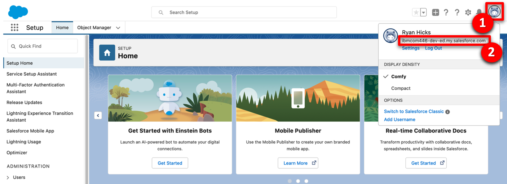
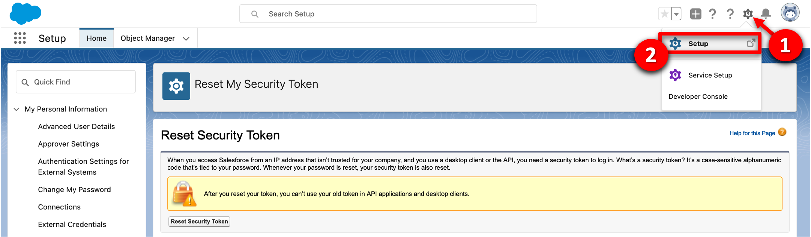
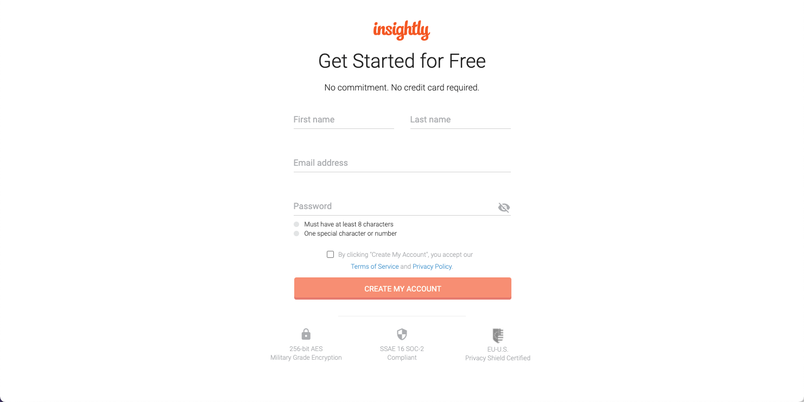
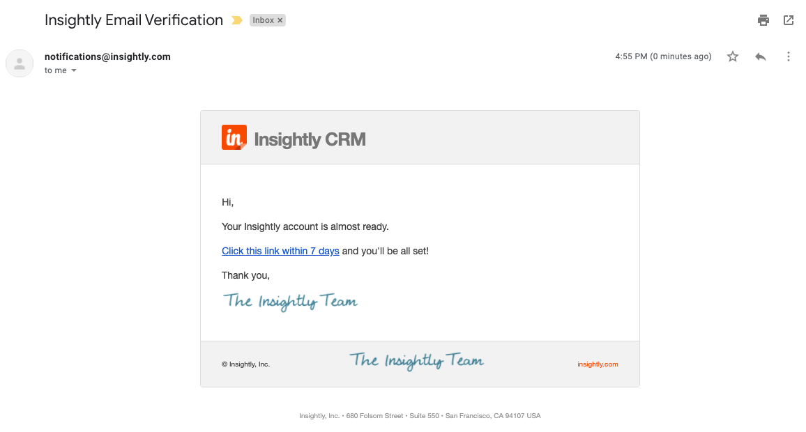
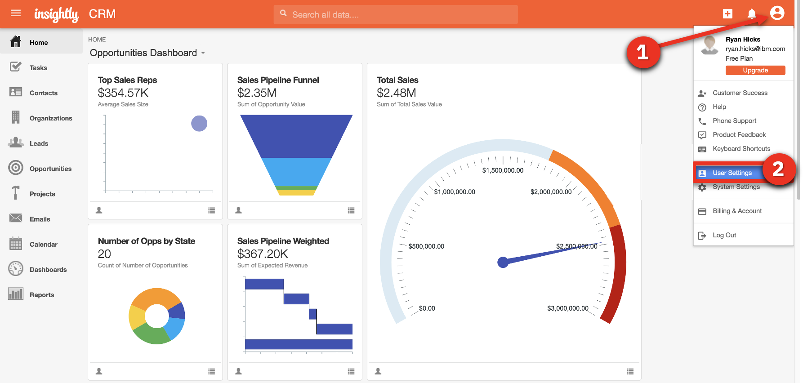
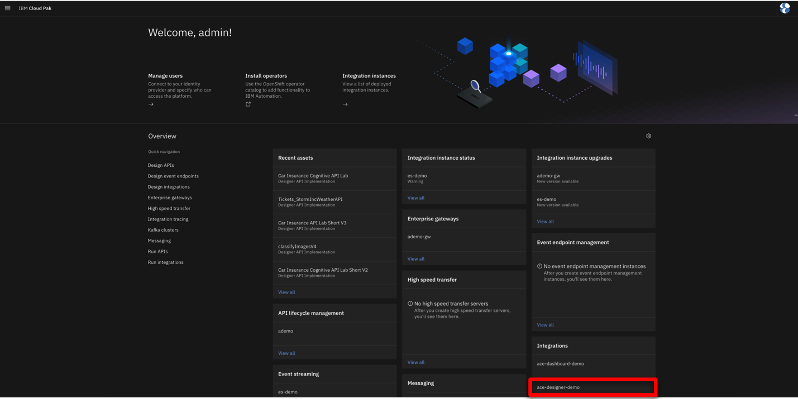
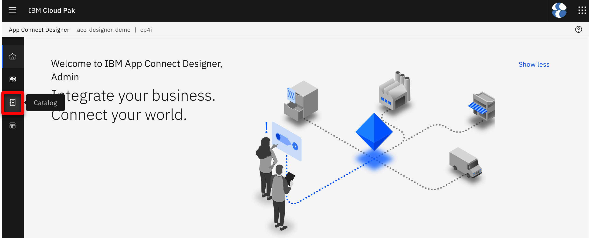
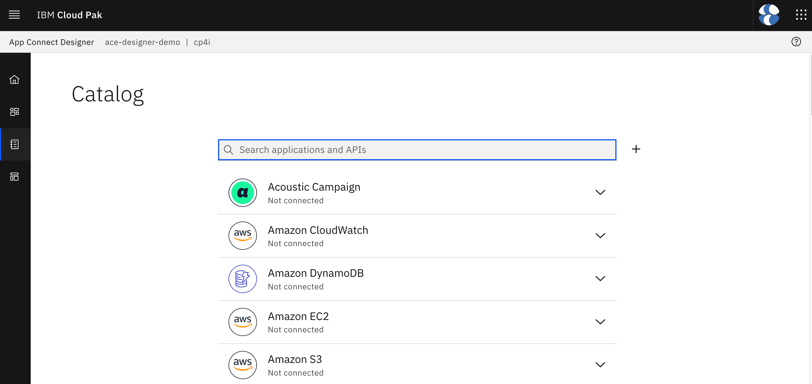
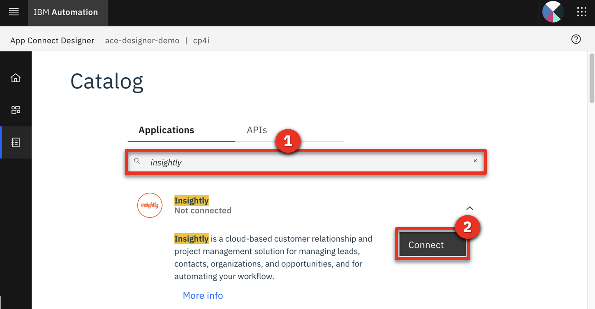



4 - Set up Salesforce

You need a Salesforce developer account to use for testing. If you already have a Salesforce developer account, you can use that (start at step 2 below). If not, you can sign up for a free developer account by following step 1 below.

1. Go to <a href="https://developer.salesforce.com/signup" target="_blank" rel="noreferrer">Salesforce Developers</a>. Follow the prompts on the Saleforce pages to get your free developer account. 

2. As soon as you have your account, go back to the <a href="https://login.salesforce.com/" target="_blank" rel="noreferrer">Salesforce log in page</a> and log in to your dev admin account.  

3. Click the **profile** icon (1) and save your Salesforce Login URL (2).  

4. In the same user profile menu, select **Settings**.  

5. Click **Reset My Security Token** in the **My Personal Information** (1) menu. Then, click **Reset Security Token** (2). A newly-generated security token will be emailed to you.  

6. Next, you will create an application representing App Connect Enterprise, and then retrieve the Consumer Key and Consumer Secret. Click the **cogwheel** icon (1) and then select **Setup** (2).  

7. In the navigator on the left-hand side, scroll to **PLATFORM TOOLS**, expand **Apps** (1), and click **App Manager** (2).  

8. Click **New Connected App**.  

9. Enter **App Connect** (1) as the **Connect App Name** and your email as the **Contact Email** (2). Mark **Enable OAuth Settings** (3).  

10. Mark **Enable for Device Flow** (1). Now select **Manage user data via APIs (api)** (2) as the **Selected OAuth Scopes**. Click **Add** (3)  

11. Click **Save**.  

12. It will take approximately 10 minutes for the new connected app to register in Salesforce. Once it does, you should see **Manage Consumer Details** displayed. Click **Manage Consumer Details,** following any authentication directions.  

13. Save the **Consumer Key** and **Consumer Secret.**  

Your Salesforce dev account is ready.

**[Go to top](#top)**
 

5 - Set up Insightly

Next, let’s set up Insightly, a cloud-based customer relationship management (CRM) solution.

We will now create a trial account (15 days). After the trial period, you can migrate your trial account to a free account (with limited users).

1. Go to <a href="https://www.insightly.com/" target="_blank" rel="noreferrer">Insightly</a> and click **Try CRM Free**.  

2. Complete the form with your personal data to create a free Insightly account. Accept the **Terms of Service and Privacy Policy** and click **Create My Account**.  

3. Confirm your email address.   

4. As soon as you click the link to confirm your email, you should see an initial Insightly screen asking basic information about your company.  Write **demo** (1), select **1-5** (2), select **IT Services** (3), and fill in any phone number (4), matching the screenshot below. Click **Let's go!** (5).  

5. Close the **Invite your team** dialog.  

6. You have an Insightly account. Let's get the API key to enable App Connect to authenticate when making API calls. Click the **Profile** (1) icon in Insightly and select **User Settings** (2).  

7. Scroll down to the bottom of the page and copy the **API key**, which is a long string of characters.  

9. On the **Free** plan tile, click **Select Plan**.  

10. Click **OK** on the confirmation dialog box.

 

Your Insightly account is ready to use.

 

**[Go to top](#top)**

6 - Connect Cloud Pak for Integration to your endpoints

Let’s configure our services endpoints in Cloud Pak for Integration.

1. Return the connectivity instructions from section 2.2, navigate to the **Cloud Pak Console** (1) tab and use the credentials (2) access the Platform Navigator.    <inline-notification text="If you are using Chrome, you may see a certificate error when accessing the page. To bypass this, type <strong>thisisunsafe</strong> and press return."></inline-notification> 

2. Click **ace-designer-demo** in the **Integrations** section.
  

3. Click the **Catalog** icon.  

4. This is the list of the available connectors.  Now configure the Salesforce connector.  

5. Search for **salesforce** (1) and click **Connect** (2).  

6. Enter your Salesforce **Login URL**.  <inline-notification text="You must enter <strong>‘https://’</strong> in front of the Saleforce Login URL you saved earlier. The connection will not work if you just copy/paste the URL."></inline-notification>  

7. Input your Salesforce **Username** (1). Fill in the connector's **Password** field (2) by concatenating your Salesforce **Password** and the **Security token** received via email.  For example, if your Salesforce password is ‘myGreatPassword’ and your Salesforce security token is ‘2325jsdhew4312hs534dh’ then enter ‘myGreatPassword2325jsdhew4312hs534dh’ in the **Password** field.  

8. Input Salesforce’s **Consumer Key** as **Client ID** (1) and **Secret** as **Client Secret** (2), respectively, in the connector account UI. Click **Connect** (3).  

9. Search for **insightly** and click **Connect**.  

10. Paste your **API key** (1) in the **API key** field. Keep **v3.1** (2) in the **API version** field. Click **Connect** (3).  

Your environment is ready to demo.

**[Go to top](#top)**
 

## **AFTER EACH DEMO**

Reset the environment

After practicing the demo you will need to reset the environment.

1. Delete any contacts that were added in Insightly.

2. Reinstall Cloud Pak for Integration to ensure you have a clean environment. Follow <strong>step 1</strong> and <strong>step 2</strong> above.

3. Reconnect the end points, following <strong>step 5</strong> to your endpoints above.

<inline-notification text="Attempting to reuse the same environment may result in inconsistencies between your environment and what is shown in the script and screenshots."></inline-notification>

**[Go to top](#top)**
 

Click [here](/300-integration-low-code-integration-using-ai/demo-script) to go to the **Demo script** on the next tab.
