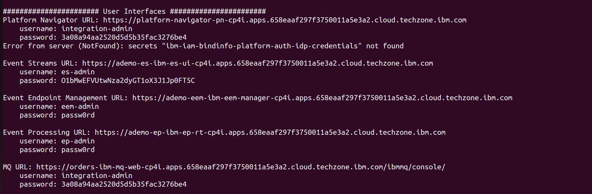
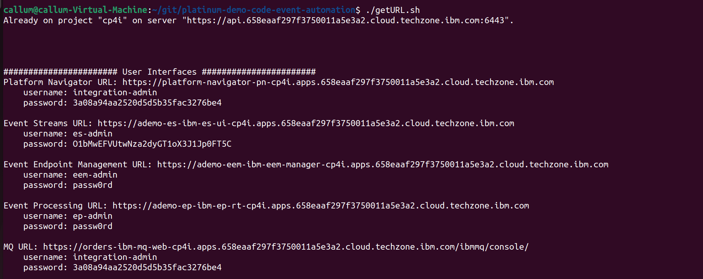



<span id="installDemo"></span>

<details markdown="1">

<summary>4 - Install the demo and access the Web UI</summary>

1. To deploy the demo run:

   ```./deploy.sh```

   This will automatically deploy the resources into the CP4I namespace.


2. The deployment will take approximately 20-45 minutes to install. Wait for the deployment to complete. The URL and credentials will be shown once the installation is complete. 

   

   If you need to recall this information please use the getURL.sh command: 

   ```getURL.sh```

   

3. In preparation for running the demo open the Event Streams, Event Endpoint Management and Event Processing consoles using the supplied credentials. We have also created a scratch pad that you may find useful while running the demo. It contains space for all the username and passwords outputted above, and the text that you need to copy and paste within the demo. You can find this file [here](../300-integration-event-automation-common/scratch-pad).
<br/>

Your have completed the demo setup.

<br/>

**[Go to top](#top)**

<br/><br/>

</details>
<hr/>
Click [here](demo-script) to go to the **Demo script** on the next tab.
