

Introduction

Today we will see how Focus Corp, an online retailer, uses real-time transaction data to capitalize on time-sensitive revenue opportunities. 

Focus Corp has a goal of driving more revenue from its first-time customers. The marketing team want to send a high-value promotion to first-time customers immediately after a large initial order.

Focus Corp uses IBM MQ to coordinate transactions between its order management system and its payments gateway. We’ll see how these transactions can be harvested to generate an Apache Kafka event stream and exposed to other teams for reuse. The marketing team will use these event streams to precisely identify when, and to which customers, to send its highest-value promotional offers.

Let’s get started!

(Demo intro slides <a href="https://ibm.box.com/s/pdidbqniosqelx6d77lvetmqd9u7gwp4" target="_blank" rel="noreferrer">here</a>)

(Printer-ready PDF of demo script <a href="https://ibm.box.com/s/da97h1zq1oesc4sjmwa1yadran3vp70z" target="_blank" rel="noreferrer">here</a>)

  

1 - Creating an event stream from a message queue

Focus Corp’s integration team exposes the enterprise’s data using event streams. This allows application teams to subscribe to the data without impacting the backend system, decoupling development, and lowering risks. The integration team has received a request to access customer orders. The order management system and its payment gateway exchange customer orders over IBM MQ. The integration team will tap into this communication, clone each of the orders and publish the messages into an event stream.

 

| **1.1** | **Configure a new queue in IBM MQ for the cloned order messages** |
| :--- | :--- |
| **Narration** | Focus Corp’s integration team logs into the IBM MQ console. They create a new queue called TO.KAFKA to store the cloned order messages before they are published to Apache Kafka. |
| **Action** &nbsp; 1.1.1 | In the IBM MQ console, click on **Manage** (1) and **Queues** (2).  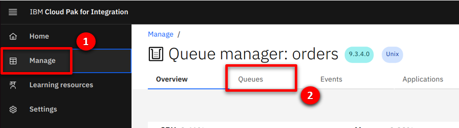 |
| **Action** &nbsp; 1.1.2 | Define a new queue by clicking on the **Create** button.   |
| **Action** &nbsp; 1.1.3 | Click on the **Local** tile.  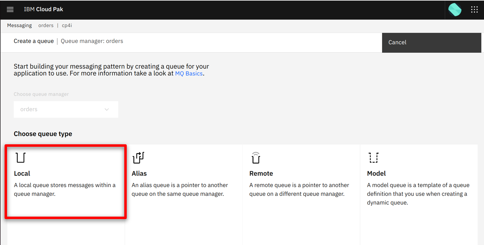 |
| **Action** &nbsp; 1.1.4 | Fill in **TO.KAFKA** (1) as the queue name and click **Create** (2).   |
| **Action** &nbsp; 1.1.5 | See the new queue in the table.  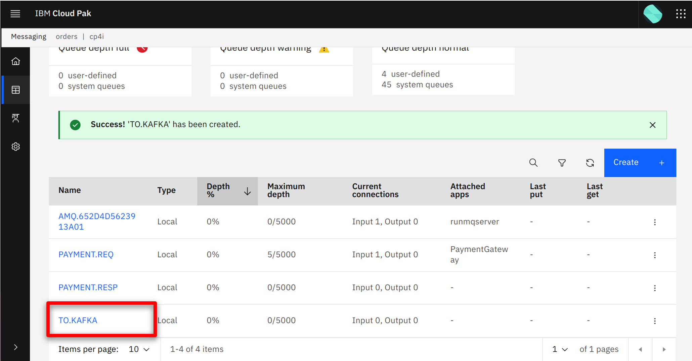 |

| **1.2** | **Configure IBM MQ to clone the orders** |
| :--- | :--- |
| **Narration** | Next the integration team identifies the queue that connects the order management system to the payment gateway. They review the messages as they are passing through MQ to verify they contain the expected payload. |
| **Action** &nbsp; 1.2.1 | Click on the **PAYMENT.REQ** queue.  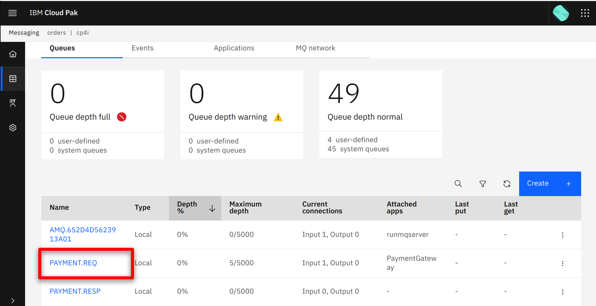 |
| **Action** &nbsp; 1.2.2 | Click on a message (1), scroll down (2) and show the order details (3).  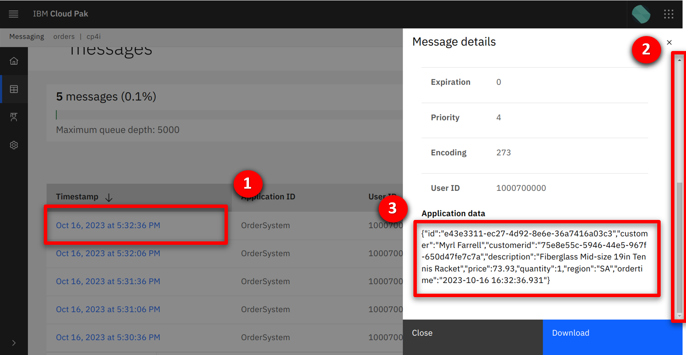 |
| **Action** &nbsp; 1.2.3 | Click **Close**.  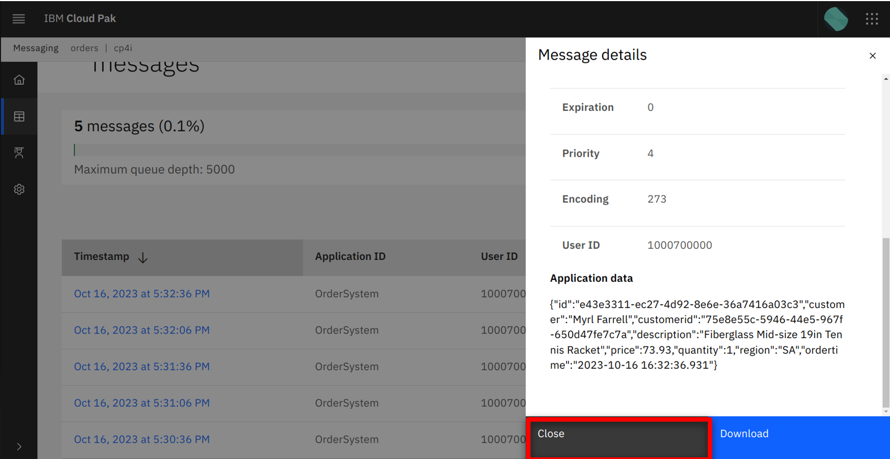 |
| **Narration** | They update the configuration to specify TO.KAFKA as the streaming queue. This causes IBM MQ to clone new messages to the PAYMENT.REQ queue. |
| **Action** &nbsp; 1.2.4 | Click the **Actions** button and select **View configuration**.  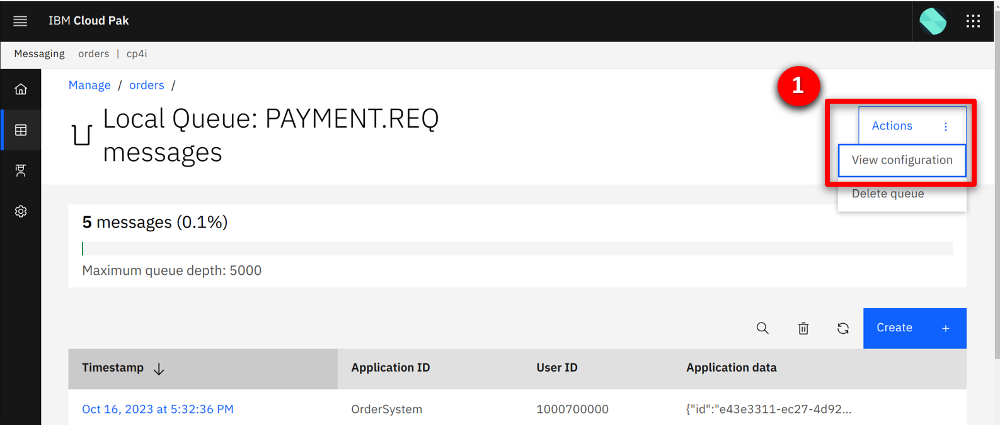 |
| **Action** &nbsp; 1.2.5 | Click the **Edit** button.  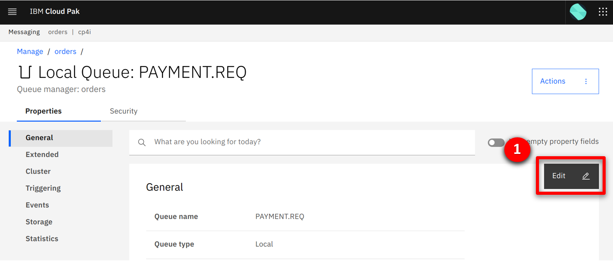 |
| **Action** &nbsp; 1.2.6 | Select the **Storage** (1) section. In the Streaming queue name field type **TO.KAFKA** (2), and click **Save** (3).  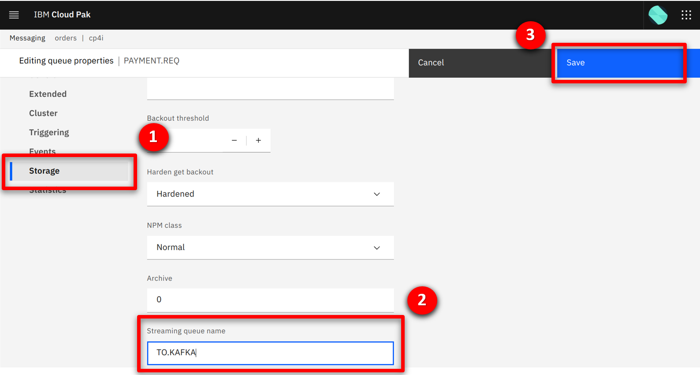 |
| **Narration** | Once saved the new configuration is live, and the integration team can see cloned order messages in the TO.KAFKA queue. |
| **Action** &nbsp; 1.2.7 | Scroll to the top of the page (1), and select **Manage** (2).  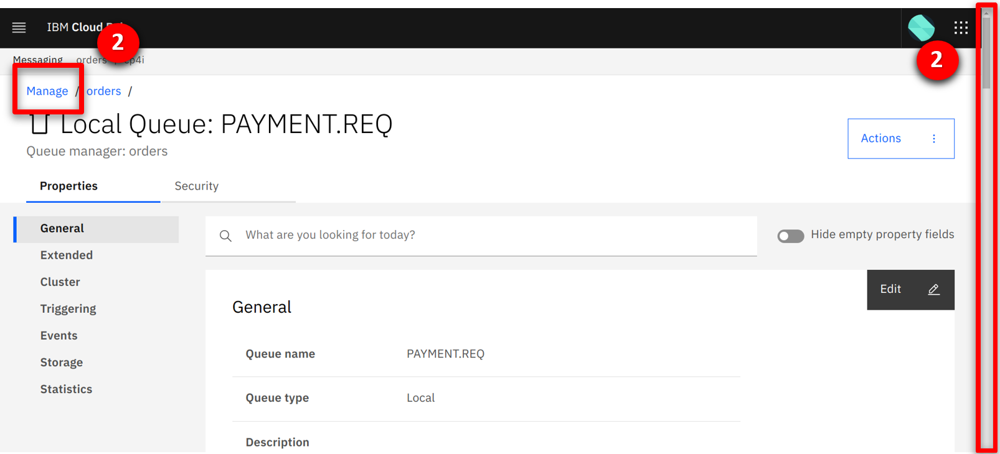 |
| **Action** &nbsp; 1.2.8 | Click on the **TO.KAFKA** (1) queue.   |
| **Action** &nbsp; 1.2.9 | View the order messages building up on the queue.  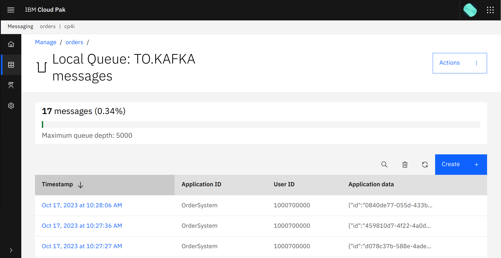 |

| **1.3** | **Define the Orders event stream** |
| :--- | :--- |
| **Narration** | Next the integration team opens the IBM Event Streams console to create the Orders stream where messages will be published. Options are provided to customize the data replication and retention settings. The team uses the default values, as their standard policy is to retain data for a week and to replicate for high availability.  |
| **Action** &nbsp; 1.3.1 | In the IBM Event Streams console, click on the **Create a topic** tile.  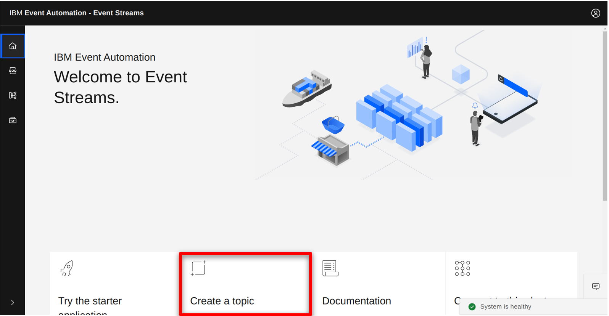 |
| **Action** &nbsp; 1.3.2 | Specify **ORDERS** (1) as the Topic name, and click **Next** (2).  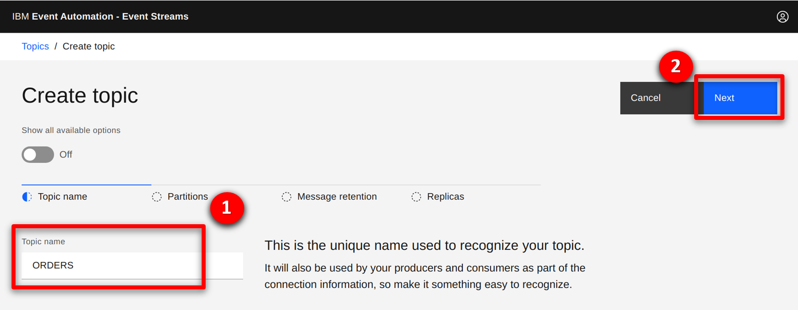 |
| **Action** &nbsp; 1.3.3 | Leave the number of partitions as the default, and click **Next** (1).   |
| **Action** &nbsp; 1.3.4 | Leave the retention settings as the default, and click **Next** (1).   |
| **Action** &nbsp; 1.3.5 | Leave the replication settings as the default, and click **Create topic** (1).   |

| **1.4** | **Configure the IBM MQ to IBM Event Streams bridge** |
| :--- | :--- |
| **Narration** | Next the integration team open the Red Hat OpenShift console to configure the MQ to IBM Event Streams bridge. The bridge is supplied and supported by IBM and built on the Apache Kafka connector framework. The configuration includes the connectivity details for both IBM MQ and IBM Event Streams. Once created, the connector reads messages from the TO.KAFKA queue and publishes to the Order stream. |
| **Action** &nbsp; 1.4.1 | In the Red Hat OpenShift console, click on the **+** button in the top right.  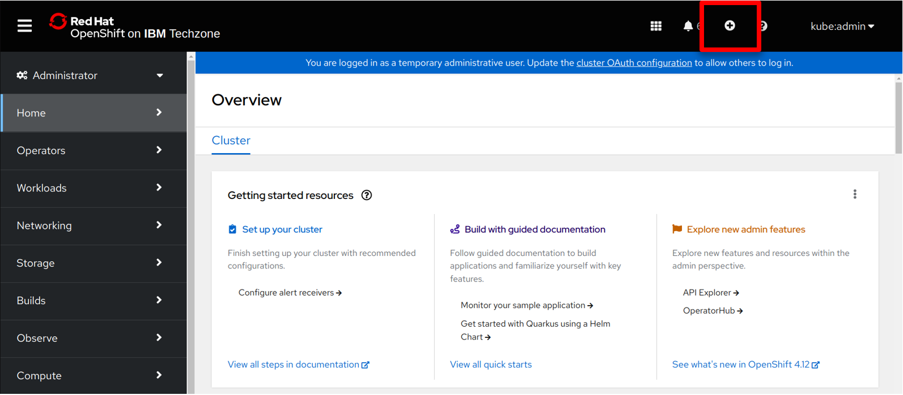 |
| **Action** &nbsp; 1.4.2 | The configuration snippet to create the MQ to Kafka bridge is shown below. Copy this configuration snippet and paste (1) into the Red Hat OpenShift console, and click **Create** (2).    <inline-code code="apiVersion: eventstreams.ibm.com/v1beta2 kind: KafkaConnector metadata: &nbsp;&nbsp;name: mq-connector &nbsp;&nbsp;namespace: cp4i &nbsp;&nbsp;labels: &nbsp;&nbsp;&nbsp;&nbsp;eventstreams.ibm.com/cluster: kafka-connect-cluster spec: &nbsp;&nbsp;class: com.ibm.eventstreams.connect.mqsource.MQSourceConnector &nbsp;&nbsp;tasksMax: 1 &nbsp;&nbsp;config: &nbsp;&nbsp;&nbsp;&nbsp;# the Kafka topic to produce to &nbsp;&nbsp;&nbsp;&nbsp;topic: ORDERS &nbsp;&nbsp;&nbsp;&nbsp;# the MQ queue to get messages from &nbsp;&nbsp;&nbsp;&nbsp;mq.queue: TO.KAFKA &nbsp;&nbsp;&nbsp;&nbsp;# connection details for the queue manager &nbsp;&nbsp;&nbsp;&nbsp;mq.queue.manager: orders &nbsp;&nbsp;&nbsp;&nbsp;mq.connection.name.list: orders-ibm-mq(1414) &nbsp;&nbsp;&nbsp;&nbsp;mq.channel.name: SYSTEM.DEF.SVRCONN &nbsp;&nbsp;&nbsp;&nbsp;# format of the messages to transfer &nbsp;&nbsp;&nbsp;&nbsp;mq.message.body.jms: true &nbsp;&nbsp;&nbsp;&nbsp;mq.record.builder: com.ibm.eventstreams.connect.mqsource.builders.JsonRecordBuilder &nbsp;&nbsp;&nbsp;&nbsp;key.converter: org.apache.kafka.connect.storage.StringConverter &nbsp;&nbsp;&nbsp;&nbsp;value.converter: org.apache.kafka.connect.json.JsonConverter &nbsp;&nbsp;&nbsp;&nbsp;# whether to send the schema with the messages &nbsp;&nbsp;&nbsp;&nbsp;key.converter.schemas.enable: false &nbsp;&nbsp;&nbsp;&nbsp;value.converter.schemas.enable: false</code> "></inline-code>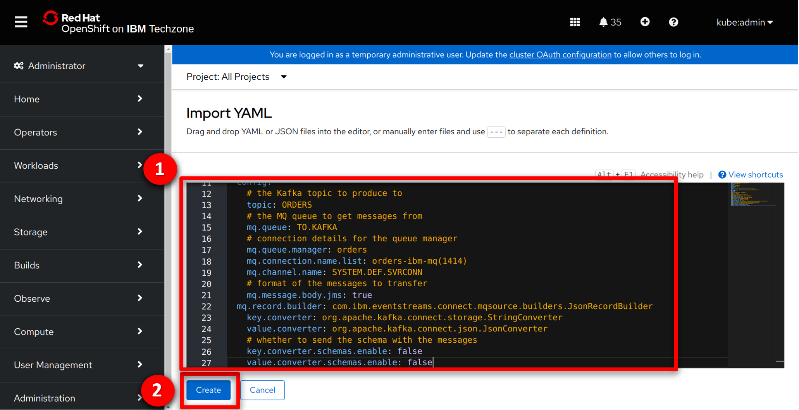 |

| **1.5** | **View the orders in the stream** |
| :--- | :--- |
| **Narration** | The integration team returns to the IBM Event Streams console to view the orders. They see the events that have been generated since they configured the streaming queue in IBM MQ. |
 **Action** &nbsp; 1.5.1 | Return to the IBM Event Streams console and show that the messages are being streamed into the topic. Click the topic icon (1), and select the **ORDERS** (2) topic.    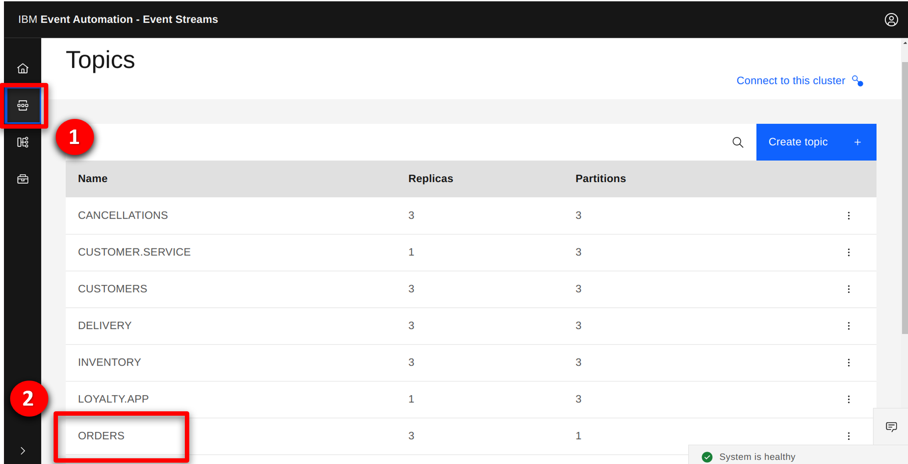 |
 **Action** &nbsp; 1.5.2 | All messages since the MQ streaming queue configuration update are seen. Click on one to view the details.     |

| **1.6** | **Importing the streams into IBM Event Endpoint Management** |
| :--- | :--- |
| **Narration** | Next the integration team open the IBM Event Endpoint Management console. The console supports two usages, one for teams publishing event streams, and a second for those consuming. The integration team wants to import the order and customer streams by discovering the topic on IBM Event Streams. As this is the first time they have imported from IBM Event Streams they need to register the cluster.|
| **Action** &nbsp; 1.6.1 | In the IBM Event Endpoint Management console, click on the **topic** (1) icon and select the **Add topic** (2) button.   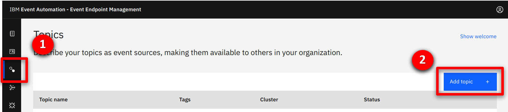 |
| **Action** &nbsp; 1.6.2 | Click **Add new cluster**.   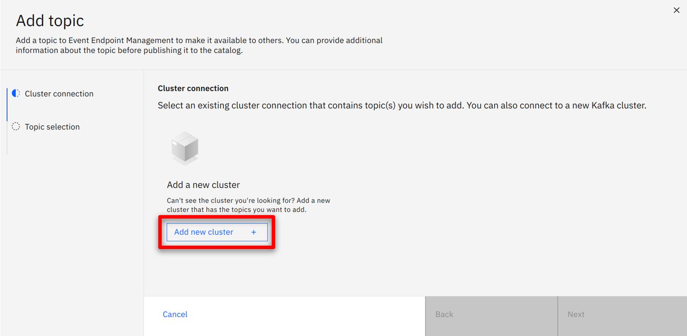 |
| **Action** &nbsp; 1.6.3 | Specify **IBM Event Streams** (1) for the cluster name and click **Next** (2).   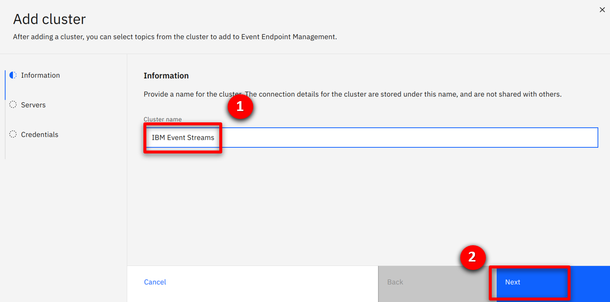 |
| **Narration** | They enter the cluster connectivity details including the endpoint, certificates for secure communication and username / password credentials.|
| **Action** &nbsp; 1.6.4 | Specify **ademo-es-kafka-bootstrap.cp4i.svc:9095** (1) for the servers field and click **Next** (2).    |
| **Action** &nbsp; 1.6.5 | Check the **Accept all certificates** (1) box and click **Next** (2).   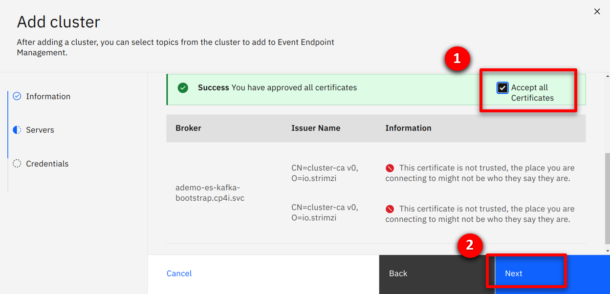 |
| **Action** &nbsp; 1.6.6 | Specify **es-admin** (1) for the username, use the value outputted in the preparation section for the password (2), and click **Add cluster** (3).    |
| **Narration** | The available topics are discovered, and the team imports both the CUSTOMERS and ORDERS streams.|
| **Action** &nbsp; 1.6.7 | Select **IBM Event Streams** (1) and click **Next** (2).   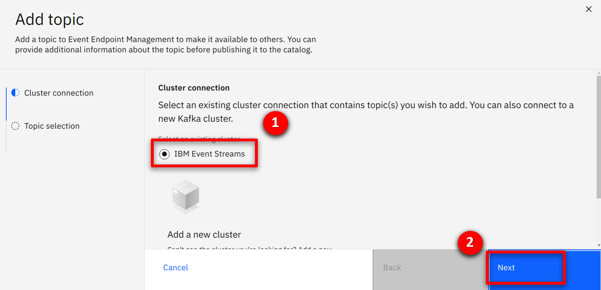 |
| **Action** &nbsp; 1.6.8 | Check **CUSTOMERS** (1) and **ORDERS** (2), and click **Add topic** (2).   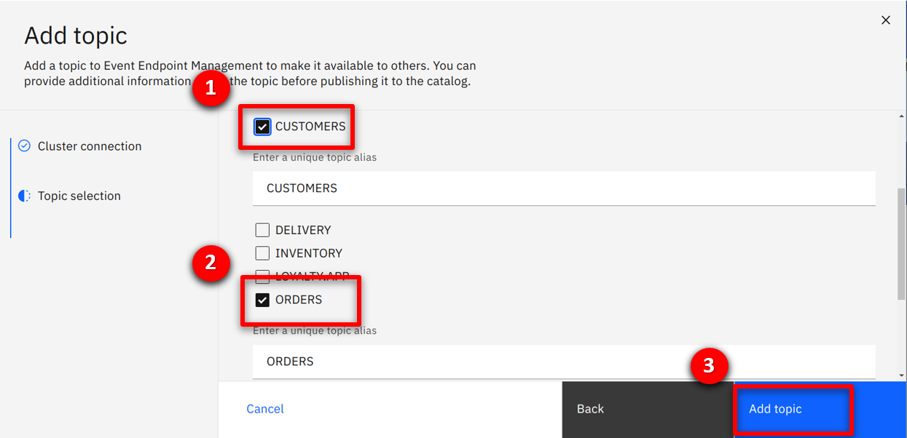 |

| **1.7** | **Describe and publish the streams into IBM Event Endpoint Management** |
| :--- | :--- |
| **Narration** | Next the integration team describes the streams, providing a description and example message. This information is displayed to consumers when they discover and subscribe to the event stream. They start by editing the CUSTOMERS stream. |
| **Action** &nbsp; 1.7.1 | Click on the **CUSTOMERS** (1) topic.   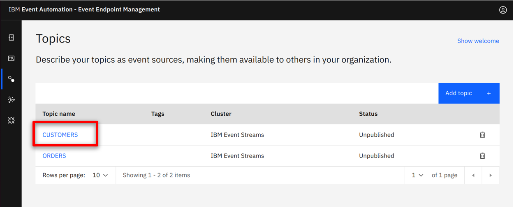 |
| **Action** &nbsp; 1.7.2 | Click on the **Edit information** (1) button.   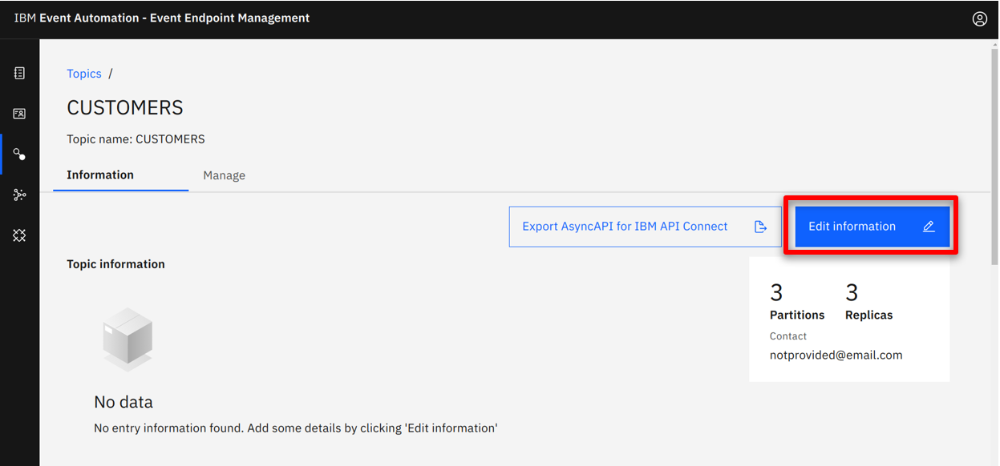 |
| **Action** &nbsp; 1.7.3 | Enter **Events generated by the customer management system. A new event is created for each new user registration.** (1) as the description.   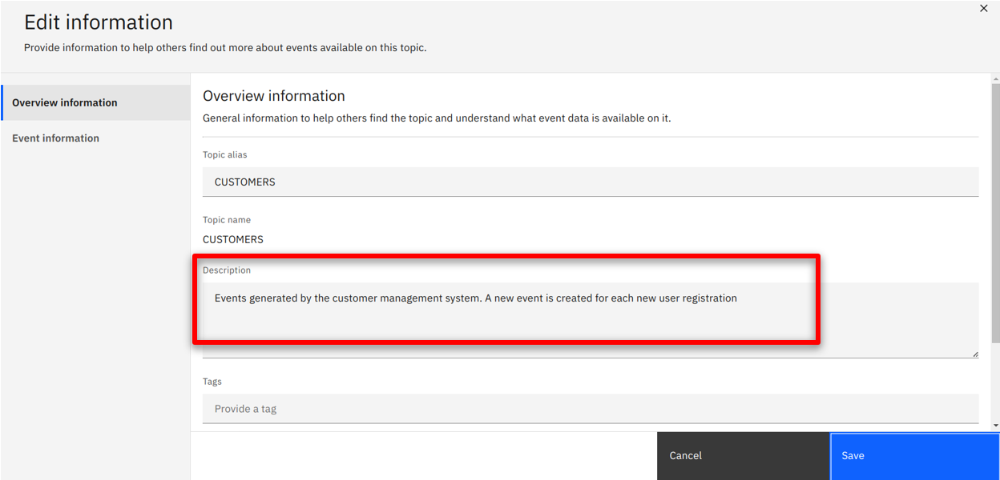 |
| **Action** &nbsp; 1.7.4 | Scroll down and enter **customer** (1) as a tag and **customerservice@focus.corp** as the contact email (2).   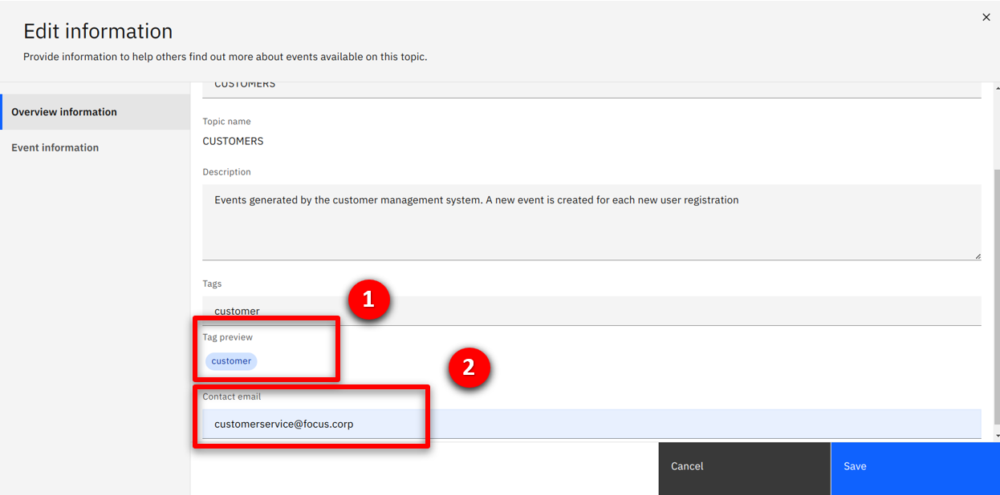 |
| **Action** &nbsp; 1.7.5 | Select the **Event information** tab, scroll down to the sample message text box (2) and copy the content from below, and click **Save** (3).    <inline-code code="{ &nbsp;&nbsp;&quot;customerid&quot;: &quot;acb3eb65-98a1-45c2-84d4-f5df157862b4&quot;, &nbsp;&nbsp;&quot;customername&quot;: &quot;Emilio Quitzon&quot;, &nbsp;&nbsp;&quot;registered&quot;: &quot;2023-10-24 19:20:35.638&quot; }"></inline-code> 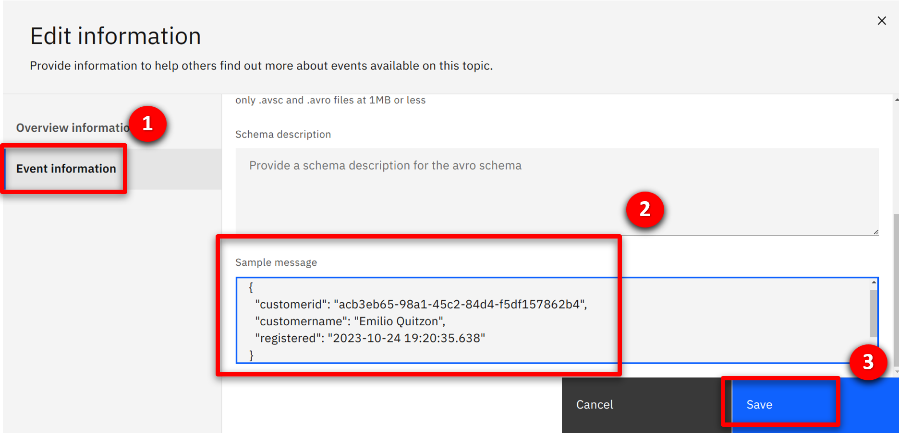 |
| **Narration** | The integration team publishes the event stream, which allows consumers to view and subscribe. |
| **Action** &nbsp; 1.7.6 | Select the **Options** (1) tab and click on the **Create Option +** (2) button.   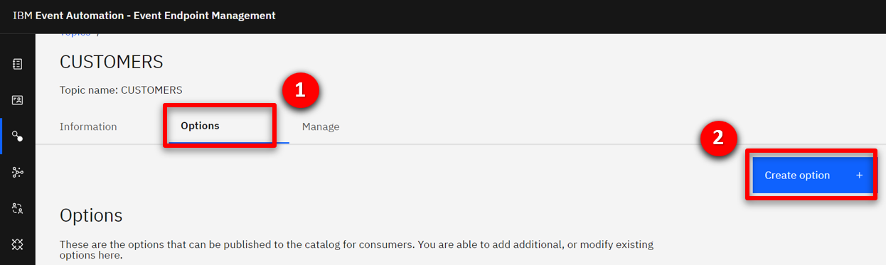 |
| **Action** &nbsp; 1.7.7 | Enter **Customer Access** (1) as the option name, **CUSTOMERS** (2) as the alias, **Self-service access to customer event stream** (3) as the description and click **Next** (4).    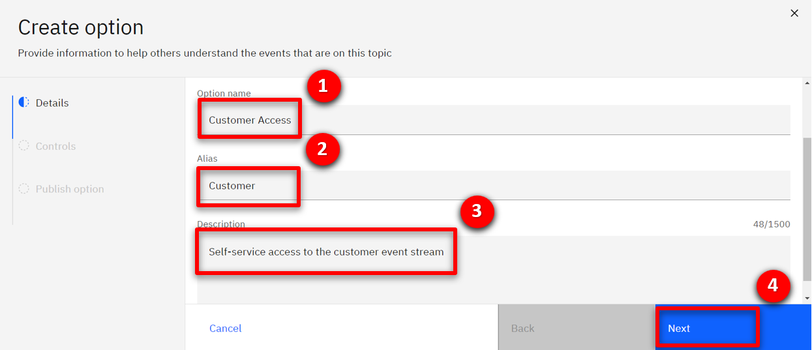 |
| **Action** &nbsp; 1.7.8 | Click **Next**.    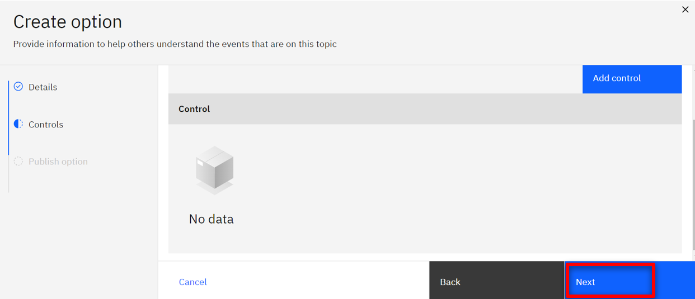 |
| **Action** &nbsp; 1.7.9 | Click **Publish**.     |
| **Action** &nbsp; 1.7.10 | Check the **production** (1) checkbox and click **Save** (2).    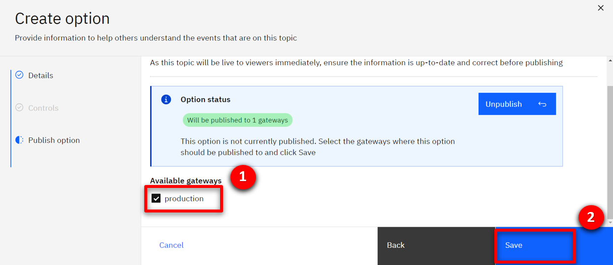 |
| **Narration** | They repeat the same process for the ORDERS stream. |
| **Action** &nbsp; 1.7.11 | Select the **topics** (1) icon and click on the **ORDERS** (2) topic.   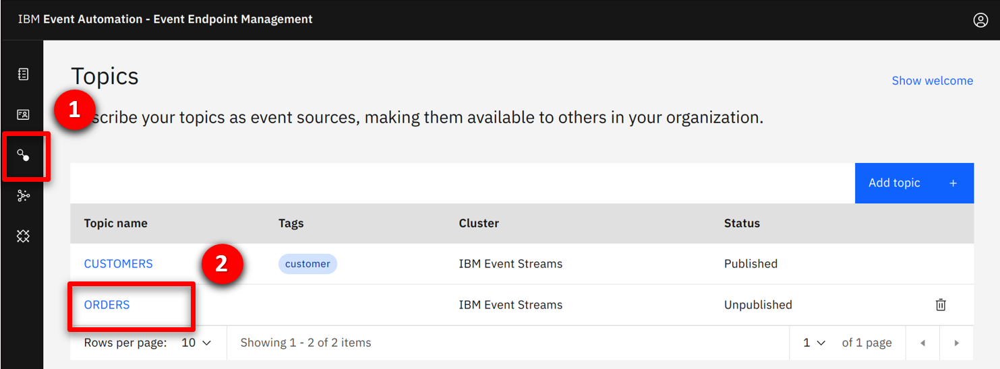 |
| **Action** &nbsp; 1.7.12 | Click on the **Edit information** (1) button.   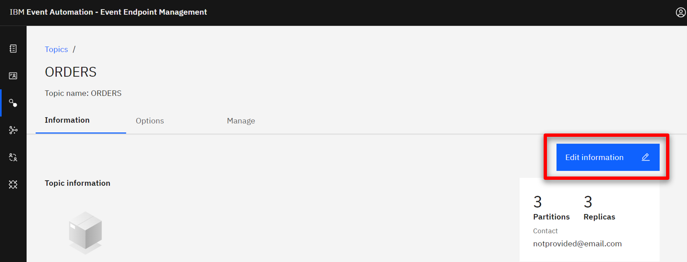 |
| **Action** &nbsp; 1.7.13 | Enter **Events from the Focus Corp order management system. An event will be emitted for every new order that is made.** (1) as the description.   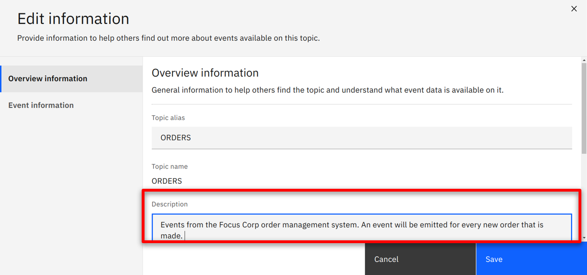 |
| **Action** &nbsp; 1.7.14 | Scroll down and enter **order** (1) as a tag and **orders@focus.corp** (2) as the contact email.   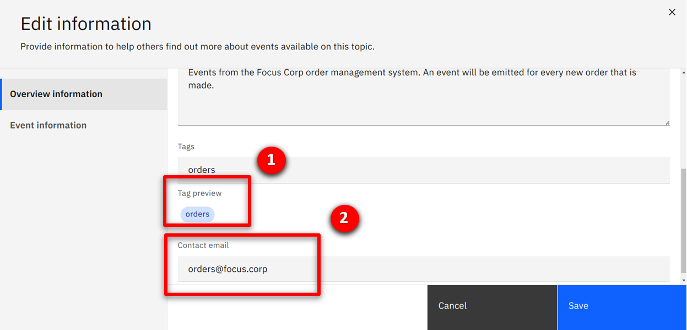 |
| **Action** &nbsp; 1.7.15 | Select the **Event information** tab, scroll down to the sample message text box (2) and copy the content from below, and click **Save** (3).    <inline-code code="{ &nbsp;&nbsp;&quot;quantity&quot;: 9, &nbsp;&nbsp;&quot;price&quot;: 197.09, &nbsp;&nbsp;&quot;customerid&quot;: &quot;a7d1586b-ced1-462f-9e44-14e9e5013540&quot;, &nbsp;&nbsp;&quot;description&quot;: &quot;Composite Oversize 28in Tennis Racket&quot;, &nbsp;&nbsp;&quot;id&quot;: &quot;1eba7af9-b748-4754-b750-3459e589dccf&quot;, &nbsp;&nbsp;&quot;region&quot;: &quot;EMEA&quot;, &nbsp;&nbsp;&quot;ordertime&quot;: &quot;2023-10-24 19:26:04.839&quot;, &nbsp;&nbsp;&quot;customer&quot;: &quot;Reed McKenzie DDS&quot; }"></inline-code>  |
| **Action** &nbsp; 1.7.16 | Select the **Options** (1) tab and click on the **Create Option +** (2) button.   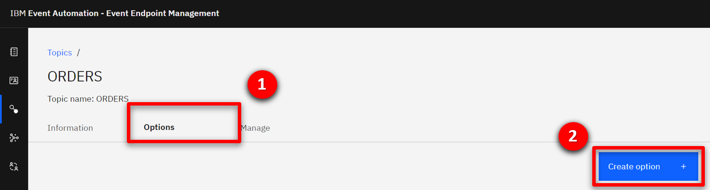 |
| **Action** &nbsp; 1.7.17 | Enter **Order Access** (1) as the option name, **ORDERS** (2) as the alias, **Self-service access to orders event stream** (3) as the description and click **Next** (4).    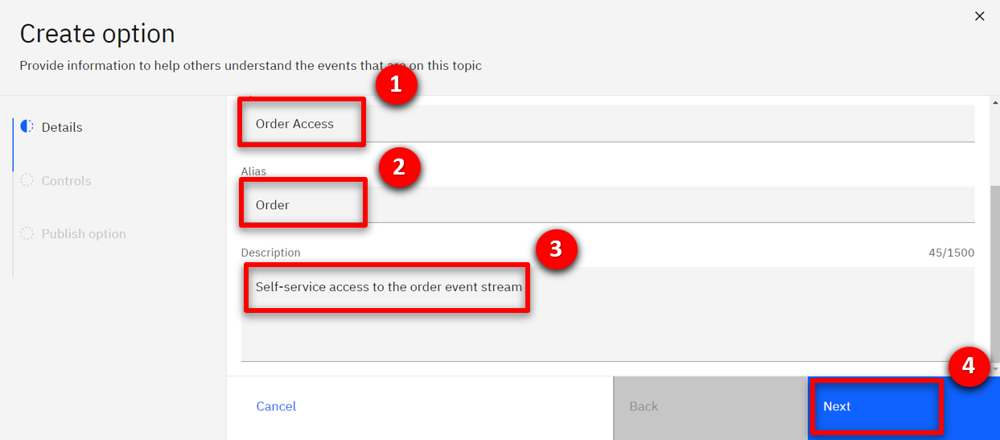 |
| **Action** &nbsp; 1.7.18 | Click **Next**.     |
| **Action** &nbsp; 1.7.19 | Click **Publish**.    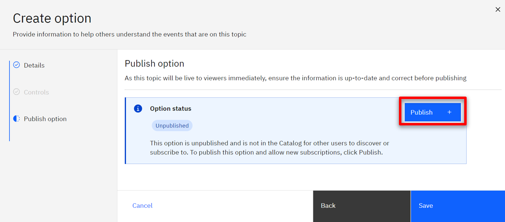 |
| **Action** &nbsp; 1.7.20 | Check the **production** (1) checkbox and click **Save** (2).     |

 

**[Go to top](#place1)**

  



Summary

In this demo we showed how Focus Corp used IBM MQ and IBM Event Automation to capitalize on time-sensitive revenue opportunities. Specifically, we saw the integration team configure IBM MQ to clone messages, and IBM Event Automation set up to publish them to an event stream. This and other streams were published to an Event Catalog that allowed non-technical consumers, like the marketing team, to easily discover and subscribe to the streams. The marketing team then used these streams to build an event processing flow, using a no-code editor. The flow detects in real-time which customers should receive the highest value discounts. This has transformed how quickly the marketing team can create new features and frees them from needing to rely on the integration team for access to this valuable business data.

Thank you for attending today’s presentation.

**[Go to top](#place1)**

  

