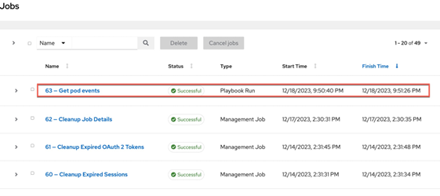

Introduction

In this demo, we’ll see how we can analyze an incoming event in Instana and leverage the new Automation Framework (in Open Beta) to automatically remediate the issue using Red Hat Ansible. 

Our application is a content management app called Quote of the Day (QotD) that delivers personalized content via a mobile and web channel.  Due to a recent sales promotion the application has been receiving an exponential increase in user traffic. A notification has just been received indicating users are beginning to experience slow response times. We need to investigate and resolve the remediation found before additional users are impacted and to avoid a possible outage.

Let’s get started

 

1 - Observing the application health and service interactions

 

| **1.1** | **View golden signals of the Quote of the Day application** |
| :--- | :--- |
| **Narration** | Let’s first observe the golden signals of the application. The golden signals consist of a set of four metrics that offer a wide view of the health of a service from the perspective of the end-user or consumer. The four metrics or signals are: Latency, Traffic, Errors and Saturation.|
| **Action** &nbsp; 1.1.1 | Navigate to **Instana** and click the **Applications** perspective icon.    |
| **Narration** | An Application Perspective (AP) is a power tool for monitoring, alerting, and analysis of a microservice environment. Each Application Perspective auto-generates a feature rich monitoring dashboard for the golden signals. It helps organize teams to stay focused on the services they are interested in. Let’s now drill into the Quote of the Day cloud-native application. |
| **Action** &nbsp; 1.1.2 | Click the **Quote of the Day** application.    |
| **Action** &nbsp; 1.1.3 | Click the **Summary** tab (1). Set the time period to **Last 10 minutes** (2). Click **Live** (3).    |
| **Narration** | By examining the golden signals we can quickly detect any potential problems that might be directly affecting the behavior of the Quote of the Day (QotD) application.   Observe the increase in both the erroneous call rate (1) and the mean service latency (2). Also notice that in the Top Services chart, the qotd-rating service is now at the top of the list (3) |
| **Action** &nbsp; 1.1.4 | Ensure you are on the **Summary** tab. If not, click the **Summary** tab.    |

 

| **1.2** | **Assess service dependencies** |
| :--- | :--- |
| **Narration** | The golden signals provide an aggregate view of all the services in the application. To drill down into more granular detail we should first understand how the services are interconnected. Instana automatically discovers the relationships between the services and correlates them into a application dependency graph. |
| **Action** &nbsp; 1.2.1 | Click the **Dependencies** tab.    |
| **Narration** | We can now see how the requests are moving through the application in real time. Instana captures 100% of all traces that flow through the application and is able to automatically analyze this information to pin-point hot spots in the request flows.   We can quickly tell that there are problems with the application because several services are highlighted in yellow and red. From the service dependency graph we can see that the Rating service is having a performance issue. |

**[Go to top](#place1)**

  

2 - Inspecting the incoming event

 

| **2.1** | **Examine the event details** |
| :--- | :--- |
| **Narration** | Instana determines how the events are related and only generates an alert if the underlying event or group of events could potentially impact end-users. Let’s examine the critical events detected by Instana. |
| **Action** &nbsp; 2.1.1 | Click the **Issues** tab on the Event page.    |
| **Action** &nbsp; 2.1.2 | Click on **Pod containers not ready** event    |
| **Narration** | Each Instana issue contains three components: severity, start times and end times. The chart plots metric values relevant to the problem. The performance issue is still active and needs to be resolved to address the current end-user experience problems. |

**[Go to top](#place1)**

  

3 - Reviewing the event remediation recommendations

 

| **3.1** | **Choose a remediation to execute** |
| :--- | :--- |
| **Narration** | Before we take a look at the specific event remediations, let’s first understand how Instana goes beyond pure observability to enable you take remedial action on an incoming event without ever leaving the Instana environment.    This new incident remediation feature is referred to as the Action Framework. The Action Framework is a collection of capabilities that allow you to define and manage a remediation. The Action Catalog is a central component of the Action Framework that allows you to manage the lifecycle of the remediations. The Action Framework can also interoperate with and leverage external automation platforms like Ansible. The event page lists the details of the event. By leveraging the Action Framework, Instana can automatically fix the issue. The Event Details page is now enriched with a list of potential remedial actions that can be executed directly within Instana to resolve this issue. |
| **Narration** | The 'Recommended Actions' section enumerates an AI-derived list of recommendations, sorted by a confidence score. You can associate any or all of these recommendations to this event by clicking the “+” icon. <inline-notification text="Since this is a read-only environment we will not be adding this recommendation to the list of actions in the event. "></inline-notification> The confidence score is derived based on several factors, such as the action definitions, tags, and the meta data from the event. The confidence score attempts to approximate the likelihood that the action will fix this event. The Action Type indicates that the remediation is contained in an Ansible playbook.  We will next select a remediation to resolve the current active event.|
| **Action** &nbsp; 3.1.1 | Review the **Recommended Actions** section.    |
| **Action** &nbsp; 2.1.2 | Click on **Pod containers not ready** event    |
| **Narration** | Each Instana issue contains three components: severity, start times and end times. The chart plots metric values relevant to the problem. The performance issue is still active and needs to be resolved to address the current end-user experience problems. |

**[Go to top](#place1)**

  

3 - Reviewing the event remediation recommendations

 

| **3.1** | **Choose a remediation to execute** |
| :--- | :--- |
| **Narration** | Before we take a look at the specific event remediations, let’s first understand how Instana goes beyond pure observability to enable you take remedial action on an incoming event without ever leaving the Instana environment.    This new incident remediation feature is referred to as the Action Framework. The Action Framework is a collection of capabilities that allow you to define and manage a remediation. The Action Catalog is a central component of the Action Framework that allows you to manage the lifecycle of the remediations. The Action Framework can also interoperate with and leverage external automation platforms like Ansible. The event page lists the details of the event. By leveraging the Action Framework, Instana can automatically fix the issue. The Event Details page is now enriched with a list of potential remedial actions that can be executed directly within Instana to resolve this issue. | 
| **Narration** | The 'Recommended Actions' section enumerates an AI-derived list of recommendations, sorted by a confidence score. You can associate any or all of these recommendations to this event by clicking the “+” icon. <inline-notification text="Since this is a read-only environment we will not be adding this recommendation to the list of actions in the event. "></inline-notification>
The confidence score is derived based on several factors, such as the action definitions, tags, and the meta data from the event. The confidence score attempts to approximate the likelihood that the action will fix this event. The Action Type indicates that the remediation is contained in an Ansible playbook.  We will next select a remediation to resolve the current active event. |
| **Action** &nbsp; 3.1.1 | Review the **Recommended Actions** section.    |

 

| **3.2** | **Choose a remediation to execute** |
| :--- | :--- |
| **Narration** | The 'Associated Actions' section is new and provided by the Automation Framework. When an event is raised, the pre-configured potential remediations also are attached and available in-context to accelerate the Mean Time to Fix (MMTF). We have the option to add additional actions or remove actions if they are no longer relevant to the event. These actions will be persisted with this event. Any future occurrence of this event will then carry these newly configured remediations. |
| **Action** &nbsp; 3.2.1 | View the **Associated Actions** tab (1). Select **Get pod events**. Click **Run** (2).    |
| **Narration** | Actions are executed on target nodes or agents. Let’s specify the Instana agent and host on which this action should be executed. |
| **Action** &nbsp; 3.2.2 | Set **Hosts Limit** (1) and **Target Agent** (2) with the values shown. Click **Run action** (3).    |
| **Action** &nbsp; 3.2.3 | Click **OK**    |
| **Narration** | The remediation is now kicked off. Instana will connect with Ansible Tower to initiate the execution of the Ansible playbook. While the playbook is executing, let’s dive deeper into the Instana-Ansible integration. |

**[Go to top](#place1)**

  

4 - Understanding the execution steps of the remediation

 

| **4.1** | **Explore the Instana Action Framework** |
| :--- | :--- |
| **Narration** | The Instana Action Framework bridges the integration between Instana and the Ansible automation platform. You can use this framework to create and manage user-defined automation actions natively in Instana or leverage any automations already defined in Ansible to automatically remediate incoming events. |
| **Action** &nbsp; 4.1.1 | Click **Automation** in the navigation menu.    |
| **Narration** | The Action Catalog is a key component of the Action Framework. It serves as a repository of all the known remediations, also called Actions. You can use the Action Catalog to create new Actions or view existing remediations from third party automation providers such as Ansible.  Let’s browse the remediations currently configured in the Action Catalog. |
| **Action** &nbsp; 4.1.2 | Click the **Automation -> Action Catalog** tab.    |
| **Narration** | Notice the action framework supports three types of actions: a Documentation Link action, a Script action and an HTTP action.
    Let’s understand each of these actions:    • *Documentation Link* action: provides access to the relevant documentation to diagnose or remediate a known issue directly from the event context.   • *Script* action: an automation script that can run on your agent using a Script Action Sensor that is part of the Automation Framework   • *HTTP* action: Specifies HTTP calls to invoke webhooks or other REST APIs on your agent by using the new HTTP action sensor.    The Instana-Action Framework synchronizes with the Red Hat Ansible Automation Platform (RHAAP) and imports the pre-defined Ansible playbooks. The ingested Ansible playbooks are categorized in the Instana Action Catalog as Ansible actions to denote that they actually exist in RHAAP.   Let’s examine a sample remediation. |
| **Action** &nbsp; 4.1.3 | Point out the Ansible action **Resolve Rating Latency**    |
| **Narration** | Ansible playbooks are configured in the enterprise-wide Red Hat Ansible Automation Platform (RHAAP). Automation Controller is the command-and-control center for RHAAP. It serves as a central location to configure and manage how automation runs across your enterprise infrastructure. In this demo you may optionally explore all the Ansible playbooks in RHAAP. |

**[Go to top](#place1)**

  

5 - Validating the proper execution of the remediation action

 

| **5.1** | **Check the execution status of the remediation flow** |
| :--- | :--- |
| **Narration** | Now that we have a better idea about how the Instana-Ansible integration works, let’s go back and check the execution status of the remediation we ran earlier. We need to remediate the active event that was generated by the health issue of the Rating service. |
| **Action** &nbsp; 5.1.1 | Select the **Action History** tab link and then select the **Get Pod events** remediation.    |
| **Narration** | Notice the 'Start Time' and 'End Time' indicating that the remediation has completed. The 'Status' field on the far left validates the successful completion of the remediation.  |
| **Action** &nbsp; 5.1.2 | Click the event to get more details. Click the **View Log** link.    |
| **Narration** | Each action has at least two log entries – the 'Start' and 'Stop' entries. The log output displays the steps of the script execution to help track the execution progress of the remediation. |
| **Action** &nbsp; 5.1.3 | Click the **End running action** log entry (1).    Ensure that the overall status of the Ansible playbook was successful. Also verify the Host it was executed on and the underlying reason of the failure. |

 

| **5.2** | **Monitor the status of the Ansible playbook execution** |
| :--- | :--- |
| **Narration** | To end the demo, we will check the status of the playbook execution in Ansible. Note that the SRE does not really need to go to Ansible at all. They can stay within Instana to perform all the remediation work. However, if there are failures it helps to understand the state of Ansible and ensure that the connectivity between Instana and Ansible is properly synchronized. |
| **Action** &nbsp; 5.2.1 | On the Ansible console tab, click **Jobs** (1). Look for **list-cpu-processes** (2).       |

**[Go to top](#place1)**

  

Summary

In this demo we showed how the new Automation Framework elevates Instana beyond just an observability tool that does rapid root cause analysis, to also include incident resolution. The Instana-Ansible integration enables IT Ops teams to automatically execute remedial actions in a timely manner, right from within Instana without having to hop across other automation tools. This feature accelerates the time to fix an incident and drastically reduces down time.

Thank you for attending today’s presentation.

**[Go to top](#place1)**

  

