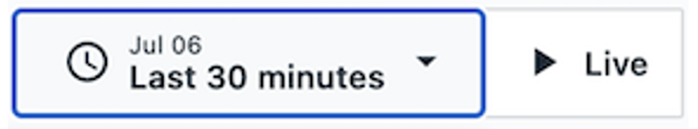
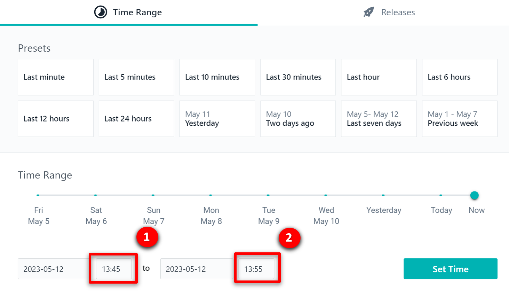

| **DEMO OVERVIEW** | | 
| :---         | :--- |
| **Scenario overview** | {{ page.overview }} |
| **Demo products** | {{ page.product }} |
| **Demo capabilities** | {{ page.capabilities }} |
| **Demo intro slides** | Download the Introduction and Overview slides <a href="{{ page.boxIntroPresentationUrl }}" target="_blank" rel="noreferrer">here</a>. This is a short deck of customer-facing slides that sets the context for the demo. |
| **Demo script** | A complete demo script is on the second tab above. You can download a printer-ready PDF of the demo script <a href="{{ page.boxPdfScript }}" target="_blank" rel="noreferrer">here</a>.   This demo script has multiple tasks that each have multiple steps. In each step, you have the details about what you need to do (**Actions**), what you can say while delivering this demo step (**Narration**), and what diagrams and screenshots you will see.  This demo script is a suggestion, and you are welcome to customize based in your sales opportunity. Most importantly, practice this demo in advance. If the demo seems easy for you to execute, the customer will focus on the content. If it seems difficult for you to execute, the customer will focus on your delivery. |
| **Required versions** | Instana 3.248 |
| **How to get support** | • Open a support case at <a href="https://techzone.ibm.com/help" target="_blank" rel="noreferrer">IBM Technology Zone Help</a> regarding issues with reserving and provisioning Tech Zone environments. • Contact <a href="https://ibm-cloud.slack.com/archives/C0216F39ACU" target="_blank" rel="noreferrer">#platinumdemos-automation-support</a> regarding issues with setting up and running this demo. |

### **PREPARE TO GIVE THE DEMO**

<inline-notification text="Business partners will need to request access to the environment. See <strong>2 - Business partners requisition instructions</strong> below. Allow up to two business days to receive access."></inline-notification>

1 - Environment setup 

Log in to the demo environment:  
•	For IBMers, click <a href="https://ibmdemo-instanaibm.instana.io" target="_blank" rel="noreferrer">here</a>.  
•	For business partners, click <a href="https://demo-partner.instana.io/" target="_blank" rel="noreferrer">here</a>.
 
<inline-notification text="If IBMers have difficulties accessing the environment please reach out to bstern@us.ibm.com who will provide access."></inline-notification>

Since you will be demonstrating using a past incident, you will need to set the time period.

1. In the upper right, click the button showing the timeframe.   

2. At the bottom of the pop-up, set the timeframe to begin at **45 minutes past the hour** and end at **55 minutes past the hour** (1). It doesn’t matter which hour you pick. Click **Set Time** (2).  <inline-notification text="This will ensure you see normal behavior for the application. During the demo you will change the time window to observe a failure occurring."></inline-notification> 

**[Go to top](#top)**

  

2 - Business partners requisition instructions

To request access to the <a href="https://demo-partner.instana.io/" target="_blank" rel="noreferrer">demo environment</a>, email <a href="mailto:timothy.burke@instana.com">Tim Burke</a>. The turnaround time for requests is two business days.

**[Go to top](#top)**

***

Click [here](demo-script) to go to the **Demo script** on the next tab.
