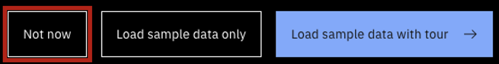

**Please bookmark this page. The demo environment URLs will change with each version update.**

There are currently 3 demo environments:
- Read-only environment in SVL (US West Coast)
- Read-only environment in RTP (US East Coast)
- Reservable environment for demos that require read/write access

### Read-only environments include:
- A complete sample dataset
- watsonx connectivity
- Concert Workflows connectivity
- Connected OpenShift environment
- GitHub ticketing
- Automation rules
- Pre-built workflows
- AI-Powered Remediation with Concert Workflows (public preview)   *Note: AI-Powered Remediation is in public preview and is currently only trained on actions that involve cloud providers (e.g., AWS, Azure, GCP, IBM Cloud).*

Important notes about the demo environment:
- **Purpose**: This environment is only for demos and self-education. It should not be used for PoCs.
- **Workflows**: You are free to create your own workflows in this environment, but please only put them in the 'Workflows sandbox' folder. Because this is a shared environment, workflows in any other location will be deleted.
- **Ticketing**: This environment is connected to GitHub. While we ask you to not make other changes to the environment, creating tickets is permitted.   - To create tickets, use the *ibm-concert-platinum-demos* organization and *concert-tickets* repository.
- **Shared environment**: This is a shared environment. Please DO NOT import data or create automation rules.
- **Sample data**: The environment contains a complete set of sample data. If you open the tour, DO NOT load the default sample data (click  <strong>Not now</strong>).     

<inline-notification text="In order to access the demo environment, you MUST be logged into the IBM VPN."></inline-notification>

Credentials:
- Username: concertuser
- Password: password

<a href="https://9.30.57.104:12443/" target="_blank" rel="noreferrer"><button class="ibm-button">Click here for Concert v2.0.0.1 SVL read-only environment (US West Coast)</button></a>

<a href="https://9.46.81.132:12443/" target="_blank" rel="noreferrer"><button class="ibm-button">Click here for Concert v2.0.0.1 RTP read-only environment (US East Coast)</button></a>

 

### Reservable environment for auto-x demos (read/write access)

Important notes about the demo environment:
- Demo is reservable in specific 4-hour time slots. **It is important to honor your timeslot exactly, as not doing so will disrupt other demoers and opportunities.**
- Time slots can be used for client demos or self-education and practice. **Note: Because this environment will be used worldwide, all times will be in UTC.**
- It is permissable to sign up for two adjacent time slots only when needed for a client demo.
- If you want to negotiate with another IBMer for a time slot, please contact them directly.
- For each time slot, please indicate client demo, practice for client demo, or self-education.
- For client demos, please indicate client name when you sign up. After you give the demo, please provide a few comments about how the demo went.
- The demo environment automatically resets in the last ten minutes of every 4-hour slot.
    - If you sign up for two adjacent slots, you can cancel the automatic reset by following the directions in each demo script. 
    - If you want to manually run the automatic reset, you can do so by following the directions in each demo script.

Demo scripts that use the reservable demo environment:
- <a href="https://ibm.box.com/s/ki9izsl0cmwwzzw85ji4b5lab617i2c8" target="_blank" rel="noreferrer">OS CVE auto-remediation demo instructions</a>
- <a href="https://ibm.box.com/s/107q1h22x95dv3gxyvufika8fel5lre5" target="_blank" rel="noreferrer">Image CVE auto-discovery demo instructions</a>
- <a href="https://ibm.box.com/s/sgxspj8k4jt13o8owku5rs0fpfuqc7kj" target="_blank" rel="noreferrer">Auto-resilience demo instructions</a>

<a href="https://ibm.box.com/s/ibtdcuf9t4bug4znvtjv0ryppe1vmtft" target="_blank" rel="noreferrer"><button class="ibm-button">Click here for the Concert v2.0.0.1 reservable demo environment sign-up page</button></a>