

Click the [**Demo preparation**](demo-preparation) tab for setup instructions.

Introduction

Today we will see how IBM Concert can help organizations efficiently manage and track their certificates across various applications. In today's digital landscape, certificates play a crucial role in securing data, authenticating services, and ensuring the integrity of communications. However, managing numerous certificates can be challenging, especially as they come with expiration dates and renewal requirements. 

In this demo, we’ll walk through the key features and demonstrate how IBM Concert can streamline certificate management, offering a clear view of all the certificates tied to your applications.  

Let's get started.

 

<strong>1 - Operation dashboard</strong>: An overview of certificate status 

 

| **1.1** | **Placeholder** |
| :--- | :--- |
| **Narration** | Focus Financials DevOps team oversees applications deployed across multiple environments. These applications span multiple regions, use third party services, and have many microservices. This increases the resources needed to track and manage SSL and TLS certificates and their expiry date. Concert helps the DevOps team track certificates more effectively. |
| **Action** &nbsp; 1.1.1 | Show the **Home** page, which you opened during demo preparation. Select the **Operation** dimension.   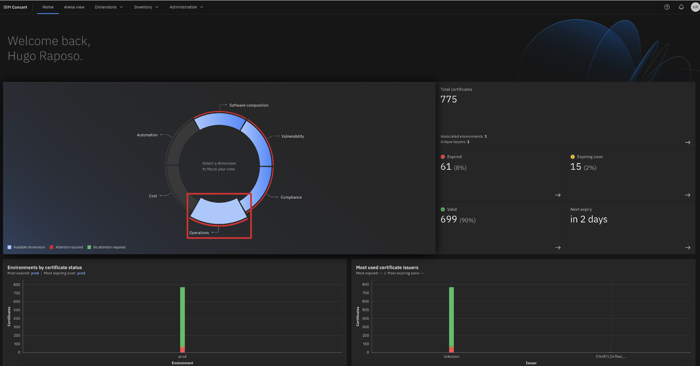 |
| **Narration** | The operations dashboard provides the DevOps team with a quick and comprehensive overview, allowing them to monitor the status of their certificates in real time. It highlights key details like upcoming expirations and expired certificates. By having this information readily available, the DevOps team can proactively address certificate-related problems, ensuring faster resolution of security concerns and minimizing downtime caused by expired certificates. |
| **Action** &nbsp; 1.1.2 | Click **Arena view**.   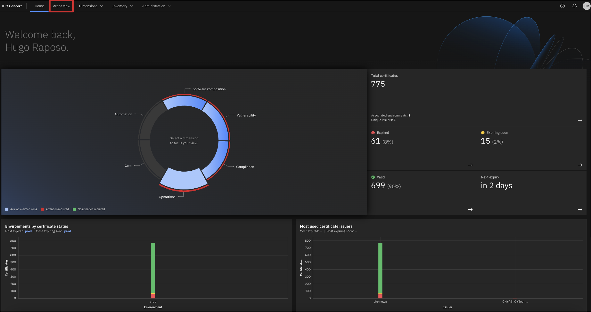 |
| **Action** &nbsp; 1.1.3 | Click the **Expired certificates** switch.   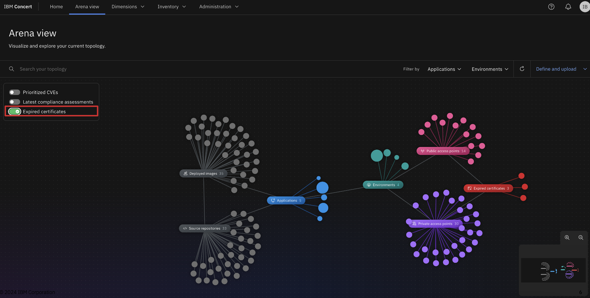 |
| **Narration** | The DevOps team sees a summary of expired certificates which are related to their application environment. The red circles represent the expired certificates. |
| **Action** &nbsp; 1.1.4 | Right click on a expired certificate and select **Search for relationships**   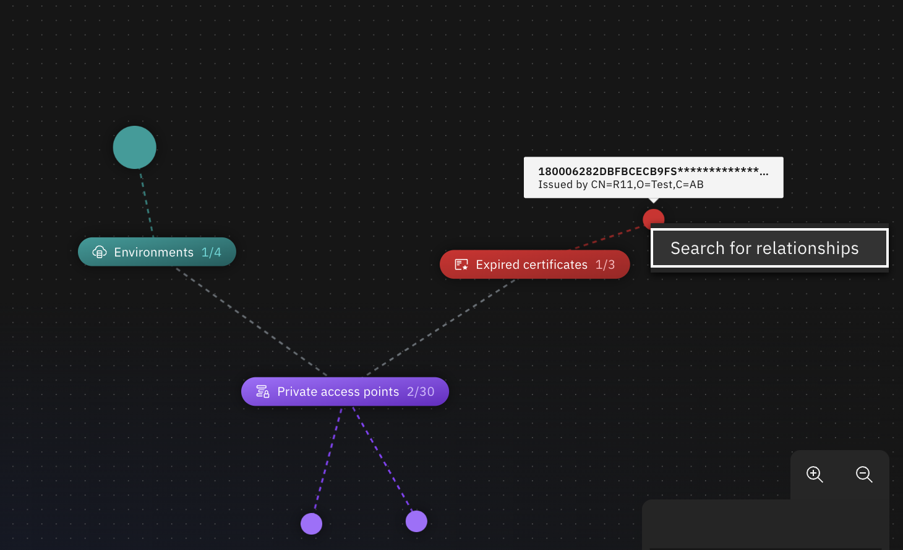 |
| **Narration** | By having this relationship view at their fingertips, DevOps teams can more easily assess the criticality of an expired certificate and understand its potential impact. This feature is particularly valuable for diagnosing issues, as it helps identify which parts of the system or services might be affected, enabling quicker decision-making and more effective mitigation strategies.   |

**[Go to top](#top)**

  

<strong>2 - Certificate details</strong>: Viewing a summary of certificates in the Operations View 

 

| **2.1** | **Placeholder** |
| :--- | :--- |
| **Narration** | Focus Financials tracks 23,000 TLS and SSL certificates across their organization. On the Operations page, the DevOps team is presented with a tabular view of all certificates across their application environments. This table provides an in-depth look into the key details of each certificate, helping them too easily manage and monitor their certificate inventory. |
| **Action** &nbsp; 2.1.1 | Click **Dimensions** (1) and select **Operations** (2).   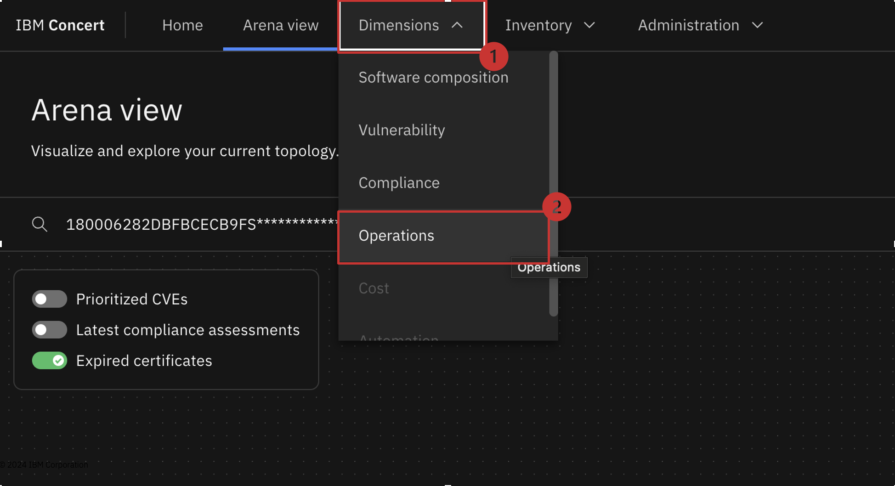   The following **Operations** page will appear   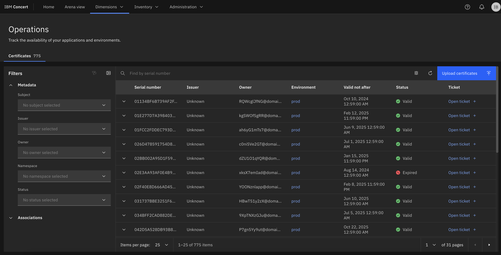 |
| **Narration** | On the **Operations page**, the DevOps team is presented with a tabular view of all certificates across their application environments. This table provides an in-depth look into the key details of each certificate, helping them too easily manage and monitor their certificate inventory.   The table includes the following columns:   **Serial Number**: A unique identifier that each certificate is generated with.   **Issuer**: The company or product that issued the certificate.   **Owner**: The email address associated with the certificate’s generation.   **Environment**: The specific environment where the certificate is deployed, such as production, staging, or development.   **Valid Not After**: The expiration date of the certificate, indicating when it will no longer be valid.   **Status**: Displays whether the certificate is currently Valid or Expired, helping users quickly identify potential issues.   **Ticket**: Provides the option to open a ticket directly from the table for any expiring or expired certificates. We’ll dive into this feature in more detail later in this demo.  |
| **Action** &nbsp; 2.1.2 | Apply filter for Issuer **CN=R11,O=Test,C=AB**, Status **Expired** and Environment **prod**   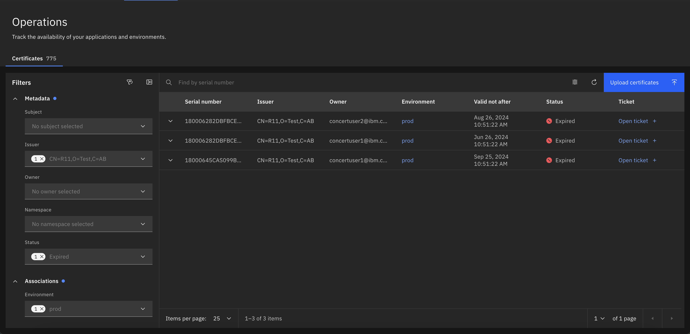 |
| **Narration** | The Operations page also includes a Filter feature, enabling the DevOps team to narrow down and view specific categories of certificates. This makes it easier to manage and focus on particular sets of certificates based on criteria like status, issuer, or environment. |
| **Action** &nbsp; 2.1.4 | Expand one of the table rows to reveal associated access points.   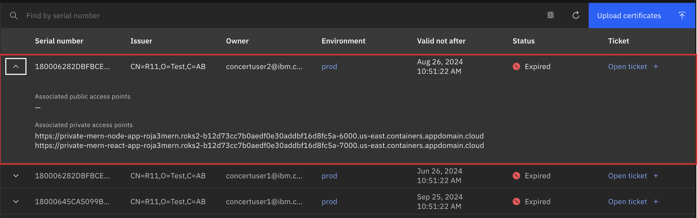 |
| **Narration** | By expanding the row for a certificate, additional information is revealed, such as the associated public or private access points. This extra layer of detail is particularly helpful for the DevOps team who may be troubleshooting the impact of an expired certificate. With this information, the DevOps team can quickly identify which access points might be affected, allowing them to assess the scope of the issue and take appropriate action within their environment. |

**[Go to top](#top)**

  

<strong>3 - Environments View</strong>: Viewing a summary of certificates based on environments

 

| **3.1** | **Placeholder** |
| :--- | :--- |
| **Action** &nbsp; 2.1.1 | Click **Inventory** (1) and select **Environments** (2).   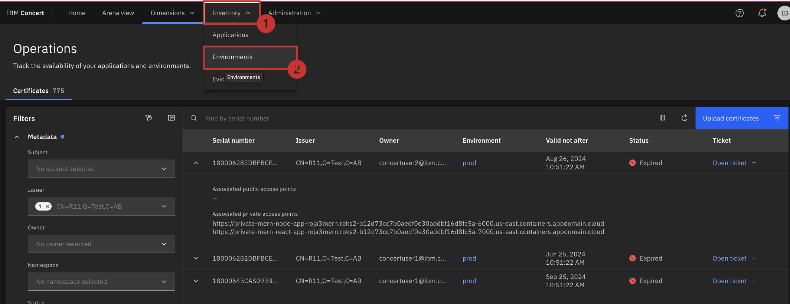   The following **Environments** page will appear   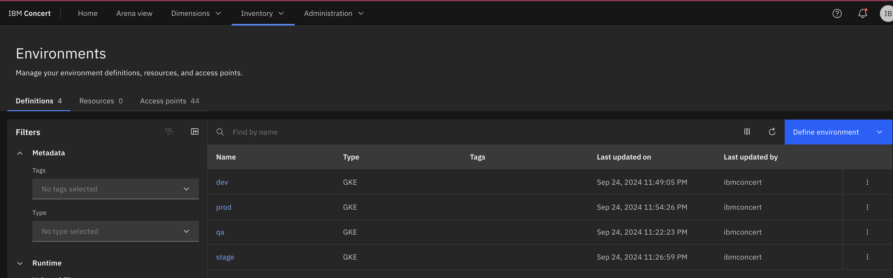   Click on one of the **Environment** names    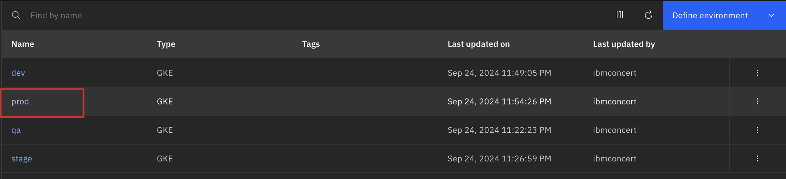 |
| **Action** &nbsp; 3.1.1 | Select the **Certificates** tab.   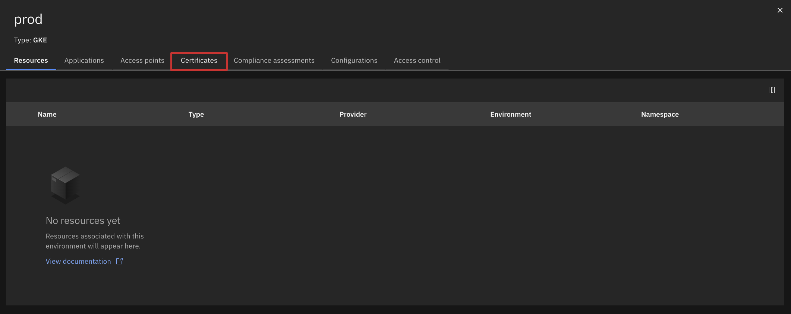   The following **Certificates** page will appear   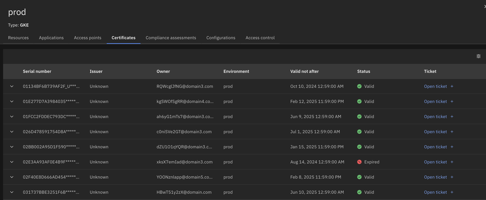 |
| **Narration** | This Certificates tab displays the same data table from the Operations page, but filtered to show certificates specific to the selected environment. By providing this focused view, the DevOps team can easily see certificate details relevant to a particular environment. This ensures that they have a clear overview of all aspects of their application environment, making it easier to manage and maintain security and uptime.|

**[Go to top](#top)**

  

<strong>4 - Ticketing</strong>: Opening a ticket for an expired certificate manually

 

| **4.1** | **Placeholder** |
| :--- | :--- |
| **Action** &nbsp; 4.1.1 | While on the environment view, click on Open Ticket.   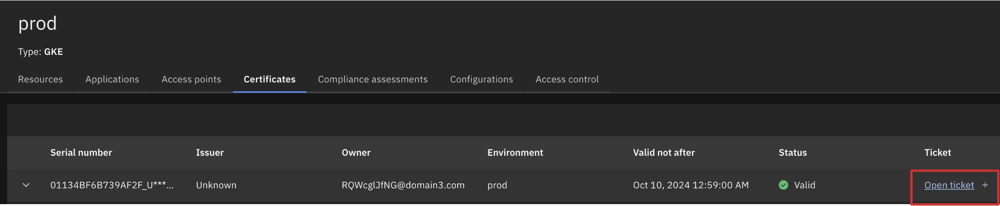   The following **Open a ticket** page will appear   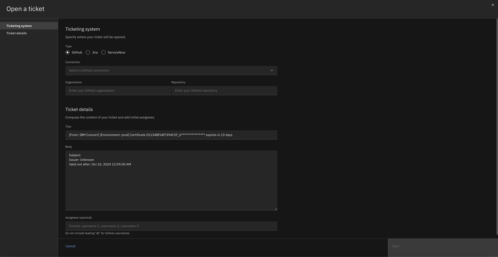 |
| **Narration** | From any of the table views displaying certificate data, the DevOps team has the option to open a ticket directly. By clicking the Open a Ticket button, a pop-up window appears, allowing the customer to configure the details of the ticket before submitting it. This feature ensures that the DevOps team can quickly and easily raise tickets for expiring or expired certificates, streamlining the resolution process.   The configuration options include:   **Type**: Select the type of ticketing system to raise the ticket against.   **Connection**: Choose a pre-configured connection to the relevant ticketing system.   **Ticket Title**: This field is automatically populated with a title containing details of the certificate, but the customer can rename it if desired.   **Ticket Details**: A detailed description of the certificate is also pre-populated here, though the customer can modify it to include any additional information.   **Assignee**: Select who to assign the ticket to within the ticketing system.  |

**[Go to top](#top)**

  

<strong>5 - Ticketing</strong>: Opening a ticket for an expired certificate automatically

 

| **5.1** | **Audit changes** |
| :--- | :--- |
| **Action** &nbsp; 5.1.1 | Click **Administration** (1) and select **Integrations** (2).   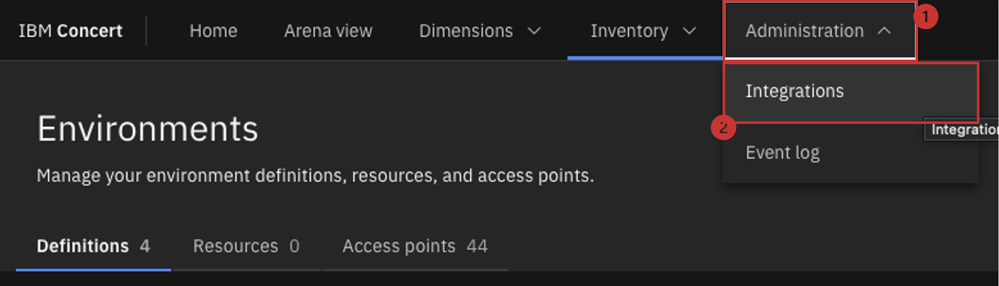    The following **Integrations** screen will appear:   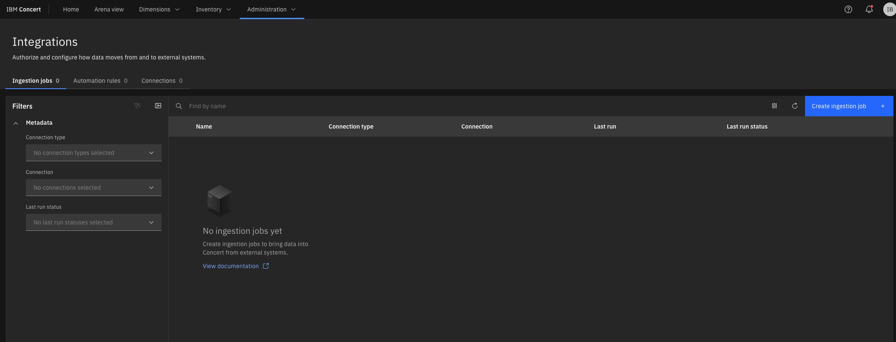    Click on the **Automation rules** tab.     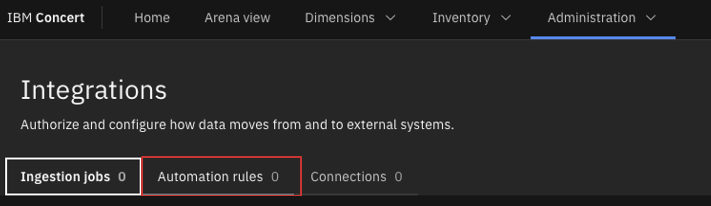    Then click on the Blue **Create Automation Rule** button. |
| **Action** &nbsp; 5.1.2 | Fill in the name and details for a new automation rule. Then change the **When this condition occurs** dropwdown to Certificate expiry. Click the create button   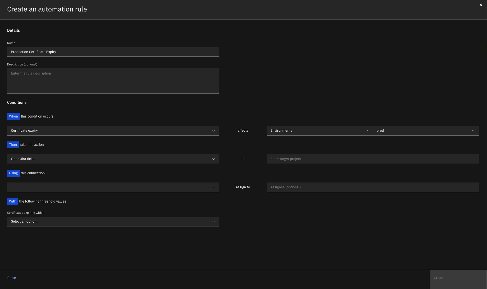 |
| **Narration** | One of the most valuable features of IBM Concert for the DevOps team, in terms of Certificates, is the ability to create automation rules that automatically raise tickets for certificates approaching expiration. These rules can be configured with specific conditions, such as the environments affected by the certificate’s expiry and the number of days before expiration that should trigger the rule. This proactive approach allows the DevOps team to address expiring certificates in advance, ensuring they are renewed before they expire. By automating this process, customers can significantly reduce downtime and avoid potential disruptions across their environments.  |

**[Go to top](#top)**

  

Summary

We’ve shown how Concert seamlessly integrates certificate management allowing DevOps teams to track upcoming expirations. This helps to avoid costly security incidents or outages.

**[Go to top](#top)**

  

