

Click the [**Demo preparation**](demo-preparation) tab for setup instructions.

Introduction

Today, we’ll dive into how IBM Concert supports compliance managers in streamlining application compliance tracking and ensuring alignment with evolving standards. We'll explore how Concert integrates compliance monitoring seamlessly throughout the application lifecycle.

By continuously evaluating applications, Concert offers prioritized recommendations to maintain compliance with regulatory requirements. It also automates the collection of evidence, making it easier to demonstrate compliance during audits.

Let’s begin.

 

<strong>1 - Compliance dashboard</strong>: An overview of compliance assessments

 

| **1.1** | **Placeholder** |
| :--- | :--- |
| **Narration** |  As the application portfolio has expanded at Focus Financial, so has its complexity. The compliance manager oversees these applications distributed across various environments. These applications operate across multiple servers and cloud platforms, increasing both the resources needed for compliance tracking and the risk of non-compliance. IBM Concert helps the compliance manager manage these challenges more efficiently and maintain adherence to regulatory standards. |
| **Action** &nbsp; 1.1.1 | Show the **Home** page, which you opened during demo preparation. Select the **Compliance** dimension.   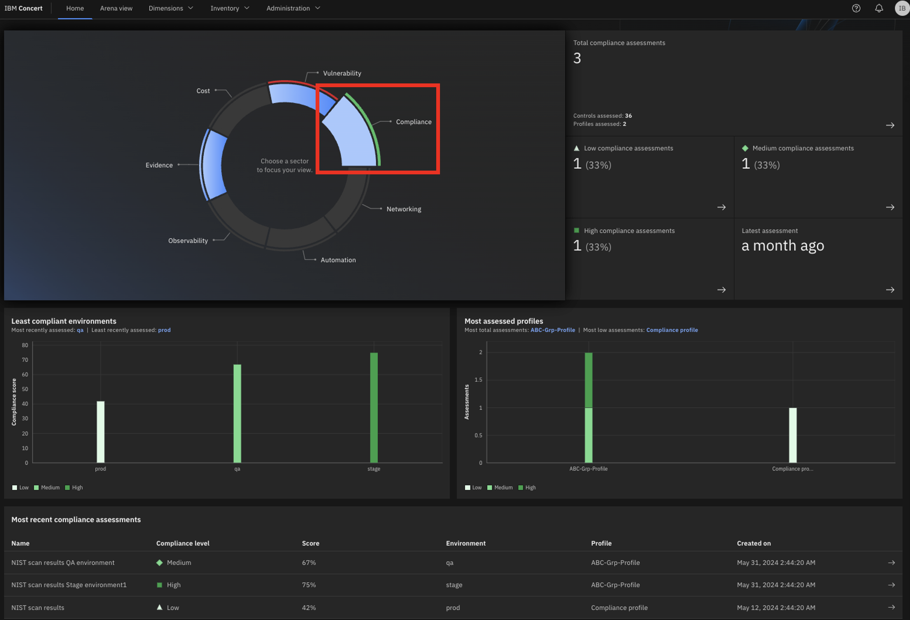 |
| **Narration** | The compliance manager ensures that all applications meet regulatory requirements. IBM Concert simplifies this process by embedding compliance management into the application lifecycle, streamlining assessments across all applications and speeding up issue tracking. When deviations are found, Concert prioritizes them, enabling the compliance team to resolve issues efficiently.   Upon logging into Concert, the compliance manager gains a comprehensive overview of the organization’s compliance posture. This unified dashboard displays compliance assessments alongside the corresponding application environments. |
| **Action** &nbsp; 1.1.2 | Click **Arena view**.    |
| **Action** &nbsp; 1.1.3 | Click the **Latest compliance assessments** switch.   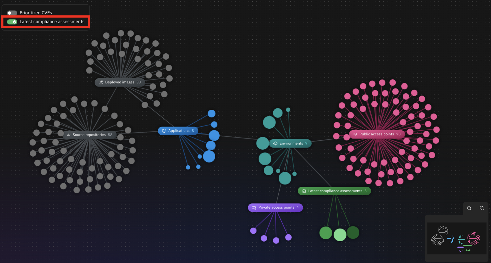 |
| **Narration** | The compliance manager views a summary of assessments across all application environments. Lighter green circles indicate environments with lower compliance scores, while darker green circles represent those with higher compliance ratings. |

**[Go to top](#top)**

  

<strong>2 - Compliance requirements</strong>: Uploading catalogs

 

| **2.1** | **Placeholder** |
| :--- | :--- |
| **Narration** | Focus Financial adopted the NIST SP 800-53 framework as the foundation for their security compliance practices. While this framework is mandatory for U.S. federal agencies and contractors to protect critical data, private organizations like Focus Financial can also implement it.   NIST SP 800-53 provides a comprehensive catalog of security and privacy controls related to information systems. These controls ensure that applications and their environments comply with established policies. For instance, the 'least privilege' control mandates that system access is restricted to the minimum levels necessary for business functions. |
| **Action** &nbsp; 2.1.1 | Click **Dimensions** (1) and select **Compliance** (2).   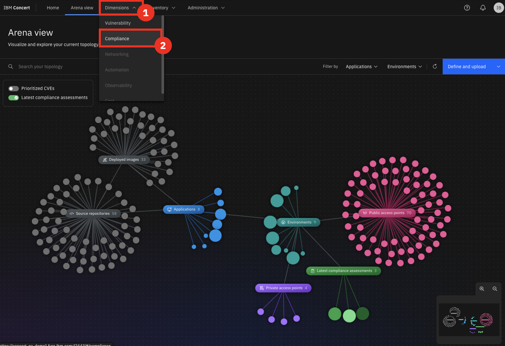 |
| **Action** &nbsp; 2.1.2 | Click the **Catalogs** tab.   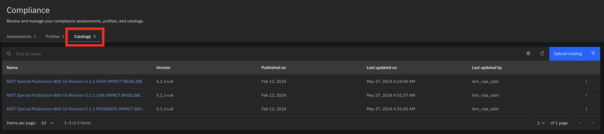 |
| **Narration** | Concert handles compliance catalogs within the Compliance dimension, with NIST SP 800-53 preloaded into the platform. NIST and other compliance standards utilize the OSCAL (Open Security Controls Assessment Language) format.   Examples of other standards available within IBM Concert are:   **FedRAMP** (Federal Risk and Authorization Management Program)   **PCI-DSS** (Payment Card Industry Data Security Standard)   **SOC 2** (Service Operation Control Type 2)   **CMS ARS** (CMS Acceptable Risk Safeguards)   The compliance manager reviews and manages Concert’s catalog list. NIST security control baselines—low, moderate, and high—correspond to varying levels of security requirements based on the potential impact of a security breach. These baselines are outlined in the NIST standard and categorize the necessary security controls to safeguard information and systems. The compliance manager must select the baseline that aligns with the sensitivity and importance of their systems. For instance, the high baseline is intended for systems where a breach could cause severe or catastrophic harm, while the low baseline applies to systems with minimal adverse impacts.  The compliance manager can also add any compliance catalog standard to Concert that adheres to the OSCAL format. |
| **Action** &nbsp; 2.1.3 | Click **Upload catalog**.       The following **Upload catalog** screen will appear:    |
| **Narration** | Since the NIST SP 800-53 catalogs come preloaded into Concert, the compliance manager does not need to import any additional catalogs at this time. |
| **Action** &nbsp; 2.1.4 | Click **Cancel**.   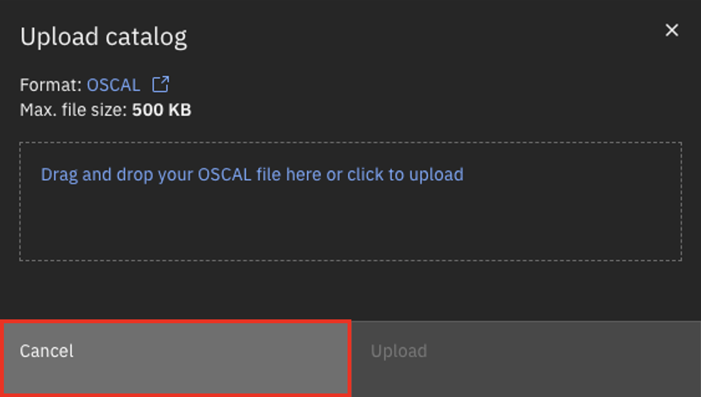 |
| **Action** &nbsp; 2.1.5 | Click the first catalog.   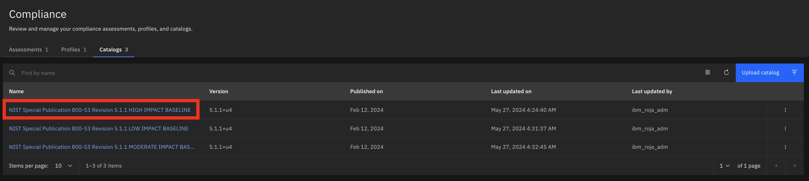    The following screen will appear:    |
| **Narration** | For each catalog, the compliance manager views the compliance controls. |
| **Action** &nbsp; 2.1.6 | Click to open the first control.    |
| **Narration** | Concert provides detailed information for each control, including descriptions of what is required to meet compliance. However, the compliance manager may need additional context to fully understand how these requirements apply to the target environment. |
| **Action** &nbsp; 2.1.7 | Click the **AI** icon.   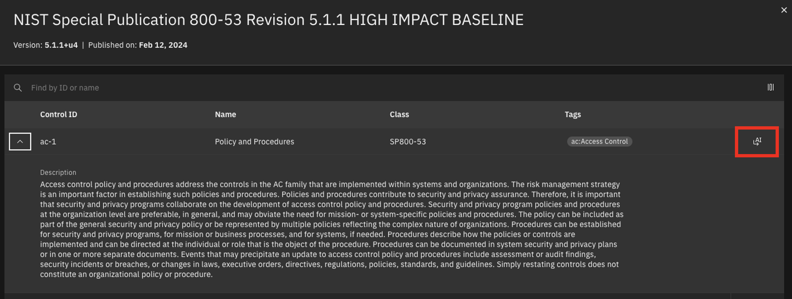 |
| **Action** &nbsp; 2.1.8 | Type '**How does ac-1 impact my kubernetes cluster?**' into the chatbot.   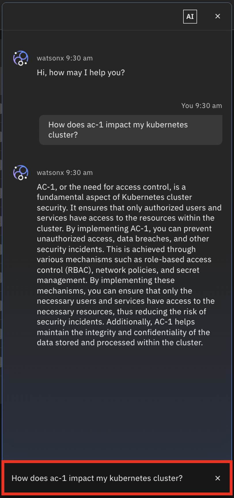 |
| **Narration** | Concert features an interactive chatbot that uses generative AI to facilitate in-depth discussions about compliance controls. This tool allows compliance managers to engage in natural language conversations, making it easier to explore specific compliance requirements and how they relate to the target environment. The chatbot is powered by IBM’s Granite language model, which is pre-trained for dynamic interactions on compliance topics.    IBM Concert also offers specific guidance related to these controls. This includes recommendations for enhancing role-based access controls and implementing strict network policies to limit interactions between services. By combining AI-driven dialogue with practical insights, Concert empowers compliance managers to navigate complex regulatory landscapes more efficiently. |
| **Action** &nbsp; 2.1.9 | Click **X** to close the chatbot window.    |
| **Action** &nbsp; 2.1.10 | Click **X** to close the catalog.    |

**[Go to top](#top)**

  

<strong>3 - Compliance</strong>: Tuning compliance requirements with profiles

 

| **3.1** | **Placeholder** |
| :--- | :--- |
| **Narration** | A compliance profile consists of a tailored set of security controls designed to meet the unique security requirements of an organization, taking into account their specific environments and the potential consequences of a security breach. By categorizing control baselines from compliance catalogs into profiles, Focus Corp can address their individual compliance needs more effectively.   These profiles not only help in satisfying regulatory obligations but also enhance the protection of their data and systems against potential threats and vulnerabilities. This customized approach allows organizations to prioritize their compliance efforts based on risk assessments, ensuring a more robust security posture. |
| **Action** &nbsp; 3.1.1 | Select the **Profiles** tab.   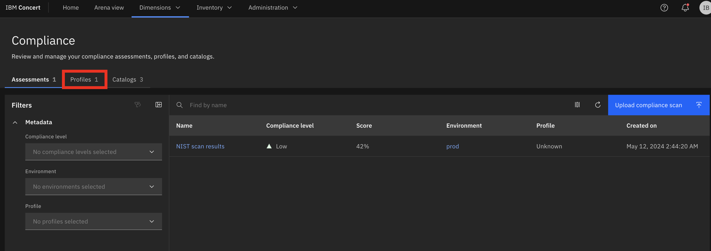 |
| **Narration** | When a profile is selected, the compliance manager views its controls. |
| **Action** &nbsp; 3.1.2 | Click **Compliance profile**.   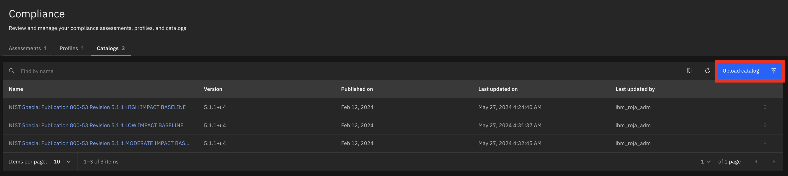    The following **Compliance profile** screen will appear:   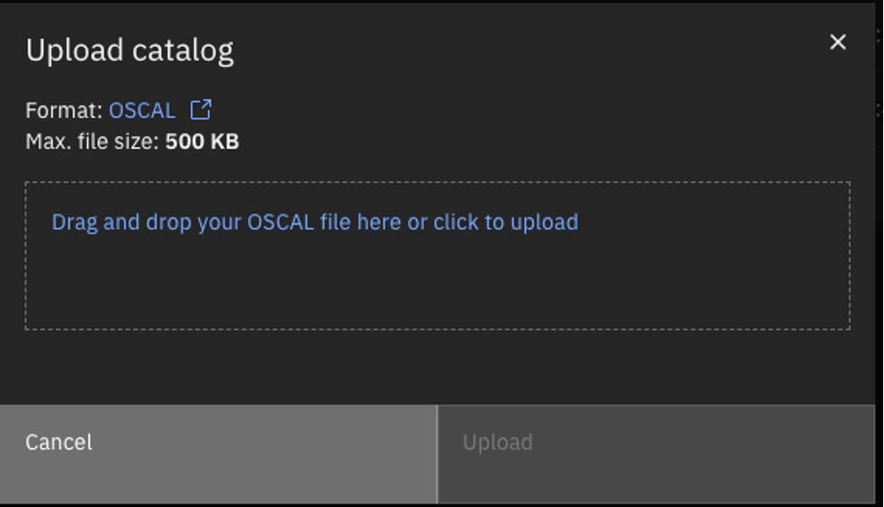 |
| **Action** &nbsp; 3.1.3 | Click **X** to close the **Compliance profile** screen.   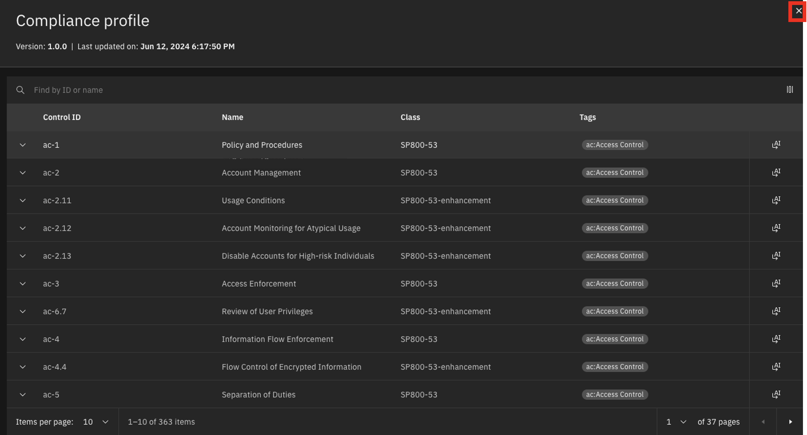 |
| **Narration** | Compliance controls are specific safeguards or practices implemented by organizations to ensure adherence to legal, regulatory, and internal standards for data protection and security. These controls help mitigate risks and enhance overall security posture. |
| **Action** &nbsp; 3.1.4 | Click **Create profile**.       The following **Create profile** screen will appear:   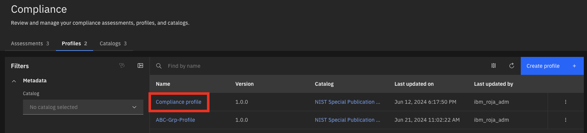 |
| **Action** &nbsp; 3.1.5 | In the **Name** field, enter '**Global Profile**' (1). Select any catalog for the **Select Catalog** field (2). Select some controls in the **Select controls** field (3).   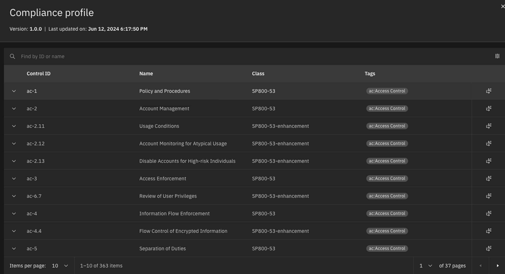 |
| **Narration** | The compliance manager creates the profile by selecting the required controls from a catalog. |
| **Action** &nbsp; 3.1.6 | Click **Cancel**.    |

**[Go to top](#top)**

  

<strong>4 - Compliance assessments</strong>: Reviewing compliance results

 

| **4.1** | **Placeholder** |
| :--- | :--- |
| **Narration** | Compliance scans are used by the compliance manager to evaluate whether an organization's information systems align with the security controls specified in compliance profiles. Focus Financial employs an automated compliance scanning tool that complies with NIST 800-53 standards. Popular tools in this space include OpenSCAP, Tenable.io (Nessus), Qualys, Rapid7 InsightVM, and AWS Config Rules.  Once a compliance scan is completed, the tool generates a report outlining the compliance status for each NIST 800-53 control. The compliance manager then uploads these assessment scans in OSCAL format to be managed and reviewed within Concert. |
| **Action** &nbsp; 4.1.1 | Select the **Assessments** tab.    |
| **Action** &nbsp; 4.1.2 | Click the first assessment to open it.       The following **NIST scan results** screen will appear:   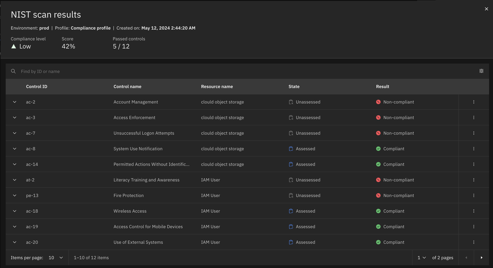 |
| **Narration** | The assessment scan results identify which controls are compliant and which are not. After reviewing the results, the compliance manager updates the non-compliant controls by providing appropriate evidence. |
| **Action** &nbsp; 4.1.3 | For the **Access Enforcement** control, click the **menu** icon and then click **Provide evidence**.   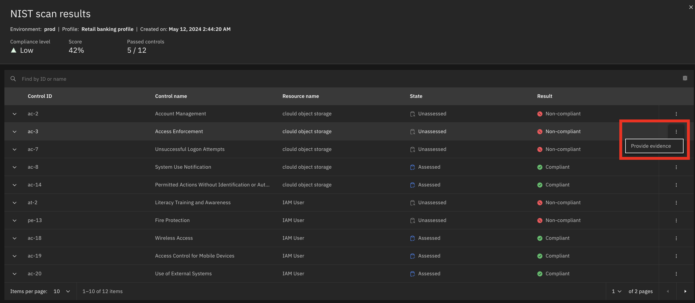    The following **Provide evidence** screen will appear:   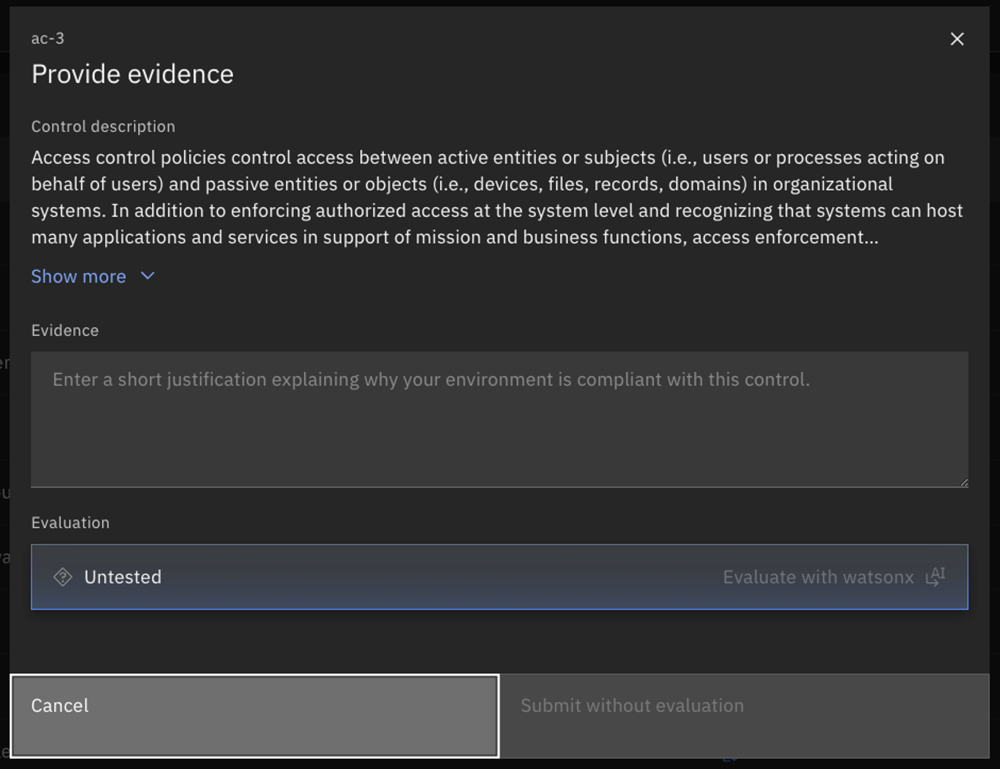 |
| **Narration** | Concert uses watsonx to assist the compliance manager with documentation by evaluating the evidence statements and indicating whether they are sufficient to satisfy the requirements of the compliance control. |
| **Action** &nbsp; 4.1.4 | In the **Evidence** field, type '**Change request approved for implementing network policies**' (1). Click **Evaluate with watsonx** (2).   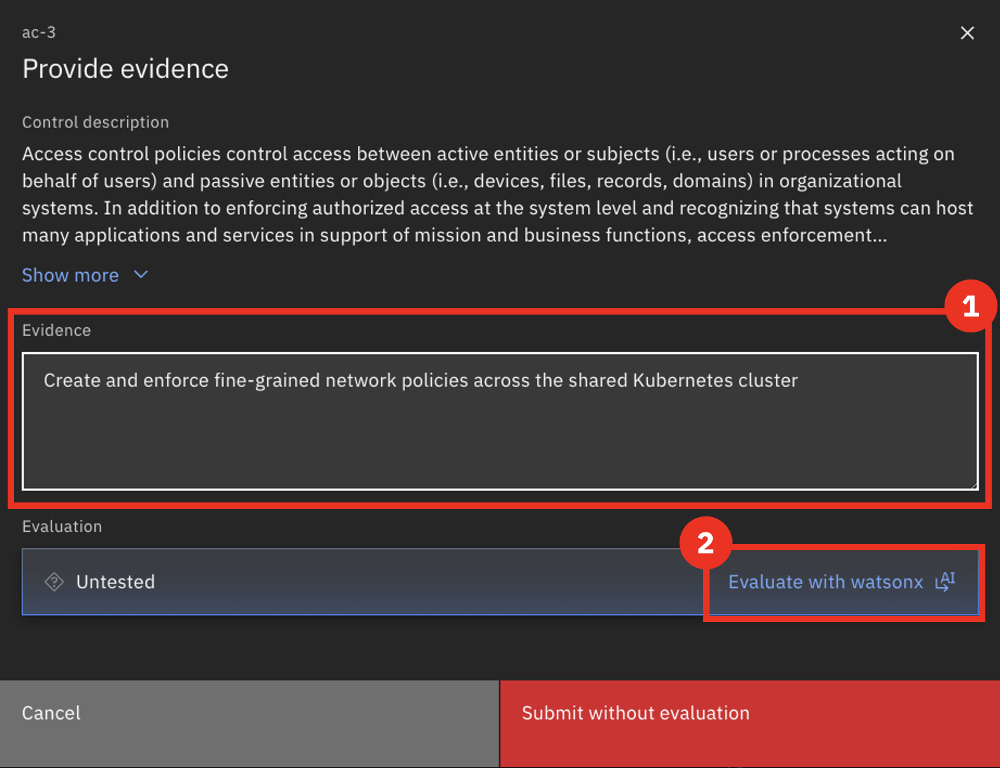    The following screen will appear:   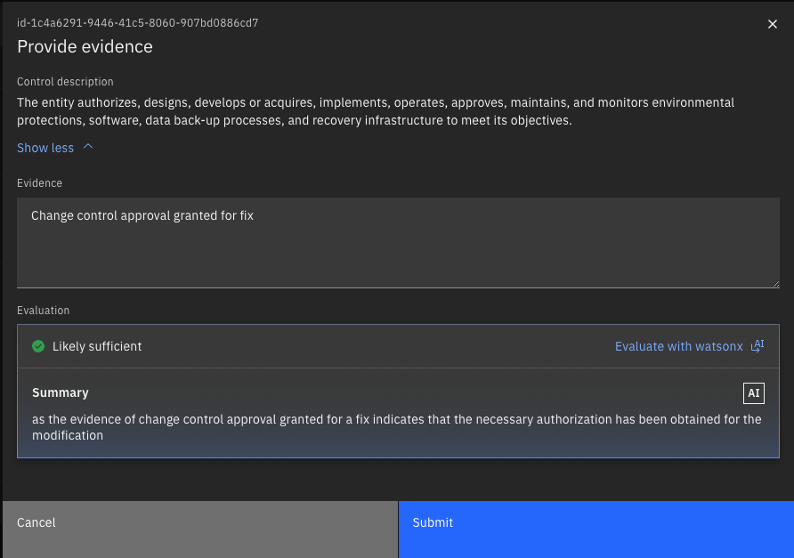 |
| **Narration** | Concert uses its deep understanding of the NIST control to verify that this evidence would satisfy the compliance requirements. |

**[Go to top](#top)**

  

<strong>5 - Evidence store</strong>: Tracking and auditing changes

 

| **5.1** | **Audit changes** |
| :--- | :--- |
| **Action** &nbsp; 5.1.1 | Click **Inventory** (1) and select **Evidence store** (2).   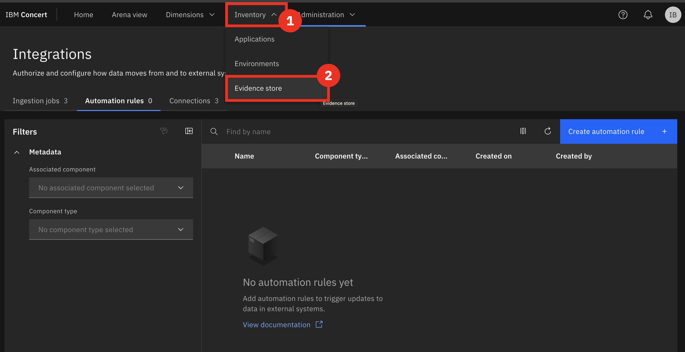    The following **Evidence store** screen will appear:    |
| **Narration** | As activities occur and data is updated, Concert continuously keeps the ‘Evidence Store’ current. This store functions as a comprehensive change log, tracking key details such as CVE resolution progress, compliance status, and delivered applications.  During software audits, gathering and presenting all necessary information to demonstrate compliance can be extremely time-consuming. With Concert, however, all relevant data is automatically collected and stored in the ‘Evidence Store,’ significantly streamlining the audit process.  For instance, it allows users to easily track completed compliance assessments and view changes over time, enhancing visibility and accountability. |
| **Action** &nbsp; 5.1.2 | Click **Compliance assessment** under the chart.   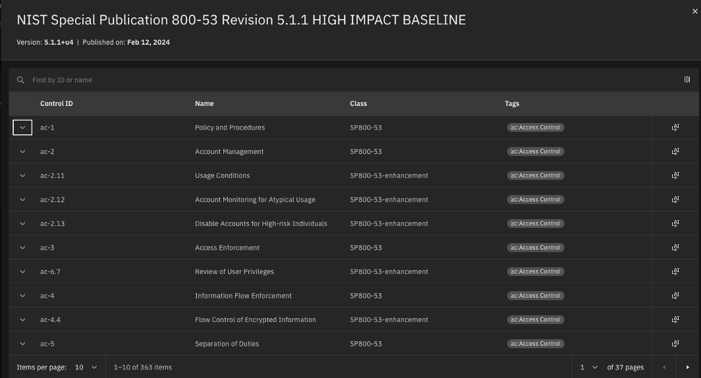    The following screen will appear:    |
| **Action** &nbsp; 5.1.3 | <inline-notification text="There is currently only one compliance assessment loaded into the demo environment. For now, you will need to skip these final actions."></inline-notification> Select the last two assessments (1) and then select **Compare** (2).       The following screen will appear:    |
| **Narration** | Concert compares the two selected compliance assessments, highlighting the differences. It compares the total number of controls that passed in each assessment and the results for each specific control. |

**[Go to top](#top)**

  

Summary

We've demonstrated how Concert seamlessly integrates compliance monitoring throughout the application lifecycle, ensuring that adherence to standards is maintained as applications evolve. By incorporating compliance considerations during application development, Concert helps prevent costly post-deployment rework, fostering a proactive compliance culture within teams.

**[Go to top](#top)**

  

