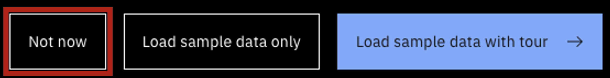

### Please bookmark this page. The demo environment URLs may change with each version update.

 

### Read-only environments include:
- A complete sample dataset
- watsonx connectivity
- Concert Observe
- Concert Optimize
- Concert Protect
- Concert Resilience
- Concert Workflows 
- Connected OpenShift environment into each of the modules

Important notes about the demo environment:
- **Purpose**: This environment is only for demos and self-education. It should not be used for PoCs.
- **Shared environment**: This is a shared environment. Please DO NOT import data or create automation rules.
- **Sample data**: The environment contains a complete set of sample data. If you open the tour, DO NOT load the default sample data (click  <strong>Not now</strong>).     

<inline-notification text="In order to access the demo environment, you MUST be logged into the IBM VPN."></inline-notification>

Credentials:
- Username: ibmconcert
- Password: GTMteam

<a href="https://concert-concert-protect.apps.concert-platform-demo.cp.fyre.ibm.com/platform/" target="_blank" rel="noreferrer"><button class="ibm-button">Click here for Concert Platform read-only environment</button></a>

 