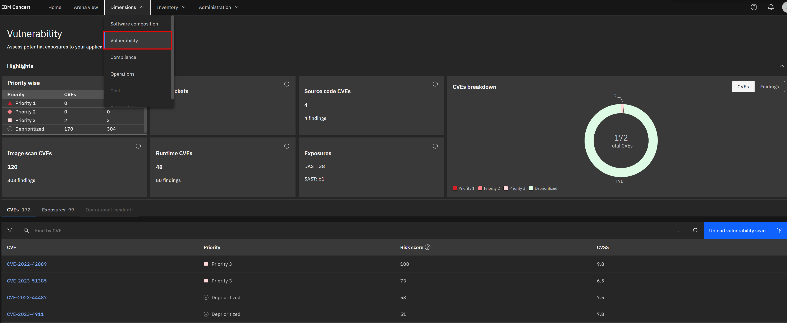
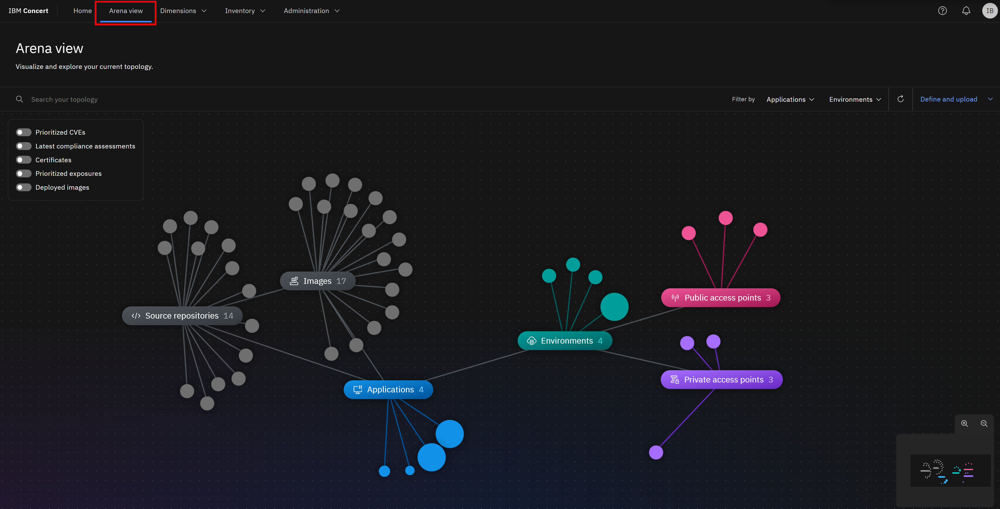
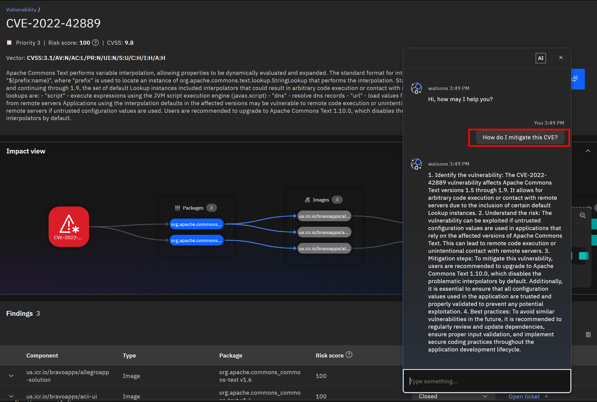
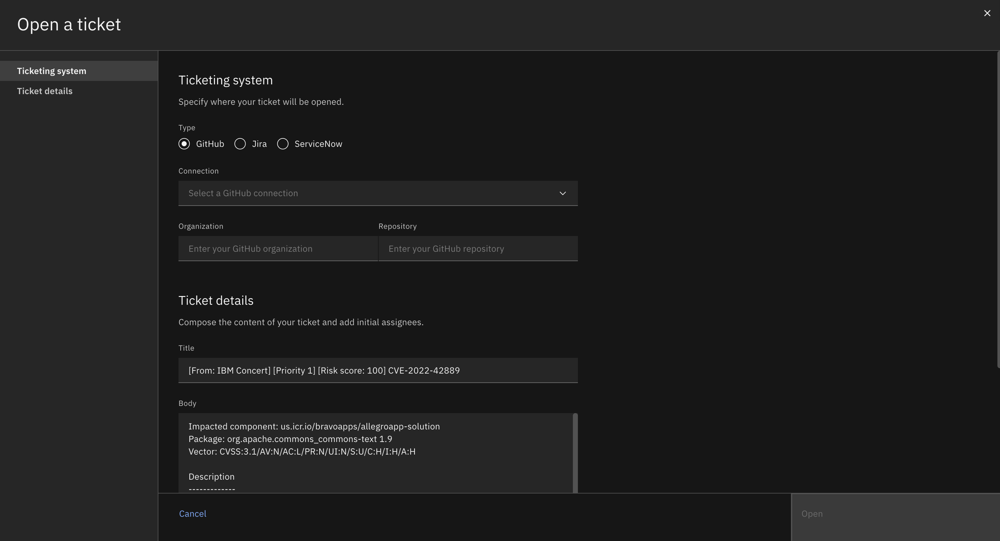

Click the [**Demo preparation**](demo-preparation) tab for setup instructions.

Introduction

As enterprises develop and deploy an increasing number of software applications, they face significant risks and challenges related to Common Vulnerability Exposures (CVEs) and other vulnerabilities in open-source software. The traditional approach to vulnerability management often means prolonged exposure, with mitigation taking weeks and increasing the risk of breaches.

IBM Concert leverages data from various tools, empowering IT operations along with security professionals to gain a comprehensive view of vulnerabilities across their application landscape. Through its advanced gen AI engine, Concert tailors vulnerability risk assessments to each customer's unique environment, identifying potential threats, evaluating their impact, and providing actionable recommendations that reduce mean time to resolution (MTTR) from weeks to just days. This shift not only frees up person-hours but significantly lowers the risk of breaches by enabling faster, prioritized mitigation.

Let’s see how IBM Concert accelerates vulnerability management, saves time, reduces MTTR, and strengthens a company's security posture in real time.

 

<strong>1 - Vulnerability dashboard</strong>: Seeing an overview of the vulnerabilities in your environment

 

| **1.1** | **Examine the vulnerability landscape** |
| :--- | :--- |
| **Narration** | The security manager at Focus Financial is overwhelmed with a backlog of 1100+ CVEs and struggles to manage vulnerabilities across applications hosted by different teams. With the recent adoption of a microservices architecture and increasing use of open source software, the complexity has surged as these applications now span multiple cloud providers and on-prem environments. This shift has introduced significant challenges in vulnerability management, making it crucial to find a better way to prioritize, manage and address the exposures. |
| **Action** &nbsp; 1.1.1 | Show the **Home** page.   |
| **Narration** | On logging into Concert, Focus Financial’s security manager gains an immediate, consolidated view of over 1100+ CVEs across cloud and on-prem environments, regardless of application or hosting provider. Rather than being overwhelmed by the sheer volume, they can now see each vulnerability in context—prioritizing those that pose the greatest threat to critical assets.    The section on the right provides key vulnerability metrics, showing the total number of unique CVEs and affected components. Concert highlights the most critical vulnerabilities. In this case, we see 6 'Priority 1' CVEs, 7 'Priority 2' CVEs, 74 'Priority 3' CVEs and 117 deprioritized CVEs. This concise snapshot helps the manager quickly assess the organization's vulnerability landscape and prioritize remediation efforts. |

 

| **1.2** | **Examine vulnerabilities in the Dimensions view** |
| :--- | :--- |
| **Action** &nbsp; 1.2.1 | Click **Dimensions** and select **Vulnerability**.  |
| **Narration** | To see a list of all vulnerabilities, the security manager accesses the Vulnerability page in the Dimensions view. The vulernability dashboard provides a snapshot of source code, image scan, runtime vulnerabilities and exposures as well as a detailed list of all vulnerabilities prioritized by risk score. This view enables quick identification of the most critical vulnerabilities across all applications. It offers a comprehensive overview, making it easy to sort, filter and find vulnerabilities in the system, ensuring no critical exposure goes unnoticed. |

 

| **1.3** | **View CVE details** |
| :--- | :--- |
| **Action** &nbsp; 1.3.1 | Click the Priority first CVE (<strong>CVE-2022-42889</strong>).       The following 'CVE details' screen will appear:    |
| **Action** &nbsp; 1.3.2 | Highlight the difference between the generic CVSS score and Concert's custom risk score and priority.    |
| **Narration** | The manager selects a CVE to view the details and sees the impact view showing the packages, images, applications and environments affected by the vulnerablability.    The CVE view also provides the manager with a summary of the issue, the generic CVSS score and a custom Concert risk score.  Concert leverages generative AI to correlate vulnerability data across multiple risk vectors, analyzing package and application dependencies to highlight risks specific to an organization’s environment. This allows Concert to generate a score based on the actual exposure risk.   Concert uses the following vectors to calculate the risk posed by each vulnerability. • Base CVSS score • Proprietary threat intelligence from IBM X-Force • Application criticality • Public and private access points |

**[Go to top](#top)**

  

<strong>2 - End-to-end view of vulnerability impact across the organization</strong>: Visualizaing vulnerabilities alongside the application landscape

 

| **2.1** | **Display CVEs in the Arena View** |
| :--- | :--- |
| **Action** &nbsp; 2.1.1 | Click **Arena view**. <inline-notification text="Use the zoom controls on the bottom right to fit the view on your screen."></inline-notification>  |
| **Narration** | In IBM Concert's Arena View, Focus Financial’s security manager can see a 360-degree perspective on the entire application ecosystem. Despite the complexities introduced by microservices, Concert understands each application as a cohesive unit, mapping dependencies and connections across multiple microservices and environments.   This intelligent architecture-aware design allows the manager to view vulnerabilities not just as isolated issues but within the context of the whole application. Arena View ensures they can track how each vulnerability affects the application’s source code, images, and security posture. |
| **Action** &nbsp; 2.1.2 | Click the **Prioritized CVEs** switch, which will display the prioritized CVEs on the left side of the Arena view.    |
| **Narration** | By clicking the 'Prioritized CVEs' switch, the manager reveals a red cluster showing all the prioritized CVEs. |
| **Action** &nbsp; 2.1.3 | Hover over any CVE node to highlight its end-to-end connections.   |
| **Narration** | The darkest red circles represent Concert's ‘Priority 1’ vulnerabilities. By hovering over any node, the manager sees the impact of a CVE - from affected repositories and images to an applications's environments and access points. It provides a comprehensive overview of how vulnerabilities propagate through the system, enabling informed decision-making for remediation efforts.|
| **Action** &nbsp; 2.1.4 | Click the **Prioritized exposures** switch.    |
| **Narration** | By clicking the 'Prioritized Exposures' switch, the security manager unveils two new orange clusters within the Arena View—exposures identified from static application security testing (SAST) on the left and dynamic application security testing (DAST) on the right. Previously, the manager relied on image CVE scans alone, which flagged vulnerabilities within container images but didn’t account for application-level risks.   With the addition of SAST and DAST, Concert now provides a comprehensive view that combines vulnerabilities from the underlying code, runtime behavior, and container images. This holistic approach allows the manager to address security gaps across every layer of the application, ensuring both prevention of code-level exploits and real-time mitigation of runtime threats.    By uniting these layers in a single visualization, the manager can confidently prioritize efforts, reducing the risk of undetected vulnerabilities and reinforcing the security posture from code to container. |

**[Go to top](#top)**

  

<strong>3 - watsonx chatbot</strong>: Expert vulnerability analysis and remediation guidance

 

| **3.1** | **Interact with the chatbot** |
| :--- | :--- |
| **Action** &nbsp; 3.1.1 | Click **Ask watsonx**.    |
| **Narration** | Concert’s interactive chatbot uses generative AI to dig deeper into Concert’s specific suggestions and explain the potential impact and remediation of each issue. The chatbot uses IBM’s Granite language model powered by watsonx and comes pre-trained to have interactive conversations about application vulnerabilities. The manager interactively asks questions about CVE details and engages in a discussion about remediation guidance. Concert responds with CVE-specific details. |
| **Action** &nbsp; 3.1.2 | Type '**How do I mitigate this CVE?**' in the chatbot.    |
| **Narration** | Concert responds like an expert, providing the manager with insight about the vulnerability and tailored remediation guidance, saving valuable research time. By applying contextual knowledge specific to Focus Financial’s environment, Concert delivers focused recommendations that wouldn’t be available in generic resources, enabling the team to address risks more precisely and efficiently. |
| **Action** &nbsp; 3.1.3 | Type '**Does this CVE have known exploits?**' in the chatbot.    |
| **Narration** | Concert quickly responds with detailed information on any known exploits associated with the CVE, providing Focus Financial’s IT operations manager with important context to prioritize vulnerabilities with active exploits, reducing potential exposure time and allowing them to focus on the most pressing risks. |

**[Go to top](#top)**

  

<strong>4 - Service ticket generation</strong>: Quickly mitigating vulnerability issues

 

| **4.1** | **Open a ticket** |
| :--- | :--- |
| **Narration** | Now that the security manager fully understands the potential impact of the CVE on the application environment, Concert can automatically generate a service ticket to resolve the vulnerability. Previously, this process required manually communicating the issue to a separate team to create the service ticket. |
| **Action** &nbsp; 4.1.1 | Click **Open ticket** in the first row.       The following **Open a ticket** screen will appear:    |
| **Narration** | Concert can connect directly to popular ticketing systems, such as GitHub, Jira, ServiceNow and Salesforce to automatically generate service tickets to remediate the vulnerability. Concert automatically inserts the appropriate text into the ticket fields, automating what would otherwise be a time-consuming task. In addition to ensuring accuracy, Focus Financial now saves an average of 15 minutes per vulnerability, which can add up significantly given the thousands of issues that arise each year. |
| **Action** &nbsp; 4.1.2 | Click **X** to close the **Open a ticket** screen.    |
| **Action** &nbsp; 4.1.3 | Click **X** to close the CVE details screen.    |

 

| **4.2** | **Create an automation rule** |
| :--- | :--- |
| **Narration** | Alternatively, the manager can configure automation rules to automatically create and assign tickets in the ticketing system, further speeding up the process of remediating vulnerabilities. Concert’s automation rules define the automatic actions to take when it detects a CVE that needs remediation. |
| **Action** &nbsp; 4.2.1 | Click **Administration** and select **Integrations**.    |
| **Action** &nbsp; 4.2.2 | Click the **Automation rules** tab.    |
| **Action** &nbsp; 4.2.3 | Click **Create automation rule**.    |
| **Action** &nbsp; 4.2.4 | In the **Name** field, type '**Create ticket for critical CVE on prod environment**' (1).   For the first condition, select **Environments** and **production** (2).   For the second condition, Select **Open GitHub issue** (3).    |
| **Narration** | For example, the manager can configure a rule to automatically generate a service ticket in GitHub for each vulnerability detected in the production environment. If desired, the manager can also set threshold values on risk scores to determine when a ticket should be generated. |
| **Action** &nbsp; 4.2.5 | Click **X** to close the **Create an automation rule** screen.    |

**[Go to top](#top)**

  

Summary

We’ve demonstrated how Concert empowers both IT professionals and security managers to not only identify and prioritize vulnerabilities but also simplify the entire remediation process. Before implementing Concert, the SRE/Devops team grappled with time-intensive manual efforts, fragmented tools, and a vast amount of data to assess and manage vulnerabilities effectively.

With Concert, managers now have a unified view across disparate data sources, providing comprehensive visibility into Focus Financial’s security posture. Concert’s advanced AI contextualizes each vulnerability to Focus Financial’s unique environment, saving research time, reducing mean time to resolution from weeks to days, and ensuring that resources are focused on critical exposures with known exploits.   By using intelligent prioritization and applying tailored insights, Concert enables the team to mitigate risks more effectively, reinforcing a proactive and resilient security approach.

**[Go to top](#top)**

  

