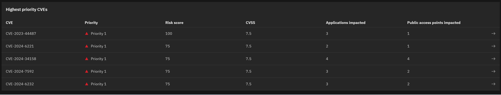
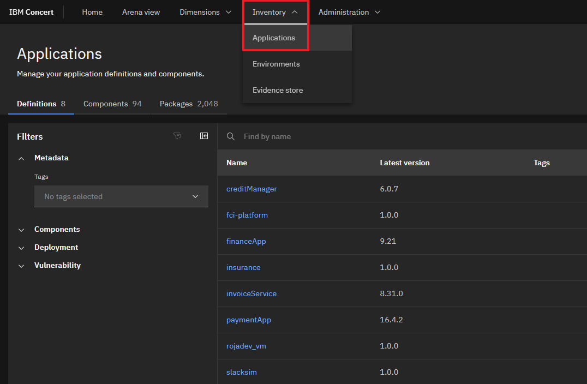

Click the [**Demo preparation**](demo-preparation) tab for setup instructions.

Introduction

As enterprises develop and deploy an increasing number of software applications, they face significant risks and challenges related to Common Vulnerability Exposures (CVEs) and other vulnerabilities in open source software.

Leveraging data from various tools, IBM Concert empowers security professionals to gain a comprehensive view of vulnerabilities across their application landscape. Using an advanced gen AI engine, Concert  assesses vulnerability risk tailored to each customer’s specific environment. Concert identifies potential threats, evaluates their impact and provides actionable recommendations to prioritize and mitigate risks effectively.

Let’s see how IBM Concert accelerates vulnerability management and enhances security posture.

 

<strong>1 - Vulnerability dashboard</strong>: Seeing an overview of the vulnerabilities in your environment

 

| **1.1** | **Examine the vulnerability landscape** |
| :--- | :--- |
| **Narration** | The security manager at Focus Financial is overwhelmed with a backlog of 1100+ CVEs and struggles to manage vulnerabilities across applications hosted by different teams. With the recent adoption of a microservices architecture, the complexity has surged as these applications now span multiple cloud providers and on-prem environments. This shift has introduced significant challenges in vulnerability management, making it crucial to find a better way to prioritize, manage and address the exposures. |
| **Action** &nbsp; 1.1.1 | Show the **Home** page.   |
| **Narration** | On logging into Concert, the security manager is presented with a dashboard that represents different dimensions of the application landscape. The vulnerability summary provides an immediate overview of the risk posture.    The section on the right provides key vulnerability metrics, showing the total number of unique CVEs and affected components. Concert highlights the most critical vulnerabilities. In this case, we see 6 'Priority 1' CVEs, 7 'Priority 2' CVEs, 74 'Priority 3' CVEs and 117 deprioritized CVEs. This concise snapshot helps security managers quickly assess the organization's vulnerability landscape and prioritize remediation efforts. |
| **Action** &nbsp; 1.1.2 | Scroll down the home page to show the **Most vulnerable applications** (left) and **Prioritized CVEs impacting public access points** (right) graphs.    |
| **Narration** | Scrolling down the home page, the security manager sees two visual representations of vulnerability risk.   The bar chart on the left provides a clear view of the most vulnerable applications within the organization. By categorizing and prioritizing the vulnerabilities, the security manager can quickly identify that even though the 'quote-of-the-day' application contains the highest number CVE findings, the application to pay immediate attention to might be the 'ecommerce ' app because it contains the most CVEs in the critical (Priority 1) category.   The scatter plot on the right highlights the CVEs that have a potential path to public access points, with each point representing a CVE and its associated risk score and impact. |
| **Action** &nbsp; 1.1.3 | Scroll down the home page to show the **Highest prioritiy CVEs** table.    |
| **Narration** | At the bottom of the Home page, the security manager can see the top five vulnerabilities displayed in order of criticality. |

 

| **1.2** | **Display CVEs in the Arena View** |
| :--- | :--- |
| **Action** &nbsp; 1.2.1 | Click **Arena view**. <inline-notification text="Use the zoom controls on the bottom right to fit the view on your screen."></inline-notification>  |
| **Narration** | The 'Arena view' provides the security manager with a 360-degree view of the entire application ecosystem. |
| **Action** &nbsp; 1.2.2 | Click the **Prioritized CVEs** switch, which will display the prioritized CVEs on the left side of the Arena view.    |
| **Narration** | By clicking the 'Prioritized CVEs' switch, the security manager reveals a red cluster showing all the high priority CVEs. This visualization details the affected repositories, deployed images, applications and public access points. It provides a comprehensive overview of how vulnerabilities propagate through the system, enabling informed decision-making for remediation efforts. |
| **Action** &nbsp; 1.2.3 | Hover over any CVE node to highlight its end-to-end connections.    |
| **Narration** | The darkest red circles represent Concert's ‘Priority 1’ vulnerabilities. By hovering over any node, the security manager sees the repositories, images, applications, environments and access points associated with a CVE. |
| **Action** &nbsp; 1.2.4 | Click the **Prioritized exposures** switch.    |
| **Narration** | By clicking the 'Prioritized exposures' switch, the security manager reveals two new orange clusters. This visualization displays exposures detected from static code scans on the left side of the Arena view and dynamic security scans on the right side of the Arena view. |

**[Go to top](#top)**

  

<strong>2 - Vulnerability analysis and details</strong>: Drilling down into individual vulnerabilities

 

| **2.1** | **Examine vulnerabilities in the Dimensions view** |
| :--- | :--- |
| **Action** &nbsp; 2.1.1 | Click **Dimensions** and select **Vulnerability**.  |
| **Narration** | To see a list of all vulnerabilities, the security manager accesses the Vulnerability page in the Dimensions view. The vulernability dashboard provides a snapshot of source code, image scan, runtime vulnerabilities and exposures as well as a detailed list of all vulnerabilities prioritized by risk score. This view enables quick identification of the most critical vulnerabilities across all applications. It offers a comprehensive overview, making it easy to sort, filter and find vulnerabilities in the system. |

 

| **2.2** | **View CVE details** |
| :--- | :--- |
| **Action** &nbsp; 2.2.1 | Click the Priority first CVE (<strong>CVE-2022-42889</strong>).       The following 'CVE details' screen will appear:    |
| **Action** &nbsp; 2.2.2 | Highlight the difference between the generic CVSS risk score and Concert's custom risk score and priority.    |
| **Narration** | The security manager selects a CVE to view the details and sees the impact view showing the packages, images, applications and environments affected by the vulnerablability.    The CVE view also provides the security manager with a summary of the issue, the generic CVSS score and a custom Concert risk score.  Concert leverages generative AI to correlate vulnerability data across multiple risk vectors, analyzing package and application dependencies to highlight risks specific to an organization’s environment. This allows Concert to generate a score based on the actual exposure risk.   Concert uses the following vectors to calculate the risk posed by each vulnerability. • Base CVSS score • Proprietary threat intelligence from IBM X-Force • Application criticality • Publicly exposed access points |

**[Go to top](#top)**

  

<strong>3 - watsonx chatbot</strong>: Expert vulnerability analysis and remediation guidance

 

| **3.1** | **Interact with the chatbot** |
| :--- | :--- |
| **Action** &nbsp; 3.1.1 | Click **Ask watsonx**.    |
| **Narration** | Concert’s interactive chatbot uses generative AI to dig deeper into Concert’s specific suggestions and explain the potential impact and remediation of each issue. The chatbot uses IBM’s Granite language model powered by watsonx and comes pre-trained to have interactive conversations about application vulnerabilities. The security manager interactively asks questions about CVE details and engages in a discussion about remediation guidance. Concert responds with CVE-specific details. |
| **Action** &nbsp; 3.1.2 | Type '**How do I mitigate this CVE?**' in the chatbot.    |
| **Narration** | Concert responds like an expert, providing the security manager with insight about the vulnerability and offering remediation guidance. |
| **Action** &nbsp; 3.1.3 | Type '**Does this CVE have known exploits?**' in the chatbot.    |

**[Go to top](#top)**

  

<strong>4 - Service ticket generation</strong>: Quickly mitigating vulnerability issues

 

| **4.1** | **Open a ticket** |
| :--- | :--- |
| **Narration** | Now that the security manager fully understands the potential impact of the CVE on the application environment, Concert can automatically generate a service ticket to resolve the vulnerability. Previously, this process required manually communicating the issue to a separate team to create the service ticket. |
| **Action** &nbsp; 4.1.1 | Click **Open ticket** in the first row.       The following **Open a ticket** screen will appear:    |
| **Narration** | Concert can connect directly to popular ticketing systems, such as GitHub, Jira and ServiceNow, to automatically generate service tickets to remediate the vulnerability. Concert automatically inserts the appropriate text into the ticket fields, automating what would otherwise be a time-consuming task. In addition to ensuring accuracy, Concert saves an average of 15 minutes per vulnerability, which can add up significantly given the thousands of issues that arise each year. |
| **Action** &nbsp; 4.1.2 | Click **X** to close the **Open a ticket** screen.    |
| **Action** &nbsp; 4.1.3 | Click **X** to close the CVE details screen.    |

 

| **4.2** | **Create an automation rule** |
| :--- | :--- |
| **Narration** | Alternatively, the security manager can configure automation rules to automatically create and assign tickets in the ticketing system, further speeding up the process of remediating vulnerabilities. Concert’s automation rules define the automatic actions to take when it detects a CVE that needs remediation. |
| **Action** &nbsp; 4.2.1 | Click **Administration** and select **Integrations**.    |
| **Action** &nbsp; 4.2.2 | Click the **Automation rules** tab.    |
| **Action** &nbsp; 4.2.3 | Click **Create automation rule**.    |
| **Action** &nbsp; 4.2.4 | In the **Name** field, type '**Create ticket for critical CVE on prod environment**' (1).   For the first condition, select **Environments** and **production** (2).   For the second condition, Select **Open GitHub issue** (3).    |
| **Narration** | For example, the security manager can configure a rule to automatically generate a service ticket in GitHub for each vulnerability detected in the production environment. If desired, the security manager can also set threshold values on risk scores to determine when a ticket should be generated. |
| **Action** &nbsp; 4.2.5 | Click **X** to close the **Create an automation rule** screen.    |

**[Go to top](#top)**

  

<strong>5 - Managing vulnerability status</strong>: Assessing and categorizing application vulnerabilities

 

| **5.1** | **Organize vulnerabilities in the kanban view** |
| :--- | :--- |
| **Action** &nbsp; 5.1.1 | Click **Inventory** and select **Applications**.    |
| **Action** &nbsp; 5.1.2 | Click **paymentApp** in the **Applications** view.   |
| **Action** &nbsp; 5.1.3 | Click **Prioritized CVE findings** in the **paymentApp** application dialog.  |
| **Narration** | The security manager organizes all vulnerabilities affecting a specific application using Concert's convenient kanban board. The CVEs are categorized according to those with 'Assessment in progress', 'Exception requested' and 'False positive.' The status of a CVE can be updated by simply dragging and dropping it into the appropriate column. |

 

**[Go to top](#top)**

  

Summary

We’ve demonstrated how Concert assists a security manager in identifying and prioritizing vulnerabilities and streamlining the remediation process. Before implementing Concert, the security team faced challenges with manual efforts, fragmented tools and extensive data needed to manage and assess vulnerabilities.

The security manager utilized Concert to unify disparate data sources, offering a comprehensive view of the security posture. Concert used gen AI to analyze data across various environments, enabling the security team to proactively prioritize, understand and address vulnerabilities.

**[Go to top](#top)**

  

