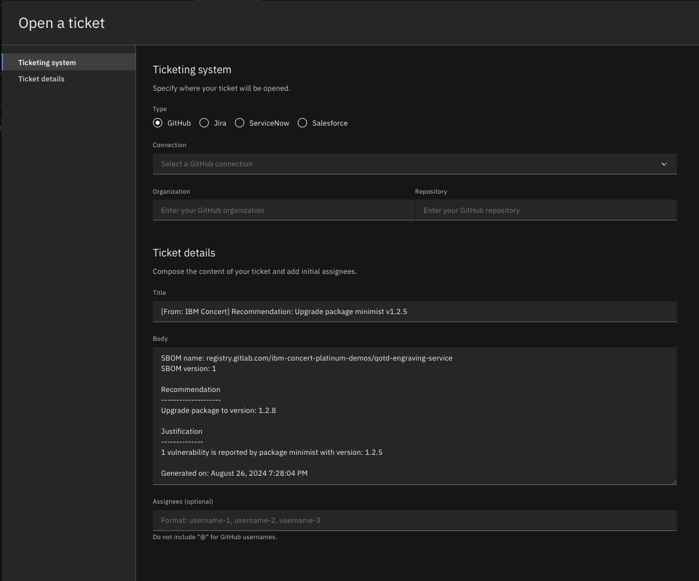
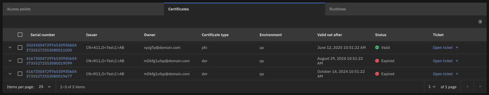

Click the [**Demo preparation**](demo-preparation) tab for setup instructions.

Introduction

Focus Corp is preparing for a significant release of their finance application. Since financial applications are mission-critical to their customers, it's essential to ensure the software is thoroughly protected against risks before launch.

In this demo, we'll showcase an application-centric approach, demonstrating how Concert can assist in addressing CVEs, outdated packages, expired certificates, and compliance assessments.

Let's get started!

 

<strong>1 - Arena View</strong>: Correlating an applications dependencies

 

| **1.1** | **Placeholder** |
| :--- | :--- |
| **Narration** | Focus Corp's Finance Application is their most intricate system, spanning multiple regions and lifecycle stages, with numerous repositories and microservice images supporting its functionality. Before starting work, the software development team might need a corrolated overview of all the application's dependencies. |
| **Action** &nbsp; 1.1.1 | Show the **Home** page, which you opened during demo preparation. Select the **Arena view**.    |
| **Action** &nbsp; 1.1.2 | On the **Arena view** page, enable all toggles:   Priority 1 CVEs   Priority 1 exposures   Low compliance assessments   Expired certificates    |
| **Narration** | With this Arena view, the software developers can see a correlation of all applications belonging to Focus Corp along with their dependencies. For now, however, they want to focus specifically on the Finance Application to address its fixes. |
| **Action** &nbsp; 1.1.3 | On the **Arena view** page, click on the **Applications** dropdown filter, and select Finance-app       |
| **Narration** | From this view of the fitered application, the software developer has a unified view displaying the corrolation between:   The Finance Application   Environments where it is deployed   Access Points   Expired Certificates which relate to those access points   Images present in the application   Repositories used to build those images   Priority 1 CVE's present in both the images and the repositories. |
| **Action** &nbsp; 1.1.4 | On the **Arena view** page, click on the dot representing the Finance-app.      This will bring the software developer to an application centric view of the finance-app within Concert.     |

**[Go to top](#top)**

  

<strong>2 - Vulnerabilties </strong>: Viewing a summary of vulnerabilities present in an application 

 

| **2.1** | **Placeholder** |
| :--- | :--- |
| **Narration** | Focus Corp requires that all Priority 1 CVEs be resolved prior to an application's release. The software developer's first goal is to assess any CVEs impacting the Finance Application. |
| **Action** &nbsp; 2.1.1 | Click the **Vulnerabilities** tab      |
| **Narration** | This **Vulnerabilities** page provides a comprehensive overview of both image and code scan results related to the Finance application.   At the top of the page, the software developer is met with a section containing a standard description about the CVE. This description is usually provided by the security scanning tool which detected this CVE.      The **Impact View** enables software developers to evaluate the criticality of a CVE by showing the environments and access points where the CVE might be exposed. Additionally, it helps pinpoint the source of the CVE by identifying the affected packages and the images where the CVE is present.       The central **Findings** table represents a list of each image within the Finance application where the CVE was located. This table also allows the developer to set an assessment state and open a ticket for each image to resolve the CVE.      The 2 columns at the end of the page provide additional details and recommended mitigation for the CVE. This information is provided by watsonx.ai    |
| **Narration** | The software developer for Focus Corp wants to open a ticket to track the mitigation of the CVE. |
| **Action** &nbsp; 2.1.2 | Click on the blue **Open ticket** button on the **Findings** table.      The following screen will appear.     |
| **Narration** | The body of the ticket is populated by watsonx.ai to provide comprehensive context to assist the developer in resolving the CVE efficiently. |

**[Go to top](#top)**

  

<strong>3 - Packages </strong>: Viewing recommended package updates. 

 

| **2.1** | **Placeholder** |
| :--- | :--- |
| **Narration** | While updating package versions to resolve CVEs, the Focus Corp software developer also takes the opportunity to update other outdated packages within the application, proactively mitigating potential future risks. |
| **Action** &nbsp; 2.1.1 | Click the **Packages** tab      |
| **Narration** | This **Packages** page provides a comprehensive list of recomended package updates, related to the Finance application.   At the top of the page, the software developer is met with a section containing details about the package.      Similar to on the vulnerabilities page, the **Impact View** enables software developers to evaluate the criticality of the outdated package, by showing the environments and access points where the package is active.       The central **Recommendations** section provides the recommended action to take for this package, along with justification for why this action should be taken.      The table at the end of the page provides a full list of images where this package was located.    |
| **Narration** | The software developer for Focus Corp wants to open a ticket to track the mitigation of this package. |
| **Action** &nbsp; 2.1.2 | Click on the blue **Open ticket** button on the table.      The following screen will appear.     |
| **Narration** | The body of the ticket is populated with the recomended action to take, along with the justification. |

**[Go to top](#top)**

  

<strong>4 - Certificates</strong>: Using Concert Workflows to refresh environment certificates

 

| **4.1** | **Placeholder** |
| :--- | :--- |
| **Narration** | Before the upcoming release, the software developer plans to rotate any expired certificates to ensure customers are not affected by potential outages. |
| **Action** &nbsp; 4.1.1 | Click on the Environments tab.         On the table which appears, click on the **Certificates** tab.    |
| **Narration** | The software developer gains information on the expiry status of all certificates relating to their application for a given environment. In an environment with real data, there could be hundreds of upcoming certificate expiries, or already expired certificates. So the software developer decides to set an **automation rule** within Concert to rotate all certificates for a given environment. |
| **Action** &nbsp; 4.1.2 | Click **Administration** (1) and select **Integrations** (2).       The following **Integrations** screen will appear:       Click on the **Automation rules** tab.         Then click on the Blue **Create Automation Rule** button. |
| **Action** &nbsp; 4.1.3 | Fill in the name and details for a new automation rule. Then change the **When this condition occurs** dropwdown to Certificate expiry. Set **take this action** to Trigger a workflow. Click the create button    |
| **Narration** | One of the most valuable features of IBM Concert, in terms of Certificates, is the ability to create automation rules that automatically rotate certificates approaching expiration. These rules can be configured with specific conditions, such as the environments affected by the certificate’s expiry and the number of days before expiration that should trigger the rule. By automating this process, customers can significantly reduce downtime and avoid potential disruptions across their environments.  |

**[Go to top](#top)**

  

<strong>5 - Compliance</strong>: Uploading and assessing compliance evidence

 

| **5.1** | **Audit changes** |
| :--- | :--- |
| **Narration** | After addressing the CVE's for the finance application, the compliance manager at Focus Corp has asked the application developer for evidence for a compliance assessment that the CVE was detected and mitigated in a timely manner. |
| **Action** &nbsp; 5.1.1 | Click **Dimensions** (1) and select **Compliance** (2).       The following **Compliance** screen will appear:       Click on the Blue compliance assessment name.         |
| **Action** &nbsp; 5.1.2 | Within the **Find by ID or name** Search bar, type in Risk.      For the **Risk Monitoring** control, click on the kebab menu (three dots) on the right. Then select provide evidence.         Change the **Evidence type** to File Evidence.      Download this PDF from github as a sample: https://github.ibm.com/ibm-concert-platinum-demos/concert-tickets/blob/main/vulnerability-evidence.pdf   Back in Concert, upload the vulnerability-evidence.pdf file.    </> Click **Evaluate with watsonx**.       |
| **Narration** | watsonx.ai has now evaluated the pdf evidence provided and gave a summary to the software developer on why it evaluated the pdf as sufficient or not. |

**[Go to top](#top)**

  

Summary

We've demonstrated how Concert takes an application-centric approach to addressing all risks associated with an application, enabling teams to shift left and proactively resolve these risks well ahead of release dates.

**[Go to top](#top)**

  

