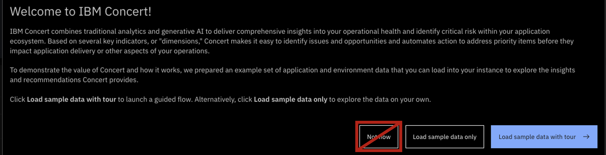

 

### **TABLE OF CONTENTS**

1. [End-to-end enablement video](#enablement-video)
2. [Tech Sales demo environment](#demo-environment)
3. [Technical office hours](#office-hours)
4. [Customer-facing demo videos](#demo-videos)
5. [Data ingestion demos](#data-ingestion)
6. [Proof of Value/Proof of Concept materials](#pov-poc-materials)

***

 

### **1. CONCERT END-TO-END ENABLEMENT VIDEO (1.0.4)**

Comprehensive video that covers all dimensions of IBM Concert 1.0.4:   

<!-- <video width="500" height="250" controls>
  <source src="videos/Concert-104-Demo.mp4" type="video/mp4">
Your browser does not support the video tag.
</video> -->

**[Go to top](#top)**

 

### **2. TECH SALES DEMO ENVIRONMENT**

For the **Tech Seller demo environment**:

<a href="https://9.30.214.214:12443/#/" target="_blank" rel="noreferrer"><button class="ibm-button">Click here</button></a>

IMPORTANT: This environment is specifically for Tech Sales and other IBM technical professionals' demos and self-education. The environment contains a complete set of sample data. DO NOT use this environment for Proof of Concepts. In order to access the demo environment, you MUST be logged into the IBM VPN.

Credentials:
- Username: concertuser
- Password: password

Please DO NOT do the following:
- We have already populated this environment with a complete data set. DO NOT load the sample data. If you click on the tour, click **Not now** without loading sample data.     
 
- DO NOT import data
- DO NOT create automation rules

For TechZone images: 

<a href="https://techzone.ibm.com/collection/tech-zone-certified-base-images/journey-watsonx" target="_blank" rel="noreferrer"><button class="ibm-button">Click here</button></a>

**[Go to top](#top)**

 

### **3. TECHNICAL OFFICE HOURS**

Anybody can join any sessions, but we've created the following sessions to accommodate various time zones:

<!-- | **Region** | **URL** |
| :--- | :--- |
| **Americas & Australia**    Mondays, 5:00-5:30 PM ET | Click <a href="https://ec.yourlearning.ibm.com/w3/event/10463907" target="_blank" rel="noreferrer">here</a> to sign up for the office hours. |
| **Asia & Europe**    Tuesdays, 9:00-9:30 AM GMT | Click <a href="https://ec.yourlearning.ibm.com/w3/event/10463907" target="_blank" rel="noreferrer">here</a> to sign up for the office hours. | -->

  

    <h3>Americas & Australia</h3>
    
Mondays, 5:00-5:30 PM ET

    
Click <a href="https://ec.yourlearning.ibm.com/w3/event/10463907" target="_blank" rel="noreferrer">here</a> to sign up for the office hours.

  

  

    <h3>Asia & Europe</h3>
    
Tuesdays, 9:00-9:30 AM GMT

    
Click <a href="https://ec.yourlearning.ibm.com/w3/event/10463907" target="_blank" rel="noreferrer">here</a> to sign up for the office hours.

  

To access previous office hour recordings: 

<a href="https://ibm.box.com/s/d9pqfta1d986xh31vtjh2wnz00f081bm" target="_blank" rel="noreferrer"><button class="ibm-button">Click here</button></a>

**[Go to top](#top)**

 

### **4. CUSTOMER-FACING DEMO VIDEOS**

| **Use case** | **Video** |
| :--- | :--- |
| **Primary customer-facing video** | Click <a href="https://ibm.box.com/s/y9x9n4bafsgtnaxadr513uttrpk0yafi" target="_blank" rel="noreferrer">here</a> to access the video in Box.    <video width="1000" height="500" controls> <source src="videos/Concert-104-Demo.mp4" type="video/mp4"> Your browser does not support the video tag. </video> |
| **Software composition** | Click <a href="https://ibm.box.com/s/y9x9n4bafsgtnaxadr513uttrpk0yafi" target="_blank" rel="noreferrer">here</a> to access the video in Box.    <video width="500" height="250" controls> <source src="videos/Concert-104-Demo.mp4" type="video/mp4"> Your browser does not support the video tag. </video> |
| **Compliance** | Click <a href="https://ibm.box.com/s/y9x9n4bafsgtnaxadr513uttrpk0yafi" target="_blank" rel="noreferrer">here</a> to access the video in Box.    <video width="500" height="250" controls> <source src="videos/Concert-104-Demo.mp4" type="video/mp4"> Your browser does not support the video tag. </video> |
| **Infrastructure insights** | Click <a href="https://ibm.box.com/s/y9x9n4bafsgtnaxadr513uttrpk0yafi" target="_blank" rel="noreferrer">here</a> to access the video in Box.    <video width="500" height="250" controls> <source src="videos/Concert-104-Demo.mp4" type="video/mp4"> Your browser does not support the video tag. </video> |

<inline-notification text="If you want a custom version of this video (e.g., a video for vulnerability and compliance), please contact Maryam (maryama@ca.ibm.com)."></inline-notification>

**[Go to top](#top)**

 

### **5. DATA INGESTION DEMOS**

| **Demo** | **URL** |
| :--- | :--- |
| **Manual data ingestion** | Click <a href="https://ibm.github.io/platinum-demos/tech-sales-enablement-learning-to-ingest-data-into-ibm-concert-manual/pre-requisites" target="_blank" rel="noreferrer">here</a>   |
| **Tekton pipeline data ingestion** | Click <a href="https://ibm.github.io/platinum-demos/tech-sales-enablement-learning-to-ingest-data-into-ibm-concert-pipeline/pre-requisites" target="_blank" rel="noreferrer">here</a> |
| **Customizing a customer's pipeline** | Click <a href="https://ibm.github.io/platinum-demos/tech-sales-enablement-customizing-customers-CICD-pipeline-for-ibm-concert/demo-instructions" target="_blank" rel="noreferrer">here</a> |
| **Jenkins pipeline data ingestion** | Click <a href="https://ibm.github.io/platinum-demos/tech-sales-enablement-learning-to-ingest-data-into-ibm-concert-jenkins-pipeline/pre-requisites" target="_blank" rel="noreferrer">here</a> |

**[Go to top](#top)**

 

### **6. PROOF OF VALUE/PROOF OF CONCEPT MATERIALS**

  

    <h3>Vulnerability</h3>
    
<a href="https://ibm.ent.box.com/s/y7gd01k4kxa3szw7fdetyp025thfnjvt" target="_blank" rel="noreferrer">Vulnerability PoV</a>

    
<a href="https://ibm.box.com/s/axxx4dlhtjshxueqxss5sly4xvz50f68" target="_blank" rel="noreferrer">Vulnerability ROI Calculator</a>

  

  

    <h3>Certificates</h3>
    
<a href="https://ibm.box.com/s/03hc23ea6n7oadactmi2ko9xnhixcmw5" target="_blank" rel="noreferrer">Certificates ROI Calculator</a>

  

 

**[Go to top](#top)**

