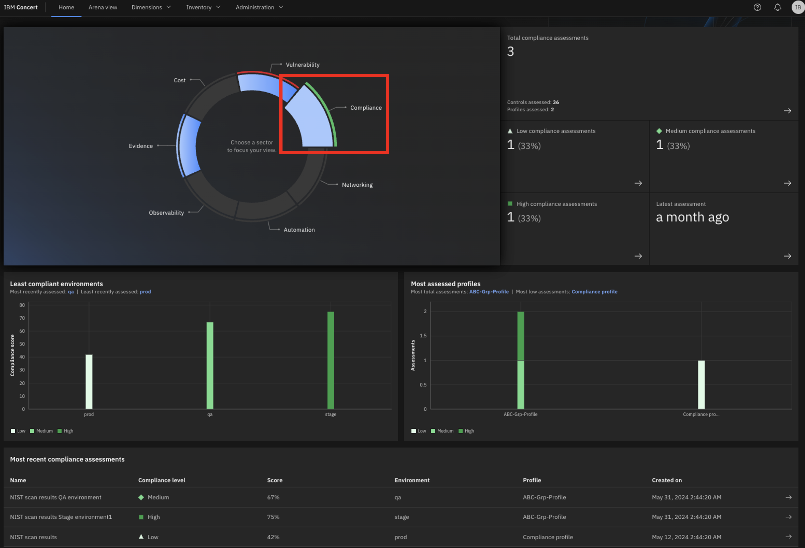
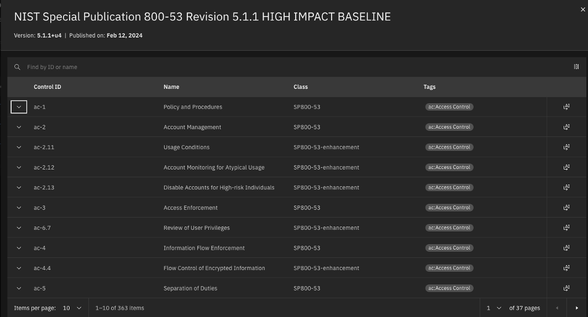
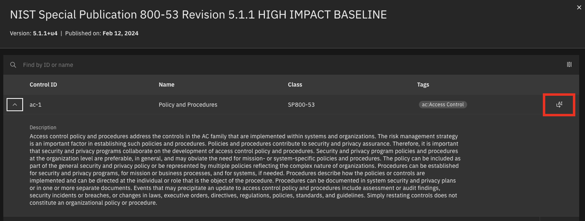
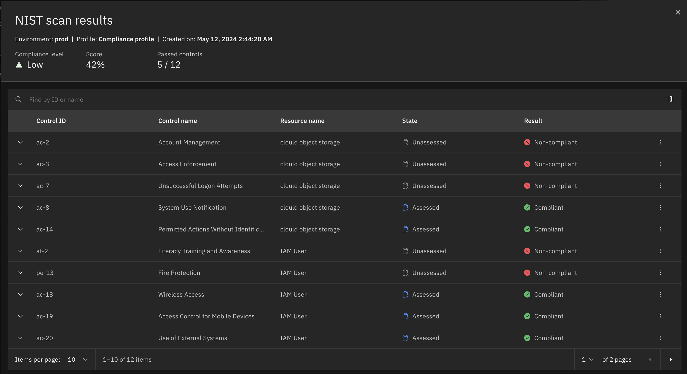
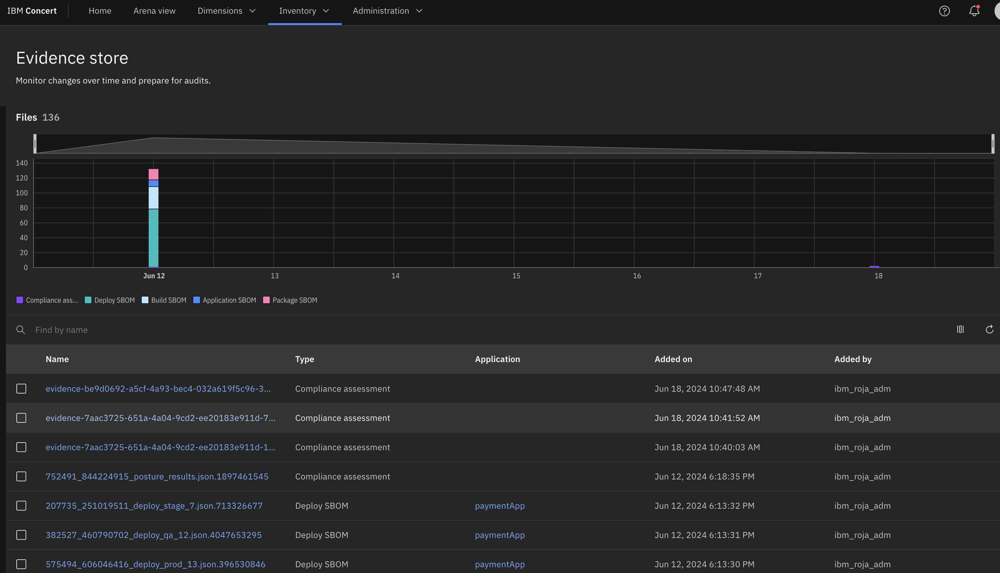

Click the [**Demo preparation**](demo-preparation) tab for setup instructions.

Introduction

Today we’ll explore how IBM Concert assists a compliance manager with accelerating application compliance tracking and ensuring adherence to standards as applications evolve. We’ll see how Concert seamlessly integrates compliance monitoring into the application lifecycle.

By continuously assessing applications for compliance, Concert provides prioritized recommendations to bring them into conformance with standards. Additionally, Concert automates the compilation of evidence, simplifying the process of demonstrating compliance to auditors.

Let’s get started.

 

<strong>1 - Compliance dashboard</strong>: Reviewing the compliance posture

 

| **1.1** | **Placeholder** |
| :--- | :--- |
| **Narration** | The compliance manager at Focus Financial manages applications hosted across various environments. As the application portfolio has evolved, its complexity has grown. Applications now span multiple servers and cloud providers, which increases the resources needed to track and manage compliance and heightens the risk of non-compliance. Concert helps the compliance manager maintain compliance more effectively. |
| **Action** &nbsp; 1.1.1 | Show the **Home** page, which you opened during demo preparation. Select the **Compliance** dimension.    |
| **Narration** | The compliance manager is responsible for maintaining compliance by ensuring all applications adhere to regulatory requirements. By integrating compliance management into the application lifecycle, Concert streamlines compliance assessments across all applications and accelerates issue tracking. When compliance deviations are detected, Concert prioritizes issues and assists the operations team in addressing them efficiently.    Upon logging into Concert, the compliance manager sees a comprehensive overview of the organization’s compliance posture. Concert provides a unified view of compliance assessments and their associated application environments. |
| **Action** &nbsp; 1.1.2 | Click **Arena view**.    |
| **Action** &nbsp; 1.1.3 | Click the **Latest compliance assessments** switch.    |
| **Narration** | The compliance manager sees a summary of the compliance assessments across all the application environments. The lighter green circles represent the environments with the lowest compliance scores, while the darker green circles represent those with higher compliance scores. |

**[Go to top](#top)**

  

<strong>2 - Compliance requirements</strong>: Managing catalogs

 

| **2.1** | **Placeholder** |
| :--- | :--- |
| **Narration** | Focus Corp adopted NIST SP 800-53 (National Institute of Standards and Technology Special Publication) as a guiding framework for their security compliance practices.  (Although all U.S. federal government agencies and contractors are required to comply with the NIST 800-53 framework to protect critical data, any private organization can adopt its use.)   NIST SP 800-53 provides a “compliance catalog” of security and privacy “controls” related to information systems. Controls are the specific measures that ensure applications and their environments adhere to compliance policies.  (For example, the ‘least privilege’ control dictates that processes are in place to ensure that access to systems remain at privilege levels no higher than necessary to accomplish business functions.) |
| **Action** &nbsp; 2.1.1 | Click **Dimensions** (1) and select **Compliance** (2).    |
| **Action** &nbsp; 2.1.2 | Click the **Catalogs** tab.    |
| **Narration** | Concert manages compliance catalogs within the Compliance dimension. The NIST SP 800-53 catalogs are preloaded into Concert.  NIST and other compliance standard organizations use the OSCAL (Open Security Controls Assessment Language) format. Examples of other standards that are available in OSCAL format include FedRAMP (Federal Risk and Authorization Management Program), CIS (Center for Internet Security) and PCI-DSS (Payment Card Industry Data Security Standard).    The compliance manager reviews and manages Concert’s list of catalogs. The NIST security control baselines—low, moderate, and high—represent different levels of security requirements based on the potential impact of a security breach. These baselines are defined in the NIST standard and are used to categorize the security controls necessary to appropriately protect information and information systems. It is the responsibility of the compliance manager to select the control baseline that corresponds to the sensitivity and importance of their information systems. (For example, the high baseline is designed for information systems where a breach would have a severe or catastrophic impact, while the low baseline is designed for information systems where a breach would have limited adverse impacts.)    The compliance manager can add any compliance catalog to Concert that adheres to the OSCAL format. |
| **Action** &nbsp; 2.1.3 | Click **Upload catalog**.       The following **Upload catalog** screen will appear:    |
| **Narration** | Since the NIST SP 800-53 catalogs come preloaded into Concert, the compliance manager does not need to import any additional catalogs at this time. |
| **Action** &nbsp; 2.1.4 | Click **Cancel**.    |
| **Action** &nbsp; 2.1.5 | Click the first catalog.       The following screen will appear:    |
| **Narration** | For each catalog, the compliance manager views the compliance controls. |
| **Action** &nbsp; 2.1.6 | Click to open the first control.    |
| **Narration** | Concert provides the detail of each control, including the description of what is needed to meet the requirements. The compliance manager might need further details to understand the requirements within the target environment. |
| **Action** &nbsp; 2.1.7 | Click the **AI** icon.    |
| **Action** &nbsp; 2.1.8 | Type '**How does ac-1 impact my kubernetes cluster?**' into the chatbot.    |
| **Narration** | Concert’s interactive chatbot uses gen AI to dig deeper into the compliance control and engage in conversations. The compliance manager uses natural language to interact with Concert to  probe this compliance control and understand its implementation in the context of the target environment. The chatbot uses IBM’s Granite language model and comes pre-trained to have interactive conversations about compliance.    Concert provides prescriptive guidance on this control, in this case touching on concepts such as configuring tighter role-based access controls and restricting interservice interactions via fine-grained network policies. |
| **Action** &nbsp; 2.1.9 | Click **X** to close the chatbot window.    |
| **Action** &nbsp; 2.1.10 | Click **X** to close the catalog.    |

**[Go to top](#top)**

  

<strong>3 - Compliance baselines</strong>: Creating compliance profiles

 

| **3.1** | **Placeholder** |
| :--- | :--- |
| **Narration** | A compliance profile refers to a set of security controls tailored to meet the specific security requirements of an organization based on their environments and the potential impact level of a security breach. Control baselines from the catalogs are further categorized into profiles based on the potential impact level. Profiles enable Focus Corp to meet their specific compliance requirements, ensuring the protection of their data and systems against potential threats and vulnerabilities. |
| **Action** &nbsp; 3.1.1 | Select the **Profiles** tab.    |
| **Narration** | When a profile is selected, the compliance manager views its controls. |
| **Action** &nbsp; 3.1.2 | Click **Compliance profile**.       The following **Compliance profile** screen will appear:    |
| **Action** &nbsp; 3.1.3 | Click **X** to close the **Compliance profile** screen.    |
| **Narration** |  |
| **Action** &nbsp; 3.1.4 | Click **Create profile**.       The following **Create profile** screen will appear:    |
| **Action** &nbsp; 3.1.5 | In the **Name** field, enter '**Global Profile**' (1). Select any catalog for the **Select Catalog** field (2). Select some controls in the **Select controls** field (3).    |
| **Narration** | The compliance manager creates the profile by selecting the required controls from a catalog. |
| **Action** &nbsp; 3.1.6 | Click **Cancel**.    |

**[Go to top](#top)**

  

<strong>4 - Manage assessments</strong>: Reviewing compliance results

 

| **4.1** | **Placeholder** |
| :--- | :--- |
| **Narration** | Compliance scans are used to assess and ensure that an organization's information systems adhere to the security controls defined in the compliance profiles. Focus Corp uses an automated compliance scanning tool that supports NIST 800-53 standards. Some popular tools include OpenSCAP, Tenable.io (or Nessus), Qualys, Rapid7 InsightVM and AWS Config Rules.    After each compliance scan is complete, the scanning tool generates a report detailing compliance status against each NIST 800-53 control. The compliance manager uploads the assessment scans (in OSCAL format) so they can be managed and reviewed in Concert. |
| **Action** &nbsp; 4.1.1 | Select the **Assessments** tab.    |
| **Action** &nbsp; 4.1.2 | Click the first assessment to open it.       The following **NIST scan results** screen will appear:    |
| **Narration** | The assessment scan results identify which controls are compliant and which are not. After reviewing the results, the compliance manager updates the non-compliant controls by providing appropriate evidence. |
| **Action** &nbsp; 4.1.3 | For the **Access Enforcement** control, click the **menu** icon and then click **Provide evidence**.       The following **Provide evidence** screen will appear:    |
| **Narration** | Concert uses watsonx to assist the compliance manager with documentation by evaluating the evidence statements and indicating whether they are sufficient to satisfy the requirements of the compliance control. |
| **Action** &nbsp; 4.1.4 | In the **Evidence** field, type '**Create and enforce fine-grained network policies across the shared Kubernetes cluster**' (1). Click **Evaluate with watsonx** (2).       The following screen will appear:    |
| **Narration** | Concert uses its deep understanding of the NIST control to verify that this evidence would satisfy the compliance requirements. |

**[Go to top](#top)**

  

<strong>5 - Evidence store</strong>: Monitoring and auditing changes

 

| **5.1** | **Audit changes** |
| :--- | :--- |
| **Action** &nbsp; 5.1.1 | Click **Inventory** (1) and select **Evidence store** (2).       The following **Evidence store** screen will appear:    |
| **Narration** | As activities occur and data is updated, Concert continuously maintains the information in the ‘Evidence store.’ The 'Evidence store' acts as a comprehensive change log, tracking CVE resolution progress, compliance status, delivered applications and all the other crucial details.    During software audits, compiling and presenting all necessary data to demonstrate compliance can be very time-consuming. However, with Concert, all relevant information is automatically collected and stored in the 'Evidence store,' making the audit process much more efficient.    For example, we can easily see what compliance assessments we’ve completed and what changed over time. |
| **Action** &nbsp; 5.1.2 | Click **Compliance assessment** under the chart.       The following screen will appear:    |
| **Action** &nbsp; 5.1.3 | <inline-notification text="There is currently only one compliance assessment loaded into the demo environment. For now, you will need to skip these final actions."></inline-notification> Select the last two assessments (1) and then select **Compare** (2).       The following screen will appear:    |
| **Narration** | Concert compares the two selected compliance assessments, highlighting the differences. It compares the total number of controls that passed in each assessment and the results for each specific control. |

**[Go to top](#top)**

  

Summary

We’ve shown how Concert seamlessly integrates compliance monitoring into the application lifecycle and ensures adherence to standards as applications evolve. Concert ensures that compliance is considered during application development, avoiding costly post-deployment re-factoring to foster a proactive compliance culture teams.

**[Go to top](#top)**

  

