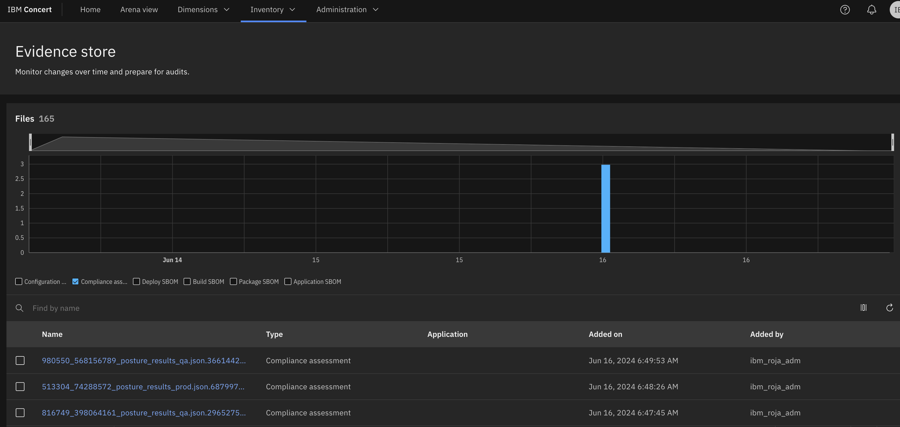

Click the [**Demo preparation**](demo-preparation) tab for setup instructions.

Introduction

Today we’ll explore how IBM Concert assists a compliance manager with accelerating application compliance tracking and ensuring adherence to standards as applications evolve. We’ll see how Concert seamlessly integrates compliance monitoring into the application lifecycle.

By continuously assessing applications for compliance, Concert provides prioritized recommendations to bring them into conformance with standards. Additionally, Concert automates the compilation of evidence, simplifying the process of demonstrating compliance to auditors.

Let’s get started.

 

<strong>1 - Compliance dashboard</strong>: Reviewing the compliance posture

 

| **1.1** | **Placeholder** |
| :--- | :--- |
| **Narration** | The compliance manager at Focus Financial manages applications hosted across various environments. As the application portfolio has evolved, its complexity has grown. Applications now span multiple servers and cloud providers, which increases the resources needed to track and manage compliance and heightens the risk of non-compliance. Concert helps the compliance manager maintain compliance more effectively. |
| **Action** &nbsp; 1.1.1 | Show the **Home** page, which you opened during demo preparation. Select the **Compliance** dimension.    |
| **Narration** | The operations manager is responsible for maintaining compliance by ensuring all applications adhere to regulatory requirements. By integrating compliance management into the application lifecycle, Concert streamlines compliance assessments across all applications and accelerates issue tracking. When compliance deviations are detected, Concert prioritizes issues and assists the operations team in addressing them efficiently.    Upon logging into Concert, the compliance manager sees a comprehensive overview of the organization’s compliance posture. Concert provides a unified view of compliance assessments and their associated application environments. |
| **Action** &nbsp; 1.1.2 | Click **Arena view**.    |
| **Action** &nbsp; 1.1.3 | Click the **Latest compliance assessments** switch.    |
| **Narration** | The operations manager sees a summary of the compliance assessments across all the application environments. The lighter circles represent the environments with the lowest compliance scores, while the darker circles represent those with higher compliance scores. |

**[Go to top](#top)**

  

<strong>2 - Compliance requirements</strong>: Managing catalogs

 

| **2.1** | **Placeholder** |
| :--- | :--- |
| **Narration** | Compliance catalogs store the compliance requirements, standards and regulations that a software application must adhere to. Concert manages compliance catalogs within the Compliance dimension. |
| **Action** &nbsp; 2.1.1 | Click **Dimensions** (1) and select **Compliance** (2).    |
| **Action** &nbsp; 2.1.2 | Click the **Catalogs** tab.    |
| **Narration** | The compliance manager reviews and manages the list of catalogs. The compliance manager can upload additional compliance catalogs. |
| **Action** &nbsp; 2.1.3 | Click **Upload catalog**.       The following screen will appear:    |
| **Narration** | Concert can import catalogs that are published by standards bodies, such as NIST-53 standards, or custom catalogs that are formatted according to the OSCAL specification. |
| **Action** &nbsp; 2.1.4 | Click **Cancel**.    |
| **Action** &nbsp; 2.1.5 | Click the first catalog.       The following screen will appear:    |
| **Narration** | Each compliance catalog defines a set of compliance controls, which are the specific measures that ensure applications adhere to regulatory policies. |
| **Action** &nbsp; 2.1.6 | Click to open the first control.    |
| **Narration** | The compliance manager reviews the compliance controls. Concert uses gen AI to generate a summary of the description of each control. |
| **Action** &nbsp; 2.1.7 | Click the **AI** icon. Type '**What is ac-1?**' into the chatbot.    |
| **Narration** | Concert’s interactive chatbot uses gen AI to dig deeper into the compliance control and engage in conversations. The compliance manager uses natural language to interact with Concert, probing this compliance control, understanding its regulations and exploring the potential impacts. The chatbot uses IBM’s Granite language model and comes pre-trained to have interactive conversations about compliance. |
| **Action** &nbsp; 2.1.8 | Click **X** to close the chatbot.    |
| **Action** &nbsp; 2.1.9 | Click **X** to close the catalog.    |

**[Go to top](#top)**

  

<strong>3 - Compliance baselines</strong>: Creating compliance profiles

 

| **3.1** | **PLaceholder** |
| :--- | :--- |
| **Action** &nbsp; 3.1.1 | Click the **Profiles** tab.    |
| **Narration** | Concert uses compliance profiles to determine application compliance. When a profile is selected, the compliance manager views its controls. |
| **Action** &nbsp; 3.1.2 | Click **Compliance profile**.       The following screen will appear:    |
| **Action** &nbsp; 3.1.3 | Click **X** to close the **Compliance profile** screen.    |
| **Action** &nbsp; 3.1.4 | Click **Create profile**.       The following **Create profile** screen will appear:    |
| **Action** &nbsp; 3.1.5 | Enter '**Global Profile**' for the **Name** field (1). Select any catalog for the **Select Catalog** field (2). Select some controls in the **Select controls** field (3).    |
| **Narration** | The compliance manager groups the controls into compliance profiles. Any set of controls from a catalog can be used to create a profile. |
| **Action** &nbsp; 3.1.6 | Click **Cancel**.    |

**[Go to top](#top)**

  

<strong>4 - Manage assessments</strong>: Reviewing compliance results

 

| **4.1** | **Placeholder** |
| :--- | :--- |
| **Action** &nbsp; 4.1.1 | Click the **Assessments** tab.    |
| **Action** &nbsp; 4.1.2 | Click the first assessment to open it.       The following **NIST scan results** screen will appear:    |
| **Narration** | Concert’s assessment results identify which controls are compliant and which are not. As applications are delivered, Concert verifies compliance and ensures adherence to standards as applications evolve and scale. In most organizations, compliance is typically handled in isolation by a separate compliance team. Concert provides a unified view of compliance impacts across application and compliance teams, enabling streamlined collaboration and decision-making. |
| **Action** &nbsp; 4.1.3 | For the **Fire Protection** control, click the **menu** icon and then click **Provide evidence**.       The following **Provide evidence** screen will appear:    |
| **Narration** | The compliance manager can mark controls as tested and provide an appropriate evidence statement. Concert uses watsonx to evaluate the evidence statement and indicate whether the evidence provided is sufficient to satisfy most compliance officers. |
| **Action** &nbsp; 4.1.4 | In the **Evidence** field, type '**Fire protection system in place and documented**' (1). Click **Evaluate with watsonx** (2).    |
| **Narration** | Export all this and send to auditors instead of manually putting this all together manually, which is what most companies do now. That alone will save companies time and effort. |

**[Go to top](#top)**

  

<strong>5 - Evidence store</strong>: Monitoring and auditing changes

 

| **5.1** | **Audit changes** |
| :--- | :--- |
| **Action** &nbsp; 5.1.1 | Click **Inventory** (1) and select **Evidence store** (2).       The following **Evidence store** screen will appear:    |
| **Narration** | As activities occur and data is updated, Concert continuously maintains the information in the ‘Evidence store.’ The 'Evidence store' acts as a comprehensive change log, tracking CVE resolution progress, compliance status, delivered applications and all the other crucial details.    During software audits, compiling and presenting all necessary data to demonstrate compliance can be very time-consuming. However, with Concert, all relevant information is automatically collected and stored in the 'Evidence store,' making the audit process much more efficient.    For example, we can easily see what compliance assessments we’ve completed and what changed over time. |
| **Action** &nbsp; 5.1.2 | Click **Compliance assessment** under the chart.       The following screen will appear:    |
| **Action** &nbsp; 5.1.3 | <inline-notification text="There is currently only one compliance assessment loaded into the demo environment. For now, you will need to skip these final actions."></inline-notification> Select the last two assessments (1) and then select **Compare** (2).       The following screen will appear:    |
| **Narration** | Concert compares the two selected compliance assessments, highlighting the differences. It compares the total number of controls that passed in each assessment and the results for each specific control. |

**[Go to top](#top)**

  

Summary

Placeholder

**[Go to top](#top)**

  

