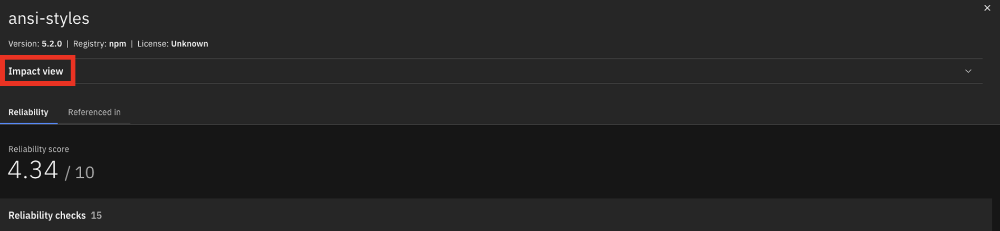

Click the [**Demo preparation**](demo-preparation) tab for setup instructions.

Introduction

Today, we'll explore how IBM Concert empowers both security teams and DevOps engineers to accelerate software composition analysis (SCA) and manage the risks associated with open-source and third-party libraries. We’ll see how Concert seamlessly integrates SCA into the application lifecycle, ensuring continuous visibility and proactive management of vulnerabilities and license risks throughout development and deployment.

By continuously assessing open-source components, Concert identifies outdated or vulnerable libraries and provides prioritized recommendations to address these issues. Additionally, Concert automates the detection of license violations, malicious maintainers and other security risks, simplifying the process of securing applications while reducing the burden on both security and DevOps teams.

Let’s get started.

 

<strong>1 - Software composition dashboard</strong>: Monitoring the security and compliance posture of open-source and third-party components

 

| **1.1** | **Uncover the open-source vulnerability landscape** |
| :--- | :--- |
| **Narration** | Meet the DevOps and security teams at Horizon Tech, who manage applications across different environments. As the number of applications has grown, including open-source and third-party libraries on multiple servers and cloud providers, it has become harder to track security and license risks. This increased complexity requires more resources and raises the chances of vulnerabilities and compliance issues.    IBM Concert helps these teams manage SCA more effectively by providing:    1. Real-time visibility into open-source risks across all environments   2. Automated scanning for vulnerabilities and license issues   3. Prioritized recommendations to address security risks quickly   4. Simplified evidence gathering, making it easier to demonstrate compliance. |
| **Action** &nbsp; 1.1.1 | Show the **Home** page, which you opened during demo preparation. Select the **Software composition** dimension.    |
| **Narration** | As Horizon Tech gears up to launch a new product, the security and DevOps teams must ensure all applications meet regulatory and security standards. By integrating Software Composition Analysis (SCA) into their workflow, IBM Concert streamlines vulnerability detection and license risk assessment. It automatically prioritizes risks, enabling swift remediation.    When teams log in to IBM Concert, they immediately see a real-time view of the organization's open-source risks across all environments. Concert highlights 9 versions (2%) of components with known vulnerabilities, 108 versions (27%) with outdated risks, and 1 version with support risks.    This helps teams quickly focus on the most critical issues, speeding up fixes, ensuring compliance, and improving application security. It also allows teams to prioritize risks efficiently, helping to ensure a smooth product launch. |
| **Action** &nbsp; 1.1.2 | Scroll down the home page to show the **Least reliable package versions** and **Most used licenses** graphs.    |
| **Narration** | In addition to identifying critical risks, IBM Concert provides further insights into the reliability and licensing of package versions.    The 'Least reliable package versions' chart highlights components with low reliability scores (e.g., gensync v1.0.0, deepmerge v4.3.1), helping teams prioritize their updates to improve system stability. The 'Most used licenses' chart reveals that MIT license is the most commonly used license, followed by Apache 2.0 and GPL v3. This ensures teams maintain compliance with widely accepted open-source licenses, mitigating potential legal risks while integrating third-party components. |
| **Action** &nbsp; 1.1.3 | Scroll down the home page to show the **Lastest recommendations** table.    |
| **Narration** | Just below, IBM Concert provides a detailed table with the latest recommendations, offering clear actions to address risks. It lists packages like async v3.2.4 and axios v1.6.0, highlighting issues like 'Back-level' and 'Vulnerability,' and suggests actions like 'Upgrade package.'    This helps teams prioritize updates, focusing on security vulnerabilities and outdated components to keep their software stable and secure. Each recommendation is based on multiple SBOM (Software Bill of Materials) sources, with the last update time clearly shown to guide teams on what to do next. |

**[Go to top](#top)**

  

<strong>2 - Software composition analysis and details</strong>: Drilling down into individual security vulnerabilities, license compliance and versioning 

 

| **2.1** | **Examine recommendations in the Dimensions view** |
| :--- | :--- |
| **Action** &nbsp; 2.1.1 | Click **Dimensions** and then **Software composition**.       The **Software composition** detail view will appear:    |
| **Narration** | The Software composition detail view in IBM Concert offers a clear summary of the 393 total packages and associated risks, including the 118 flagged packages mentioned earlier. <  This view builds on previous discussions of key components like axios v1.6.0 and body-parser v1.19.2, emphasizing the need for immediate updates. It provides teams with a streamlined overview to prioritize remediation efforts and maintain application security without repeating details. Upcoming sections will further explore critical risks and actions.|
| **Action** &nbsp; 2.1.3 | Expand the sections for **axios v1.6.0** and **body-parser v1.19.2** to see the additional details.    |
| **Narration** | Detailed insights into axios v1.6.0 and body-parser v1.19.2 are provided – both flagged with critical Vulnerability risks. The team is advised to upgrade axios to v1.7.7 and body-parser to v1.20.3, enabling quick fixes to these security issues.   Visual cues make it easy to identify high-priority risks, simplifying the remediation process. This clear guidance helps teams quickly fix vulnerabilities, saving time and keeping applications secure.|

 

| **2.2** | **Examine packages lineage in the Dimensions view** |
| :--- | :--- |
| **Action** &nbsp; 2.2.1 | Click the **Packages** tab.    |
| **Narration** | As the team gets ready for the application launch, they focus on 225 packages flagged as "Behind recommended" (e.g., ansi-regex, ansi-styles), which could pose security risks. With Concert highlighting version status and reliability scores, the team can easily prioritize which components need immediate updates.   Concert offers the vital visibility needed to assess and act on these insights, helping the team focus on high-risk areas. By identifying outdated dependencies, it enables informed decisions to keep the application secure and ready for release. |
| **Action** &nbsp; 2.2.2 | Click **ansi-styles** (version 5.2.0).       The following pop-up window will appear:    |
| **Narration** | With a reliability score of 4.34/10, ansi-styles v5.2.0 has both strengths and weaknesses. It scores perfectly in critical areas like Binary-Artifacts, Dangerous-Workflow, License, and Vulnerabilities, but falls short in development practices such as Branch-Protection and Code-Review.   These gaps reduce the overall score and point to the need for stronger development safeguards. The recommendation is simple: improving these areas will make the package more secure for production use.   Looking closer at the reliability score, the weaknesses in development practices stand out. With a 0/10 score for branch protection, unreviewed changes could be merged, increasing risk. The code review process, scoring just 3/10, also leaves potential issues undetected.   Additionally, not pinning dependencies to specific versions raises the risk of unexpected or breaking changes. By improving these areas, the team can greatly boost the package’s reliability, making it more production-ready while maintaining its strong security features.|
| **Action** &nbsp; 2.2.4 | Click **Impact view** at the top of the window.     |
| **Narration** | The Impact view for ansi-styles v5.2.0 shows how the package is linked across the codebase. It reveals two source repositories, encoreapp and allegroapp-analytics, that depend on ansi-styles, giving a clear picture of where the package is being used. <  By mapping these dependencies, the team can see how issues with this package might affect different parts of the application. This helps them make better decisions when assessing risks and planning updates, ensuring that any changes are carefully considered across all impacted repositories.    With the package's impact now clear, the team moves from mapping dependencies in the Impact view to addressing flagged issues in the Recommendations view. Here, actionable steps emerge—whether upgrading ansi-styles or fixing vulnerabilities in other key packages. This shift from insight to action helps the team not only understand where a package fits into the codebase but also make targeted improvements to protect the entire application ecosystem. |

 

**[Go to top](#top)**

  

<strong>3 - Service ticket generation</strong>: Quickly mitigating open-source risks

 

| **3.1** | **Implement suggested actions** |
| :--- | :--- |
| **Narration** | With the flagged issues identified, the team proceeds to implement the suggested actions. This involves fixing vulnerabilities, updating outdated packages, and improving security practices based on the insights from the Recommendations view. By following these steps, the team ensures that key packages like ansi-styles are secure and aligned with best practices, strengthening the overall health of the codebase. |
| **Action** &nbsp; 3.1.1 | Click the **Recommendations** tab.    |
| **Narration** | With actionable insights in hand, the team clicks on the recommendations for async v3.2.4 and axios v1.6.0, both key to the application's data handling and HTTP requests. It's crucial to assess their impact.   By selecting these recommendations, the team can see which applications, like encoreapp and allegroapp-analytics, are affected. This allows them to focus their remediation efforts on specific applications, addressing security vulnerabilities and outdated versions where they matter most. |
| **Action** &nbsp; 3.1.2 | Click **axios v1.6.0**       The detailed view of **axios v1.6.0** will appear:    |
| **Narration** | The team is given more details on the vulnerability's impact, showing that both encoreapp and allegroapp-analytics are using the vulnerable version of axios.   The next step is to open tickets for each affected application, allowing the team to track the resolution process. These tickets ensure that the upgrade to axios v1.7.7 is properly managed, reducing vulnerability risks across the connected repositories and keeping the applications secure and up-to-date. |

 

| **3.2** | **Open a service ticket** |
| :--- | :--- |
| **Action** &nbsp; 3.2.1 | Click **Open ticket +** for the encoreapp       The **Open a ticket** pop-up window will appear:    |
| **Narration** | After identifying the affected applications, the team opens a ticket to address the vulnerability in axios v1.6.0. IBM Concert automatically generates the ticket details, including the recommendation to upgrade to axios v1.7.7, the justification based on the identified vulnerability, and the related SBOM information for encoreapp.   The team selects the appropriate ticketing system (GitHub, Jira, ServiceNow, or Salesforce) and assigns it to the responsible team members. This ensures that the necessary actions are tracked and resolved efficiently. |
| **Action** &nbsp; 3.2.3 | Click **Open** to proceed with the ticket opening.    |

**[Go to top](#top)**

  

Summary

We've shown how Concert helps teams manage Software Composition Analysis (SCA), identify vulnerable and outdated third-party dependencies, and streamline remediation. Previously, teams struggled with manual dependency tracking and fragmented tools, making it hard to evaluate the security and stability of open-source components.

Concert consolidates data across dependencies, offering clear visibility into packages' reliability and risks. By prioritizing vulnerabilities and outdated components, it provides actionable recommendations and simplifies ticket creation, enabling teams to proactively address risks and enhance the security of their software supply chain.

**[Go to top](#top)**

  

