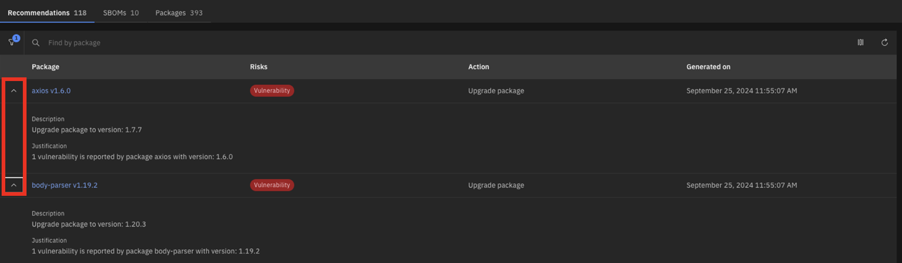
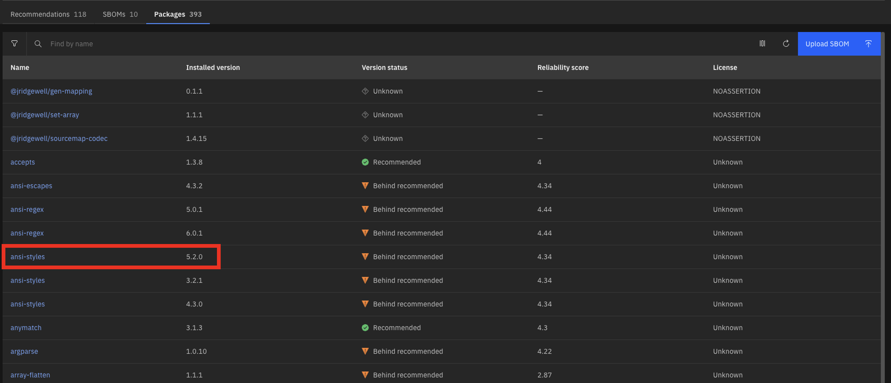
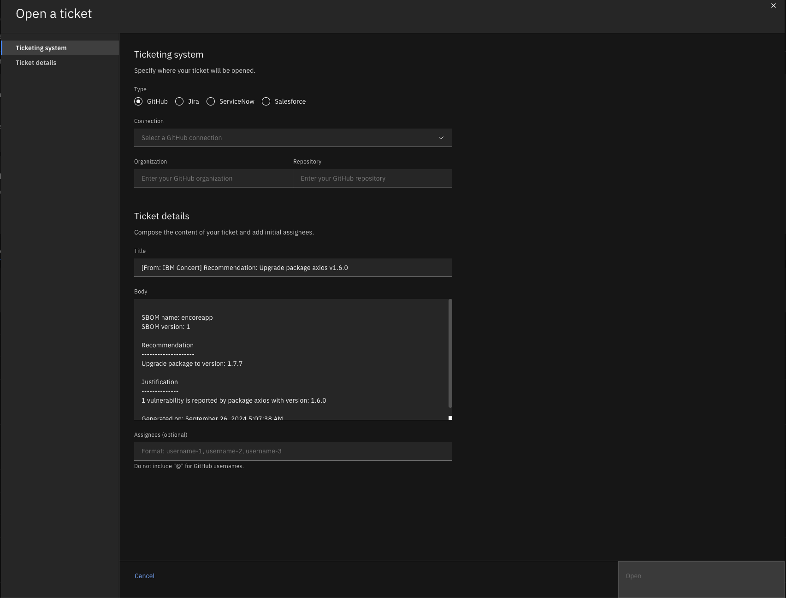

Click the [**Demo preparation**](demo-preparation) tab for setup instructions.

Introduction

Today, we'll explore how IBM Concert empowers both security teams and DevOps engineers to accelerate software composition analysis (SCA) and manage the risks associated with open-source and third-party libraries. We’ll see how Concert seamlessly integrates SCA into the application lifecycle, ensuring continuous visibility and proactive management of vulnerabilities and license risks throughout development and deployment.

By continuously assessing open-source components, Concert identifies outdated or vulnerable libraries and provides prioritized recommendations to address these issues. Additionally, Concert automates the detection of license violations, malicious maintainers and other security risks, simplifying the process of securing applications while reducing the burden on both security and DevOps teams.

Let’s get started.

 

<strong>1 - Software composition dashboard</strong>: Monitoring the security and compliance posture of open-source and third-party components

 

| **1.1** | **Uncover the open-source vulnerability landscape** |
| :--- | :--- |
| **Narration** | Meet the DevOps and security teams at Horizon Tech, who manage applications across different environments. As the number of applications has grown, including open-source and third-party libraries on multiple servers and cloud providers, it has become harder to track security and license risks. This increased complexity requires more resources and raises the chances of vulnerabilities and compliance issues.  
IBM Concert helps these teams manage SCA more effectively by providing: 
1. Real-time visibility into open-source risks across all environments; 
2. Automated scanning for vulnerabilities and license issues;
3. Prioritized recommendations to address security risks quickly and;
4. Simplified evidence gathering, making it easier to demonstrate compliance. |
| **Action** &nbsp; 1.1.1 | Show the **Home** page, which you opened during demo preparation. Select the **Software composition** dimension.    |
| **Narration** | As Horizon Tech gears up to launch a new product, the security and DevOps teams must ensure all applications, especially those using open-source components, meet regulatory and security standards. By integrating Software Composition Analysis (SCA) into their workflow, IBM Concert streamlines vulnerability detection and license risk assessment. It automatically prioritizes risks, enabling swift remediation.    When teams log in to IBM Concert, they get an instant, real-time view of the organization's open-source risk landscape across all environments. Concert flags 9 versions (2%) of open-source and third-party components with known vulnerabilities, 108 versions (27%) with back-level risks and 1 version with support risks, allowing teams to quickly focus on critical issues. This targeted approach accelerates remediation, ensures compliance and strengthens application security, all while enabling teams to prioritize and address risks efficiently, ensuring a smooth product launch. |
| **Action** &nbsp; 1.1.2 | Scroll down the home page to show the **Least reliable package versions** and **Most used licenses** graphs.    |
| **Narration** | In addition to identifying critical risks, IBM Concert provides further insights into the reliability and licensing of package versions.    The 'Least reliable package versions" chart highlights components with low reliability scores (e.g., gensync v1.0.0, deepmerge v4.3.1), helping teams prioritize their updates to improve system stability.    The 'Most used licenses' chart reveals that MIT license is the most commonly used license, followed by Apache 2.0 and GPL v3. This ensures teams maintain compliance with widely accepted open-source licenses, mitigating potential legal risks while integrating third-party components. |
| **Action** &nbsp; 1.1.3 | Scroll down the home page to show the **Lastest recommendations** table.    |
| **Narration** | Immediately below, IBM Concert provides a detailed table of the latest recommendations, offering clear, actionable insights for addressing risks. The table lists packages like async v3.2.4 and axios v1.6.0, indicating risks such as 'Back-level' and 'Vulnerability,' along with the recommended action to 'Upgrade package.' This allows teams to prioritize updates, focusing on both security vulnerabilities and outdated components to ensure the stability and security of their software. Each recommendation is generated based on multiple SBOM (Software Bill of Materials) sources, with the last update timestamp clearly provided to guide teams on immediate next steps.|

**[Go to top](#top)**

  

<strong>2 - Software composition analysis and details</strong>: Drilling down into individual security vulnerabilities, license compliance and versioning 

 

| **2.1** | **Examine recommendations in the Dimensions view** |
| :--- | :--- |
| **Action** &nbsp; 2.1.1 | Click **Dimensions** and then **Software composition**.       The **Software composition** detail view will appear:    |
| **Narration** | The Software composition detail view in IBM Concert offers a clear summary of the 393 total packages and associated risks, including the 118 flagged packages mentioned earlier.    This view builds on previous discussions of key components like axios v1.6.0 and body-parser v1.19.2, emphasizing the need for immediate updates. It provides teams with a streamlined overview to prioritize remediation efforts and maintain application security without repeating details. Upcoming sections will further explore critical risks and actions.|
| **Action** &nbsp; 2.1.3 | Expand the sections for **axios v1.6.0** and **body-parser v1.19.2** to see the additional details.    |
| **Narration** | Detailed insights into axios v1.6.0 and body-parser v1.19.2 are provided – both flagged with critical Vulnerability risks. Clear upgrade actions to secure versions, such as upgrading axios to v1.7.7 and body-parser to v1.20.3, ensure the team can swiftly address these security gaps.    The visual cues make it easy to spot high-priority risks, streamlining the remediation process. This direct, actionable guidance empowers teams to quickly resolve vulnerabilities, saving time and maintaining robust security across applications.|

 

| **2.2** | **Examine packages lineage in the Dimensions view** |
| :--- | :--- |
| **Action** &nbsp; 2.2.1 | Click the **Packages** tab.    |
| **Narration** | As the team prepares for the application launch, attention turns to the 225 packages flagged as 'Behind recommended' (e.g., ansi-regex, ansi-styles), which may introduce security risks. With Concert’s ability to surface key insights like version status and reliability scores, the team can prioritize which components need immediate attention.    Concert provides the crucial visibility needed to assess and act on these insights, guiding the team to focus on high-risk areas. By identifying outdated dependencies, it allows teams to make informed decisions, ensuring the application remains secure and ready for release. |
| **Action** &nbsp; 2.2.2 | Click **ansi-styles** (version 5.2.0).       The following pop-up window will appear:    |
| **Narration** | With a reliability score of 4.34/10, ansi-styles v5.2.0 shows a mix of strengths and areas for improvement. While it scores high in critical categories (e.g., Binary-Artifacts, Dangerous-Workflow, License, Vulnerabilities), securing perfect 10's in these areas, it falls short in development practices like Branch-Protection and Code-Review. These gaps lower the overall score and highlight the need for better development safeguards. The recommendation is clear: By addressing these weaknesses, the package can become more robust and secure for production use.    Diving deeper into the reliability score, the gaps in development practices become more apparent. The lack of branch protection, with a score of 0/10, means risky, unreviewed changes could be merged. Meanwhile, the minimal code review process, scoring just 3/10, leaves room for undetected issues. Additionally, dependencies aren’t pinned to specific versions, adding further risk of introducing unexpected or breaking changes. By focusing on strengthening these areas, the team can significantly enhance the package’s overall reliability, ensuring it’s better prepared for production while building on its existing security strengths.|
| **Action** &nbsp; 2.2.4 | Click **Impact view** at the top of the window.     |
| **Narration** | Clicking the Impact view for ansi-styles v5.2.0 reveals how the package is connected across the codebase. This visualization shows two source repositories (encoreapp and allegroapp-analytics) that rely on ansi-styles, providing a clear view of where the package is being used.    By mapping these dependencies, the team gains insights into how potential issues with this package could impact different parts of the application. This allows for more informed decisions when evaluating risks and planning updates, ensuring any changes to the package are thoroughly considered across all affected repositories.    With the package's impact across repositories clear, the next step is to ensure those connections aren’t affected by underlying risks. The team transitions from mapping dependencies in the Impact view to addressing flagged issues by exploring the Recommendations view. Here, actionable insights surface — whether it’s upgrading ansi-styles or resolving vulnerabilities in other key packages. This shift from insight to action allows the team to not just understand where a package fits into the broader codebase but also make targeted improvements, safeguarding the entire application ecosystem. |

 

**[Go to top](#top)**

  

<strong>3 - Service ticket generation</strong>: Quickly mitigating open-source risks

 

| **3.1** | **Implement suggested actions** |
| :--- | :--- |
| **Narration** | With the flagged issues identified, the team moves on to implementing the suggested actions. This phase involves addressing specific vulnerabilities, updating outdated packages and improving security practices based on the insights provided in the Recommendations view. By following these steps, the team ensures critical packages like ansi-styles are not only secure but also aligned with best practices, reinforcing the overall health of the codebase. |
| **Action** &nbsp; 3.1.1 | Click the **Recommendations** tab.    |
| **Narration** | Now, with the actionable insights in view, the team moves forward by clicking the recommendations for async v3.2.4 and axios v1.6.0. These flagged packages are crucial to the application’s data handling and HTTP requests, so it's vital to assess their impact.    By selecting these recommendations, the team can see exactly which applications like encoreapp and allegroapp-analytics are affected. This allows them to focus their remediation efforts on specific applications, ensuring security vulnerabilities and outdated versions are addressed where they matter most. |
| **Action** &nbsp; 3.1.2 | Click **axios v1.6.0**       The detailed view of **axios v1.6.0** will appear:    |
| **Narration** | The team is presented with more details on the impact of the vulnerability. It clearly shows that both encoreapp and allegroapp-analytics are using this version of axios.    The next step involves opening tickets for each affected application, allowing the team to track the resolution process. These tickets will ensure the upgrade to axios v1.7.7 is properly managed, reducing the vulnerability risks across the connected repositories and ensuring the applications remain secure and up-to-date. |

 

| **3.2** | **Open a service ticket** |
| :--- | :--- |
| **Action** &nbsp; 3.2.1 | Click **Open ticket +** for the encoreapp       The **Open a ticket** pop-up window will appear:    |
| **Narration** | After identifying the affected applications, the team proceeds to open a ticket to address the vulnerability in axios v1.6.0.    Here, IBM Concert automatically generates the relevant details for the ticket, including the recommendation to upgrade to axios v1.7.7, the justification based on the identified vulnerability and the associated SBOM information for encoreapp.    The team selects the appropriate ticketing system (GitHub, Jira, ServiceNow or Salesforce) and assigns it to the responsible team members. This step ensures the necessary actions are tracked and resolved efficiently. |
| **Action** &nbsp; 3.2.3 | Click **Open** to proceed with the ticket opening.    |

**[Go to top](#top)**

  

Summary

We’ve demonstrated how Concert supports teams in managing SCA, identifying vulnerable and outdated third-party dependencies and streamlining remediation. Previously, teams faced challenges with manual dependency tracking and fragmented tools, making it difficult to assess the security and stability of open-source components.

Concert unifies data across dependencies, providing visibility into packages' reliability and risks. By prioritizing vulnerabilities and outdated components, it offers clear recommendations and simplifies ticket creation, allowing teams to proactively address risks and improve the overall security posture of their software supply chain.

**[Go to top](#top)**

  

