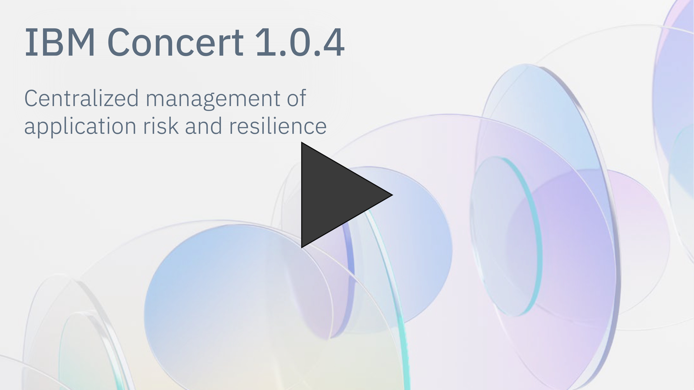
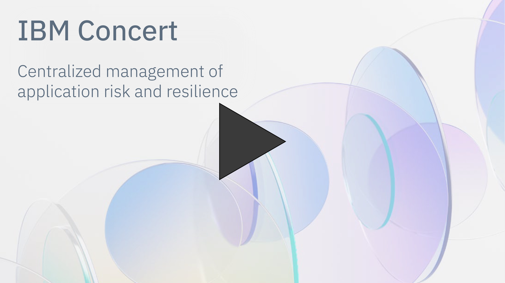
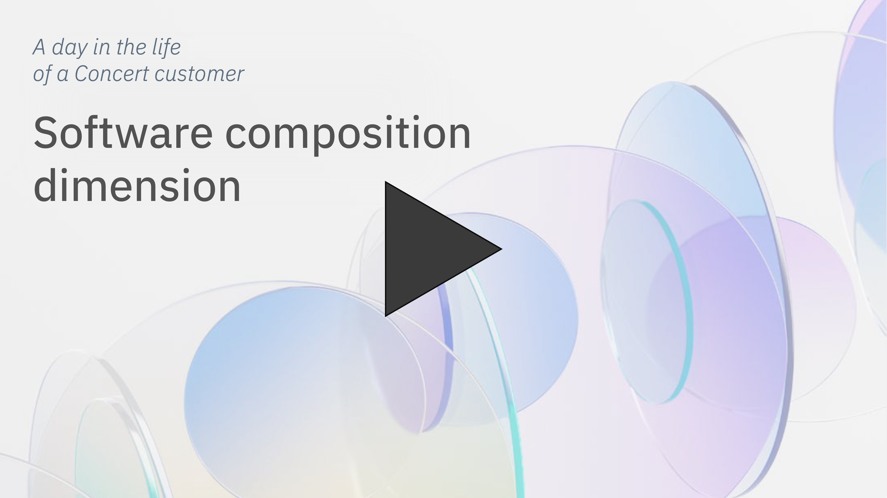
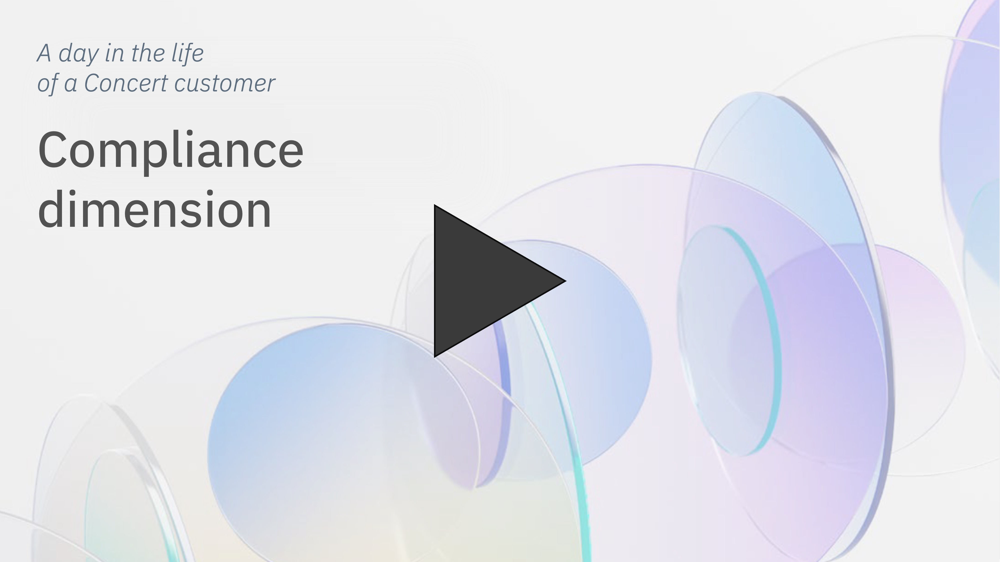
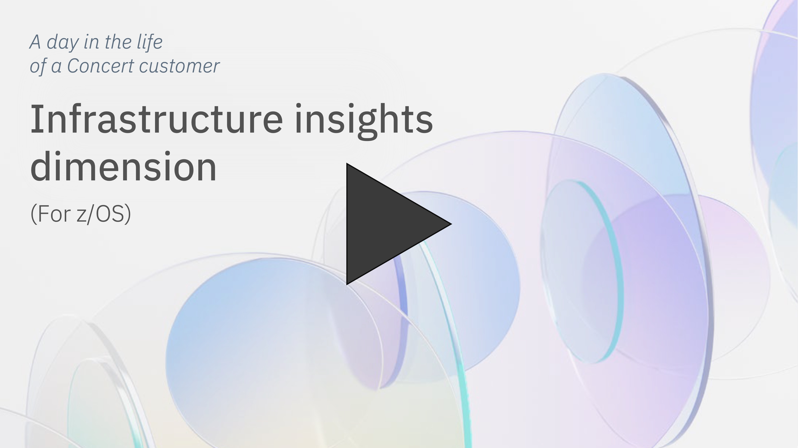

 

### **TABLE OF CONTENTS**

1. [Tech Sales demo environment (currently 1.0.4)](#demo-environment)
2. [Concert end-to-end enablement video (1.0.4)](#enablement-video)
3. [Technical office hours](#office-hours)
4. [Customer-facing demo videos](#demo-videos)
5. [Data ingestion demos (updated for 1.0.4)](#data-ingestion)
6. [Concert 1.0.4 template on TechZone](#template-techzone)
7. [Proof of Value/Proof of Concept materials](#pov-poc-materials)

***

 

### **1. TECH SALES DEMO ENVIRONMENT (CURRENTLY 1.0.4)**

Credentials:
- Username: concertuser
- Password: password

<a href="https://9.30.214.214:12443/#/" target="_blank" rel="noreferrer"><button class="ibm-button">Click here to access the environment</button></a>

Important notes:
- **For Tech Sellers and other IBM technical professionals**: This environment is only for demos and self-education. It should not be used for PoCs.
- **IBM VPN**: In order to access the demo environment, you MUST be logged into the IBM VPN.
- **Shared environment**: This is a shared environment. Please DO NOT import data or create automation rules.
- **Maintenance windows**: This is a persistent environment. We will advertise maintenance windows at the top of this page when we upgrade to each subsequent version.
- **Sample data**: The environment contains a complete set of sample data. If you open the tour, DO NOT load the default sample data (click  <strong>Not now</strong>).     

 

### **2. CONCERT END-TO-END ENABLEMENT VIDEO (1.0.4)**

Comprehensive video that covers all dimensions of IBM Concert 1.0.4:   

<!-- <video width="500" height="250" controls>
  <source src="videos/Concert-104-Demo.mp4" type="video/mp4">
Your browser does not support the video tag.
</video> -->

 

### **3. TECHNICAL OFFICE HOURS**

We hold two office hours per week to accommodate time zones. Please bring your technical questions about demos, the demo environment, data ingestion and other topics.

<!-- | **Region** | **URL** |
| :--- | :--- |
| **Americas & Australia**    Mondays, 5:00-5:30 PM ET | Click <a href="https://ec.yourlearning.ibm.com/w3/event/10463907" target="_blank" rel="noreferrer">here</a> to sign up for the office hours. |
| **Asia & Europe**    Tuesdays, 9:00-9:30 AM GMT | Click <a href="https://ec.yourlearning.ibm.com/w3/event/10463907" target="_blank" rel="noreferrer">here</a> to sign up for the office hours. | -->

  

    <h3>Americas & Australia</h3>
    
<strong>Mondays</strong>

    
2:00-2:30 PM Pacific Time

    
5:00-5:30 PM Eastern Time

    
9:00-9:30 AM Australian Eastern Time (Tuesday mornings)

    
Click <a href="https://ec.yourlearning.ibm.com/w3/meeting/10488384" target="_blank" rel="noreferrer">here</a> to sign up for the office hours.

  

  

    <h3>Europe & Asia</h3>
    
<strong>Tuesdays</strong>

    
9:00-9:30 AM Greenwich Mean Time

    
5:00-5:30 PM Singapore Standard Time

    
6:00-6:30 PM Japan Standard Time

    
Click <a href="https://ec.yourlearning.ibm.com/w3/meeting/10488386" target="_blank" rel="noreferrer">here</a> to sign up for the office hours.

  

 

### **4. CUSTOMER-FACING DEMO VIDEOS**

**Primary customer-facing video**
includes gen AI, App360, vulnerability, certificates and workflows)

 |

| **Use case** | **Video** |
| :--- | :--- |
| **Software composition dimension**    Can be shown after primary video (above) for customers interested in software composition |  |
| **Compliance dimension**    Can be shown after primary video (above) for customers interested in compliance |  |
| **Infrastructure insights dimension for z/OS**    Can be shown after primary video (above) for customers interested in infrastructure insights for z/OS |  |

<inline-notification text="If you need a video with a specific combination of Concert's dimensions (e.g., a video for vulnerability and compliance), please contact Maryam (maryama@ca.ibm.com)."></inline-notification>

 

### **5. DATA INGESTION DEMOS (UPDATED FOR 1.0.4)**

| **Demo** | **URL** |
| :--- | :--- |
| Manual data ingestion | *Coming soon* |
| Tekton pipeline data ingestion | Click <a href="https://ibm.github.io/platinum-demos/tech-sales-enablement-learning-to-ingest-data-into-ibm-concert-pipeline/pre-requisites" target="_blank" rel="noreferrer">here</a> |
| Customizing a customer's pipeline | Click <a href="https://ibm.github.io/platinum-demos/tech-sales-enablement-customizing-customers-CICD-pipeline-for-ibm-concert/demo-instructions" target="_blank" rel="noreferrer">here</a> |
| Jenkins pipeline data ingestion | *Coming soon* |

 

### **6. CONCERT 1.0.4 TEMPLATE ON TECHZONE**

<a href="https://techzone.ibm.com/collection/tech-zone-certified-base-images/journey-watsonx" target="_blank" rel="noreferrer"><button class="ibm-button">Click here to access the TechZone template</button></a>

 

### **7. PROOF OF VALUE/PROOF OF CONCEPT MATERIALS**

  

    <h3>Vulnerability</h3>
    
<a href="https://ibm.ent.box.com/s/y7gd01k4kxa3szw7fdetyp025thfnjvt" target="_blank" rel="noreferrer">Vulnerability PoV</a>

    
<a href="https://ibm.box.com/s/axxx4dlhtjshxueqxss5sly4xvz50f68" target="_blank" rel="noreferrer">Vulnerability ROI Calculator</a>

  

  

    <h3>Certificates</h3>
    
<a href="https://ibm.box.com/s/03hc23ea6n7oadactmi2ko9xnhixcmw5" target="_blank" rel="noreferrer">Certificates ROI Calculator</a>

  

**[Go to top](#table-of-contents)**