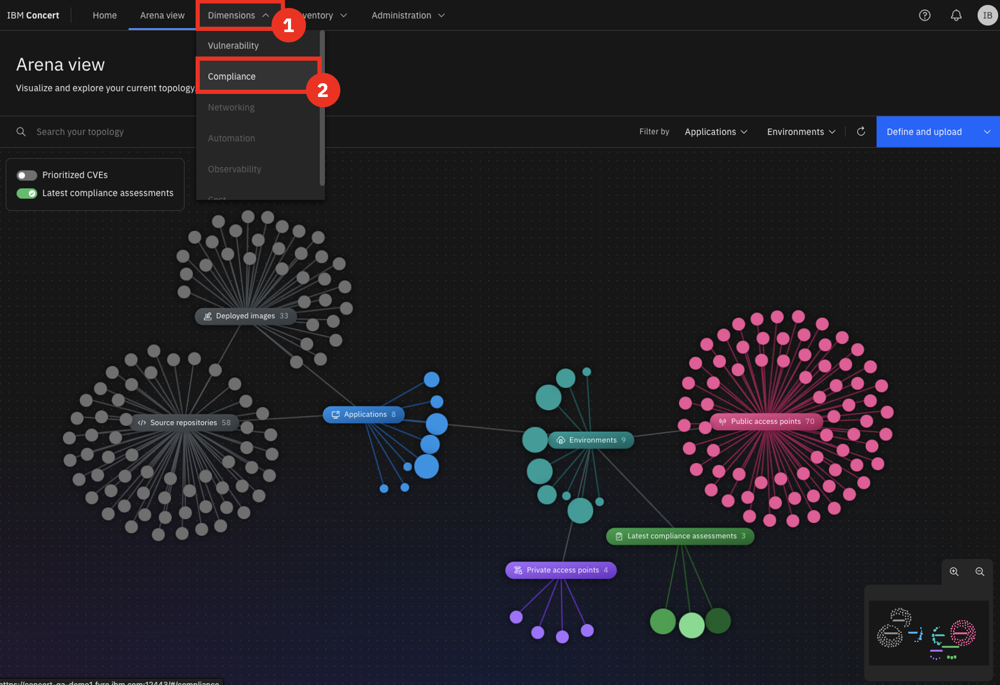
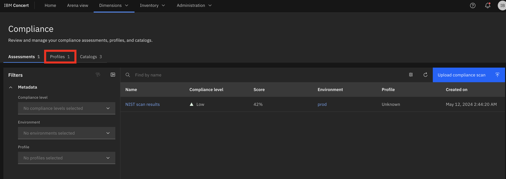
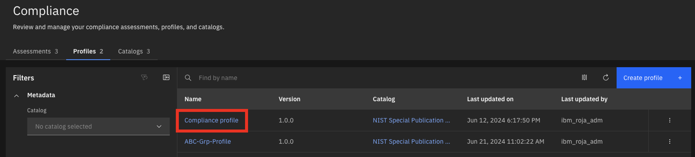
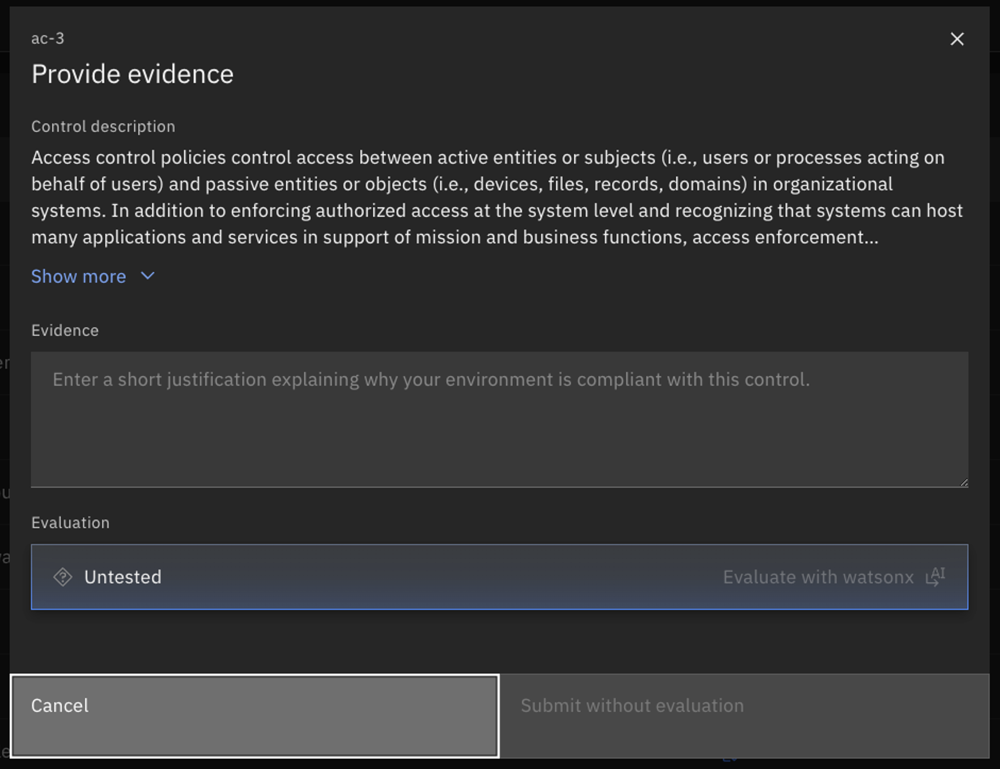
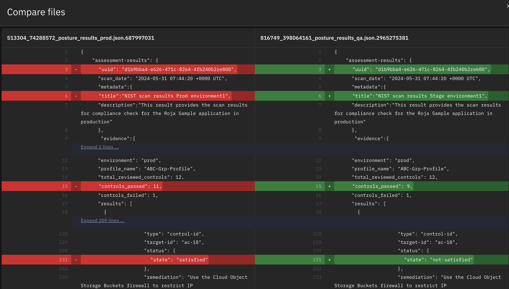

Click the [**Demo preparation**](demo-preparation) tab for setup instructions.

Introduction

As the application portfolio has expanded at Focus Corp, so has its complexity. The compliance manager oversees these applications distributed across various environments. These applications operate across multiple servers and cloud platforms, increasing both the resources needed for compliance tracking and the risk of non-compliance. 

Today, we’ll dive into how IBM Concert supports the compliance manager in streamlining application compliance tracking and ensuring alignment with evolving standards.

 

<strong>1 - Compliance dashboard</strong>: An overview of compliance assessments

 

| **1.1** |  |
| :--- | :--- |
| **Narration** | Upon logging into Concert, the compliance manager gains a comprehensive overview of the organization’s compliance posture. This unified dashboard displays compliance assessments alongside the corresponding application environments. |
| **Action** &nbsp; 1.1.1 | Show the **Home** page, which you opened during demo preparation. Select the **Compliance** dimension.    |
| **Narration** | From the compliance dashboard, the compliance manager identifies a compliance assessment with a low score. To gain more context, they can navigate to the arena to view details such as the environment where the assessment was conducted and the applications running within that environment. |
| **Action** &nbsp; 1.1.2 | Click **Arena view**.    |
| **Action** &nbsp; 1.1.3 | Click the **Latest compliance assessments** switch.    |
| **Narration** | In the **Arena View**, the compliance manager views a summary of assessments across all application environments. Lighter green circles indicate environments with lower compliance scores, while darker green circles represent those with higher compliance ratings. |
| **Action** &nbsp; 1.1.4 | Right Click on a compliance assessment circle, and select show relationship.    |
| **Narration** | By viewing the relationships associated with the compliance assessment, the compliance manager can quickly identify the environment where the assessment was conducted. |
| **Action** &nbsp; 1.1.5 | Right Click on the environment, and select **Add to Environment Filter**      Then clear the compliance assessment from the search bar to display all data associated with that environment.      |
| **Narration** | This **Arena View** will help the compliance manager gain more context for the assessment which will help them determine the criticality of unassessed controls. |

**[Go to top](#top)**

  

<strong>4 - Compliance assessments</strong>: Reviewing compliance results

 

| **2.1** |  |
| :--- | :--- |
| **Narration** | After gaining the environmental context from the **Arena View**, the compliance manager may determine that this compliance assessment is critical to address immediately. To further investigate, they navigate to the compliance dimension page to view the assessment details. |
| **Action** &nbsp; 2.1.1 | Click **Dimensions** (1) and select **Compliance** (2).    |
| **Narration** | Compliance assessments are used by the compliance manager to evaluate whether an organization's information systems align with the security controls specified in compliance profiles. Focus Corp employs an automated compliance scanning tool that complies with NIST 800-53 standards. Popular tools in this space include OpenSCAP, Tenable.io (Nessus), Qualys, Rapid7 InsightVM, and AWS Config Rules.  Once a compliance scan is completed, the tool generates a report outlining the compliance status for each NIST 800-53 control. The compliance manager then uploads these assessment scans in OSCAL format to be managed and reviewed within Concert. |
| **Action** &nbsp; 2.1.2 | Click the first assessment to open it.       The following **NIST scan results** screen will appear:    |
| **Narration** | The scan results provide a detailed breakdown of the assessment, highlighting which controls are compliant and which ones are non-compliant. This allows the compliance manager to quickly identify areas of concern and prioritize remediation. |

**[Go to top](#top)**

  

<strong>2 - Compliance requirements</strong>: Tuning compliance requirements to fit an organizations needs 

 

| **3.1** |  |
| :--- | :--- |
| **Narration** | While reviewing the compliance assessment, the compliance manager may have noticed that some of the failing controls arent specific to Focus Corps organizational needs.   At Focus Corp, the organization has a mandatory requirement to follow the NIST SP 800-53 framework. While this framework is mandatory for U.S. federal agencies and contractors to protect critical data, private organizations like Focus Corp can also implement it.   NIST SP 800-53 provides a comprehensive catalog of security and privacy controls related to information systems. |
| **Action** &nbsp; 3.1.1 | Click the **Catalogs** tab.    |
| **Narration** | Concert handles compliance catalogs within the Compliance dimension, with NIST SP 800-53 preloaded into the platform. NIST and other compliance standards utilize the OSCAL (Open Security Controls Assessment Language) format.   Examples of other standards available within IBM Concert are:   **FedRAMP** (Federal Risk and Authorization Management Program)   **PCI-DSS** (Payment Card Industry Data Security Standard)   **SOC 2** (Service Operation Control Type 2)   **CMS ARS** (CMS Acceptable Risk Safeguards)   The compliance manager reviews Concert’s catalog list, confirming the appropriate NIST catalog is available.   If the correct catalog was missing, the compliance manager could easily add any compliance catalog standard to Concert that adheres to the OSCAL format. |
| **Action** &nbsp; 3.1.2 | Click **Upload catalog**.       The following **Upload catalog** screen will appear:    |
| **Narration** | Since the NIST SP 800-53 catalogs come preloaded into Concert, the compliance manager does not need to import any additional catalogs at this time. |
| **Action** &nbsp; 3.1.3 | Click **Cancel**.    |
| **Narration** | Next the compliance manager will ensure the compliance profile has the correct controls enabled. A compliance profile consists of a tailored set of security controls designed to meet the unique security requirements of an organization. By categorizing control baselines from compliance catalogs into profiles, Focus Corp can address their individual compliance needs more effectively. |
| **Action** &nbsp; 3.1.4 | Select the **Profiles** tab.    |
| **Narration** | When a profile is selected, the compliance manager views its controls. |
| **Action** &nbsp; 3.1.5 | Click **Compliance profile**.       The following **Compliance profile** screen will appear:    |
| **Action** &nbsp; 3.1.6 | Click **X** to close the **Compliance profile** screen.    |
| **Narration** | Compliance controls are specific safeguards or practices implemented by organizations to ensure adherence to legal, regulatory, and internal standards for data protection and security. These controls help mitigate risks and enhance overall security posture. |
| **Action** &nbsp; 3.1.7 | Click **Create profile**.       The following **Create profile** screen will appear:    |
| **Action** &nbsp; 3.1.8 | In the **Name** field, enter '**Global Profile**' (1). Select any catalog for the **Select Catalog** field (2). Select some controls in the **Select controls** field (3).    |
| **Narration** | The compliance manager creates the profile by selecting the required controls from a catalog. |
| **Action** &nbsp; 3.1.9 | Click **Cancel**.    |

**[Go to top](#top)**

  

<strong>5 - WatsonX</strong>: Recieving guidance on how to resolve controls

 

| **5.1** | |
| :--- | :--- |
| **Narration** | After uploading new compliance results to align with the refined compliance profile, the compliance manager observes that some controls remain non compliant. To gain further insights, they utilize watsonx for guidance on addressing the specific controls. |
| **Action** &nbsp; 5.1.1 | Click the **Catalogs** tab.    |
| **Action** &nbsp; 5.1.2 | Click the first catalog.       The following screen will appear:    |
| **Narration** | For each catalog, the compliance manager views the compliance controls. |
| **Action** &nbsp; 5.1.3 | Click to open the first control.    |
| **Narration** | Concert provides detailed information for each control, including descriptions of what is required to meet compliance. However, the compliance manager may need additional context to fully understand how these requirements apply to the target environment. |
| **Action** &nbsp; 5.1.4 | Click the **AI** icon.   . |
| **Narration** | The compliance manager may want to know the impact of a specific control in Focus Corp's kubernetes infrastructure. |
| **Action** &nbsp; 5.1.5 | Type '**How does ac-1 impact my kubernetes cluster?**' into the chatbot.    |
| **Action** &nbsp; 5.1.6 | To avoid making any potentioal mistakes in the Focus Corp, the compliance manager consults the chatbot asking what do other companies do wrong with this control? |
| **Action** &nbsp; 5.1.7 | Type '**What are organizations doing wrong when they are non compliant with ac-1?**' into the chatbot.    |
| **Action** &nbsp; 5.1.6 | Given the limited budget for compliance at Focus Corp, the compliance manger seeks to understand the most cost effective way of implementing this control. |
| **Action** &nbsp; 5.1.7 | Type '**What is the most cost effective way to implement this control?**' into the chatbot.    |
| **Action** &nbsp; 5.1.8 | The compliance manager now switches focus to another control that is failing. |
| **Action** &nbsp; 5.1.9 | Type '**For control ac-2.12 whats the best technical way to monitor for atypical usage?**' into the chatbot.    |
| **Narration** | Since WatsonX recommended UEBA software, now the compliance manager now wants to know what vendors are offering UEBA. |
| **Action** &nbsp; 5.1.10 | Type '**What vendor is the best for UEBA?**' into the chatbot.    |
| **Narration** | Again since the compliance team have a limited budget, the compliance manager may now want to know the average cost of implementing UEBA in an enterprise. |
| **Action** &nbsp; 5.1.11 | Type '**How much does it cost to implement UEBA in an enterprise?**' into the chatbot.    |
| **Narration** | Concert features an interactive chatbot that uses generative AI to facilitate in-depth discussions about compliance controls. This tool allows compliance managers to engage in natural language conversations, making it easier to explore specific compliance requirements and how they relate to the target environment. The chatbot is powered by IBM’s Granite language model, which is pre-trained for dynamic interactions on compliance topics. |
| **Action** &nbsp; 5.1.12 | Click **X** to close the chatbot window.    |
| **Action** &nbsp; 5.1.13 | Click **X** to close the catalog.    |
| **Narration** | The assessment scan results identify which controls are compliant and which are not. After reviewing the results, the compliance manager updates the non-compliant controls by providing appropriate evidence. |
| **Action** &nbsp; 5.1.14 | Navigate back to the Assessments tab and Click on the first assessments name. For the **Access Enforcement** control, click the **menu** icon and then click **Provide evidence**.       The following **Provide evidence** screen will appear:    |
| **Narration** | Concert uses watsonx to assist the compliance manager with documentation by evaluating the evidence statements and indicating whether they are sufficient to satisfy the requirements of the compliance control. |
| **Action** &nbsp; 5.1.15 | In the **Evidence** field, type '**Change request approved for implementing network policies**' (1). Click **Evaluate with watsonx** (2).       The following screen will appear:    |
| **Narration** | Concert uses its deep understanding of the NIST control to verify that this evidence would satisfy the compliance requirements. |

**[Go to top](#top)**

  

<strong>5 - Evidence store</strong>: Tracking and auditing changes

 

| **6.1** |  |
| :--- | :--- |
| **Action** &nbsp; 6.1.1 | Click **Inventory** (1) and select **Evidence store** (2).       The following **Evidence store** screen will appear:    |
| **Narration** | As activities occur and data is updated, Concert continuously keeps the ‘Evidence Store’ current. This store functions as a comprehensive change log, tracking key details such as CVE resolution progress, compliance status, and delivered applications.  During software audits, gathering and presenting all necessary information to demonstrate compliance can be extremely time-consuming. With Concert, however, all relevant data is automatically collected and stored in the ‘Evidence Store,’ significantly streamlining the audit process.  For instance, it allows users to easily track completed compliance assessments and view changes over time, enhancing visibility and accountability. |
| **Action** &nbsp; 6.1.2 | Click **Compliance assessment** under the chart.       The following screen will appear:    |
| **Action** &nbsp; 6.1.3 | <inline-notification text="There is currently only one compliance assessment loaded into the demo environment. For now, you will need to skip these final actions."></inline-notification> Select the last two assessments (1) and then select **Compare** (2).       The following screen will appear:    |
| **Narration** | Concert compares the two selected compliance assessments, highlighting the differences. It compares the total number of controls that passed in each assessment and the results for each specific control. |

**[Go to top](#top)**

  

Summary

We've demonstrated how Concert seamlessly integrates compliance monitoring throughout the application lifecycle, ensuring that adherence to standards is maintained as applications evolve. By incorporating compliance considerations during application development, Concert helps prevent costly post-deployment rework, fostering a proactive compliance culture within teams.

**[Go to top](#top)**

  

