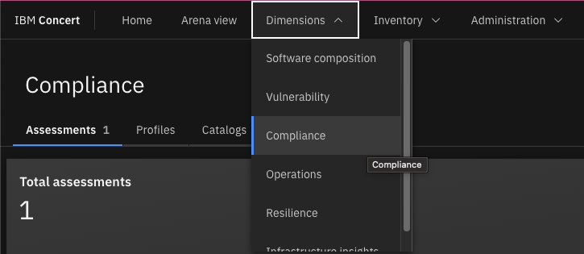
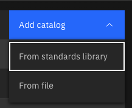
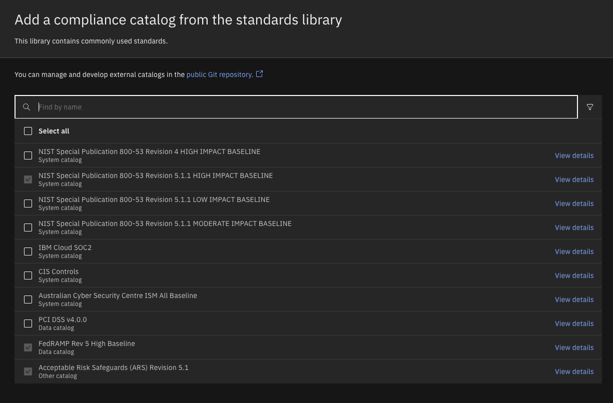
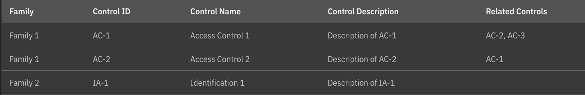
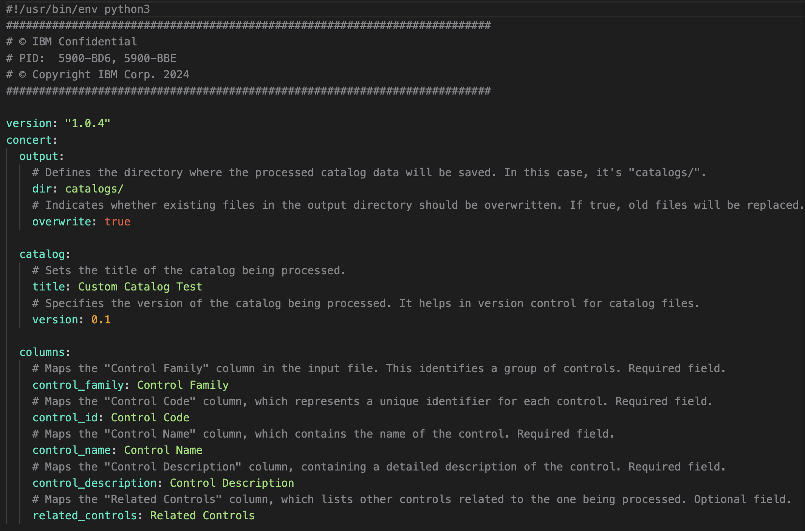
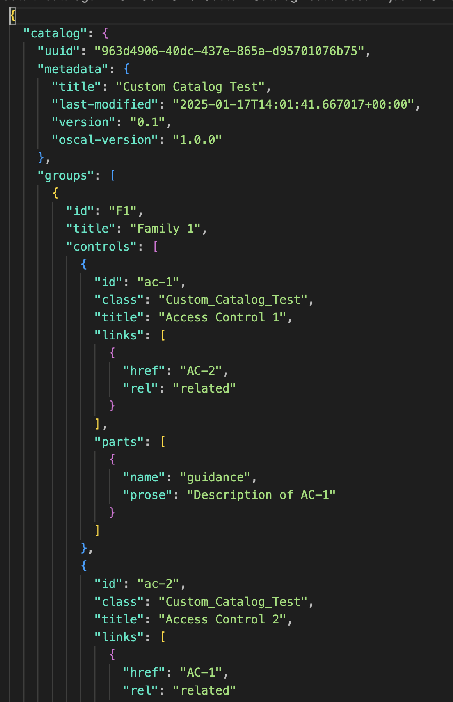
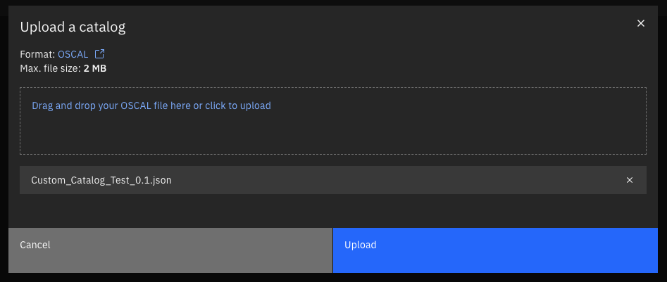

### Introduction

In this demo, we will walk through how to create a compliance catalog from a csv.

For our demo, we will download the concert toolkit, format a CSV with compliance controls and then run the concert toolkit to conver the csv into OSCAL json format.

### **Pre-requisites**

Below is a list of pre-requisites that need to be setup prior to beginning this PoV.

* Docker or Podman
* Microsoft Excel
* Compliance catalog which the customer is using

### 1 - Creating a compliance catalog

**1.1:** Navigate to the **Compliance** dimension within Concert   

**1.2:** Click the **Catalogs** tab   

**1.3:** Click **Add catalog** and then **From standards library**   

**1.4:** If the customer needs a pre-defined compliance catalog from Concert, select one from this list:   

**1.5:** If the customers compliance catalog is not listed, create one with the Concert toolkit.

Define a CSV to Excel file with the following format:   

Click <a href="./images/DORA_Compliance_Controls.csv" target="_blank" rel="noreferrer">here</a> for an example CSV from DORA Compliance.

Define a config file for the Concert toolkit in the following format:   

Click <a href="./images/config.yaml" target="_blank" rel="noreferrer">here</a> for an example YAML file.

Run the Concert toolkit with the following command:

<code>docker run -v .:/data/src -v ./toolkit-data:/toolkit-data icr.io/cpopen/ibm-concert-toolkit:latest /bin/bash -c "compliance-catalog" --input-file ./toolkit-data/DORA_Compliance_Controls.csv --config-file /toolkit-data/config.yaml"</code>

The output will be a compliance catalog OSCAL json:   

**2.6:** In the Concert UI, click **Add catalog**, then **From file** and upload the json file which was created   

 

**[Go to top](#top)**