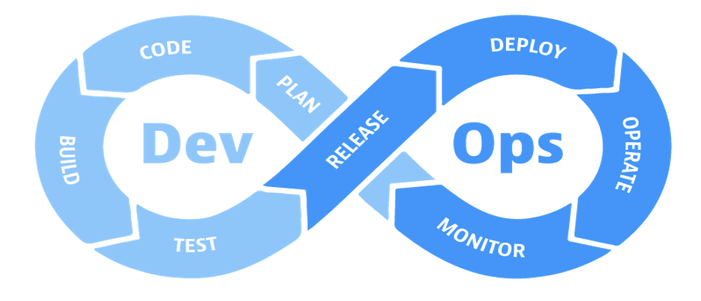
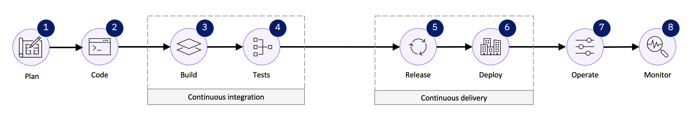
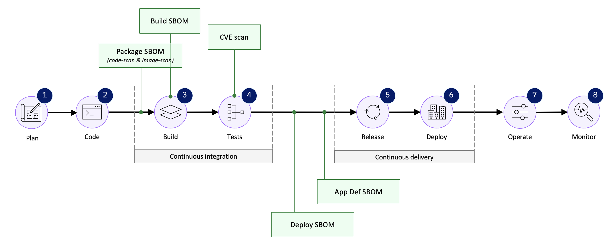
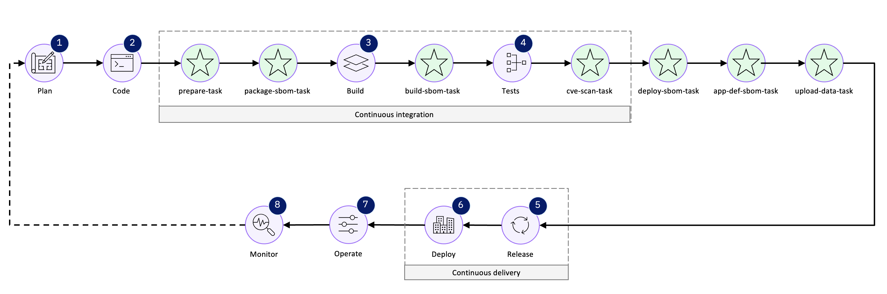

 

Click the [**Pre-requisites**](pre-requisites) tab for setup instructions.

Introduction

  

Security is a core element of software development, not something to be added as an afterthought. Every system must go through thorough checks to uncover and eliminate vulnerabilities that could compromise its integrity. By embedding security into the entire delivery process, risks are addressed well before deployment, ensuring protection at every stage.

In the CI/CD pipeline, vulnerability scanning plays a crucial role in maintaining this proactive approach to security. The ideal time for these scans is between the **Test** and **Release** phases. At this point, the code has already passed functional and quality tests, but it still requires a final security check to guarantee its safety. This ensures that when the software is deployed, organizations can trust it to be secure and production-ready.

  

<inline-notification text="Each customer’s IBM Concert implementation can vary based on their environment and CI/CD workflows, which may result in different stage names or configurations. Flexibility is key to addressing customer-specific needs, while ensuring core CI/CD integration principles are maintained."></inline-notification>

 

1 - Configure customer's pipeline

This guide will show how to set up the customer pipeline for IBM Concert. We will walk through the manual process of aligning the pipeline with IBM Concert’s specific requirements, ensuring it operates smoothly and meets the customer’s unique needs, ultimately setting the stage for a successful and efficient demonstration.

The following illustration presents the final structure of the CI/CD pipeline after the recommended changes:

  

 

| **Action** 1.1 | Create a new task named **prepare-task** immediately before the **build-task**. |
| :--- | :--- |
|  |  The purpose of this task is to download and configure the required IBM Concert toolkit image, as well as the source code repositories and container images for all microservices in the target application, ensuring the environment is fully prepared for subsequent analysis. |

| **Action** 1.2 | In the newly created **prepare-task**, include the following code commands:    Fetch a copy of the IBM Concert toolkit image to the local Docker server:    <code class="code-block"> docker pull --platform "linux/amd64" \    "cp.stg.icr.io/cp/concert/toolkit/ibm-concert-toolkit:latest"</code>    Fetch a copy of the microservices’ source code to the local file system:     <code class="code-block"> for i in "${!DEMO_APP_REPOSITORY_URL[@]}"; do      repo_url="${DEMO_APP_REPOSITORY_URL[$i]}"          git clone "https://${repo_url}" </code>    Pull a copy of the microservices’ image to the local Docker server:     <code class="code-block"> for i in "${!DEMO_APP_IMAGE_URL[@]}"; do      service="${DEMO_APP_COMPONENT[$i]}"            docker pull "${DEMO_APP_IMAGE_URL[$i]}:${DEMO_APP_IMAGE_TAG[$i]}" </code>|

| **Action** 1.3 | Create a new task named **package-sbom-task** immediately after the **prepare-task** and before the **build-task**. |
| :--- | :--- |
|  |  The purpose of this task is to decompose the target application and identify all underlying software components and open-source libraries through two critical steps: code-scan and image-scan. |

| **Action** 1.4 | In the newly created **package-sbom-task**, include the following code commands:    Run a **code-scan** using cdxgen on the application's source code to perform a static analysis and identify all static dependencies within the codebase:    <code class="code-block"> docker run --user 0 --platform "linux/amd64" \ --volume "$(pwd)/toolkit-data:/toolkit-data" \ --volume "$(pwd)/$src_repo:/$src_repo" \ --interactive \ --env JAVA_HOME="$JAVA_HOME" \ "cp.stg.icr.io/cp/concert/toolkit/ibm-concert-toolkit:latest" \ bash -c code-scan --src ${src_repo} --output-file ${DEMO_APP_NAME}-${service}-$ {PACKAGE_SBOM_CODESCAN_OUTPUT_FILENAME_SUFFIX}</code>    Run an **image-scan** using Syft on the application's container images to perform a static analysis and identify all static dependencies within the image metadata:     <code class="code-block"> docker run --user 0 --platform "linux/amd64" \ --volume "$(pwd)/toolkit-data:/toolkit-data" \ --volume "$(pwd)/$src_repo:/$src_repo" \ --interactive \ --env JAVA_HOME="$JAVA_HOME" \ "cp.stg.icr.io/cp/concert/toolkit/ibm-concert-toolkit:latest" \ bash -c image-scan --images ${IMAGES} </code>|

| **Action** 1.5 | Create a new task named **build-sbom-task** immediately after the **build-task** and before the **test-task** and add the following code commands to the workbook: |
|  |  The purpose of this new code command is to generate a Software Bill of Materials (SBOM) for the **build**, documenting all dependencies and tools utilized during the build process. For the build-sbom command to work correctly, it requires a configuration file that outlines <a href="https://github.ibm.com/ibm-concert-platinum-demos/concert-pm-utils/blob/64d2bb900519e1eacf06ca275f4f45af2d6263aa/macos/templates/build-sbom-config-template.yaml" target="_blank" rel="noreferrer">this information</a>. |

|  |  Instead of merging the SBOM creation commands with the current build task, we recommend implementing them as a separate task within the customer pipeline. This approach ensures modularity and prevents modifications to existing, well-tested components.|

|  |  <code class="code-block"> TOOLKIT_COMMAND="build-sbom --build-config ${OUTPUT_CONFIG_FILE}"    if [ "$CONTAINERIZATION_PLATFORM" -eq 1 ]; then docker run --user 0 --platform ${PLATFORM_ARCH} \ --volume "$(pwd)/toolkit-data:/toolkit-data" \ --volume "$(pwd)/$TEMPLATES_DIR:/$TEMPLATES_DIR" \ --volume "$(pwd)/$TMP_DIR:/$TMP_DIR" \ --interactive \ $CONCERT_TOOLKIT_IMAGE \ bash -c "${TOOLKIT_COMMAND}" elif [ "$CONTAINERIZATION_PLATFORM" -eq 2 ]; then podman run --user 0 --platform ${PLATFORM_ARCH} \ --volume "$(pwd)/toolkit-data:/toolkit-data" \ --volume "$(pwd)/$TEMPLATES_DIR:/$TEMPLATES_DIR" \ --volume "$(pwd)/$TMP_DIR:/$TMP_DIR" \ --interactive \ $CONCERT_TOOLKIT_IMAGE \ bash -c "${TOOLKIT_COMMAND}" fi </code> |

| **Action** 1.6 | Create a new task named **cve-scan-task** immediately after the **test-task** and add the following code commands to the workbook: |
|  |  The purpose of this new code command is to scan the application's images for known vulnerabilities by analyzing the components identified in the Software Bill of Materials (SBOM) and cross-referencing them against the CVE (Common Vulnerabilities and Exposures) database. This process helps to identify any known vulnerabilities and assess their potential impact on the application.    **TEMPLATE_GRYPE_FILE** refers to the path of the Grype template that maps each Grype output to the format required by IBM Concert. You can download this file <a href="https://github.ibm.com/ibm-concert-platinum-demos/concert-pm-utils/blob/64d2bb900519e1eacf06ca275f4f45af2d6263aa/macos/templates/grype-cve.tmpl" target="_blank" rel="noreferrer">here</a>. |

|  |  Instead of merging the SBOM creation commands with the current test task, we recommend implementing them as a separate task within the customer pipeline. This approach ensures modularity and prevents modifications to existing, well-tested components.|

|  |  <code class="code-block"> grype "${image}" --by-cve -o template -t "${TEMPLATE_GRYPE_FILE}" > "${OUTPUT_DIR}/${OUTPUT_FILENAME}" </code> |

|  |  Templates are currently available for Twistlock, Grype, Trivy, Tenable and Fortify. For other scanning tools, please send the CSV file to the product management team, and we will generate the necessary mapping.|

| **Action** 1.7 | Create a new task named **deploy-sbom-task**  after the **build-task** and the recently created **cve-scan-task**. |

|  |  The purpose of this new task is to create the deploy SBOM. |

| **Action** 1.8 | In the newly created **deploy-sbom-task**, include the following code commands:    The purpose of the command below is to generate an SBOM providing detailed information about the infrastructure and configuration files used during the deployment. For the deploy-sbom task to run successfully, it requires a configuration file that outlines <a href="https://github.ibm.com/ibm-concert-platinum-demos/concert-pm-utils/blob/64d2bb900519e1eacf06ca275f4f45af2d6263aa/macos/templates/deploy-sbom-config-template.yaml" target="_blank" rel="noreferrer">this information</a>    <code class="code-block"> docker run --user 0 --platform "linux/amd64" \ --volume "$(pwd)/toolkit-data:/toolkit-data" \ --volume "$(pwd)/$TEMPLATES_DIR:/$TEMPLATES_DIR" \ --volume "$(pwd)/$TMP_DIR:/$TMP_DIR" \ --interactive \ "cp.stg.icr.io/cp/concert/toolkit/ibm-concert-toolkit:latest" \  bash -c "deploy-sbom --deploy-config ${OUTPUT_CONFIG_FILE}" </code>  |

| **Action** 1.9 | Create a new task named **app-def-sbom-task**  after the **deploy-sbom-task**. |

|  |  The purpose of this new task is to create the app-definition SBOM. |

| **Action** 1.10 | In the newly created **app-def-sbom-task**, include the following code commands:    The purpose of this command is to generate the app-definition SBOM, which provides a detailed overview of the application’s modules, libraries, and dependencies. For the app-definition-sbom task to execute successfully, it requires a configuration file that outlines <a href="https://github.ibm.com/ibm-concert-platinum-demos/concert-pm-utils/blob/64d2bb900519e1eacf06ca275f4f45af2d6263aa/macos/templates/app-def-sbom-config-template.yaml" target="_blank" rel="noreferrer">this information</a>.     <code class="code-block"> docker run --user 0 --platform "linux/amd64" \ --volume "$(pwd)/toolkit-data:/toolkit-data" \ --volume "$(pwd)/$TEMPLATES_DIR:/$TEMPLATES_DIR" \ --volume "$(pwd)/$TMP_DIR:/$TMP_DIR" \  --interactive \ "cp.stg.icr.io/cp/concert/toolkit/ibm-concert-toolkit:latest" \ bash -c "app-sbom --app-config ${OUTPUT_CONFIG_FILE}"  </code>|

| **Action** 1.11 | Create a new task named **upload-data-task** immediately after the **app-def-sbom-task**. |

|  |  The purpose of this task is to upload all generated SBOMs and security data to IBM Concert for comprehensive analysis, tracking, and validation. For the app-definition task to execute successfully, it requires a configuration file that outlines <a href="https://github.ibm.com/ibm-concert-platinum-demos/concert-pm-utils/blob/64d2bb900519e1eacf06ca275f4f45af2d6263aa/macos/templates/config.yaml" target="_blank" rel="noreferrer">this information</a>.|

| **Action** 1.12 | In the newly created  **upload-data-task**, include the following code commands:  <code class="code-block"> docker run --user 0 --platform "linux/amd64" \ --volume "$(pwd)/toolkit-data:/toolkit-data" \ --volume "$(pwd)/$TEMPLATES_DIR:/$TEMPLATES_DIR" \ --volume "$(pwd)/$TMP_DIR:/$TMP_DIR" \ --interactive \ "cp.stg.icr.io/cp/concert/toolkit/ibm-concert-toolkit:latest" \ bash -c "upload-concert --upload-config ${OUTPUT_DIR}/${DEMO_APP_NAME}-concert-upload-config.yaml"</code> |

The following represents the final state of the pipeline after incorporating the proposed new tasks:

  

**[Go to top](#top)**

  

2 - Onboard application into Concert

After setting up the shared pipeline infrastructure, you'll need to customize each application previously onboarded by the customer individually. Most CI/CD pipelines have a dedicated property or mapping file where parameters for each application are defined and linked to specific variables within the pipeline. These mappings ensure that each application's configuration is properly aligned with the pipeline's automated tasks.

Typically, the CI/CD server populates these variables automatically using information gathered throughout the pipeline's stages. However, there may be instances where additional customizations will be needed, requiring you to manually define the parameters to ensure proper execution. These manual adjustments often involve setting environment-specific variables or configurations that cannot be dynamically fetched by the server. 

Below is a list of some of the variables that you will need to populate manually:

| **Variable** | **Definition** |
| :--- | :--- |
| **Application criticality** | Refers to the level of importance an application holds within an organization’s IT environment, based on its impact on business operations.    The criticality is rated on a scale of 1 to 5, with:    • **1 (Low criticality)**: Applications that have minimal impact on day-to-day operations. They are not essential for core business functions, and if they go offline, business continuity is not significantly affected.   • **2-3 (Moderate criticality)**: These applications support important business processes but are not mission-critical. Downtime or failure would cause inconvenience and inefficiency but would not disrupt key business operations.   • **4 (High criticality)**: These applications are integral to business processes. Downtime could severely impact productivity, revenue, or customer satisfaction. They require regular monitoring and robust security measures.   • **5 (Critical)**: These are mission-critical applications, essential for the core functioning of the business. Any downtime would have a catastrophic impact on operations, leading to significant financial or reputational loss. These applications often demand high availability, strong security protocols and fast recovery processes. |
| **Access points that make each microservice and their exposure level** | Refers to the endpoints through which each microservice can be accessed, and they play a critical role in determining the exposure level of a microservice within an architecture. Each microservice should ideally have only one access point to maintain clarity and control over how it is accessed and exposed.    These access points can be classified as internal or external based on their exposure:    • **Internal access points**: These are used for communication between services within the organization's internal network or environment. They are not exposed to the internet and are generally accessed only by other microservices or internal systems. This limited exposure reduces the security risks associated with external threats.   • **External access points**: These are exposed to the internet and can be accessed by external users or systems outside of the internal network. External access points require additional security measures, such as authentication, encryption and firewall rules, to protect them from vulnerabilities and unauthorized access. |
| **Environments for each microservice** | Refers to the distinct settings or stages in which a microservice operates, each serving a unique purpose in the development, testing, and deployment lifecycle. A single microservice can have multiple environments, each tailored to specific activities or stages of its development and release. Typically, these environments include:    • **Development environment (Dev)**: This is where the initial coding and testing of the microservice occur. It is used by developers to implement new features, fix bugs, and experiment with changes without affecting the live system.   • **Testing or QA environment**: After development, the microservice moves to a testing environment, where it undergoes more rigorous testing by quality assurance (QA) teams. This environment closely mirrors production to ensure that everything works as expected before deployment.   • **Staging environment**: Staging is a pre-production environment that is nearly identical to the live environment. It’s used to test the entire system, including integrations and performance, to validate that the microservice is ready for release.   • **Production environment**: This is the live environment where the microservice is deployed for actual use by end users. It requires the highest level of monitoring, security and support, as any issues here directly affect the user experience.    Each microservice can have one or more of these environments depending on its development and deployment needs. |
| **Repositories for each microservice** | Dedicated storage locations where the codebase for each microservice is maintained and version-controlled. Each microservice should have its own repository to ensure clear separation of concerns, streamline development and facilitate independent updates and scaling. |

**[Go to top](#top)**

  

