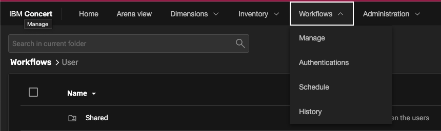
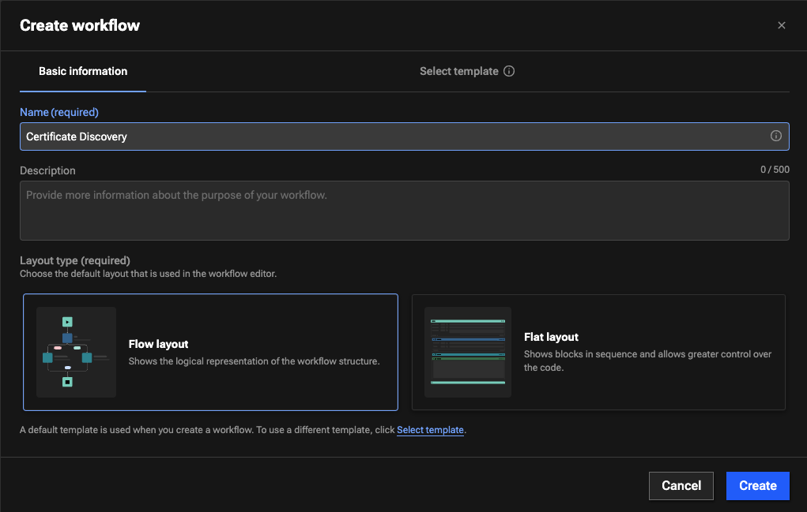
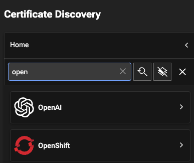
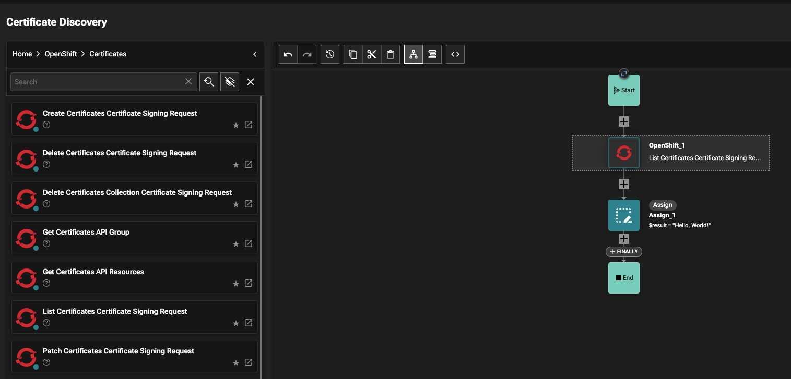
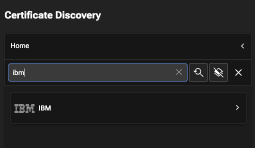
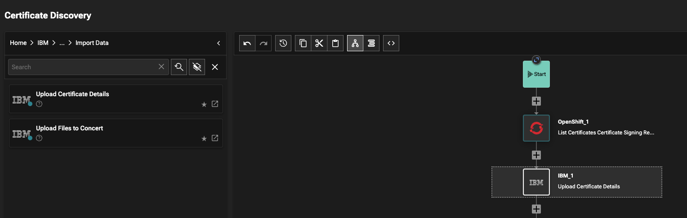
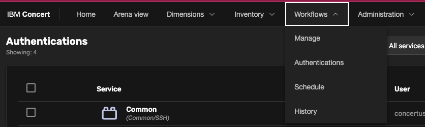
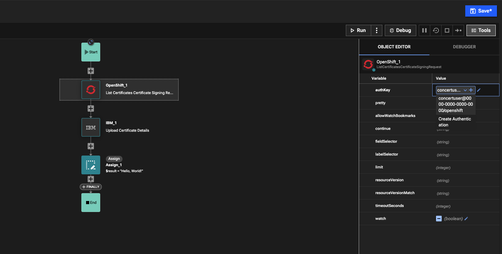
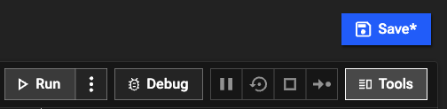
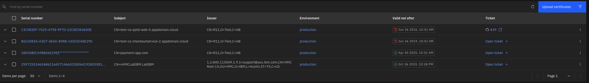

### Introduction

In this demo, we will build and run a Concert Workflow to understand how a customer will automate the certificate discovery and ingestion process. This method can then be used for building workflows and ingesting certificates during a proof of value with a customer.

### Pre-requisites

Below is a list of pre-requisites that need to be setup prior to beginning this PoV.

* <a href="https://techzone.ibm.com/collection/tech-zone-certified-base-images/journey-vmware-on-ibm-cloud-environments" target="_blank" rel="noreferrer">OpenShift cluster</a> with public ingress 
* IBM Concert <a href="https://techzone.ibm.com/collection/tech-zone-certified-base-images/journey-watsonx" target="_blank" rel="noreferrer">(VM or OCP)</a>  

### 1 - Creating a Concert Workflow

**1.1:** Navigate to **Workflows** within Concert and click **Manage**   

**1.2:** Click **Create Workflow**, and fill in the workflow information giving the workflow a name and description   

**1.3:** Using the search bar, find the OpenShift integration   

**1.4:** Within the OpenShift integration, find the **List Certificates Signing Request** action, and drag and drop it onto the flow underneath **Start**   

**1.5:** Search for '**IBM**'   

**1.6:** Within the IBM integration, navigate to **Concert**, then **Import Data**, and drag and drop the **Upload Certificate Details** action   

 

### 2 - Creating a Workflow authentication

**2.1:** Navigate to **Workflows** within Concert and click **Authentications**   

**2.2:** Click **Create Authenitcation**. Fill in the authentication information, giving it a name and description. Select **OpenShift** as the **Service**. Next, fill in the **Host**, **Port** and **API Token** for the OpenShift cluster.   

**2.3:** Click **Create**. Then navigate back to the **Certificate Discovery Workflow**. Within the Workflow, click the **Openshift_1** action. Then change the **authKey** dropdown to the authentication which was just created.   

**2.4:** Save the workflow and click **Run**   

**2.5:** Certificates have now been discovered from the customer's cluster and ingested   

 

### Summary

In this demo, we saw how to create a workflow to discover and ingest certificate details from an OpenShift cluster, as well as how to create the authentication with that cluster. 

Once certificate data is ingested successfully into Concert, the operations teams can review the certificate expiration dates and automate the rotation of those certificates.

**[Go to top](#top)**