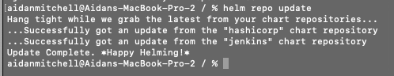

 

Click **<a href="https://www.youtube.com/watch?v=dQw4w9WgXcQ" target="_blank" rel="noreferrer">here</a>** to access the pipeline data ingestion video.

Click the [**Pre-requisites**](pre-requisites) tab for setup instructions.

Introduction

In this demo, we’ll explore how to automate data ingestion using a Jenkins pipeline, similar to what a customer might implement.

Concert is designed to continuously ingest data. Whenever an application is updated, the automated pipeline is triggered, automatically creating updated SBOMs and conducting CVE vulnerability scans. These outputs are then sent to Concert for processing.

For this demo, we’ll build the pipeline using Jenkins on Red Hat OpenShift, showcasing how the entire process can be seamlessly automated.

 

1 - Install Jenkins on OpenShift cluster

The first step is to install Jenkins which is an open-source automation server which enables developers to reliably build, test and deploy their software.

| **Action** 1.1 | Log in to the OpenShift (OCP) cluster on TechZone. |
| :--- | :--- |
|  | When we reserved the OCP instance, we received a kubeadmin login and password.       We will use this to log in to the cluster.       |

| **Action** 1.2 | Use the '**oc login**' command directly from the TechZone OCP console to log in to the OpenShift cluster from the local machine. |
| :--- | :--- |
|  | Click on 'kubeadmin' in the top right, then click 'copy login command'.      Click 'display token, and then copy the command and paste it into the terminal.    |

<inline-notification text="Note: The OCP login token expires every 24 hours."></inline-notification>

| **Action** 1.3 | Add the Jenkins repo to helm on the command line |
| :--- | :--- |
|  |   <code class="code-block"> helm repo add jenkins https://charts.jenkins.io </code>    |

| **Action** 1.4 | Update the helm repo to ensure it has the latest versions available |
| :--- | :--- |
|  |   <code class="code-block"> helm repo update </code>    |

| **Action** 1.5 | Install Jenkins on Openshift using helm |
| :--- | :--- |
|  |   <code class="code-block"> helm install latest jenkins/jenkins </code>    |

| **Action** 1.6 | Retrieve your Jenkins password, this will be used to login through the Jenkins UI along with the username admin |
| :--- | :--- |
|  |   <code class="code-block"> oc exec --namespace default -it svc/latest-jenkins -c jenkins -- /bin/cat /run/secrets/additional/chart-admin-password && echo </code>    |

**[Go to top](#top)**

  

2 - Configure an Openshift route to access Jenkins

In order to create a URL to access the Jenkins instance, an Openshift Route must be configured with the Jenkins service.

| **Action** 2.1 | In the Openshift Console, navigate to Networking, then click on Routes |
| :--- | :--- |
|  |    |

| **Action** 2.2 | On the Routes page, click on the blue **Create Route** button on the top right hand side. |
| :--- | :--- |
|  |    |

| **Action** 2.3 | On the Create Routes page, enter the following details and leave all other fields as their default values |
| :--- | :--- |
|  |   **Name:** jenkins   **Service:** latest-jenkins   **Target port:** 8080 > 8080 (TCP)    |

| **Action** 2.4 | Click the blue **Create** button at the bottom of the page |
| :--- | :--- |
|  |    |

| **Action** 2.5 | After saving, the jenkins route page will open. On this page you will find the URL for the jenkins instance under the **Location** section. Click on this link to open Jenkins. |
| :--- | :--- |
|  |    |

| **Action** 2.6 | On the Jenkins login page, use the username admin and the password saved during the Jenkins install to login |
| :--- | :--- |
|  |    |

 

3 - Create secrets

We will now create certain authentication credentials in Github and in Concert which we will use as part of the Jenkins pipeline later on.

In this step, we will create 2 secrets: a Concert Secret and a Github Secret.

### Concert Secret

The Concert secret is what enables Tekton to authenticate with the Concert API for uploading data.  

| **Action** 3.1 | Generate the API key from Concert by ensuring you have admin access, and then log in to the Concert instance. |
| :--- | :--- |
|  | In this demo, our Concert instance is deployed on SaaS.|

| **Action** 3.2 | Click your profile -> **API Key** -> Generate. Copy the key into a notepad or place where you can access it, as it will not be visible again.   |
| :--- | :--- |
|  |  | 

<inline-notification text="Note: This token doesn’t expire unless you generate a new one or revoke it."></inline-notification>

### GitHub Secret

| **Action** 3.4 | Create the GitHub api token by using the link https://github.ibm.com/settings/tokens/new. Again copy this link into a notepad where you can access it again. |
| :--- | :--- |
|  |     | 

**[Go to top](#top)**

  

4 - Create Jenkins Job

For the QotD application, we will create a Jenkins pipeline with 2 stages. The second stage relies on using the toolkit that comes packaged with Concert to automate SBOM generation in the correct format. (IBM Concert Toolkit v1.0.1 used)

<inline-notification text="This demo is not intended to teach Jenkins concepts. We will configure a pre-built Jenkinsfile."></inline-notification> 

The Jenkinsfile being configured is available at <a href="https://github.ibm.com/ibm-concert-platinum-demos/concert-jenkins-sbom-pipeline">github</a>. The IBM GitHub repository is internal to IBM and available for all IBMers.

| **4.1** | Within the Jenkins UI, click on the **Create a job** button. |
| :--- | :--- |
|  |      |

| **4.2** | Give the job a name, and select item type **Pipeline** |
| :--- | :--- |
|  |      |

| **4.3** | On the next **Configuration** page, leave all of the parameters default except for the following |
| :--- | :--- |
|  | **Definition:** Pipeline script from SCM   **SCM:** Git   **Repository URL:** https://github.ibm.com/ibm-concert-platinum-demos/concert-jenkins-sbom-pipeline     Under Credentials click the **+ Add** button, then click Jenkins.   On the **Add Credentials** popout which appears enter your Github Username under the Username parameter, and your Github Token from earlier in the Password parameter, and set the **ID** to GITHUB_TOKEN, then click Add.     Back on the configuration page on the Credentials dropdown, select the credential that was just created      Set **Branch Specifier:** */main      Then click the blue **Save** button at the bottom of the page.   |

| **4.3** | Click on the **Build Now** button |
| :--- | :--- |
|  | This will trigger a the automated build to run, this first build will fail but it will automatically configure parameters for the job from the Jenkinsfile.      |

  

5 - Running the Jenkins pipeline

Now that Jenkins and its pipeline is fully configured. We can now run the automation to scan images, create an SBOM, and push the results to Concert. This will be how a customer can trigger a pipeline run manually to ingest the Concert data.

| **Action** 5.1 | Click **Build with Parameters** |
| :--- | :--- |
|  |      |

| **Action** 5.2 | On the build parameters page which opens up, enter the **CONCERT_URL** and the **CONCERT_TOKEN**. Then click **Build**.|
| :--- | :--- |
|  |      |

The Jenkins pipeline will now run with two stages. 

1. **Install Tools** stage: In this stage, all the required CLI tools are installed to run a scan, generate an SBOM, and upload the results to Concert. In a customer's environment, these tools might already be pre-installed on a Jenkins agent, which would speed up the build process. However, installing the tools at runtime is also a valid approach, offering flexibility depending on the setup.

2. **Run Scans** stage: This stage runs all of the scripts provided in the Concert Toolkit to do the following:

* **Generate the Package SBOM** - Image Scan: The image scan uses tools like grype and Trivy to identify vulnerabilities in container images and Syft to generate a detailed Software Bill of Materials, listing all components and dependencies to ensure comprehensive vulnerability management.

* **Run the CVE Scans against the QOTD Applications** - This script uses grype to scan for vulnerabilities (CVEs) in the container images associated with each service or microservice of the selected application.

* **Generate the Build SBOM** - The Build SBOM Generation Script generates a comprehensive Software Bill of Materials (SBOM) with the information of all available builds.

* **Generate the Deploy SBOM** - The Deploy SBOM Generation Script generates a comprehensive Software Bill of Materials (SBOM) with the information of all deploys performed.

* **Generate the Application SBOM** - The Application SBOM Generation Script generates a comprehensive Software Bill of Materials (SBOM) for an application, detailing all the components, dependencies, and associated metadata for each service or microservice, to ensure transparency, traceability, and compliance in the software supply chain.

* **Upload the data to IBM Concert** - The primary objective of this method is to enable users to upload necessary data into an IBM Concert instance to facilitate automation, monitoring, and orchestration of IT resources.

**[Go to top](#top)**

  

View updates in Concert UI

Log in to the Concert instance to ensure all data was uploaded successfully.

<inline-notification text="If you were already logged in to Concert, doing a refresh in the browser will render the uploaded data in the Concert Arena view."></inline-notification>
  

Go to the <strong>Administration</strong> -> <strong>Event log</strong> tab to view the history and status of all uploads.

**[Go to top](#top)**

  

Summary

In this demo, we showed how to automate key security tasks using a Jenkins pipeline on an OpenShift cluster. The process involved generating SBOMs, running CVE scans, and automatically uploading the results to IBM Concert.

Once the CVE data reaches Concert, teams can assess the risk scores and focus on the most critical issues.

When conducting a PoV, you will use these methods to integrate similar Concert tasks into the customer’s CI/CD pipeline, making the entire process more efficient.

**[Go to top](#top)**

  

