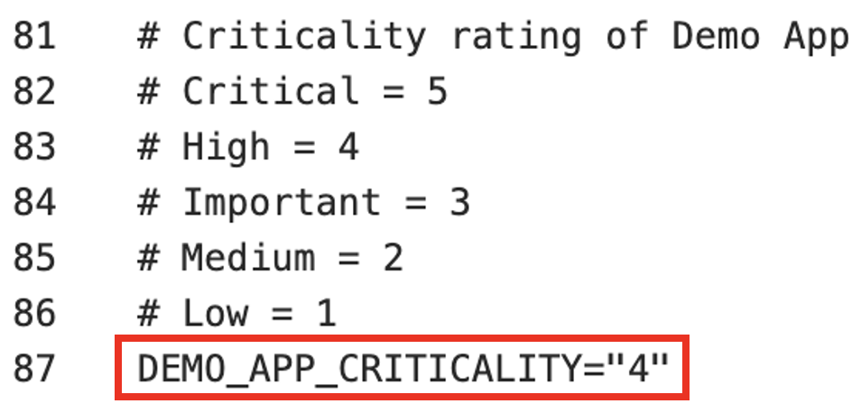
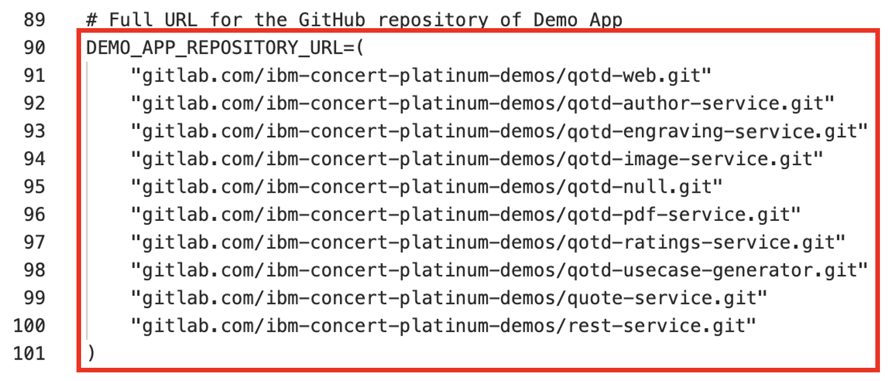
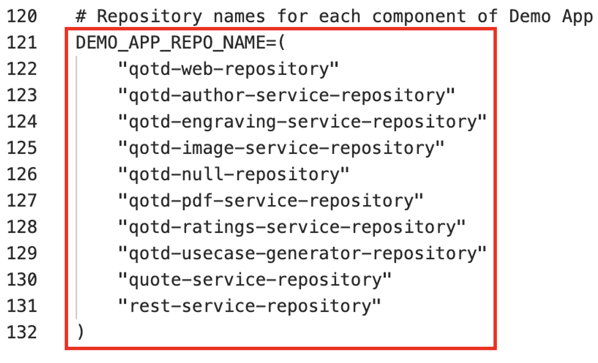
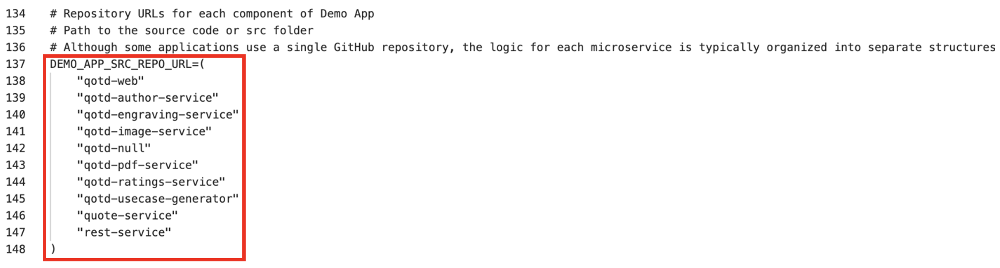
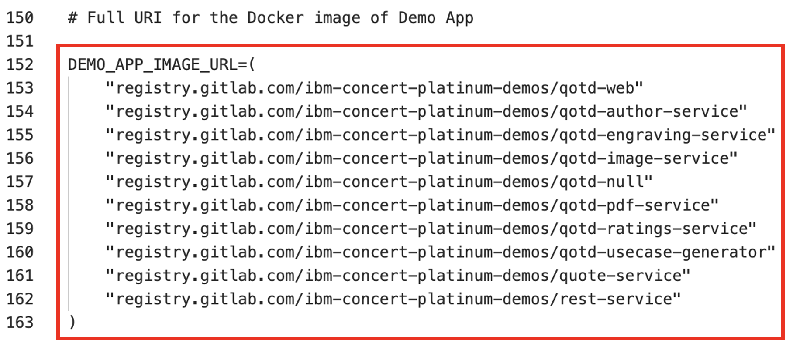
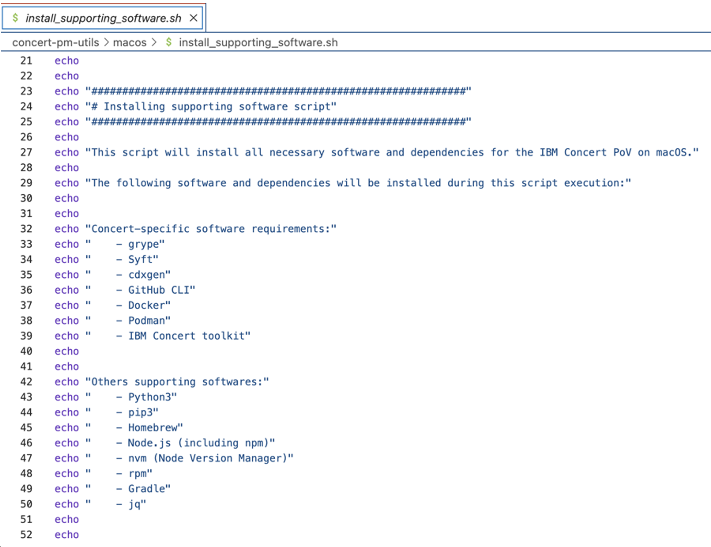
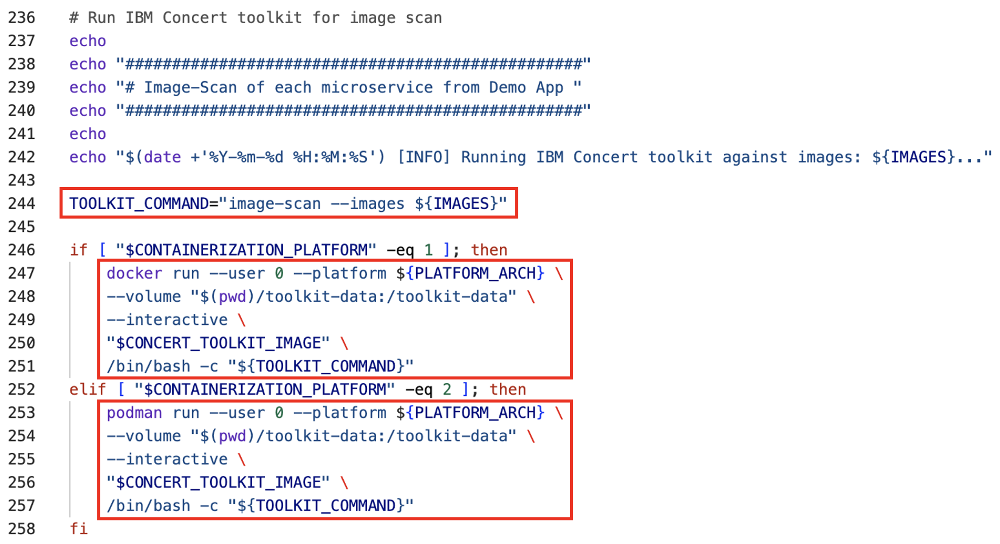
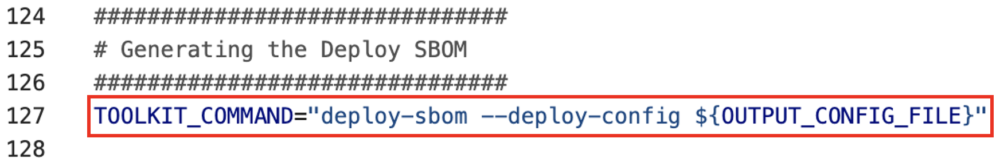

  

Click the [**Pre-requisites**](pre-requisites) tab for setup instructions.

Introduction

In this demo, we’ll show how to ingest data manually into IBM Concert. 

We will walk through the manual process to help understand the details of how Concert works and the different types of data and formats that Concert supports. 

For our demo, we’ll use the Quote of the Day (QotD) application, which consists of 10 microservices. The final result will showcase a populated Concert Arena view with all the underlying components of the application and the prioritized CVEs.

 

1 - Populate global variables

We begin by opening the concert-pm-utils repo code we downloaded in the pre-requisites section and open the **global_environment_variables** file. This file contains all the details of the demo QotD application and its environment.

In a real world PoV, customers should always use a pipeline to ingest data where these variables would be populated automatically from the pipeline.   

For this demo, we will need to provide all the data in the global variables file. These variables will be used throughout the demo by the Concert toolkit to generate files for Concert.

<inline-notification text="This demo uses Concert Toolkit V1.0.1."></inline-notification>
<inline-notification text="Line numbers may vary as helper scripts get updated."></inline-notification>

| **Variables** | **Screenshot** | **Description** |
| :--- | :--- | :--- |
| Line 62:   **PLATFORM_ARCH** |  | Placeholder |
| Line 58:   **CONTAINERIZATION_PLATFORM** |  | Placeholder |
| Line 79:   **DEMO_APP_NAME** |  | Placeholder |
| Line 87:   **DEMO_APP_CRITICALITY** |  | Placeholder |
| Line 90:   **DEMO_APP_REPOSITORY_URL** |  | Placeholder | 
| Line 104:   **DEMO_APP_VERSION** |  | Placeholder |
| Line 107:   **DEMO_APP_COMPONENT** |  | Placeholder |
| Line 121:   **DEMO_APP_REPO_NAME** |  | Placeholder |
| Line 137:   **DEMO_APP_SRC_REPO_URL** |  | Placeholder |
| Line 152:   **DEMO_APP_IMAGE_URL** |  | Placeholder |
| Line 166:   **DEMO_APP_IMAGE_TAG** |  | Placeholder |
| Line 181:   **DEMO_APP_REPOSITORY_BRANCH** |  | Placeholder |
| Line 196:   **DEMO_APP_ACCESS_POINTS** |  | Placeholder |
| Line 223:   **BUILD_NUMBER2**    Line 225:   **INVENTORY_BUILD_NUMBER2**    Line 227:   **CONCERT_URN_PREFIX2** |  | Placeholder |
| Line 230:   **K8_PLATFORM2**    Line 232:   **ENV_PLATFORM2**    Line 234:   **CLUSTER_ID2**    Line 236:   **CLUSTER_REGION2**    Line 238:   **CLUSTER_NAME2**    Line 240:   **CLUSTER_NAMESPACE2** |  | Placeholder |
| Line 247:   **K8_PLATFORM_TYPE**    Line 249:   **K8_PLATFORM_NAME**    Line 251:   **CLUSTER_ENV_PLATFORM** |  | Placeholder |
| Line 254:   **BUSINESS_NAME**    Line 255:   **BUSINESS_UNIT_NAME**    Line 256:   **CONTACT_EMAIL**    Line 257:   **CONTACT_PHONE** |  | Placeholder |
| Line 218:   **CONCERT_INGESTION_ENDPOINT**    Line 220:   **CONCERT_INGESTION_INSTANCE_ID**    Line 222:   **CONCERT_INGESTION_TOKEN** |  | Placeholder |
| Line 227:   **CONCERT_INGESTION_USER**    Line 229:   **CONCERT_INGESTION_PASSWORD** |  | Placeholder |

<!-- <Show source code for install script> -->

**[Go to top](#top)**

  

2 - Install supporting software

In this section we will install the software needed to run the demo. 

To install all supporting software, run the **install_supporting_software** shell script. The script will install software like the IBM Concert toolkit, Grype, Docker, and many others needed for this demo.

To run the install_pre_reqs.sh shell script, execute the code in a terminal:

<code class="code-block"> ./install_pre_reqs.sh </code>

The shell script will install the following:  

| **Software** | **Description** |
| :--- | :--- |
| **IBM Concert toolkit** | Framework required to generate SBOMs and interact with IBM Concert APIs |
| **grype** | Vulnerability scanner for container images and filesystems |
| **Syft** | Tool for generating SBOMs from container images and filesystems |
| **cdxgen** | Tool required to generate CycloneDX SBOMs for various programming languages |
| **Python3** and **pip3** | Essential for running Python scripts and managing Python packages |
| **Homebrew** | Package manager for macOS that simplifies the installation, updating and management of software and libraries |
| **Node.js** | Required to enable the execution of JavaScript code server-side and the development of scalable network applications |
| **nvm** | Enable you to manage multiple versions of Node.js, making it easy to switch between different versions for various projects and development environments |
| **rpm** | Needed for installing certain packages like Syft |
| **Gradle** | Open-source build automation tool that streamlines the building, testing and deployment of software projects with its flexible and powerful capabilities |
| **jq** | Lightweight and flexible command-line JSON processor, essential for parsing, manipulating and transforming JSON data |
| **Bazel** | Powerful build and test tool that automates the process of compiling and testing large codebases efficiently |
| **GitHub CLI** | Tool for managing GitHub repositories from the command line |
| **Docker** | Platform for running and deploying containers and applications |

### Set up system paths

1. Update the system path and configure Git. Homebrew usually adds itself to the PATH automatically. However, if it doesn’t, you can add it manually:    <code class="code-block"> nano ~/.zshrc  # For zsh   # or   nano ~/.bash_profile  # For bash </code>

2. For users running macOS versions prior to Big Sur, you can set the Homebrew installation directory with the following command. Please add this line to your .zshrc or .bash_profile:    <code class="code-block"> export PATH="/usr/local/bin:/usr/local/sbin:$PATH" </code>

3. For users running macOS macOS versions Big Sur and later, the Homebrew installation directory is /opt/homebrew:    <code class="code-block"> export PATH="/opt/homebrew/bin:/opt/homebrew/sbin:$PATH" </code>

4. Homebrew usually handles this automatically, but to ensure Gradle is included in your PATH. For users running macOS versions prior to Big Sur, this can be done by adding the command below to your .zshrc or .bash_profile:    <code class="code-block"> export PATH="/usr/local/opt/gradle/bin:$PATH" </code>

5. For users running macOS versions Big Sur and later, use the command below:    <code class="code-block"> export PATH="/opt/homebrew/opt/gradle/bin:$PATH" </code>

6. Homebrew usually handles this automatically, but to ensure Bazel is included in your PATH. For users running macOS versions prior to Big Sur, this can be done by adding the command below to your .zshrc or .bash_profile:    <code class="code-block"> export PATH="/usr/local/bin:$PATH" </code>

7. For users running macOS versions Big Sur and later, use the command below:    <code class="code-block"> export PATH="/opt/homebrew/bin:$PATH" </code>

8. Apply changes:    <code class="code-block"> source ~/.zshrc  # For zsh   # or   source ~/.bash_profile  # For bash </code>

9. Configure Git:    <code class="code-block"> git config --global user.name "Your Name"   git config --global user.email "your.email@ibm.com" </code>

**[Go to top](#top)**

  

3 - Generate 'Package SBOMs'

In this section we will ingest SBOMs (Software Bill of Materials) and CVEs into IBM Concert.

This slide shows the two variations of SBOMs that IBM Concert ingests.
  

On the left, we see that Concert ingests the industry standard CycloneDX SBOM generated by various tools like CycloneDX, Syft and cdxgen. These SBOMs are called Package SBOMs.

On the right, we see that Concert also ingests SBOMs that are specific to Concert. These SBOMs are extenstions of the CycloneDX format and are customized for Concert. These SBOMs are called ‘Concert-defined’ SBOMs.

The first SBOM file is the Package SBOM. This SBOM provides an inventory of what’s in the software packages. Concert ingests two types of package SBOMs, one that scans the the source code and the second that scans the images.

<!-- <show section in script where toolkit image is pulled> -->

We will use the IBM Concert Toolkit (v1.0.1) to generate both types of package SBOMs.

<!-- <show section in script where code scan is called> -->

The code scan command in the Concert toolkit uses **cdxgen** to analyze the codebase, identifying all software packages and dependencies.

<!-- <show section in script where image scan is called> -->

The image scan command in the toolkit uses an open source tool called **Syft** to analyze the packages and operating system details in the containerized image.

In both cases, the toolkit generates a JSON file in standard CycloneDX format.

To execute both tasks we will run the **generate_package_sbom.sh** shell script:    <code class="code-block"> ./generate_package_sbom.sh </code>

The output of this command will be an image-scan SBOM and a code-scan SBOM file for each microservice.

<!-- <show generated package SBOM files on the computer> -->

**[Go to top](#top)**

  

4 - Generate CVE scan

Next, we use an open source tool called **Grype** to conduct a vulnerability scan by analyzing container images. However, customers can use any image scanning tool like Prisma Cloud's Twistlock or Aqua Security's Trivvy.

<inline-notification text="The Concert toolkit does not contain any commands for generating CVE scan files."></inline-notification>

This process is carried out by executing the **generate_cve_csv_file.sh** shell script:    <code class="code-block"> ./generate_cve_csv_file.sh </code>

The output of this command will be a CVE file in CSV format for each microservice image in the application.

<inline-notification text="Concert accepts CSV files in a specific column format. Use the provided template to ensure the output file is generated with the correct CSV headers."></inline-notification>

<!-- <show CVE scans generated on the computer> -->

One CSV scan file should be generated for every microservice image in our QotD application.

**[Go to top](#top)**

  

5 - Generate 'Build SBOMs'

IBM concert ingests custom SBOM files called ConcertDef. These are an extension of the CycloneDX format. The three concert-defined SBOMs are called: Build, Deploy, and Application Definition.

Let’s start with the Build SBOM.

We will use the toolkit to generate the build SBOM file, which is a detailed inventory that includes information about the libraries, frameworks, tools, and other dependencies that were used to build the software application.

<!-- <show script where build-sbom command is called> -->

This process is carried out by executing the **generate_build_sbom.sh** shell script:    <code class="code-block"> ./generate_build_sbom.sh </code>

For each microservice image of the target application, a Build SBOM will be generated in the ./toolkit-data directory.
  

<!-- <show files in toolkit data directory> -->

<!-- <open one build sbom> -->

For each individual microservice, a Build SBOM provides an inventory of:  
1. Associated images and their versions      
2. Repositories and their branches   

**[Go to top](#top)**

  

6 - Generate 'Deploy SBOMs'

The next step involves using the toolkit to generate the deploy SBOM file where the public and private access points are defined. The deploy SBOM focuses on the software as it is actually deployed in a specific environment, including any environment-specific configurations or dependencies.

<!-- <show script where deploy-sbom command is called> -->

This process is carried out by executing the generate_deploy_sbom.sh shell script:    <code class="code-block"> ./generate_deploy_sbom.sh </code>

For each pair of microservice and environment defined for the target application, a deploy SBOM will be generated in the ./toolkit-data directory. 

<!-- <show toolkit-data directory where SBOMs are generated (14)> --> 

involves using the toolkit to generate the Application Definition SBOM file, which is a detailed record of all elements involved in the application, from its core components to external dependencies, configuration settings, and runtime environments.
  

For each combination of microservice and environment, a Deploy SBOM provides an inventory of:   
1. Access points      
2. External dependencies   

**[Go to top](#top)**

  

7 - Generate 'Application-definition SBOM'

The last SBOM to be generated is the Application definition SBOM. This SBOM is where the application criticality is defined. As mentioned earlier the application criticality plays a significant role in Concert’s calculation of risk prioritization and recommendations.

<!-- <show script where app-definition command is called> -->

This process is carried out by executing the **generate_app_def.sh** shell script:    <code class="code-block"> ./generate_app_def.sh </code>

Unlike the other SBOMs, the Application-definition SBOM is defined at the application level instead of the microservice level. This enables Concert to have an application-centric view and only one Application-definition SBOM is required for each application, regardless of how many microservices it has.

An Application-definition SBOM will be generated in the ./toolkit-data directory. 
  

<!-- <show toolkit-data directory where Application Definition SBOM is generated (1)> -->

An Application-definition SBOM defines the boundaries of an application, including the following underlying elements:   
1. Microservices       
2. Repositories       
3. Images      
4. Environments       
5. Access points and their exposure levels       
6. Application criticality   

**[Go to top](#top)**

  

8 - Upload data to Concert

The final step is to upload all the generated data into IBM Concert to make it accessible in the Concert UI. This can be done by executing the **upload_data_concert.sh** shell script. 

<!-- <show script with upload details> -->

This helper script automates the process, allowing multiple Concert-supported files to be uploaded at once, eliminating the need for manual uploads:    <code class="code-block"> ./upload_data_concert.sh </code>

Alternatively, you can manually upload all relevant files from the ./toolkit-data directory to IBM Concert using the user interface, one by one.

<inline-notification text="Once all files are processed, they will be zipped and moved to the ./processed folder."></inline-notification>

**[Go to top](#top)**

  

View updates in Concert UI

We can now log in to Concert to view the uploaded data.
  
  

<!-- <show arena view> -->

<!-- <show dimensions view of vulnerability> -->

**[Go to top](#top)**

  

Summary

In this demo, we saw how to ingest data manually into IBM Concert. We learned about the five types of SBOMs and the CVE scan format that can be uploaded to Concert for visualization in the UI. / 

Click <a href="https://ibm.github.io/platinum-demos/tech-sales-enablement-learning-to-ingest-data-into-ibm-concert-pipeline/pre-requisites" target="_blank" rel="noreferrer">here</a> to continue to **Part 2 - Using a pipeline to automate data ingestion into IBM Concert**.

**[Go to top](#top)**

  

