

  

Click <a href="https://ibm.seismic.com/app?ContentId=24a980e9-bc75-427d-b341-bce2db2e771f#/doccenter/f6bc8873-d580-4ee8-a903-[…]0-a4ab-4913-a193-2cfef77d0f34/grid/" target="_blank" rel="noreferrer">here</a> to access the manual data ingestion video.

Click the [**Pre-requisites**](pre-requisites) tab for setup instructions.

Introduction

In this demo, we’ll show how to ingest data manually into IBM Concert. 

We will walk through the manual process to help understand the details of how Concert works and the different types of data and formats that Concert supports. 

For our demo, we’ll use the Quote of the Day (QotD) application, which consists of 10 microservices. The final result will showcase a populated Concert Arena view with all the underlying components of the application and the prioritized CVEs.

 

1 - Populate global variables

We begin by opening the concert-pm-utils repo code we downloaded in the pre-requisites section and open the **global_environment_variables** file. This file contains all the details of the demo QotD application and its environment.

In a real world PoV, customers will always use a pipeline to ingest data. These variables would be populated automatically from the pipeline.

For this demo, we will need to provide all the data in the global variables file. These variables will be used throughout the demo by the Concert toolkit to generate files for Concert.

<inline-notification text="This demo uses Concert Toolkit V1.0.1."></inline-notification>
<inline-notification text="Line numbers will vary as helper scripts get updated."></inline-notification>

 

### Action 1.1: Review and update global variables in the table below.

"For faster implementation during the demo, we have pre-populated the demo repo with most of the variables below. Each variable is explained in detail below for improved understanding.

<table>
    <thead>
        <tr>
            <th>
                

                    
Environment variable

                

            </th>
            <th>Description and code snippet</th>
        </tr>
    </thead>
    <tbody>
        <tr>
            <td><strong>Platform architecture</strong> </td>
            <td>
                

                    
Define the architecture of your machine: MacOS, Linux, or Windows.   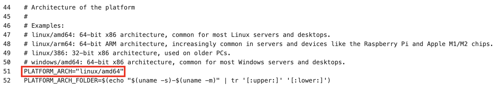

                

            </td>
        </tr>
        <tr>
            <td><strong>Containerization platform</strong> </td>
            <td>
                

                    
Choose between Docker and Podman for building the container images in the demo (Docker is preferred).  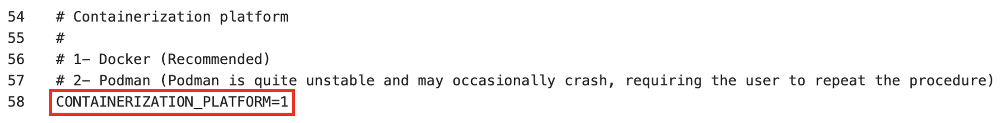

                

            </td>
        </tr>
        <tr>
            <td><strong>Demo app name</strong> </td>
            <td>
                

                    
Name of the demo application   

                

            </td>
        </tr>
        <tr>
            <td><strong>Demo app criticality</strong> </td>
            <td>
                

                    
Define how critical this application is to the business (1 = low and 5 = high)   

                

            </td>
        </tr>
        <tr>
            <td><strong>Demo app repository URL</strong> </td>
            <td>
                

                    
Enter a link to the source code repositories for every microservice in the application. Typically there is one repository per microservice.   

                

            </td>
        </tr>
        <tr>
            <td><strong>Demo app version</strong> </td>
            <td>
                

                    
Enter a version for the application. Latest is an accepted term.  

                

            </td>
        </tr>
        <tr>
            <td><strong>Demo app component</strong> </td>
            <td>
                

                    
Enter the name of each microservice, ensuring the order is consistent with above variables.  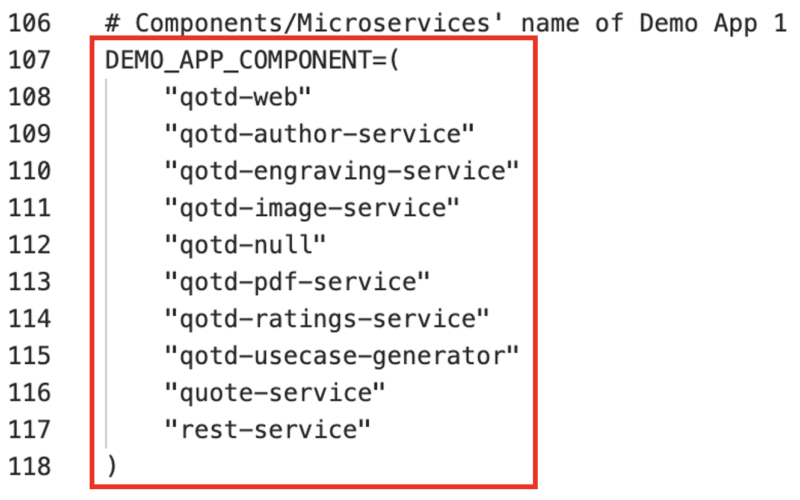

                

            </td>
        </tr>
        <tr>
            <td><strong>Demo app repo name</strong> </td>
            <td>
                

                    
Enter the name of each microservice code repository, ensuring the order is consistent with above variables.   

                

            </td>
        </tr>
        <tr>
            <td><strong>Demo app source code repo URL</strong> </td>
            <td>
                

                    
Enter the URL of the source code repository for each microservice, ensuring the order is consistent with above variables.   

                

            </td>
        </tr>
        <tr>
            <td><strong>Demo app image URL</strong> </td>
            <td>
                

                    
Enter the name of the docker image for each microservice, ensuring the order is consistent with above variables.     Note: All images for this demo have been pre-built and are ready to be pulled for use in the helper scripts.

                

            </td>
        </tr>
        <tr>
            <td><strong>Demo app image tag</strong> </td>
            <td>
                

                    
Enter the name of the tag for each docker image, ensuring the order is consistent with above variables. Latest is an accepted term.  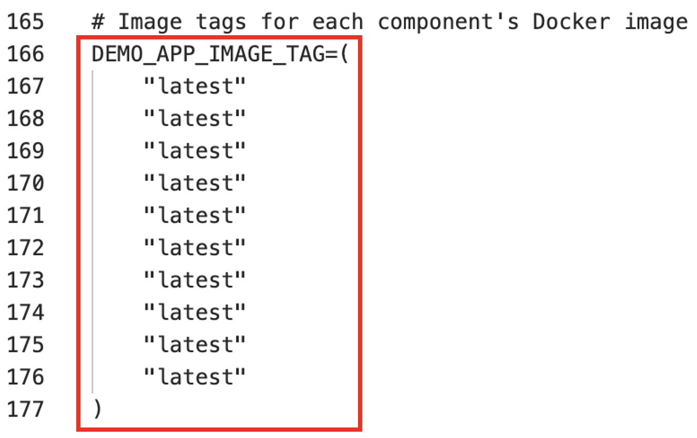

                

            </td>
        </tr>
        <tr>
            <td><strong>Demo app repository branch</strong> </td>
            <td>
                

                    
Enter the name of the repo branch for each microservice, ensuring the order is consistent with above variables.   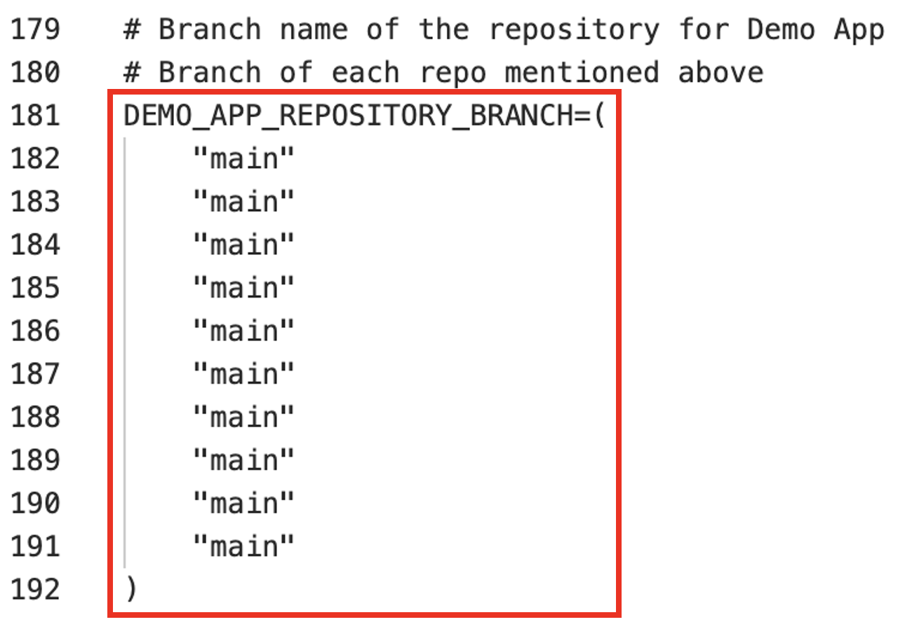

                

            </td>
        </tr>
        <tr>
            <td><strong>Demo app access points</strong> </td>
            <td>
                

                    
Enter the access points for each microservice, ensuring the order is consistent with above variables.    The access points are listed in an array of the following format:  [ microservice_name | environemnt_name | access_point_name | access_point_url | visibility] 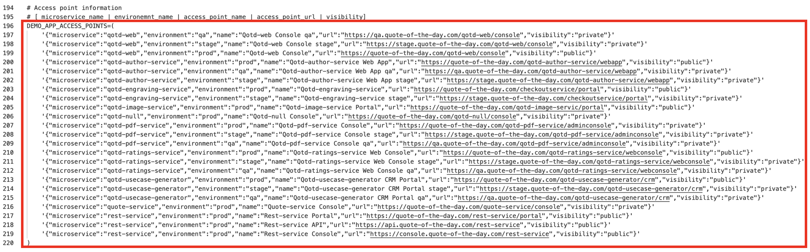

                

            </td>
        </tr>
        <tr>
            <td>
                
<strong>Build number</strong>  <strong>Inventroy build number</strong>  <strong>Concert URN prefix</strong>

            </td>
            <td>
                

                    
Enter build numbers and the Concert URN prefix. In the absence of a pipeline, these values need to be provided manually.   

                

            </td>
        </tr>
        <tr>
            <td>
                
<strong>Kubernetes platform</strong>  <strong>Environment platform</strong>  <strong>Cluster ID</strong>  <strong>Cluster region</strong>  <strong>Cluster name</strong>  <strong>Cluster namespace</strong>  <strong>Kubernetes platform type</strong>  <strong>Kubernetes platform name</strong>  <strong>Cluster environment platform</strong>

            </td>
            <td>
                

                    
Enter the deployment information for the application.  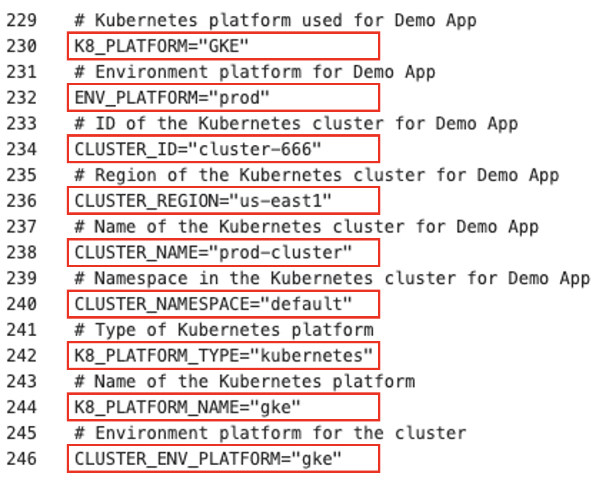

                

            </td>
        </tr>
        <tr>
            <td>
                
<strong>Business name</strong>  <strong>Business unit name</strong>  <strong>Contact email</strong>  <strong>Contact phone</strong>

            </td>
            <td>
                

                    
Enter SBOM owner and contact details.   

                

            </td>
        </tr>
        <tr>
            <td>
                
<strong>Concert ingestion endpoint</strong>  <strong>Concert ingestion instance ID</strong>  <strong>Concert ingestion token</strong>  <strong>Concert ingestion user</strong>  <strong>Concert ingestion password</strong>

            </td>
            <td>
                

                    
Enter information for a specific Concert instance.  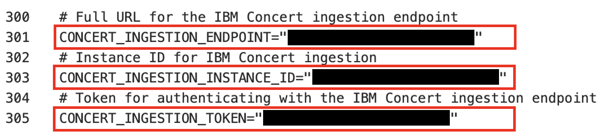  If a Concert token is not available, the Concert username & password can also be used to upload data using the API.  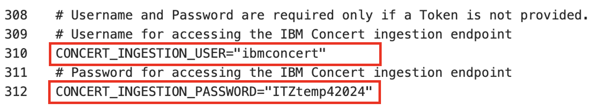

                

            </td>
        </tr>
    </tbody>
</table>

Made with <a href="https://www.htmltables.io/" target="_blank">HTML Tables</a>

<!-- <Show source code for install script> -->

**[Go to top](#top)**

  

2 - Install supporting software

The install_supporting_software.sh shell script will install the IBM Concert toolkit, Grype, Docker and other software needed for this demo.

### Action 2.1: Execute the code below in a terminal.

<code class="code-block"> ./install_supporting_software.sh </code>

The shell script will install the following:  

| **Software** | **Description** |
| :--- | :--- |
| **IBM Concert toolkit** | Framework required to generate SBOMs and interact with IBM Concert APIs |
| **grype** | Vulnerability scanner for container images and filesystems |
| **Syft** | Tool for generating SBOMs from container images and filesystems |
| **cdxgen** | Tool required to generate CycloneDX SBOMs for various programming languages |
| **Python3** and **pip3** | Essential for running Python scripts and managing Python packages |
| **Homebrew** | Package manager for macOS that simplifies the installation, updating and management of software and libraries |
| **Node.js** | Required to enable the execution of JavaScript code server-side and the development of scalable network applications |
| **nvm** | Enable you to manage multiple versions of Node.js, making it easy to switch between different versions for various projects and development environments |
| **rpm** | Needed for installing certain packages like Syft |
| **Gradle** | Open-source build automation tool that streamlines the building, testing and deployment of software projects with its flexible and powerful capabilities |
| **jq** | Lightweight and flexible command-line JSON processor, essential for parsing, manipulating and transforming JSON data |
| **Bazel** | Powerful build and test tool that automates the process of compiling and testing large codebases efficiently |
| **GitHub CLI** | Tool for managing GitHub repositories from the command line |
| **Docker** | Platform for running and deploying containers and applications |

### Set up system paths

1. Update the system path and configure Git. Homebrew usually adds itself to the PATH automatically. However, if it doesn’t, you can add it manually:    <code class="code-block"> nano ~/.zshrc  # For zsh   # or   nano ~/.bash_profile  # For bash </code>

2. For users running macOS versions prior to Big Sur, you can set the Homebrew installation directory with the following command. Please add this line to your .zshrc or .bash_profile:    <code class="code-block"> export PATH="/usr/local/bin:/usr/local/sbin:$PATH" </code>

3. For users running macOS macOS versions Big Sur and later, the Homebrew installation directory is /opt/homebrew:    <code class="code-block"> export PATH="/opt/homebrew/bin:/opt/homebrew/sbin:$PATH" </code>

4. Homebrew usually handles this automatically, but to ensure Gradle is included in your PATH. For users running macOS versions prior to Big Sur, this can be done by adding the command below to your .zshrc or .bash_profile:    <code class="code-block"> export PATH="/usr/local/opt/gradle/bin:$PATH" </code>

5. For users running macOS versions Big Sur and later, use the command below:    <code class="code-block"> export PATH="/opt/homebrew/opt/gradle/bin:$PATH" </code>

6. Homebrew usually handles this automatically, but to ensure Bazel is included in your PATH. For users running macOS versions prior to Big Sur, this can be done by adding the command below to your .zshrc or .bash_profile:    <code class="code-block"> export PATH="/usr/local/bin:$PATH" </code>

7. For users running macOS versions Big Sur and later, use the command below:    <code class="code-block"> export PATH="/opt/homebrew/bin:$PATH" </code>

8. Apply changes:    <code class="code-block"> source ~/.zshrc  # For zsh   # or   source ~/.bash_profile  # For bash </code>

9. Configure Git:    <code class="code-block"> git config --global user.name "Your Name"   git config --global user.email "your.email@ibm.com" </code>

**[Go to top](#top)**

  

3 - Generate 'Package SBOMs'

This slide shows the two variations of SBOMs that IBM Concert ingests.
  

**Industry-standard CycloneDX SBOMs:** Concert ingests the industry standard CycloneDX SBOM in JSON fromat generated by tools like CycloneDX, Syft and cdxgen. These SBOMs are called Package SBOMs.

**Concert-defined SBOMs:** Concert also ingests custom SBOMs. These SBOMs are extenstions of the CycloneDX format and are specific for Concert. These SBOMs are called ‘Concert-defined’ SBOMs and are also in JSON format.

The first SBOM file generated by the helper scripts is the Package SBOMs. Concert ingests two types of package SBOMs, one that scans the the source code and the second that scans the images. These SBOMs provide an inventory of what’s in the software packages used by the code and images of the microservice. 

We will use the IBM Concert Toolkit (v1.0.1) to generate both types of package SBOMs.

The code scan command in the Concert toolkit uses **cdxgen** to analyze the codebase, identifying all software packages and dependencies.

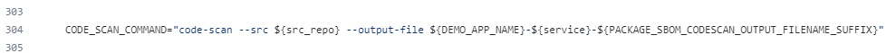

The image scan command in the toolkit uses an open source tool called **Syft** to analyze the packages and operating system details in the containerized image.

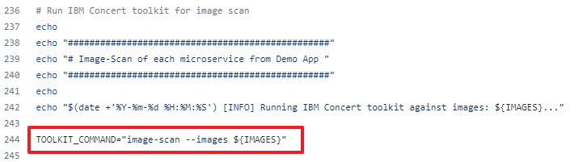

### Action 3.1: Execute the ./generate_package_sbom.sh shell script.

<code class="code-block"> ./generate_package_sbom.sh </code>

The output of this command will be an image-scan SBOM and a code-scan SBOM file for each microservice. In both cases, the toolkit generates a JSON file in standard CycloneDX format.

<!-- <show generated package SBOM files on the computer> -->

**[Go to top](#top)**

  

4 - Generate CVE scan

In our demo we use an open source tool called **Grype** to conduct a vulnerability scan by analyzing container images. However, customers can use any image scanning tool like Prisma Cloud's Twistlock or Aqua Security's Trivvy.

<inline-notification text="The Concert toolkit does not contain any commands for generating CVE scan files."></inline-notification>

### Action 4.1: Execute the generate_cve_csv_file.sh shell script.

<code class="code-block"> ./generate_cve_csv_file.sh </code>

The output of this command will be a CVE file in CSV format for each microservice image in the application.

<inline-notification text="Concert accepts CSV files in a specific column format. Use the provided template to ensure the output file is generated with the correct CSV headers."></inline-notification>

The CSV column format that Concert ingests must be in the following order:  
<code class="code-block"> CVE | Image | Package | Package Version | Package Path | Severity |Score | hasFix | Fixed Version | Description | Tag | Digest</code> 

The <a href="https://github.ibm.com/ibm-concert-platinum-demos/concert-pm-utils/blob/main/macos/templates/grype-cve.tmpl" target="_blank" rel="noreferrer">Concert CSV template</a> is provided with the helper scripts for this demo.

<!-- <show CVE scans generated on the computer> -->

One CSV scan file should be generated for every microservice image in our QotD application.

**[Go to top](#top)**

  

5 - Generate 'Build SBOMs'

The three concert-defined SBOMs are called: Build, Deploy, and Application Definition. Let’s start with the Build SBOM.

We will use the toolkit to generate the build SBOM file, which is a detailed inventory that includes information about the libraries, frameworks, tools, and other dependencies that were used to build the software application.
  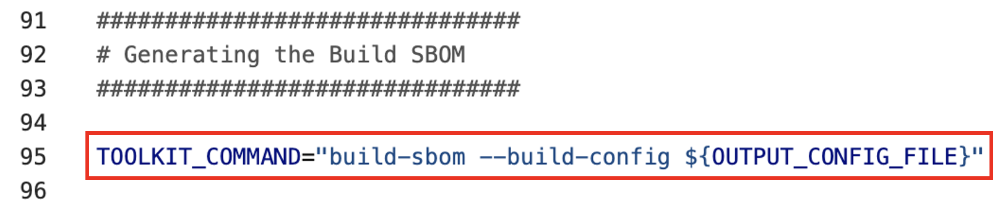

<!-- <show script where build-sbom command is called> -->

### Action 5.1: Execute the generate_build_sbom.sh shell script. 

<code class="code-block"> ./generate_build_sbom.sh </code>

For each microservice image of the target application, a Build SBOM will be generated in the ./toolkit-data directory.

<!-- <show files in toolkit data directory> -->

<!-- <open one build sbom> -->

For each individual microservice, a Build SBOM provides an inventory of:  
1. Associated images and their versions      
2. Repositories and their branches   

**[Go to top](#top)**

  

6 - Generate 'Deploy SBOMs'

The deploy SBOM focuses on the software as it is actually deployed in a specific environment, including any environment-specific configurations such as public and private access points.  We will use the toolkit to generate the deploy SBOM file.

### Action 6.1: Execute the generate_deploy_sbom.sh shell script.

<code class="code-block"> ./generate_deploy_sbom.sh </code>

For each pair of microservice and environment defined for the target application, a deploy SBOM will be generated in the ./toolkit-data directory. 

<!-- <show toolkit-data directory where SBOMs are generated (14)> --> 

For each combination of microservice and environment, a Deploy SBOM provides an inventory of:   
1. Access points      
2. External dependencies   

**[Go to top](#top)**

  

7 - Generate 'Application-definition SBOM'

The last SBOM to be generated is the Application definition SBOM. This SBOM is where the application criticality is defined.  The application criticality plays a significant role in Concert’s calculation of risk prioritization and recommendations.

<!-- <show script where app-definition command is called> -->

### Action 7.1: Execute the generate_app_def.sh shell script. 

<code class="code-block"> ./generate_app_def.sh </code>

The Application-definition SBOM is defined at the application level instead of the microservice level. This enables Concert to have an application-centric view and only one Application-definition SBOM is required for each application, regardless of how many microservices it has.

An Application-definition SBOM will be generated in the ./toolkit-data directory. 
  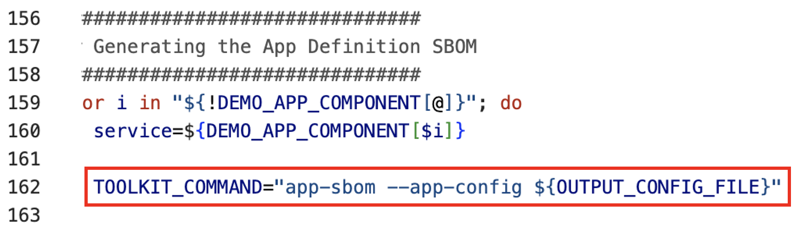

<!-- <show toolkit-data directory where Application Definition SBOM is generated (1)> -->

An Application-definition SBOM defines the boundaries of an application, including the following underlying elements:   
1. Microservices       
2. Repositories       
3. Images      
4. Environments       
5. Access points and their exposure levels       
6. Application criticality   

**[Go to top](#top)**

  

8 - Upload data to Concert

Upload all the generated data into IBM Concert to make it accessible in the Concert UI.

### Action 8.1: Execute the upload_data_concert.sh shell script. 

<code class="code-block"> ./upload_data_concert.sh </code>

<!-- <show script with upload details> -->

This helper script automates the process, allowing multiple Concert-supported files to be uploaded at once, eliminating the need for manual uploads.

Alternatively, you can manually upload all relevant files from the ./toolkit-data directory to IBM Concert using the user interface, one by one.

<inline-notification text="Once all files are processed, they will be zipped and moved to the ./processed folder."></inline-notification>

**[Go to top](#top)**

  

View updates in Concert UI

Log in to Concert to view the uploaded data.
  
  

<!-- <show arena view> -->

<!-- <show dimensions view of vulnerability> -->

**[Go to top](#top)**

  

Summary

In this demo, we saw how to ingest data manually into IBM Concert. We learned about the five types of SBOMs and the CVE scan format that can be uploaded to Concert for visualization in the UI.

Click <a href="https://ibm.github.io/platinum-demos/tech-sales-enablement-learning-to-ingest-data-into-ibm-concert-pipeline/pre-requisites" target="_blank" rel="noreferrer">here</a> to continue to **Part 2 - Using a pipeline to automate data ingestion into IBM Concert**.

**[Go to top](#top)**

  

