

Click the [**Demo preparation**](demo-preparation) tab for setup instructions.

Introduction

In this video, we’ll show you how to ingest data into IBM Concert. 

The first part of the video will walk you through the manual process to help you understand the details of how Concert works. 

Let’s start with ingesting data manually into Concert. This is important for your understanding the different types of data and formats that Concert supports. 

For our demo, we’ll use the Quote of the Day application, which consists of 10 microservices. The final result will showcase a populated Concert Arena View with all the underlying components of the application and the prioritized CVEs.

Let’s get started.

 

1 - Populate global variables

With the helper scripts downloaded, we are now ready populate application environment variables needed by the Concert toolkit. 

We begin by opening the concert-pm-utils repo code we downloaded in the pre-requisites section and open the global_environment_variables file. This file contains all the details of the demo qotd application and its environment.

<!-- <Show source code for install script> -->

At the top of the file is some information about the repository and script setup. 

The first thing we need to do is on line 51 where we define the operating system we’re working on. For Mac and Linux users we set the value of the PLATFORM_ARCH property "linux/amd64".

<code class="code-block"> PLATFORM_ARCH="linux/amd64 </code>

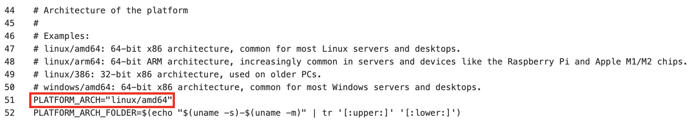

The next line to update is line 58, where we specify the container platform for building our images. You can choose either Docker or Podman. For this demo, we'll use Docker, so we’ll enter 1 in this field.

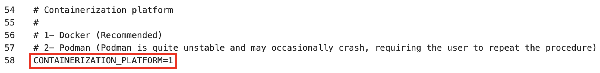

After that, we scroll down to the demo app section and give the application a name. 

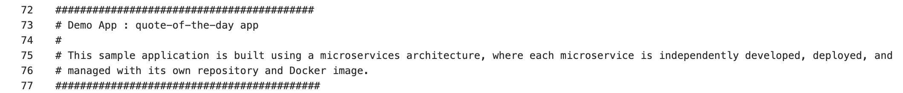

On line 79, we’ll name it "quote-of-the-day."

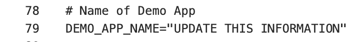

The next step is to define how critical this application is to our organization. We’ll use a scale from 1 to 5, with 1 being the least critical and 5 being the most. For this demo, we'll set the criticality to 4. The criticality rating plays a big role in how Concert calculates the risk score, so setting this value correctly is key to getting the most out of Concert’s prioritization recommendations.

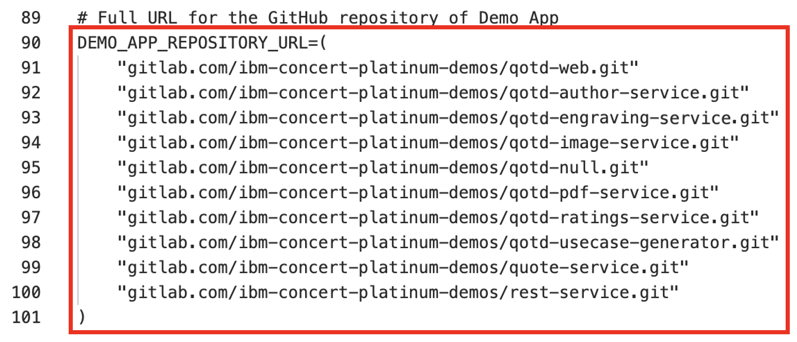

Next, on line 91, we’ll list the URLs where the source code for the qotd application is stored. Our qotd application is set up as a polyrepo in GitLab, which means each microservice has its own repository. Since the qotd application has 10 microservices, we’ll enter 10 repository URLs in this variable.

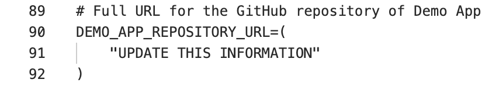

Since we’re using the latest version of the application, we will set the next variable to "latest" on line 104.

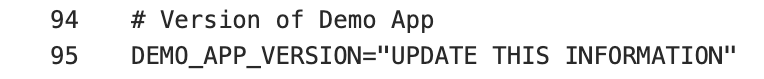

Since this is a manual script with all the information being static, we need to populate the next variable with all the different microservices or components of the application on line 107. This is a positional array, so the order of the microservices listed here is important. For example, the first microservice corresponds to the first repository we listed earlier, and the same order will apply to the other variables below.

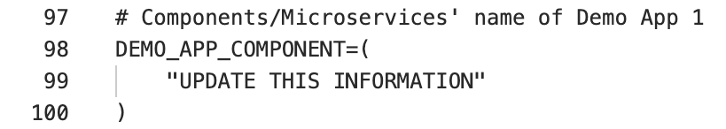

Next on line 122, we will list the names of the microservice repos in the same order as they are above.

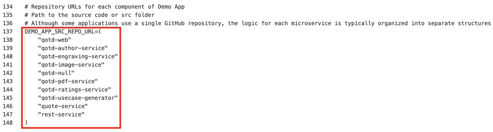

Next, we’ll specify the folder where the source code for each microservice is located on your machine. We’ll use the relative path for this.

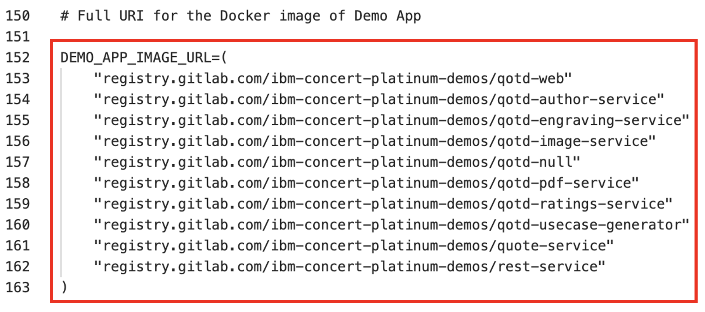

Next, we’ll fill in the next variable with the URL for each of the images corresponding to the microservices listed above. As mentioned earlier, each microservice should have exactly one image.

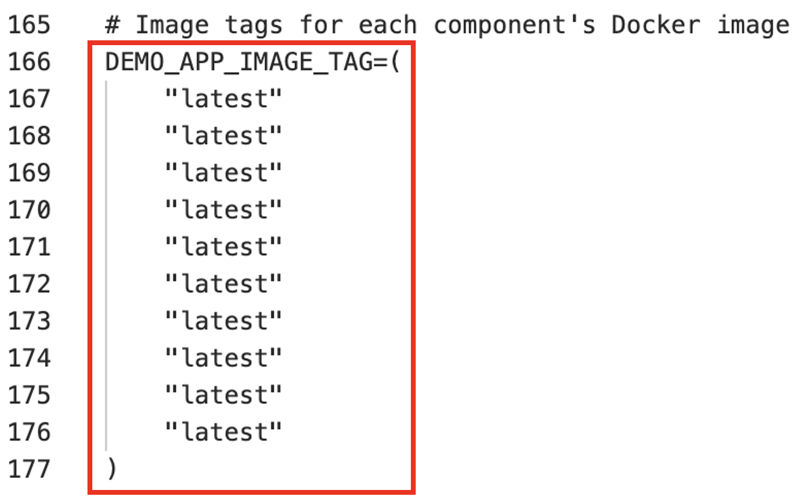

Next, we’ll enter the tags for each image. For this exercise, we’ll be working with the latest images, so we’ll use the tag "latest."

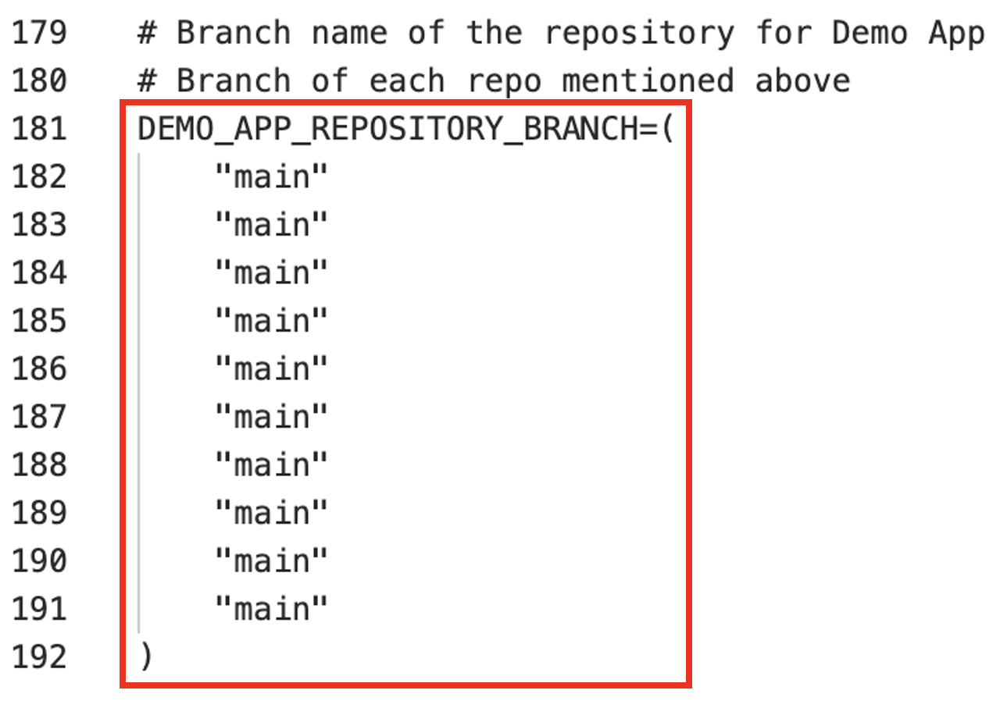

Next, we’ll specify the branch for each of the repositories we listed earlier. For this exercise, we’ll be working with the "main" branch, so let’s enter "main" for each repository.

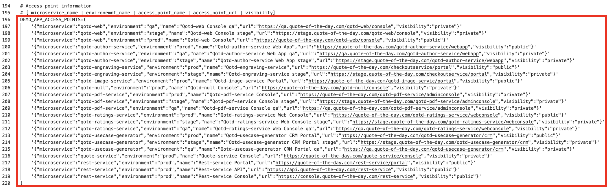

The next variable is a list of all the access points used by the microservices in this application. We’ll use an array of strings, with each element separated by a specific separator character. For each access point we will provide the name of the microservice it belongs to, the name of the environment the access point is on (for example, dev, qa, stage, prod), the name of the access point, the url of the access point, and most importantly, the visibility or exposure of the access point, either public or private. It’s useful to note that if no exposure parameter is provided, Concert will default it to public.

Each microservice can have multiple access points. For this exercise, we’ll fill line 204 with 23 access points.

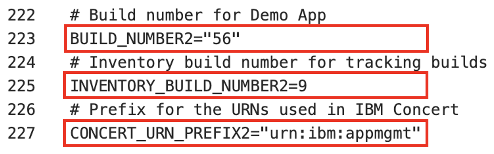

The next few variables would normally be populated automatically in a CI/CD pipeline. However, for this exercise, we will manually set the build number to 56 on line 231. Then, we’ll set the Inventory build number to 9 on line 233 and the URN Prefix on line 235 to "urn:ibm:appmgmt"

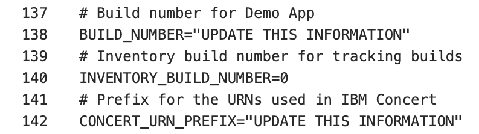

Next, let’s fill in the next section with the details of the Kubernetes container used in this exercise.

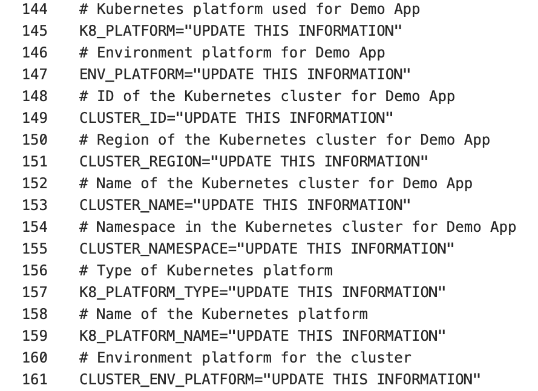

Finally, let’s populate the variables on lines 257 to 260 with the company's contact information. This information is necessary for generating the Application Definition SBOM. For this exercise, we’ll use IBM’s information to fill these variables.

We’ve finished setting up our demo app. Now, let’s configure the system variables. The global_environment.variables file is already prepopulated with the information needed to download the toolkit and other supporting details. However, we still need to provide the information for the IBM Concert instance that we’ll be using in this exercise.

On line 322, enter the token obtained from your IBM Concert console. Keep "0000-0000-0000-0000" as the instance ID on line 320.

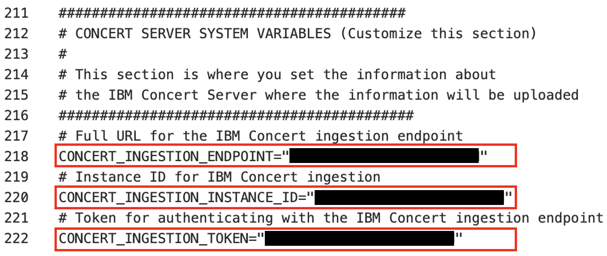

Now let’s fill in the information required to connect remotely to IBM Concert through its API. On line 312, populate the CONCERT_INGESTION_USER with any admin username; for this exercise, we’ll use "ibmconcert." Next, enter the password on line 314; we’ll use "ITZtemp42024". Then, on line 318, populate CONCERT_INGESTION_ENDPOINT with the full URL of the IBM Concert instance. 

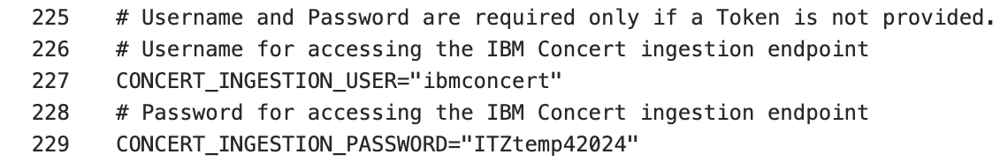

**[Go to top](#top)**

  

2 - Install supporting software

With the environment variables populated, we can now install the software needed to run this demo. 

To install all supporting software, we run the install_supporting_software shell script. The script will install software like the IBM Concert toolkit, Grype, Docker, and many others needed for this demo.

Run the install_pre_reqs.sh shell script:

<code class="code-block"> ./install_pre_reqs.sh </code>

The shell script will install the following:   • <strong>IBM Concert toolkit</strong>: framework required to interact with IBM Concert APIs.   • <strong>Python3</strong> and <strong>pip3</strong>: essential for running Python scripts and managing Python packages.   • <strong>Homebrew</strong>: package manager for macOS that simplifies the installation, updating, and management of software and libraries.   • <strong>Node.js</strong>: required to enable the execution of JavaScript code server-side and the development of scalable network applications.   • <strong>nvm</strong>: enable you to manage multiple versions of Node.js, making it easy to switch between different versions for various projects and development environments.   • <strong>rpm</strong>: needed for installing certain packages like Syft.   • <strong>Gradle</strong>: open-source build automation tool that streamlines the building, testing and deployment of software projects with its flexible and powerful capabilities.   • <strong>grype</strong>: vulnerability scanner for container images and filesystems.   • <strong>jq</strong>: lightweight and flexible command-line JSON processor, essential for parsing, manipulating, and transforming JSON data.   • <strong>Bazel</strong>: powerful build and test tool that automates the process of compiling and testing large codebases efficiently.   • <strong>Syft</strong>: tool for generating SBOMs from container images and filesystems.   • <strong>cdxgen</strong>: tool required to generate CycloneDX SBOMs for various programming languages.   • <strong>GitHub CLI</strong>: is a tool for managing GitHub repositories from the command line.   • <strong>Docker</strong>: platform for running and deploying containers and applications.

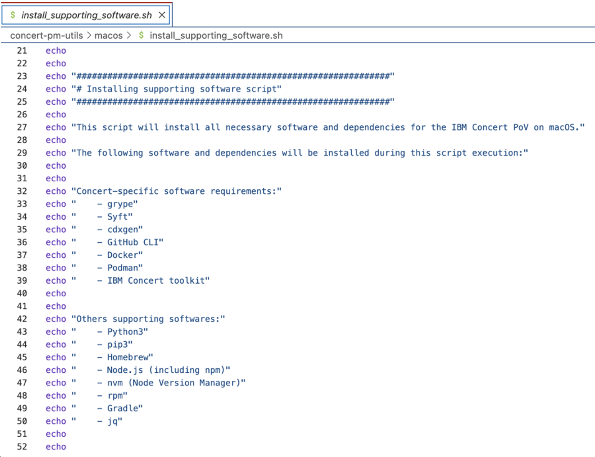

**[Go to top](#top)**

  

3 - Generate 'Package SBOMs'

Now let’s walk through how to ingest the SBOM (Software Bill of Materials) and CVEs into IBM Concert.

This slide shows the two variations of SBOMs that IBM Concert ingests.

On the left, we see that Concert ingests the industry standard cycloneDX SBOM generated by various tools like CycolneDx, Syft and CDXgen. These SBOMs are called Package SBOMs.

On the right, we see that Concert also ingests SBOMs that are specific to Concert. These SBOMs are extenstions of the cycloneDX format and are customized for Concert. These SBOMs are called ‘Concert-defined’ SBOMs. 

The first SBOM file is the Package SBOM: which gets its name because Concert takes an inventory of what’s in the software packages. Concert ingests two types of package SBOMs, one that scans the the source code and the second that scans the images.

<!-- <show section in script where toolkit image is pulled> -->

We will use the IBM Concert Toolkit (v1.0.1) to generate both types of package SBOMs.

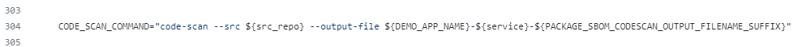

<!-- <show section in script where code scan is called> -->

The code scan command in the Concert toolkit uses CDXgen to analyze the codebase, identifying all software packages and dependencies.

<!-- <show section in script where image scan is called> -->

The image scan command uses Syft to analyze the containerized application image for vulnerabilities and compliance issues, ensuring the image is secure before deployment.

In both cases, the toolkit generates a JSON file in standard CycloneDX format.

To execute both tasks we will run the generate_package_sbom.sh shell script:    <code class="code-block"> ./generate_package_sbom.sh </code>

The output of this command will be an image-scan SBOM and a code-scan SBOM file for each microservice.

<!-- <show generated package SBOM files on the computer> -->

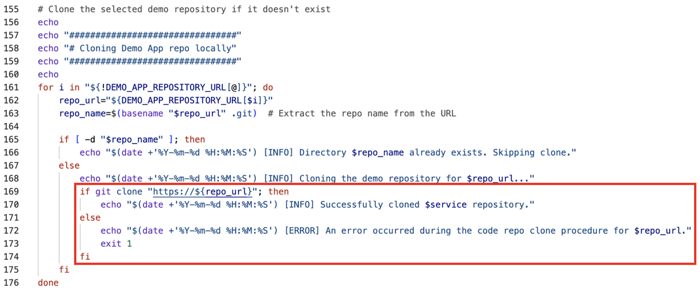

**[Go to top](#top)**

  

4 - Generate CVE scan

The next step involves using Grype to conduct a vulnerability scan by analyzing container images. We chose Grype for this demo because it’s open source, but customers will often use tools like Twistlock or Trivvy.

<!-- <show script where Grype command is called and how it’s converting it to a format that Concert can accept> -->

This process is carried out by executing the generate_cve_csv_file.sh  shell script:    <code class="code-block"> ./generate_cve_csv_file.sh </code>

The output of this command will be a CVE file in CSV format for each microservice image in the application.

<!-- <show CVE scans generated on the computer> -->

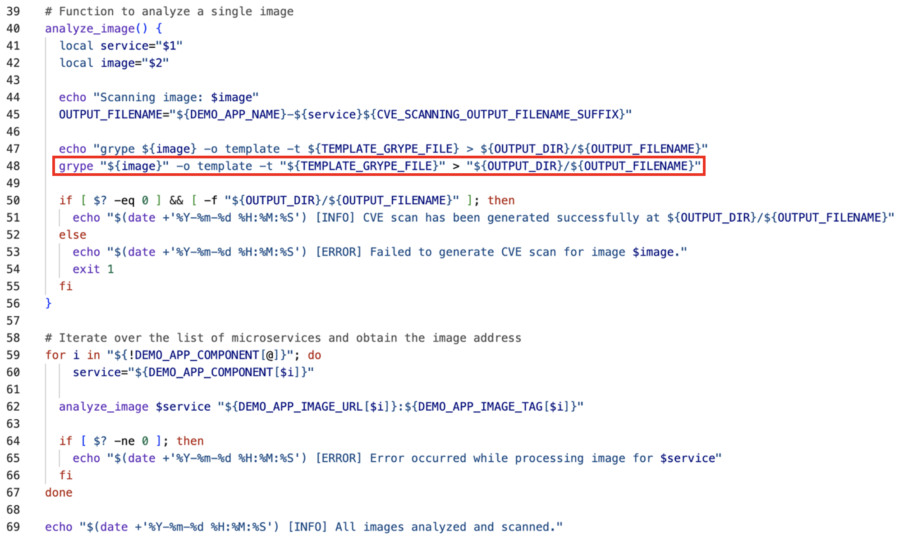

Here we can see CVE scan files generated, one for every microservice image in our qotd application.

**[Go to top](#top)**

  

5 - Generate 'Build SBOMs'

IBM concert ingests custom SBOM files called ConcertDef. These are an extension of the cycloneDX format. The three concert-defined SBOMs are called: Build, Deploy, and Application Definition.

Let’s start with the Build SBOM.

We will use the toolkit to generate the build SBOM file, which is a detailed inventory that includes information about the libraries, frameworks, tools, and other dependencies that were used to build the software application.

<!-- <show script where build-sbom command is called> -->

This process is carried out by executing the generate_build_sbom.sh shell script:    <code class="code-block"> ./generate_build_sbom.sh </code>

For each microservice image of the target application, a build SBOM  will be generated in the ./toolkit-data directory.

<!-- <show files in toolkit data directory> -->

<!-- <open one build sbom> -->

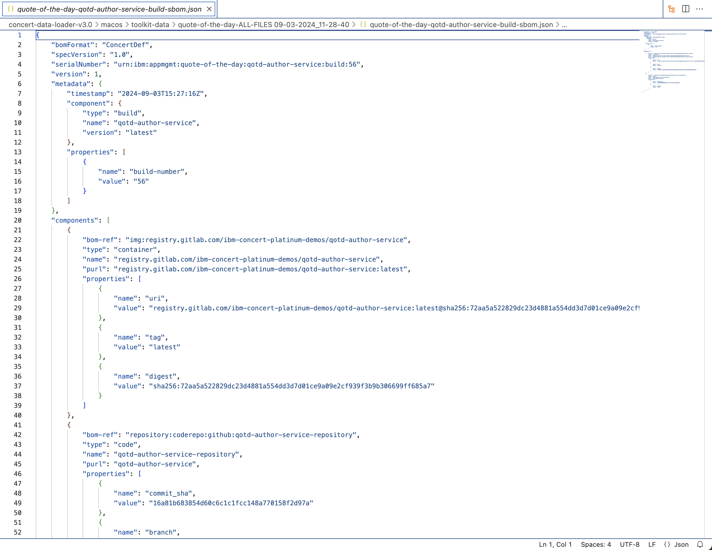

**[Go to top](#top)**

  

6 - Generate 'Deploy SBOMs'

The next step involves using the toolkit to generate the deploy SBOM file where the public and private access points are defined. The deploy SBOM focuses on the software as it is actually deployed in a specific environment, including any environment-specific configurations or dependencies.

<!-- <show script where deploy-sbom command is called> -->

This process is carried out by executing the generate_deploy_sbom.sh shell script:    <code class="code-block"> ./generate_deploy_sbom.sh </code>

For each pair of microservice and environment defined for the target application, a deploy SBOM will be generated in the ./toolkit-data directory. 

<!-- <show toolkit-data directory where SBOMs are generated (14)> --> 

involves using the toolkit to generate the Application Definition SBOM file, which is a detailed record of all elements involved in the application, from its core components to external dependencies, configuration settings, and runtime environments.

**[Go to top](#top)**

  

7 - Generate 'Application-definition SBOM'

The last SBOM to be generated is the Application definition SBOM. This SBOM is where the  application criticality is defined. As mentioned earlier the application criticality plays a significant role in Concert’s calculation of risk prioritization and recommendations.

<!-- <show script where app-definition command is called> -->

This process is carried out by executing the generate_app_def.sh shell script:    <code class="code-block"> ./generate_app_def.sh </code>

Unlike the other SBOMs, the application SBOM is defined at the application level instead of the microservice level. This enables Concert to have an application-centric view and only one application definition SBOM is required for each application, regardless of how many microservices it has.

An Application Definition SBOM will be generated in the ./toolkit-data directory. 

<!-- <show toolkit-data directory where Application Definition SBOM is generated (1)> -->

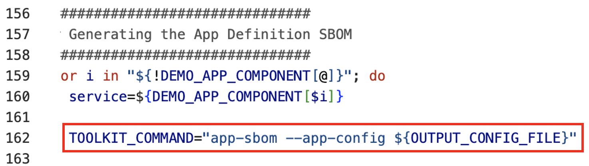

**[Go to top](#top)**

  

8 - Upload data to Concert

The final step is to upload all the generated data into IBM Concert to make it accessible in the Concert UI. This can be done by executing the upload_data_concert.sh  shell script. 

<!-- <show script with upload details> -->

This utility script automates the process, allowing multiple Concert-supported files to be uploaded at once, eliminating the need for manual uploads:    <code class="code-block"> ./upload_data_concert.sh </code>

Alternatively, you can manually upload all relevant files from the ./toolkit-data directory to IBM Concert using the user interface, one by one.

<inline-notification text="Once all files are processed, they will be zipped and moved to the ./processed folder."></inline-notification>

**[Go to top](#top)**

  

View updates in Concert UI

We can now log in to Concert to view the uploaded data.

<!-- <show arena view> -->

<!-- <show dimensions view of vulnerability> -->

**[Go to top](#top)**

  

Summary

Placeholder

**[Go to top](#top)**

  

