

 

Click **<a href="https://ibm.seismic.com/app?ContentId=595cd326-e668-430b-a8a8-13313f2a1d95#/doccenter/f6bc8873-d580-4ee8-a903-c4e0d3a7eee9/doc/%252Fdd85c941b1-5f54-2314-ce72-b98c4c0974c2%252FdfOTRiYmU4NTQtNWY4NC03Y2QyLWZjYWUtOGIxYmFmZjkyZThk%252CPT0%253D%252CRWR1Y2F0aW9uL0xlYXJuaW5n%252Flfb28f603b-fee7-4b77-b46e-8acb34740000/grid/" target="_blank" rel="noreferrer">here</a>** to access the pipeline data ingestion video.

Click the [**Pre-requisites**](pre-requisites) tab for setup instructions.

Introduction

In this demo, we will build and run a pipeline to understand how a customer will automate the data ingestion process.

Concert is designed to ingest data on a regular basis. Every time an application is updated, the pipeline will automatically generate new SBOMs and CVE scans and then upload them to Concert.

For our demo, we will use Tekton on Red Hat OpenShift to build our pipeline. The pipeline concepts we will demonstrate can be translated to other CI/CD pipeline tools.

 

1 - Install Tekton on OpenShift cluster

The first step is to install Tekton which is a Kubernetes-native CI/CD framework for automating application deployment pipelines on OpenShift clusters.

| **Action** 1.1 | Log in to the OpenShift (OCP) cluster on TechZone. |
| :--- | :--- |
|  | When we reserved the OCP instance, we received a kubeadmin login and password.   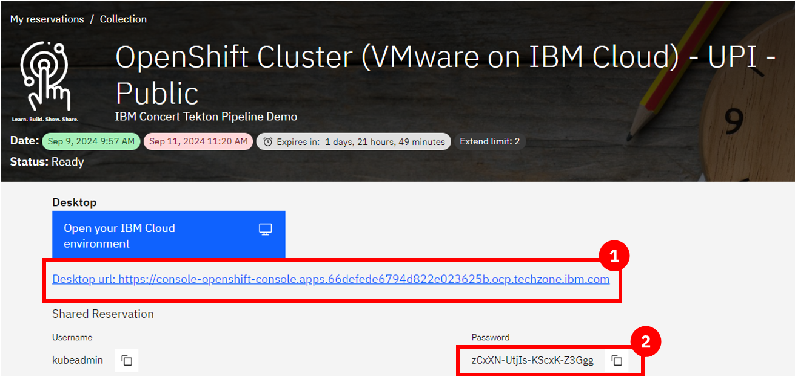    We will use this to log in to the cluster.   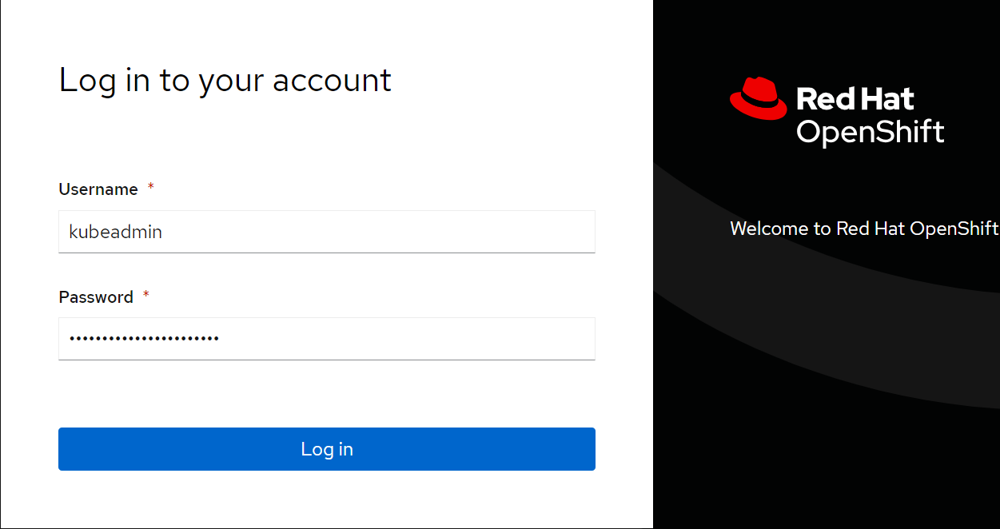    |

| **Action** 1.2 | Click **OperatorHub** in the **Operators** section. |
| :--- | :--- |
|  |   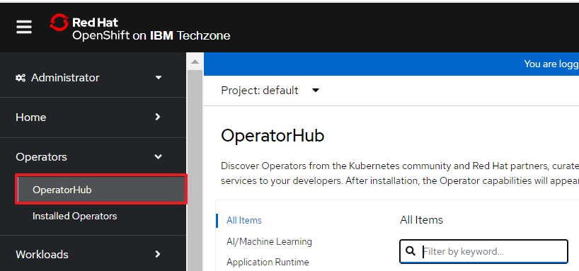 |

| **Action** 1.3 | Search for '**OpenShift pipeline**' and click the **pipeline** tile to open the install dialog. |
| :--- | :--- |
|  |   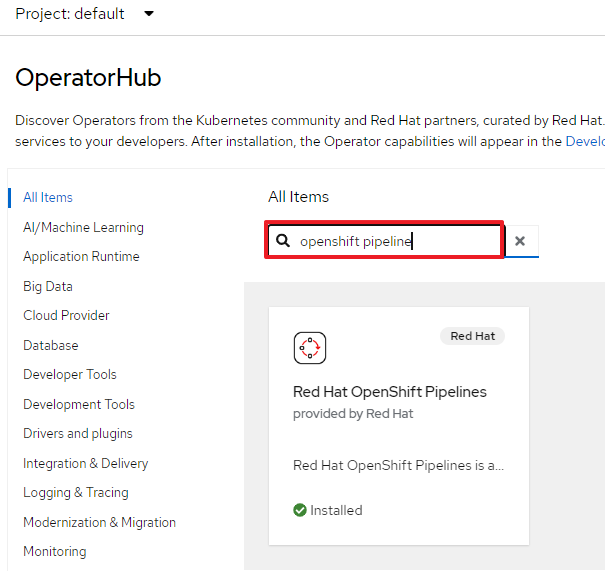 |

| **Action** 1.4 | Click **Install without any changes to the default fields**. |
| :--- | :--- |
|  |   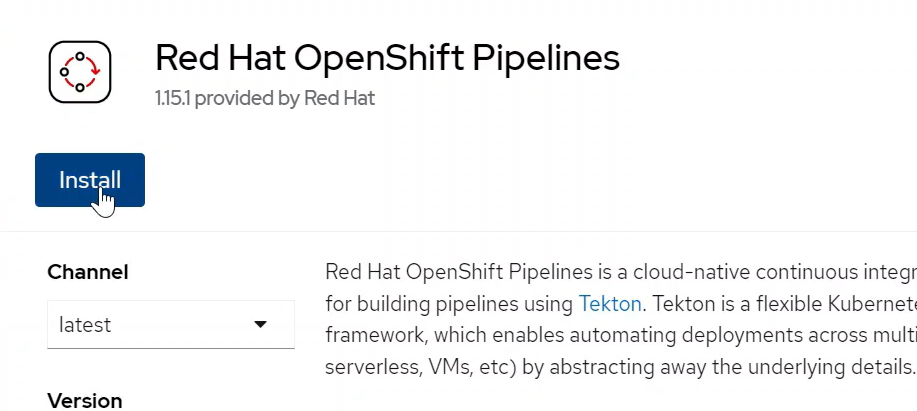  The installation should complete within one minute with a success dialog. |

**[Go to top](#top)**

  

2 - Log in to the OpenShift cluster on your terminal

 

| **Action** 2.1 | Use the '**oc login**' command directly from the TechZone OCP console to log in to the OpenShift cluster from the local machine. |
| :--- | :--- |
|  | Click on 'kubeadmin' in the top right, then click 'copy login command'.   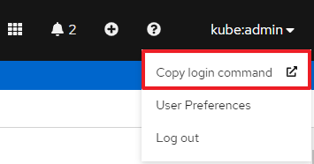   Click 'display token, and then copy the command and paste it into the terminal.   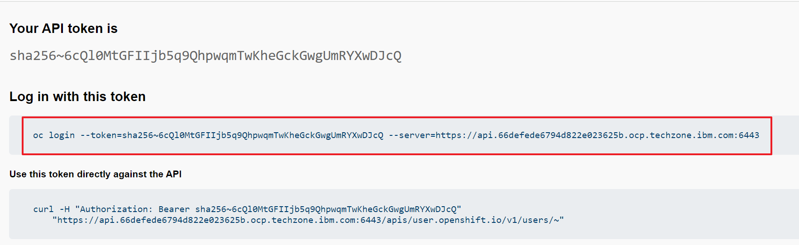 |

<inline-notification text="Note: The OCP login token expires every 24 hours."></inline-notification>

**[Go to top](#top)**

  

3 - Create secrets

We will now provide certain authentication credentials to Tekton in the form of secrets so it can connect to various components in our infrastructure.

In this step, we will create 3 secrets: a Concert Secret, Github Secret and Registry Secret.

### Concert Secret

The Concert secret is what enables Tekton to authenticate with the Concert API for uploading data.  

| **Action** 3.1 | Generate the API key from Concert by ensuring you have admin access, and then log in to the Concert instance. |
| :--- | :--- |
|  | In this demo, our Concert instance is deployed on SaaS.|

| **Action** 3.2 | Click your profile -> **API Key** -> Generate. Copy the key into a notepad or place where you can access it, as it will not be visible again.   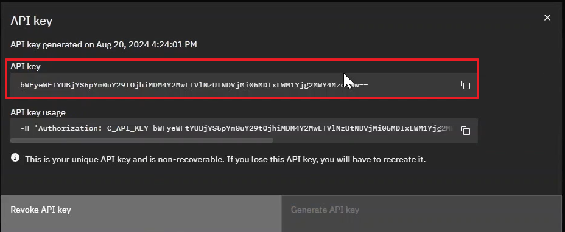|
| :--- | :--- |
|  |  | 

<inline-notification text="Note: This token doesn’t expire unless you generate a new one or revoke it."></inline-notification>

| **Action** 3.3 | Use the '**oc create secret generic**' command to set the name of the secret to '**concert-token-secret**' and insert the Concert token we generated above. |
| :--- | :--- |
|  | <code class="code-block"> oc create secret generic concert-token-secret --from-literal=token="C_API_KEY *YOUR_CONCERT_API_KEY*" </code> | 

<inline-notification text="Note: ensure you have the attribute “C_API_KEY” before the SaaS token, otherwise the API upload won’t authenticate successfully."></inline-notification>

### GitHub Secret

| **Action** 3.4 | Create the GitHub secret by using the '**oc create secret generic**' command again. Name the secret '**github-creds**' and provide your GitHub username and token. |
| :--- | :--- |
|  |   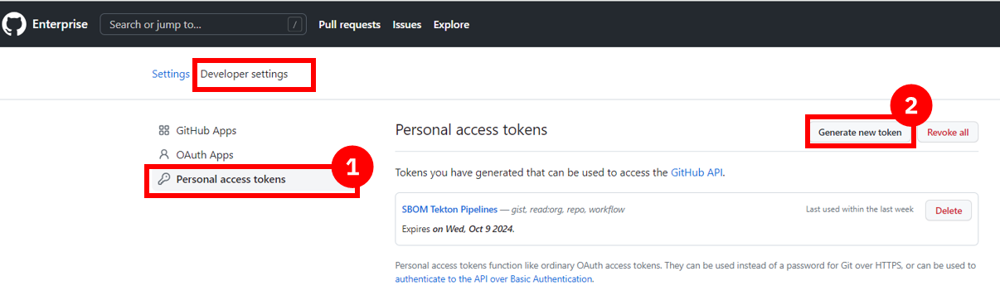  <code class="code-block"> oc create secret generic github-creds --from-literal=username=$env:GITHUB_USERNAME --from-literal=password=$env:GITHUB_TOKEN --type=kubernetes.io/basic-auth </code> | 

<inline-notification text="Note: This information was set up during the pre-requisites, and if not then an IBM GitHub username and token should be set up prior to this step."></inline-notification>

| **Action** 3.5 | Annotate the GitHub secret and link it to the pipeline by running the commands below. |
| :--- | :--- |
|  | <code class="code-block"> oc annotate secret github-creds tekton.dev/git-0=https://github.ibm.com  </code>  <code class="code-block"> oc secret link pipeline github-creds </code> | 

### Registry Secret

The third secret authenticates into the image registry.

For this demo, we are using a private IBM internal jfrog artifactory registry to store our container images. To create this secret, we need the jfrog server address, username and token.

| **Action** 3.6 | Log in to jfrog and click your profile. Click **Setup** and click **Generate authentication token**. |
| :--- | :--- |
|  |   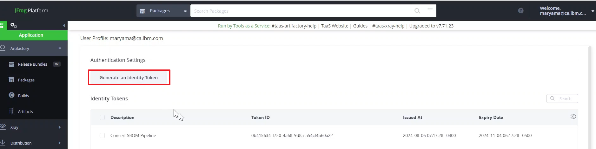 |

<inline-notification text="Note: The token will not be visible again and should be saved for future reference."></inline-notification> 

| **Action** 3.7 | Use the same '**oc create**' secret for type **docker-registry**. Set the name to '**container-registry-secret**' and provide the registry information run the whole command. |
| :--- | :--- |
|  | <code class="code-block"> oc create secret docker-registry container-registry-secret --docker-server=na.artifactory.swg-devops.com --docker-username=youremail@ibm.com --docker-password=YOUR_REGISTRY_TOKEN </code> | 

| **Action** 3.8 | Link the secret to the pipeline, giving it both access and pull permissions. |
| :--- | :--- |
|  | <code class="code-block"> oc secret link pipeline container-registry-secret </code> |
|  | The pull permission allows Tekton to pull images from our registry. |
|  | <code class="code-block"> oc secret link pipeline container-registry-secret --for=pull </code> |

| **Action** 3.9 | Validate the three secrets have been added by running the '**oc get serviceaccount**' command. |
| :--- | :--- |
|  | <code class="code-block"> oc get serviceaccount pipeline -o yaml </code> |

In the output, we should see the GitHub secret (at the bottom) and the container-registry secret (in two places). The Concert secret is not shown here.

**[Go to top](#top)**

  

4 - Create Tekton tasks

For the QotD application, we will create a Tekton pipeline with 11 tasks. Many of the Concert tasks rely on using the toolkit that comes packaged with Concert to automate SBOM generation in the correct format. (IBM Concert Toolkit v1.0.1 used)

<inline-notification text="This demo is not intended to teach Tekton concepts. We will configure a collection of pre-built qotd pipeline tasks."></inline-notification> 

Download (or clone) the <a href="https://github.ibm.com/ibm-concert-platinum-demos/sbom-concert-pipeline">pipeline code</a> to the local machine (the IBM GitHub repository is internal to IBM and available for all IBMers).

1. Navigate to the IBM-Concert-Platinum-Demos repo in your browser
2. Click on the green <> Code dropdown button
3. Click on the SSH tab
4. Copy the repository reference
5. Create a folder called 'sbom-concert-pipeline' on your computer
6. Navigate to the folder in a command line. In the demo we use the command line built into visual studio code.
7. Paste the SSH command into the terminal: git@github.ibm.com:ibm-concert-platinum-demos/sbom-concert-pipeline.git
8. Open the downloaded repository in Visual Studio code. Each task is defined in a YAML file. 

<inline-notification text="When working with a customer, Tech Sellers will need to examine the customer’s existing pipeline and identify the Concert-specific tasks or steps that should be added to the customer’s pipeline. "></inline-notification>

There are 7 Concert-specific tasks that will need to be added to every pipeline to connect it to Concert. 

| **4.1** | **Git Clone Task** |
| :--- | :--- |
|  | The initial task in the pipeline is called the Git Clone Task. In a customer’s environment, we would never work on the production code repository. So we begin the pipeline by first cloning the code repository for the microservice we will be working on.    The git-clone ClusterTask is responsible for pulling down code from a GitHub repository and storing in shared workspace storage. This task cannot be seen in the repository code because the git-clone code is included as part of the default Tekton ClusterTasks bundled with OpenShift Pipelines. |

 

| **4.2** | **Code Scan Task** |
| :--- | :--- |
|  | The next task in the pipeline is called the Code Scan Task. The purpose of this task is to scan the source code of the microservice and generate a Software Bill of Material with library, license and package information being used in the microservice. In Concert, we call this a Package SBOM (of type code-scan). This is the first task where we will be using the Concert toolkit to simplify the generation of the SBOM. (IBM Concert Toolkit v1.0.1 is used) |
| **Action** 4.2.1 | **Line 15**   Identify the toolkit and version we want to use for this task |
| **Action** 4.2.2 | **Line 21**   Call the code-scan command in the toolkit.    **Reminder:** The toolkit is provided as an image and as an end-user we do not have access to the source code. However, the code-scan command under the hood installs and uses an open source tool called cdxgen to scan the source code from the repo and produce a standard cycloneDX sbom file in json format. The pipeline stores this file in a results.output.path location accessible by Tekton. |

<inline-notification text="When working with a customer, the task files provided in this demo should not be used as-is in a customer’s Tekton pipeline environment. The code provided should be used only as a template or guide in helping the customer write their pipeline tasks."></inline-notification>

| **4.3** | **Kaniko Build Task** |
| :--- | :--- |
|  | This task is not Concert-specific, and every customer with a containerized application will have a similar build task already as part of their day-to-day setup.    In our demo, a popular open-source tool called Kaniko is used to build container images directly within a Kubernetes cluster, without requiring Docker to be installed on the nodes. Kaniko will read the Docker file and context, construct the image and then push it to a specified container registry, making it an essential step for automating container builds in CI/CD pipelines. |

 

| **4.4** | **Skopeo Copy Task** |
| :--- | :--- |
|  | This task is also not specific to Concert. It is used for copying container images between different container registries. Similar to Kaniko, Skopeo is an open-source tool that enables operations on container images without requiring a Docker daemon. In our demo, Skopeo will push our microservice’s image to our registry. |

 

| **4.5** | **Image Scan Task** |
| :--- | :--- |
|  | The purpose of this task is to scan the microservice and generate a SBOM with library, license and package information being used in the microservice. This task scans the image of the microservice which includes additional information such as operating system in Concert, we call this a Package SBOM (of type image-scan). |
| **Action** 4.5.1 | **Line 15**   Identify the toolkit and version we want to use for this task.    **Line 21** is where the toolkit is being used with the image-scan command. |
|  | The toolkit is provided as an image. As an end user, we do not have access to the source code. However, the image-scan command under the hood installs and uses an open-source tool called Syft to scan the source code from the repo and produce a standard cycloneDX SBOM file in JSON format.     The pipeline stores this file in a results.output.path location accessible by Tekton. |

 

| **4.6** | **CVE Scan Task** |
| :--- | :--- |
|  | IBM Concert accepts CVE scans that are run against container images only, therefore in our pipeline this task is performed right after the image is built in the previous steps. There are many CVE scanning tools on the market, in this demo our task will install and run an open source tool called Grype which will scan the image for vulnerabilities and output a .csv file.    IBM Concert ingests CVE scans in two formats: CSV and VDR. In this demo, we will be using the CSV format. For the CSV format, the columns and headers must be formatted in a specific sequence for uploading to Concert. This sequence is provided as a template to the Grype scan command. This causes Grype to scan the image and then generate a CSV file in the correct Concert format.    If a customer is using a different tool for their CVE scans, for example Trivvy or Twistlock, they can similarly provide this template as input to the tool to ensure the output is formatted correctly.   <inline-notification text="The IBM Concert toolkit v1.0.1 does not contain any commands for the CVE scan task."></inline-notification> |

 

| **4.7** | **Build SBOM Task** |
| :--- | :--- |
|  | This is a Concert-specific task, and a customer would not have it in an existing pipeline.    To simplify the generation of the Build SBOM file in the defined Concert format, we will be using the toolkit (IBM Concert Toolkit v1.0.1 used). |
| **Action** 4.7.1 | **Line 15**    Identify the toolkit and version we want to use for this task.    **Line 21** is where the toolkit is being used with the build-sbom command. The build-sbom command under the hood uses the pipeline’s build data to populate a config file to generate the SBOM file in JSON format. |

 

| **4.8** | **Deploy SBOM Task** |
| :--- | :--- |
|  | This is also a Concert-specific task and a customer would not have it in an existing pipeline. This SBOM is where the public and private access points for each microservice are defined.    To simplify the generation of the deploy SBOM file in the defined Concert format, we will be using the toolkit (IBM Concert Toolkit v1.0.1 used). |
| **Action** 4.8.1 | **Line 15**: Identify the toolkit and version we want to use for this task.    **Line 21** is where the toolkit is being used with the deploy-sbom command. The deploy-sbom command under the hood uses the pipeline’s build data to populate a config file to generate the SBOM file in json format. |

 

| **4.9** | **Application-definition SBOM Task** |
| :--- | :--- |
|  | This is also a Concert-specific task and a customer would not have it in an existing pipeline.    To simplify the generation of the application definition SBOM file in the defined Concert format, we will be using the toolkit (IBM Concert Toolkit v1.0.1 used). |
| **Action** 4.9.1 | **Line 15**: Identify the toolkit and version we want to use for this task.    **Line 21** is where the toolkit is being used with the application-definition command. The application-definition command under the hood uses application data to populate a config file to generate the SBOM file in json format. |

  

| **4.10** | **Upload Concert Task** |
| :--- | :--- |
|  | In this task, we connect to our Concert instance to upload all the files we generated in the previous steps.   <inline-notification text="Note: This is the first task in this demo where changes are required."></inline-notification>   To simplify the uploading of data to Concert, we will also be using the toolkit. |
| **Action** 4.10.1 | **Line 20**   Identify the toolkit and version we want to use for this task.    **Line 77** is where the toolkit is being used with the upload-concert command. |
| **Action** 4.10.2 | **Line 55**   Update this line with your Concert instance ID.    • If Concert is deployed on SaaS, the instance ID will be located in the browser URL.   • If Concert is deployed on VM, the instance ID is: 0000-0000-0000-0000   • If Concert is deployed on OCP, the instance ID is: ? |

 

| **4.11** | **SBOM Pipeline Task** |
| :--- | :--- |
|  | The final task defines the structure and logic of our sbom-pipeline. Without it, Tekton wouldn't know which tasks to run, in what order or with what parameters. |
| **Action** 4.11.1 | **Line 29**   Update this line to identify the host of your Concert instance as the base_url parameter:   • name: base_url   • default: YOUR_CONCERT_HOST_URL   <inline-notification text="For SaaS instances, this information is found in the browser URL."></inline-notification> |
|  | A very important parameter defined in this task is the application criticality number, which specifies how critical this application is to the business.    The application criticality score ranges from 1 (low) to 5 (critical), and the criticality number plays a significant role in helping Concert score and prioritize CVEs according to an organization.    For our demo, we will set the application criticality to 4.    Another important parameter to note is the access point information. Our demo qotd-web microservice has one access point, and we have set the exposure to public. Similar to application criticality, Concert takes endpoint exposure into consideration when calculating the risk score. |

**[Go to top](#top)**

  

5 - Update trigger template

IBM Concert is designed to update everytime the underlying app is updated and to rerender the data in the arena view based on changes made by the customer to their applications. 

This automation is handled by the trigger template file. This template is part of the Tekton webhook that automatically runs the pipeline on every commit to a connected code repository.

In this step, we will configure the trigger template to connect with our jfrog image repository. 

| **Action** 5.1 | Update **Line 44**. |
| :--- | :--- |
|  | • name: image   • value: "na.artifactory.swg-devops.com/hyc-roja-platform-engineering-team-docker-local/pm-qotd/$(tt.params.component_name)" |

For the value, we provide the host server of our registry, the folder path the image will be stored in, and a variable to dynamically name the image as the component name parameter from our pipeline.

This will result in images in our jfrog instances that appear as below:

**[Go to top](#top)**

  

6 - Push all files to Tekton

In this step, we push all the pipeline files to our OpenShift instance. 

To do this, we bulk apply all our pipeline files to OpenShift using the 'oc apply' commands.

| **Action** 6.1 | Navigate to the correct folder path on the machine (if not already done). |
| :--- | :--- |
|  | <code class="code-block"> cd sbom-concert-pipeline </code> |

| **Action** 6.2 | Apply the first folder path to push the files to Tekton. |
| :--- | :--- |
|  | <code class="code-block"> oc apply -f ./1-pipeline </code> |

| **Action** 6.3 | Apply the second folder path to push the files to Tekton. |
| :--- | :--- |
|  | <code class="code-block"> oc apply -f ./2-webhook </code> |

<inline-notification text="If you encounter any issues pushing the files, it’s important to note that yaml files are very specific on indentation. Ensure spacing is correct."></inline-notification>

| **Action** 6.4 | Open the OpenShift instance, switch to the default namespace and verify the pipeline was successfully created. |
| :--- | :--- |
|  | All the individual tasks that were pushed should be visible under tasks.   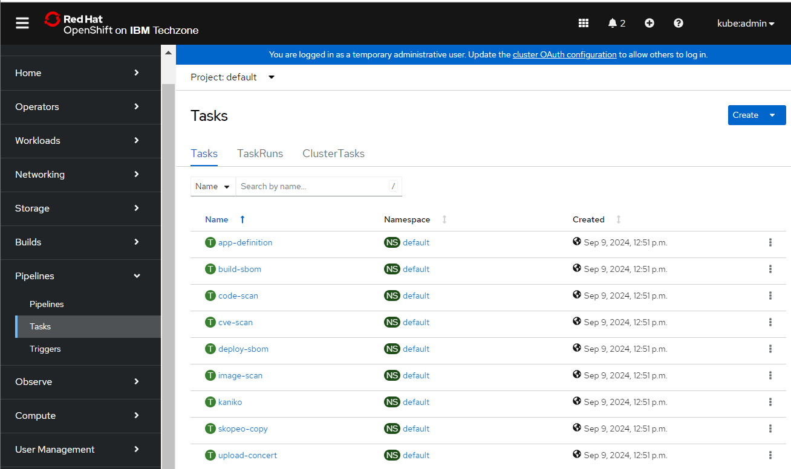 |

**[Go to top](#top)**

  

7 - Create Github access token webhook

For the trigger template to run whenever any of the repos in the quote-of-the-day organization are updated, we need to create a webhook at the organization level. 

| **Action** 7.1 | Open the pipeline in the OCP console. |
| :--- | :--- |
|  | Click on 'Show default projects' toggle and then click 'default' to select the default project where the pipeline has been created  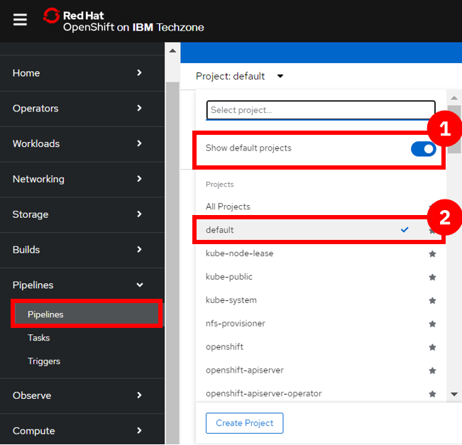   Click on the pipeline name to open the pipelie page.  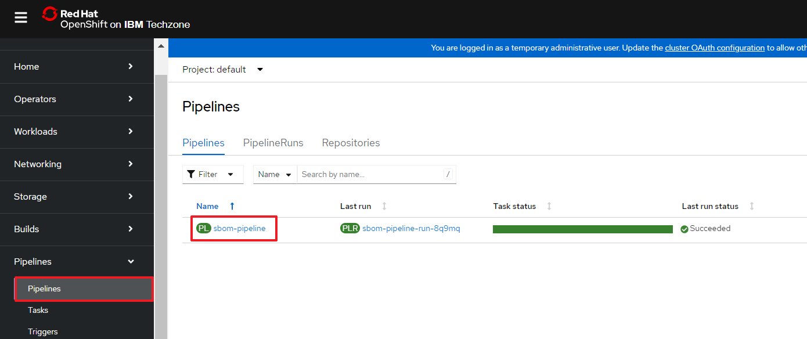 |

| **Action** 7.2 | Under **trigger templates**, copy the **Route URL**. |
| :--- | :--- |
|  |   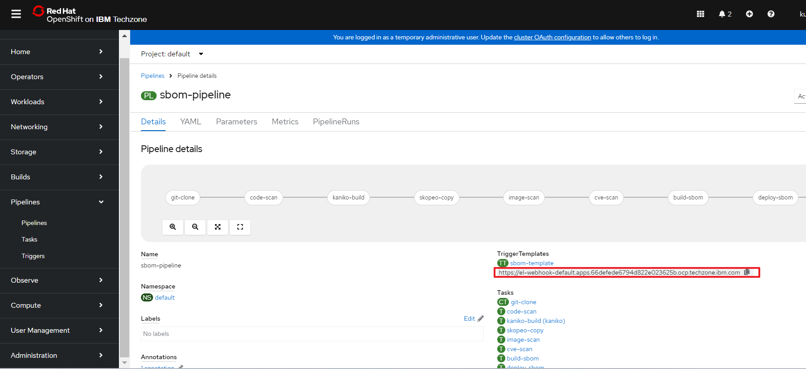  This route was created when we pushed our pipeline to Tekton.    Example:   <code class="code-block"> https://el-webhook-default.apps.66defede6794d822e023625b.ocp.techzone.ibm.com </code> |

| **Action** 7.3 | Open the Github quote-of-the-day organization page. |
| :--- | :--- |
|  |  |

| **Action** 7.4 | Click **Settings** -> **Hooks** -> **Create Webhook**. |
| :--- | :--- |
|  |   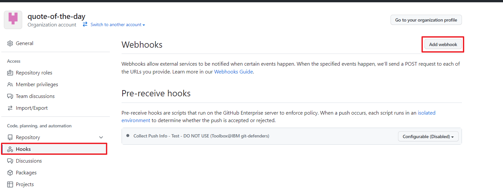 |

| **Action** 7.5 | Paste the **Route URL** (from 7.2) into the **Payload** field in Github. Click **Create webhook**. |
| :--- | :--- |
|  |    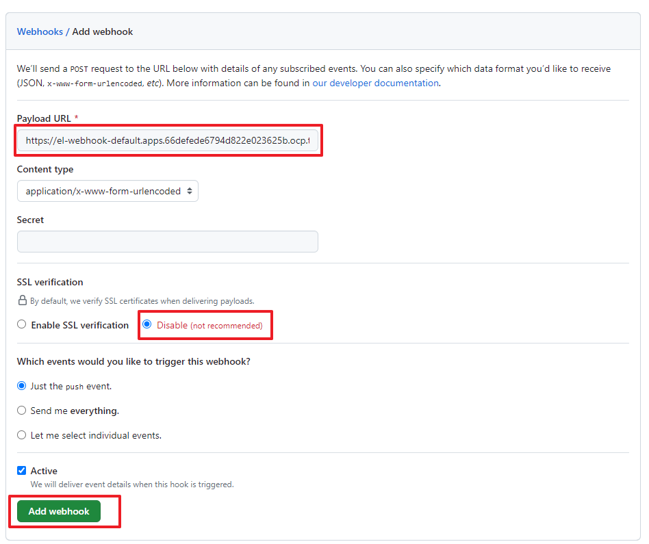 |

<inline-notification text="Note: When creating the webhook, keep all defaults and SSL disabled, although in a customer environment, SSL would typically be enabled."></inline-notification>

**[Go to top](#top)**

  

8 - Trigger a pipeline update

In this step, we will automatically trigger the pipeline to run by making a code update.

Recall that the quote-of-the-day application has 10 microservices. For this demo, we will use one microservice called qotd-web. 

| **Action** 8.1 | Clone the qotd-web code repository to your local machine. |
| :--- | :--- |
|  |  |

| **Action** 8.2 | Open the code in Visual Studio Code. |
| :--- | :--- |
|  | 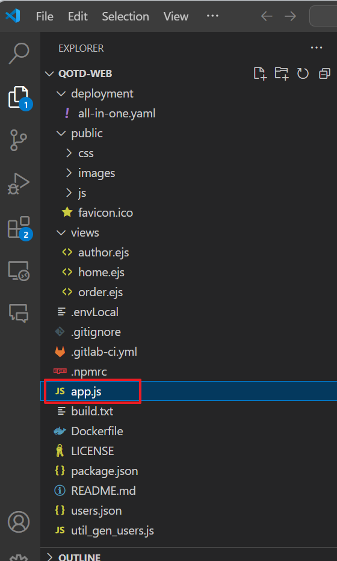 |

| **Action** 8.3 | Add a comment to a line. |
| :--- | :--- |
|  | 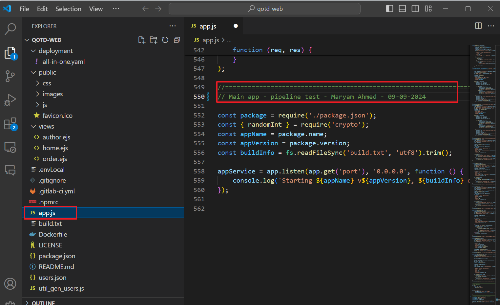  |

| **Action** 8.4 | Save and push the code to Github by creating a commit. |
| :--- | :--- |
|  |   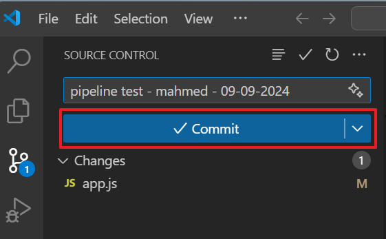   The commit action will trigger the pipeline to run. |

Within a few seconds of the commit, the Tekton pipeline should begin to run automatically.

**[Go to top](#top)**

  

9 - Review running pipeline in Tekton

To see the pipeline run in action, open the OpenShift cluster and click the pipeline name. For a play-by-play view, switch to the **Logs** tab, making note of any errors.  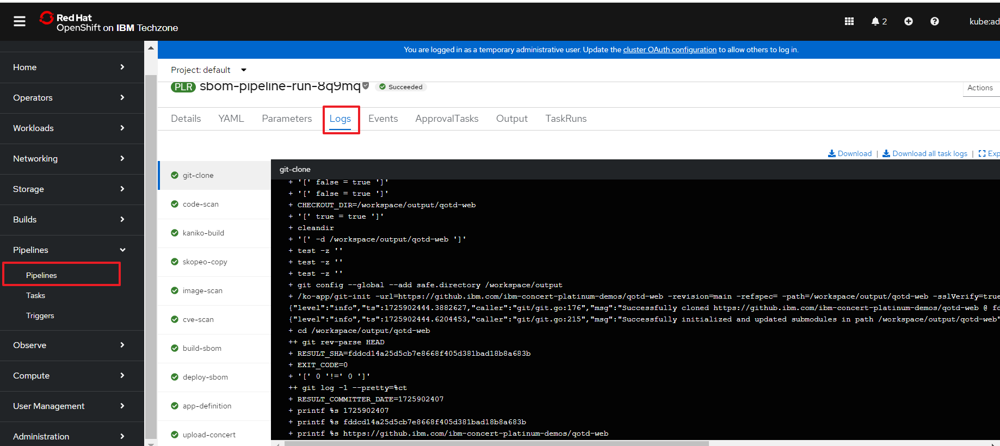

<inline-notification text="The first run of a new pipeline takes longer than subsequent runs. The first run takes about 10 minutes, and subsequent runs take 1-2 minutes."></inline-notification>

Each time a step completes successfully, a green checkmark appears.

**[Go to top](#top)**

  

View updates in Concert UI

Log in to the Concert instance to ensure all data was uploaded successfully.

<inline-notification text="If you were already logged in to Concert, doing a refresh in the browser will render the uploaded data in the Concert Arena view."></inline-notification>
  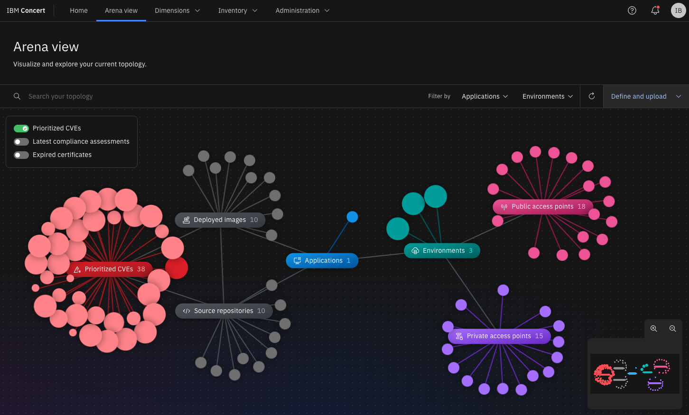

Go to the <strong>Administration</strong> -> <strong>Event log</strong> tab to view the history and status of all uploads.

**[Go to top](#top)**

  

Summary

In this demo, we saw how a Tekton pipeline on an OpenShift cluster can be used to automate the generation of SBOM and CVE scans and upload them to IBM Concert on SaaS. 

Once CVE data is ingested successfully into Concert, teams can review the Concert risk scores and priorities.

When you do a PoV, you will use the same concepts above to add similar Concert-specific tasks into the customer’s CI/CD pipeline.

**[Go to top](#top)**

  

