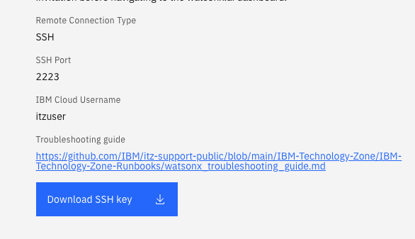
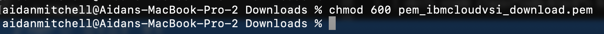
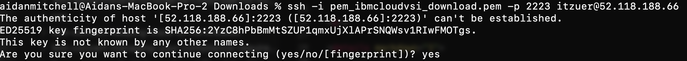
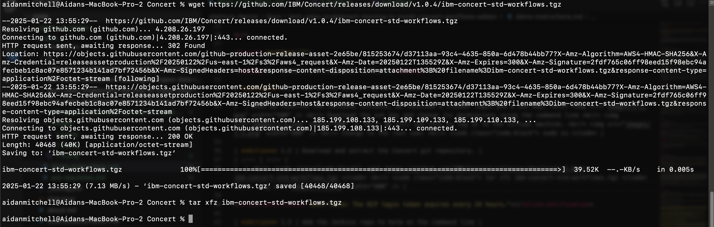
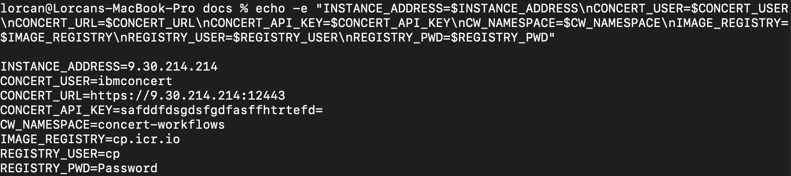

## Overview

In this document, you will learn how to install the Concert Workflows add-on within an IBM Concert 1.1.0 TechZone VM. Click <a href="https://www.ibm.com/docs/en/concert?topic=workflows-installing-concert-vm" target="_blank" rel="noreferrer">here</a> for the official install steps.

Click <a href="https://techzone.ibm.com/collection/tech-zone-certified-base-images/journey-watsonx" target="_blank" rel="noreferrer">here</a> to access the IBM Concert 1.1.0 TechZone VM. 

## Why is Workflows needed?
Concert Workflows is an add-on workflow automation service for Concert which ensures the user can:

1. Import and manage data relevent to the <a href="https://www.ibm.com/docs/en/concert?topic=posture-importing-resilience-data-using-concert-workflows">Resilence</a> dimension.

2. Automate and orchestrate complex workflows through an API-driven approach which supports IT and network infrastructure tasks .

## Why does Workflows need to use Kubernetes to be deployed?

Concert Workflows is available as an add-on service for on-premises deployments of Concert to an OpenShift (OCP) cluster or virtual machine (VM). This add-on embeds workflow definition and automation capabilities so you can define, manage and automate workflows within the Concert UI.

><strong>Note:</strong> The Concert Workflows add-on must be deployed via Kubernetes shown below (via <a href="https://k3s.io/">K3S</a>).This requirement exists because Kubernetes provides the scalability and lifecycle management needed to run and orchestrate workflows efficiently. Each workflow instance runs as an isolated <a href="https://kubernetes.io/docs/concepts/workloads/pods/">Kubernetes pod</a>.

## Steps

### 1 - Install pre-requisite software

**1.1: ssh to the Concert VM on TechZone**

When we reserved the TechZone instance, we received an ITZuser login and ssh key.   

Download the ssh key and change its permissions using the command line.   <code class="code-block"> chmod 600 pem_ibmcloudvsi_download.pem </code>

We will use this to log in to the virtual machine.   <code class="code-block"> ssh -i pem_ibmcloudvsi_download.pem -p 2223 itzuser@IP_ADDRESS </code>

Change to the root user.   <code class="code-block"> sudo su </code>  

Change to the workflow directory.   <code class="code-block"> cd workflows/ </code>

Open a port in the firewall on which Concert Workflows will run.   <code class="code-block"> sudo iptables -A INPUT -p tcp --dport 3000 -j ACCEPT </code>

**1.2: Download and extract the Concert git repository**

<code class="code-block"> wget https://github.com/IBM/Concert/releases/download/v1.1.0/ibm-concert-std-workflows.tgz </code>
<code class="code-block"> tar xfz ibm-concert-std-workflows.tgz </code>

**1.3: Log in to the Concert registry on podman**

Navigate <a href="https://myibm.ibm.com/products-services/containerlibrary" target="_blank" rel="noreferrer">here</a> to get the IBM_ENTITLEMENT_KEY.

Set the variables needed to log in.
<code class="code-block"> export IBM_ICR_IO=cp.icr.io/cp/concert </code>
<code class="code-block"> export PROD_USER=cp </code>
<code class="code-block"> export IBM_ENTITLEMENT_KEY=KEY_FROM_START_OF_1.3 </code>

Then log in to the image registry.
<code class="code-block"> podman login ${IBM_ICR_IO} --username=${PROD_USER} --password=${IBM_ENTITLEMENT_KEY} </code>

**1.4: Install k3s**

<code class="code-block"> curl -sfL https://get.k3s.io | sudo INSTALL_K3S_VERSION=v1.29.2+k3s1 sh -s - --write-kubeconfig-mode 644 --disable traefik </code>
<code class="code-block"> export PATH="/usr/local/bin:$PATH" </code>
<code class="code-block"> mkdir -p ~/.kube </code>
<code class="code-block"> sudo cp /etc/rancher/k3s/k3s.yaml ~/.kube/config </code>
<code class="code-block"> sudo chown $(id -u):$(id -g) ~/.kube/config </code>

**1.5: Install helm**

<code class="code-block"> curl -fsSL -o get_helm.sh https://raw.githubusercontent.com/helm/helm/main/scripts/get-helm-3 </code>
<code class="code-block"> chmod 700 get_helm.sh </code>
<code class="code-block"> ./get_helm.sh </code>

**1.6: Install kubectl**

<code class="code-block"> curl -LO "https://dl.k8s.io/release/$(curl -L -s https://dl.k8s.io/release/stable.txt)/bin/linux/amd64/kubectl" </code>
<code class="code-block"> chmod +x kubectl </code>
<code class="code-block"> sudo mv kubectl /usr/bin/ </code>

 

### 2 - Configure Concert Workflow values

**2.1: Run the get concert info script**

This script requires a Concert URL and API key. If you don't have an API key, you can follow <a href="https://www.ibm.com/docs/en/concert?topic=api-generating-key" target="_blank" rel="noreferrer">these steps</a> to create one.

Run the script using this command, replacing 'concert-url' and 'concert-api' with your own.   <code class="code-block"> ./bin/tethering/get_concert_info.sh --concert-url=https://concert-url:12443 --c-api-key=concert-api </code>

This will output a CONCERT_HUB_KEY value. Take note of this.

**2.2: Set the local environment variables**

Set the following values as environmental variables or add them to your bashrc or zshrc:  

<inline-notification text="Environment variables set using export only apply to the current shell session. To ensure they persist, add them to your ~/.bashrc, ~/.bash_profile or ~/.zshrc file."></inline-notification>

Set the IP address of your VM with:  
<code class="code-block"> export INSTANCE_ADDRESS=9.30.214.214 </code>  

Set the Concert User: 
<code class="code-block"> export CONCERT_USER=ibmconcert </code>  

Set the Concert URL: 
<code class="code-block"> export CONCERT_URL=https://9.30.214.214:12443 </code>  

Set the Concert API Key: 
<code class="code-block"> export CONCERT_API_KEY=safddfdsgdsfgdfasffhtrtefd= </code>  

Set the Concert Workflows namespace: 
<code class="code-block"> export CW_NAMESPACE=concert-workflows </code>  

Set the Concert Workflows registry: 
<code class="code-block"> export IMAGE_REGISTRY=cp.icr.io </code>  

Set the Concert Workflows registry user: 
<code class="code-block"> export REGISTRY_USER=cp </code>  

Set the Concert Workflows registry password: 
<code class="code-block"> export REGISTRY_PWD=Password used in step 1.3 </code>  

Check that the environmental variables are set correctly: 
<code class="code-block"> echo -e "INSTANCE_ADDRESS=$INSTANCE_ADDRESS\nCONCERT_USER=$CONCERT_USER\nCONCERT_URL=$CONCERT_URL\nCONCERT_API_KEY=$CONCERT_API_KEY\nCW_NAMESPACE=$CW_NAMESPACE\nIMAGE_REGISTRY=$IMAGE_REGISTRY\nREGISTRY_USER=$REGISTRY_USER\nREGISTRY_PWD=$REGISTRY_PWD" </code>  

### 3 - Install Concert Workflows

**3.1: Create a namespace in Kubernetes for Concert Workflows**

<code class="code-block"> CW_NAMESPACE=concert-workflows </code>
<code class="code-block"> kubectl create namespace concert-workflows </code>
<code class="code-block"> kubectl config set-context --current --namespace=concert-workflows </code>

**3.2: Create a docker registry secret**

Note: The docker password used in this command is the same IBM entitlement key used in 1.3.   <code class="code-block"> kubectl create secret docker-registry ibm-entitlement-key --docker-server=cp.icr.io --docker-username=cp --docker-password=IBM-ENTITLEMENT-KEY --namespace="${CW_NAMESPACE}" </code>

**3.3: Run the Concert Workflows install script**

<inline-notification text="This script takes, on average, about 20 minutes to run."></inline-notification>

   <code class="code-block"> ./bin/setup --license-acceptance=y --instance-address=$INSTANCE_ADDRESS --concert-user=$CONCERT_USER --concert-url=$CONCERT_URL --c-api-key=$CONCERT_API_KEY  --namespace=$CW_NAMESPACE --registry=$IMAGE_REGISTRY --registry-user=$REGISTRY_USER  --registry-password=$REGISTRY_PWD  </code>

### View updates in Concert UI

Log in to the Concert instance to ensure all data was uploaded successfully.

<inline-notification text="If you were already logged in to Concert, do a refresh in the browser."></inline-notification>

On the top menu, a Workflows option should now appear.

**[Go to top](#top)**
