

### Introduction

In this demo, we will set up a Concert integration to understand how a customer will automate the certificate discovery and ingestion process directly from a runtime environment. This method can then be used for ingesting certificates during a Proof of Value with a customer.

### Pre-requisites

Below is a list of pre-requisites that need to be set up prior to beginning this PoV.

One of the following runtime environments:

* Kubernetes
* Redhat OpenShift
* IBM Cloud IKS
* IBM Cloud ROKS
* AWS EKS
* AWS ROSA

### 1 - Creating an auto-discovery integration

**1.1:** On the homepage select "Discover your data".   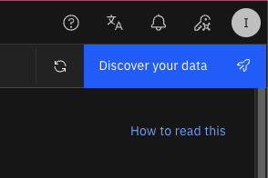

**1.2:** Choose an integration type.   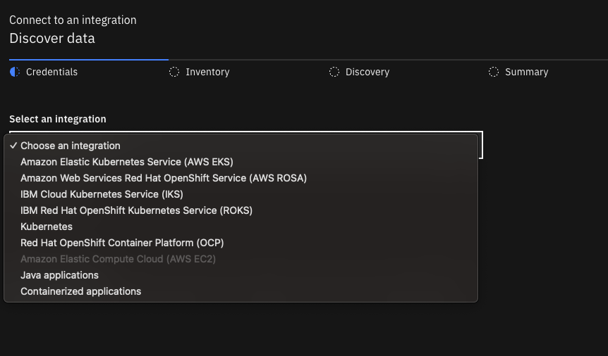

**1.3:** Enter details for the Endpoint, Token, and Cluster name.   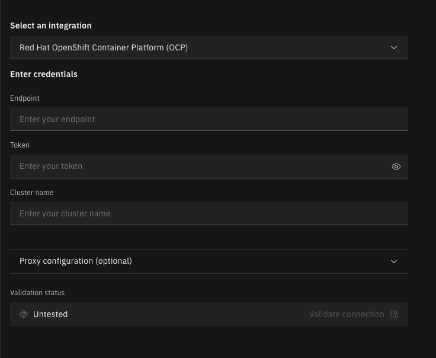

**1.4:** On the Inventory page, select the applications you want to discover from the environment   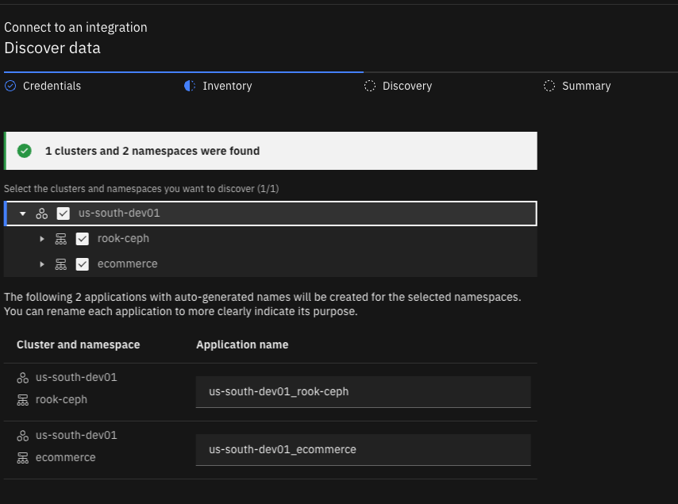

**1.5:** Click next. Certificates have now been discovered from the customer's cluster and ingested.

 

### 2 - Creating a certificate rotation workflow

**2.1:** Navigate to the Workflows library - https://automation-library.ibm.com/workflows   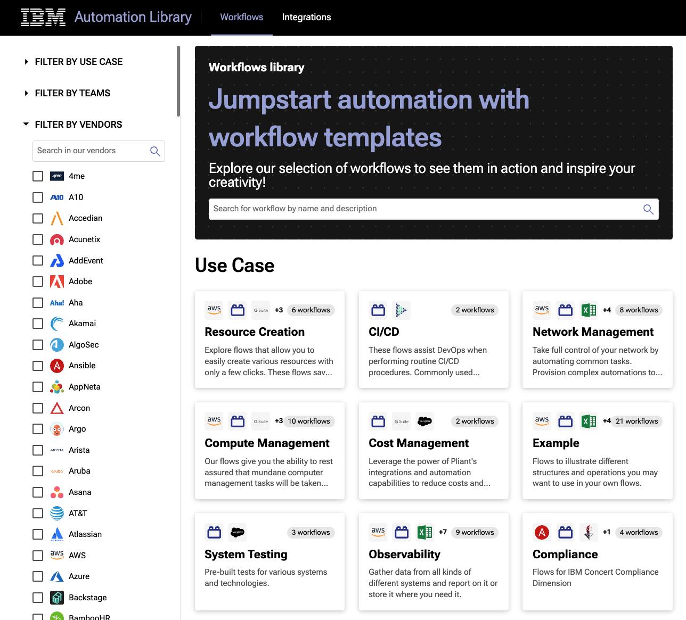

**2.2:** Choose the Certificates filter.   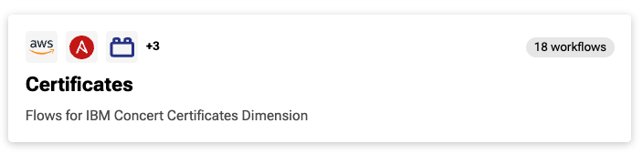

**2.3:** Find and download a renew certificates workflow specific to the environment the certificates were discovered from.   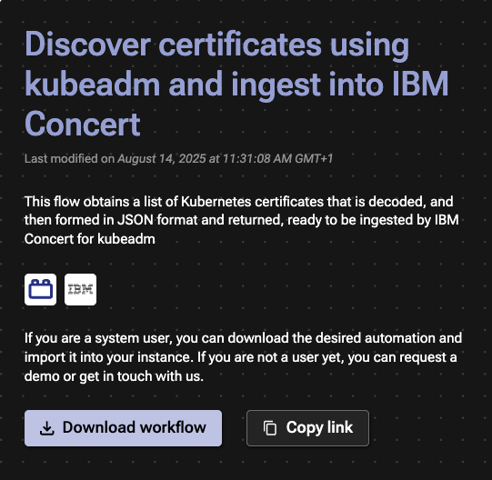

**2.4:** Navigate back to Concert Workflows, then drag and drop the downloaded ZIP file to upload the workflow.   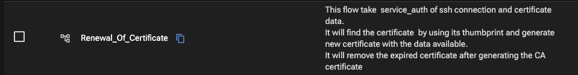

 

### 3 - Creating an automation rule

**2.1:** Navigate to Concert > Administration > Integrations. Then click on the Automation rules tab.   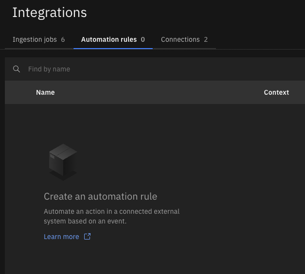

**2.2:** Click "Create automation rule"   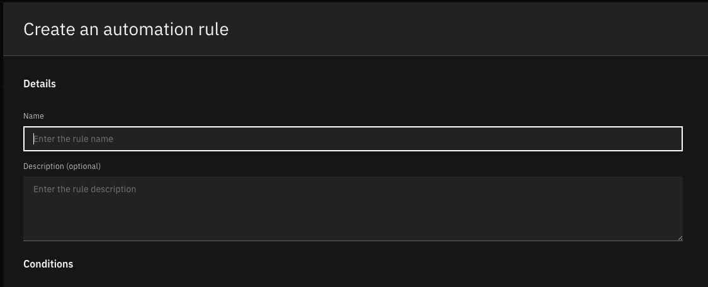

**2.3:** Enter the following details:   Name: Rotate kubernetes certificates   Take this action: Trigger a workflow   Using this references: Workflow uploaded above   When this condition occurs: An expired or expiring certificate is detected   Certificates expiring within: 7 days   

**2.4:** Click create, this will create a rule to rotate all expired and expiring certificates. 

 

### 4 - Reviewing the results

**4.1:** Navigate to Concert > Operations   

**4.2:** Here there will no longer be any expired certificates, or certificates expiring within the next 7 days. This is because Concert Workflows has rotated those certificates   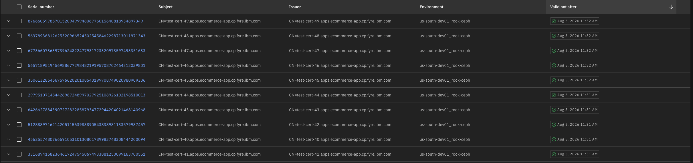

 

### Summary

In this demo, we saw how to create a direct integration to discover and ingest certificate details from a kubernetes cluster. 

Once the discovery process is running, Concert checks all namespaces across the environment for a kubernetes.io/tls secret type. If this secret is discovered, Concert will ingest the secrets details as a certificate in Concert. Once the certificate is ingested successfully into Concert, the operations teams can review the certificate expiration dates and automate the rotation of those certificates.

**[Go to top](#top)**