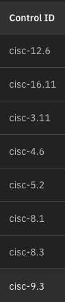

 

Click **<a href="https://ibm.ent.box.com/s/afax8p4hdkbjajutfn744tsyfjg8fyvv" target="_blank" rel="noreferrer">here</a>** to access the v1.0.4 compliance demo video.

Click the [**Pre-requisites**](pre-requisites) tab for setup instructions.

Introduction

In this demo, we will prepare a customers environment for a Compliance PoV and start the ingestion of regular compliance assessments.

For our demo, we will create an environment within Concert to assign the Compliance assessments too. Then we will use the Concert Toolkit to create a compliance catalog, add that catalog to Concert, and create a profile based on that catalog.

 

1 - Defining an environment within Concert

The first step is to define an environment within Concert, when a Compliance assessment is ingested into Concert it will be assigned to this environment.

| **Action** 1.1 | Navigate to the Arena view within Concert. |
| :--- | :--- |
|  |     |

| **Action** 1.2 | Click **Define and upload**, then **Define environment**, then **From resources**. |
| :--- | :--- |
|  |    |

| **Action** 1.3 | Define the environment|
| :--- | :--- |
|  | Assign the following for the environment:   **Name**   **Type**   **Purpose**     |

| **Action** 1.4 | Click **Create**. |
| :--- | :--- |
|  |    |

**[Go to top](#top)**

  

2 - Creating a compliance catalog

 

| **Action** 2.1 | Navigate to the compliance dimension within Concert |
| :--- | :--- |
|  |  |
| **Action** 2.2 | Click on the Catalogs tab |
| :--- | :--- |
|  |  |
| **Action** 2.3 | Click **Add catalog**, then **From standards library** |
| :--- | :--- |
|  |  |
| **Action** 2.4 | If the customer needs a pre-defined compliance catalog from Concert, select one from this list |
| :--- | :--- |
|  |  |
| **Action** 2.5 | If the customers compliance catalog is not listed, create one with the Concert toolkit |
| :--- | :--- |
|  | 1. Define a CSV to Excel file with the following format      Click **<a href="./images/DORA_Compliance_Controls.csv" target="_blank" rel="noreferrer">here</a>** for an example CSV from DORA Compliance.     2. Define a config file for the Concert toolkit in the following format.         Click **<a href="./images/config.yaml" target="_blank" rel="noreferrer">here</a>** for an example YAML file.     3. Run the Concert toolkit with the following command:     <code>docker run -v .:/data/src -v ./toolkit-data:/toolkit-data icr.io/cpopen/ibm-concert-toolkit:latest /bin/bash -c "compliance-catalog" --input-file ./toolkit-data/DORA_Compliance_Controls.csv --config-file /toolkit-data/config.yaml"</code>     The output will be a compliance catalog OSCAL json:    | 
| **Action** 2.6 | In the Concert UI, click **Add catalog**, then **From file** and upload the json file which was created |
| :--- | :--- |
|  |  |

**[Go to top](#top)**

  

3 - Creating a compliance profile

| **Action** 3.1 | Navigate to the Profiles tab within Concert |
| :--- | :--- |
|  |  |
| **Action** 3.2 | Click **Create profile** |
| :--- | :--- |
|  |  |
| **Action** 3.3 | Fill in the profile details |
| :--- | :--- |
|  | 1. Define a **Name** for the profile.   2. Select the catalog which was uploaded.   3. Select the controls which the customer wants to be assessed against.      |

**[Go to top](#top)**

  

4 - Uploading a compliance assessment

| **Action** 4.1 | Navigate to the **Assessments** tab within Concert |
| :--- | :--- |
|  |  |
| **Action** 4.2 | Click **Upload compliance scan** |
| :--- | :--- |
|  | Select the file format the assessment was completed in:   1. Use XCCDF for Openshift Operator compliance assessments.   2. Use OSCAL for any other compliance assessments.   Upload the assessment created by the continuous compliance scanner here.    |

**[Go to top](#top)**

  

