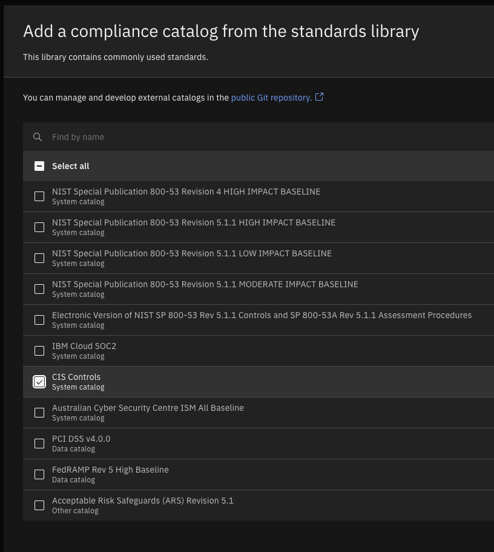

### Introduction

In this demo, we will prepare a customer's environment for a Compliance PoV and start the ingestion of regular compliance assessments.

For our demo, we will create an environment within Concert to assign the Compliance assessments too. Then, we will use the Concert toolkit to create a compliance catalog, add that catalog to Concert and create a profile based on that catalog.

### **Pre-requisites**

Below is a list of pre-requisites that need to be setup prior to beginning this PoV.

* Continuous compliance scanning tool that outputs OSCAL formatted assessments such as:
    * DRTConfidence
    * CyberArk 
    * RegScale
    * IBM Compliance Trestle 
    * OpenShift Compliance Operator 
* Compliance catalog which the customer is using - Concert provides the following: 
    * NIST Special Publication 800-53 Revision 4 HIGH IMPACT BASELINE
    * NIST Special Publication 800-53 Revision 5.1.1 HIGH IMPACT BASELINE
    * NIST Special Publication 800-53 Revision 5.1.1 LOW IMPACT BASELINE
    * NIST Special Publication 800-53 Revision 5.1.1 MODERATE IMPACT BASELINE
    * IBM Cloud SOC2
    * CIS Controls
    * Australian Cyber Security Centre ISM All Baseline
    * PCI DSS v4.0.0
    * FedRAMP Rev 5 High Baseline
    * Acceptable Risk Safeguards (ARS) Revision 5.1
    * If the catalogs provided don't cover the customer's use case, the instructions will include how to create one
* Name of the customer's environment

### 1 - Defining an environment within Concert

The first step is to define an environment within Concert. When a Compliance assessment is ingested into Concert, it will be assigned to this environment.

**1.1:** Navigate to the **Arena view** within Concert   

**1.2:** Click **Define and upload**, then **Define environment**, then **From resources**   

**1.3:** Define the environment

Assign the following for the environment: 
- Name 
- Type
- Purpose

**1.4:** Click **Create**   

 

### 2 - Creating a compliance catalog

**2.1:** Navigate to the **Compliance** dimension within Concert   

**2.2:** Click the **Catalogs** tab   

**2.3:** Click **Add catalog** and then **From standards library**   

**2.4:** If the customer needs a pre-defined compliance catalog from Concert, select one from this list:   

**2.5:** If the customers compliance catalog is not listed, create one with the Concert toolkit.

Define a CSV to Excel file with the following format:   

Click <a href="./images/DORA_Compliance_Controls.csv" target="_blank" rel="noreferrer">here</a> for an example CSV from DORA Compliance.

Define a config file for the Concert toolkit in the following format:   

Click <a href="./images/config.yaml" target="_blank" rel="noreferrer">here</a> for an example YAML file.

Run the Concert toolkit with the following command:

<code>docker run -v .:/data/src -v ./toolkit-data:/toolkit-data icr.io/cpopen/ibm-concert-toolkit:latest /bin/bash -c "compliance-catalog" --input-file ./toolkit-data/DORA_Compliance_Controls.csv --config-file /toolkit-data/config.yaml"</code>

The output will be a compliance catalog OSCAL json:   

**2.6:** In the Concert UI, click **Add catalog**, then **From file** and upload the json file which was created   

 

### 3 - Creating a compliance profile

**3.1:** Navigate to the **Profiles** tab within Concert   

**3.2:** Click **Create profile**   

**3.3:** Fill in the profile details:

- Define a **Name** for the profile
- Select the catalog which was uploaded
- Select the controls against which the customer wants to be assessed

  

 

### 4 - Uploading a compliance assessment

**4.1:** Navigate to the **Assessments** tab within Concert   

**4.2:** Click **Upload compliance scan**

Select the file format in which the assessment was completed:

- Use XCCDF for OpenShift Operator compliance assessments
- Use OSCAL for any other compliance assessments
- Upload the assessment created by the continuous compliance scanner here:   

**[Go to top](#top)**