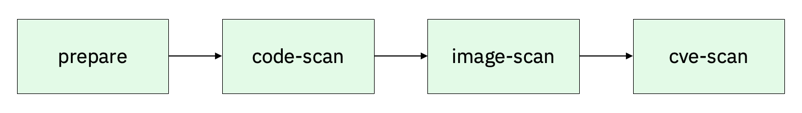
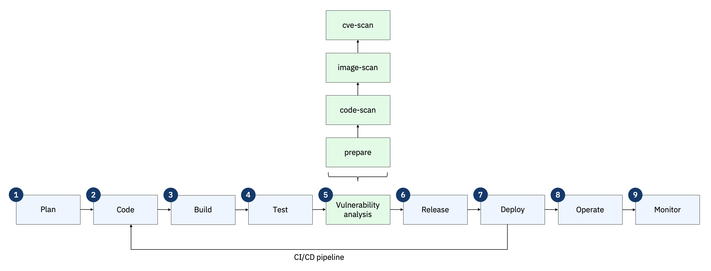
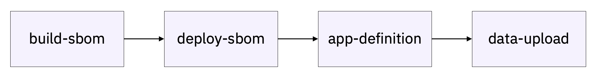
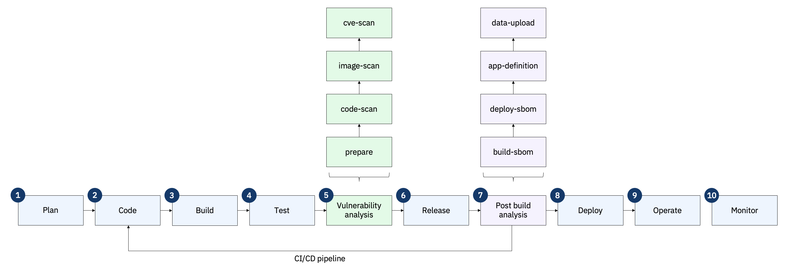

 

Click the [**Pre-requisites**](pre-requisites) tab for setup instructions.

Introduction

  

In the CI/CD pipeline, vulnerability scanning plays a critical role in ensuring that security is embedded into the software delivery process. The optimal point for conducting these scans is between **Test** and **Release**. At this stage, the code has passed functional testing, ensuring it meets quality standards. But before it is packaged and deployed, it undergoes security scrutiny.

  

<inline-notification text="Each customer’s IBM Concert implementation can vary based on their environment and CI/CD workflows, which may result in different stage names or configurations. Flexibility is key to addressing customer-specific needs, while ensuring core CI/CD integration principles are maintained."></inline-notification>

 

1 - Configure customer's pipeline

In the non-production CI/CD environment provisioned by the customer in advance of the PoV, the following changes should be performed to ensure a smooth and effective demonstration. 

 

| **Action** 1.1 | If not already present, insert a secondary inner pipeline labeled **vulnerability-analysis** between **TEST** and **RELEASE** in the customer's pipeline.  |
| :--- | :--- |
|  | This can be done by utilizing the modularity of both Jenkins and Tekton to invoke a dedicated security check pipeline from within the main pipeline.    In Jenkins, this secondary pipeline can be set up as a downstream job, triggered from the main pipeline using the build step:    <code class="code-block"> stage('vulnerability-analysis') {     steps {         build job: 'vulnerability-analysis-job', wait: true      }   } </code>    In Tekton, a similar structure can be established using Pipeline Tasks or PipelineRuns, enabling the main pipeline to invoke a separate pipeline for vulnerability scanning tasks.    <code class="code-block"> apiVersion: tekton.dev/v1beta1   kind: Task   metadata:    name: trigger-vulnerability-analysis   spec:    steps:      - name: run-vulnerability-analysis        image: gcr.io/tekton-releases/github.com/tektoncd/pipeline/cmd/pullrequest-init        script: |          tkn pipeline start vulnerability-analysis-pipeline --param target-image=$(params.image) </code> |

 

| **Action** 1.2 | In this new inner pipeline, labeled **vulnerability-analysis**, create the tasks outlined below.  |
| :--- | :--- |
|  | The structure of the pipeline will be as follows:      • **prepare**: Download and set up the necessary IBM Concert toolkit image, along with the source code repositories and container images for all microservices in the target application, ensuring the environment is ready for further analysis.   • **code-scan**: Conduct a thorough static analysis of the codebase, inspecting the application’s source code, third-party libraries, and dependencies to identify potential security vulnerabilities or weaknesses.   • **image-scan**: Perform an in-depth scan of the container images used in the application to detect any security vulnerabilities or misconfigurations that could impact the integrity of the containerized environment.   • **cve-scan**: Analyze the components identified in the Software Bill of Materials (SBOM) and cross-reference them against the CVE (Common Vulnerabilities and Exposures) database to identify known vulnerabilities and assess their impact on the application. |
| **Action** 1.2.1 | In the newly created **prepare** task of the **vulnerability-analysis** inner pipeline, add the necessary commands to download the IBM Concert toolkit, along with all microservice images and their corresponding source code repositories.    The code snippets below demonstrate the structure of the command, though the exact syntax may vary depending on the CI/CD pipeline platform being used.    Fetch a copy of the IBM Concert toolkit image to the local Docker server if it is not already present:    <code class="code-block"> docker pull --platform "linux/amd64" \    "cp.stg.icr.io/cp/concert/toolkit/ibm-concert-toolkit:latest" </code>    Fetch a copy of the microservices' source code to the local file system if it is not already present:    <code class="code-block"> for i in "${!DEMO_APP_REPOSITORY_URL[@]}"; do      repo_url="${DEMO_APP_REPOSITORY_URL[$i]}"           echo "$(date +'%Y-%m-%d %H:%M:%S') [INFO] Cloning the demo repository for ${repo_url}..."      if git clone "https://${repo_url}"; then        echo "$(date +'%Y-%m-%d %H:%M:%S') [INFO] Successfully cloned ${repo_folder} repository."      else        echo "$(date +'%Y-%m-%d %H:%M:%S') [ERROR] An error occurred during the code repo clone procedure for ${repo_folder}."        exit 1      fi   done </code>    Pull a copy of the microservices' image to the local Docker server if it is not already present:    <code class="code-block"> for i in "${!DEMO_APP_IMAGE_URL[@]}"; do  # Iterate over the indices, not values      service="${DEMO_APP_COMPONENT[$i]}"        # Pull image using the base image URL and image tag      docker pull "${DEMO_APP_IMAGE_URL[$i]}:${DEMO_APP_IMAGE_TAG[$i]}"        if [ $? -ne 0 ]; then          echo "$(date +'%Y-%m-%d %H:%M:%S') [ERROR] Error occurred while pulling image for $service"      fi   done </code> |
| **Action** 1.2.2 | In the newly created **code-scan** task within the **vulnerability-analysis** inner pipeline, include the following commands to perform a code scan using the IBM Concert toolkit:    <code class="code-block"> docker run --user 0 --platform "linux/amd64" \      --volume "$(pwd)/toolkit-data:/toolkit-data" \      --volume "$(pwd)/$src_repo:/$src_repo" \      --interactive \      --env JAVA_HOME="$JAVA_HOME" \      "cp.stg.icr.io/cp/concert/toolkit/ibm-concert-toolkit:latest" \      bash -c code-scan --src ${src_repo} --output-file ${DEMO_APP_NAME}-${service}-${PACKAGE_SBOM_CODESCAN_OUTPUT_FILENAME_SUFFIX} </code> |
| **Action** 1.2.3 | In the newly created **image-scan** task of the **vulnerability-analysis** inner pipeline, include the following commands to perform a code scan using the IBM Concert toolkit:    <code class="code-block"> docker run --user 0 --platform "linux/amd64" \      --volume "$(pwd)/toolkit-data:/toolkit-data" \      --volume "$(pwd)/$src_repo:/$src_repo" \      --interactive \      --env JAVA_HOME="$JAVA_HOME" \      "cp.stg.icr.io/cp/concert/toolkit/ibm-concert-toolkit:latest" \      bash -c image-scan --images ${IMAGES} </code> |
| **Action** 1.2.4 | In the newly created **cve-scan** task of the **vulnerability-analysis** inner pipeline, include the following commands to perform a code scan using the IBM Concert toolkit:    <code class="code-block"> grype "${image}" --by-cve -o template      -t "${TEMPLATE_GRYPE_FILE}" > "${OUTPUT_DIR}/${OUTPUT_FILENAME}" </code>    **TEMPLATE_GRYPE_FILE** refers to the path of the Grype template that maps each Grype output to the format required by IBM Concert.    <code class="code-block"> CVE,Image,Package,Package Version,Package Path,Severity,Score,hasFix,Fixed Version,Description,Tag,Digest   {{- $imagetag := split ":" .Source.Target.UserInput }}   {{- $image := $imagetag._0 }}   {{- $tag := $imagetag._1 }}   {{- $digest := 0 }}   {{- range .Source.Target.RepoDigests }}   {{- $repodigest := split "@" . }}   {{- $digest = $repodigest._1 }}   {{- end }}   {{- range $v := .Matches}}    {{- $hasFix := "N" }}    {{- $fixedIn := "" }}    {{- $vid := $v.Vulnerability.ID }}    {{- $pkgname := $v.Artifact.Name }}    {{- $pkgver := $v.Artifact.Version }}    {{- $sev := $v.Vulnerability.Severity }}    {{- $desc := "DESCRIPTION HERE" }}    {{- if eq .Vulnerability.Fix.State "fixed" }}      {{- $hasFix = "Y" }}      {{- $fixedIn = "Fixed in" }}      {{- range $vers := .Vulnerability.Fix.Versions }}        {{- $fixedIn = cat $fixedIn $vers }}      {{- end }}    {{- end }}    {{- $score := "0" }}    {{- range $c := .Vulnerability.Cvss }}      {{- $score = $c.Metrics.BaseScore }}    {{- end }}    {{- range $path := .Artifact.Locations }}   "{{$vid}}","{{$image}}","{{$pkgname}}","{{$pkgver}}","{{$path.RealPath}}","{{$sev}}","{{$score}}","{{$hasFix}}","{{$fixedIn}}","{{$desc}}","{{$tag}}","{{$digest}}"    {{- end }}   {{- end }} </code>    You can download this file <a href="https://github.ibm.com/ibm-concert-platinum-demos/concert-pm-utils/blob/64d2bb900519e1eacf06ca275f4f45af2d6263aa/macos/templates/grype-cve.tmpl" target="_blank" rel="noreferrer">here</a>.    After the creation of the first new child pipeline described above, the main CI/CD pipeline used for the Proof of Value will be structured as follows:    |

 

| **Action** 1.3 | Insert a secondary inner pipeline labeled **post-build-analysis** after **DEPLOY** and before **OPERATE** in the customer's pipeline. |
| :--- | :--- |
|  | As we did previously, this can be done by utilizing the modularity of both Jenkins and Tekton to invoke a separated pipeline designed to generated all concert-defined SBOMs from within the main pipeline.    In Jenkins, similar to the previous setup, this secondary pipeline can be configured as a downstream job, triggered from the main pipeline using the build step:    <code class="code-block"> stage('post-build-analysis') {      steps {          build job: 'post-build-analysis-job', wait: true      }   } </code>    In Tekton, a similar structure can be established using Pipeline Tasks or PipelineRuns, enabling the main pipeline to invoke a separate pipeline for vulnerability scanning tasks:    <code class="code-block"> apiVersion: tekton.dev/v1beta1   kind: Task   metadata:    name: trigger-post-build-analysis   spec:    steps:      - name: run-post-build-analysis        image: gcr.io/tekton-releases/github.com/tektoncd/pipeline/cmd/pullrequest-init        script: |          tkn pipeline start post-build-analysis-pipeline --param target-image=$(params.image) </code>    In this new inner pipeline, labeled **post-build-analysis**, create the tasks outlined below. The structure of the pipeline will be as follows:      • **build-sbom**: Create a Software Bill of Materials (SBOM) for the build environment, capturing all dependencies and tools used during the build process.   • **deploy-sbom**: Generate an SBOM for the deployment environment, detailing the infrastructure and configuration files involved in the deployment.   • **app-definition**: Produce an SBOM outlining the application's modules, libraries, and dependencies for a comprehensive view of its components.   • **data-upload**: Upload all generated SBOMs and security data to IBM Concert for analysis, tracking and validation. |
| **Action** 1.3.1 | In the newly created **build-sbom** task of the **post-build-analysis** inner pipeline, include the following commands to create the Concert-defined Build SBOM using the IBM Concert toolkit:    <code class="code-block"> docker pull --platform "linux/amd64" \    "cp.stg.icr.io/cp/concert/toolkit/ibm-concert-toolkit:latest" </code>    For the **build-sbom** task to function properly, it requires a configuration file containing <a href="https://github.ibm.com/ibm-concert-platinum-demos/concert-pm-utils/blob/64d2bb900519e1eacf06ca275f4f45af2d6263aa/macos/templates/build-sbom-config-template.yaml" target="_blank" rel="noreferrer">this information</a>. |
| **Action** 1.3.2 | In the newly created **deploy-sbom** task of the **post-build-analysis** inner pipeline, include the following commands to create the Concert-defined Build SBOM using the IBM Concert toolkit:    <code class="code-block"> docker run --user 0 --platform "linux/amd64" \        --volume "$(pwd)/toolkit-data:/toolkit-data" \        --volume "$(pwd)/$TEMPLATES_DIR:/$TEMPLATES_DIR" \        --volume "$(pwd)/$TMP_DIR:/$TMP_DIR" \        --interactive \        "cp.stg.icr.io/cp/concert/toolkit/ibm-concert-toolkit:latest" \        bash -c "deploy-sbom --deploy-config ${OUTPUT_CONFIG_FILE}" </code>    For the **deploy-sbom** task to function properly, it requires a configuration file containing <a href="https://github.ibm.com/ibm-concert-platinum-demos/concert-pm-utils/blob/64d2bb900519e1eacf06ca275f4f45af2d6263aa/macos/templates/build-sbom-config-template.yaml" target="_blank" rel="noreferrer">this information</a>. |
| **Action** 1.3.3 | In the newly created **app-definition** task of the **post-build-analysis** inner pipeline, include the following commands to create the Concert-defined Build SBOM using the IBM Concert toolkit:    <code class="code-block"> docker run --user 0 --platform "linux/amd64" \        --volume "$(pwd)/toolkit-data:/toolkit-data" \        --volume "$(pwd)/$TEMPLATES_DIR:/$TEMPLATES_DIR" \        --volume "$(pwd)/$TMP_DIR:/$TMP_DIR" \        --interactive \        "cp.stg.icr.io/cp/concert/toolkit/ibm-concert-toolkit:latest" \        bash -c "app-sbom --app-config ${OUTPUT_CONFIG_FILE}" </code>    For the **app-definition** task to function properly, it requires a configuration file containing <a href="https://github.ibm.com/ibm-concert-platinum-demos/concert-pm-utils/blob/64d2bb900519e1eacf06ca275f4f45af2d6263aa/macos/templates/build-sbom-config-template.yaml" target="_blank" rel="noreferrer">this information</a>. |
| **Action** 1.3.4 | In the newly created **data-upload** task of the **post-build-analysis** inner pipeline, include the following commands to create the Concert-defined Build SBOM using the IBM Concert toolkit:    <code class="code-block"> docker run --user 0 --platform "linux/amd64" \        --volume "$(pwd)/toolkit-data:/toolkit-data" \        --volume "$(pwd)/$TEMPLATES_DIR:/$TEMPLATES_DIR" \        --volume "$(pwd)/$TMP_DIR:/$TMP_DIR" \        --interactive \        "cp.stg.icr.io/cp/concert/toolkit/ibm-concert-toolkit:latest" \        bash -c "upload-concert --upload-config ${OUTPUT_DIR}/${DEMO_APP_NAME}-concert-upload-config.yaml" </code>    For the **data-upload** task to function properly, it requires a configuration file containing <a href="https://github.ibm.com/ibm-concert-platinum-demos/concert-pm-utils/blob/64d2bb900519e1eacf06ca275f4f45af2d6263aa/macos/templates/config.yaml" target="_blank" rel="noreferrer">this information</a>.    After the creation of the two new child pipelines described above, the main CI/CD pipeline used for the Proof of Value will be structured as follows:    |

**[Go to top](#top)**

  

2 - Onboard application into Concert

After setting up the shared pipeline infrastructure, you'll need to customize each application previously onboarded by the customer individually. Most CI/CD pipelines have a dedicated property or mapping file where parameters for each application are defined and linked to specific variables within the pipeline. These mappings ensure that each application's configuration is properly aligned with the pipeline's automated tasks.

Typically, the CI/CD server populates these variables automatically using information gathered throughout the pipeline's stages. However, there may be instances where additional customizations will be needed, requiring you to manually define the parameters to ensure proper execution. These manual adjustments often involve setting environment-specific variables or configurations that cannot be dynamically fetched by the server. 

Below is a list of some of the variables that you will need to populate manually:

| **Variable** | **Definition** |
| :--- | :--- |
| **Application criticality** | Refers to the level of importance an application holds within an organization’s IT environment, based on its impact on business operations.    The criticality is rated on a scale of 1 to 5, with:    • **1 (Low criticality)**: Applications that have minimal impact on day-to-day operations. They are not essential for core business functions, and if they go offline, business continuity is not significantly affected.   • **2-3 (Moderate criticality)**: These applications support important business processes but are not mission-critical. Downtime or failure would cause inconvenience and inefficiency but would not disrupt key business operations.   • **4 (High criticality)**: These applications are integral to business processes. Downtime could severely impact productivity, revenue, or customer satisfaction. They require regular monitoring and robust security measures.   • **5 (Critical)**: These are mission-critical applications, essential for the core functioning of the business. Any downtime would have a catastrophic impact on operations, leading to significant financial or reputational loss. These applications often demand high availability, strong security protocols and fast recovery processes. |
| **Access points that make each microservice and their exposure level** | Refers to the endpoints through which each microservice can be accessed, and they play a critical role in determining the exposure level of a microservice within an architecture. Each microservice should ideally have only one access point to maintain clarity and control over how it is accessed and exposed.    These access points can be classified as internal or external based on their exposure:    • **Internal access points**: These are used for communication between services within the organization's internal network or environment. They are not exposed to the internet and are generally accessed only by other microservices or internal systems. This limited exposure reduces the security risks associated with external threats.   • **External access points**: These are exposed to the internet and can be accessed by external users or systems outside of the internal network. External access points require additional security measures, such as authentication, encryption and firewall rules, to protect them from vulnerabilities and unauthorized access. |
| **Environments for each microservice** | Refers to the distinct settings or stages in which a microservice operates, each serving a unique purpose in the development, testing, and deployment lifecycle. A single microservice can have multiple environments, each tailored to specific activities or stages of its development and release. Typically, these environments include:    • **Development environment (Dev)**: This is where the initial coding and testing of the microservice occur. It is used by developers to implement new features, fix bugs, and experiment with changes without affecting the live system.   • **Testing or QA environment**: After development, the microservice moves to a testing environment, where it undergoes more rigorous testing by quality assurance (QA) teams. This environment closely mirrors production to ensure that everything works as expected before deployment.   • **Staging environment**: Staging is a pre-production environment that is nearly identical to the live environment. It’s used to test the entire system, including integrations and performance, to validate that the microservice is ready for release.   • **Production environment**: This is the live environment where the microservice is deployed for actual use by end users. It requires the highest level of monitoring, security and support, as any issues here directly affect the user experience.    Each microservice can have one or more of these environments depending on its development and deployment needs. |
| **Repositories for each microservice** | Dedicated storage locations where the codebase for each microservice is maintained and version-controlled. Each microservice should have its own repository to ensure clear separation of concerns, streamline development and facilitate independent updates and scaling. |

**[Go to top](#top)**

  

